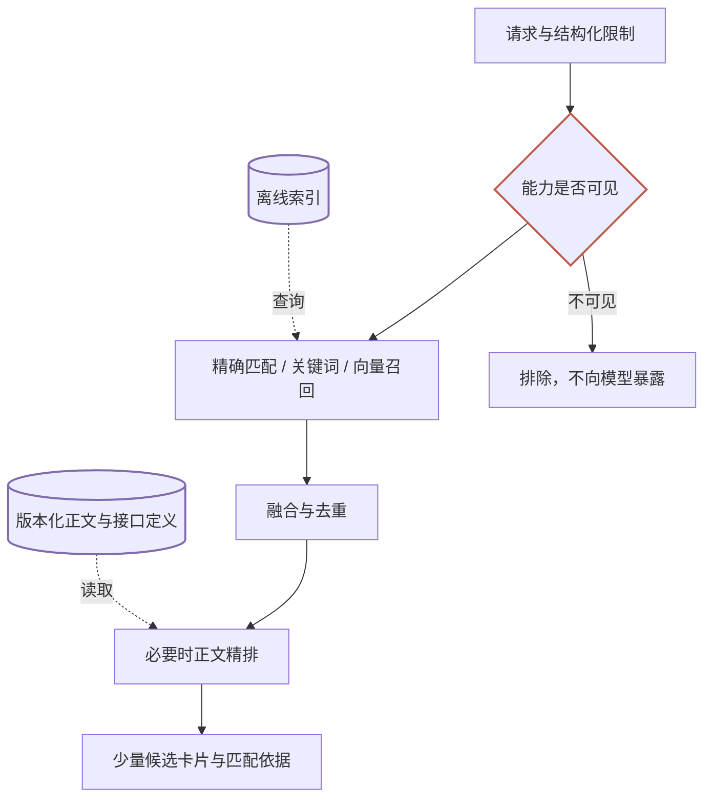

[路由架构](/writing/capability-routing-at-scale/)把路由分成发现、选择、执行和验收。这一篇只展开“发现”：如何把上万个能力转成一小组值得进一步比较的候选。

设用户要把客户会议整理为文档，禁止上传外部服务或发群。用户说“提取客户讨论的结论和后续动作”，目录却写“会议纪要”；两个 Skill 摘要相同，正文却分别要求本地整理和外部上传。这两种错误的来源不同：前者搜不到，后者分不清。

我们把“找出可能相关的候选”称为**召回**，把“仔细比较候选并重新排序”称为**精排**。

## 发现质量，先取决于能力怎样被表达

搜索系统需要的不只是名字。下面是一条自定义路由记录，不是某个协议的标准 Schema：

```json
{
  "id": "acme/meeting-summary",
  "kind": "skill",
  "version": "1.0",
  "description": "把会议逐字稿整理为决策和待办",
  "inputs": ["transcript"],
  "outputs": ["summary"],
  "do_not_use_when": ["只有录音，尚未转写"],
  "requires": [],
  "side_effects": [],
  "detail_ref": "skills/meeting-summary/SKILL.md"
}
```

它回答四件事：什么时候用、需要什么、产出什么、什么时候不适用。创建文档是后续工具步骤，不应偷偷塞进“纯总结”的承诺里。

作者可以描述用途，但准入、身份、运行健康和来源验证应由平台独立维护。不要把作者自报的“安全”或“高成功率”当作权限与质量证明。

同一能力的镜像、别名和多个版本还需要去重，否则五个候选可能只是同一个能力的五份副本。可结合发布方、稳定 ID、版本和内容摘要识别同源记录，保留来源用于追溯。

## 索引在离线准备，候选在线产生



*图 1｜实线是在线处理步骤，虚线是索引或详情供给；圆柱是存储，菱形是准入判断。精排只处理已召回候选，不能补回被遗漏的能力。*

注册或更新时，生成关键词索引、向量及必要的正文片段。用户请求到来后，查询已建立的索引，而不是重新读取一万个正文、重新计算全部向量。

权限过滤不能只放在最后：没有权限发现的名称和描述，本身也可能是敏感信息。允许发现但尚未登录的能力则可以保留，标记为“需要授权”，不要与不存在混淆。

同样需要区分“没有匹配”与“搜索尚未完成”。一个目录超时，只能说明当前结果不完整。

## 检索方法各自解决一类问题

精确匹配适合能力 ID、工具名和用户点名；关键词适合产品名、文件格式和业务术语；向量适合自然语言与目录描述之间的表达差异。

一种可实验的组合是：关键词和向量各召回一组候选，融合去重后再精排。不要直接相加不同系统的原始分数，可以先尝试按排名融合的 RRF：

```python
def rrf(rankings, k=60):
    scores = {}
    for ranking in rankings:
        # 同一路结果中的重复 ID 只计算一次
        unique = dict.fromkeys(ranking)
        for rank, item_id in enumerate(unique, start=1):
            scores[item_id] = scores.get(item_id, 0) + 1 / (k + rank)
    return sorted(scores, key=lambda item_id: (-scores[item_id], item_id))
```

这是融合机制，不负责权限、风险和任务覆盖；`k=60` 也是实验参数。用户明确点名的能力应作为约束处理，不能仅仅加一点分后又被悄悄替换。

如果增加领域分类，应保留跨领域召回。错误领域同样可能凑满 20 个结果，不能以“候选够数”作为不再全局搜索的理由。

## 正文参与路由，不等于全文进入 Agent

假设两个 Skill 都叫“会议整理”，正文却分别写着：

- 只读取逐字稿，输出摘要文本。
- 上传录音到外部端点，生成文档后自动分享。

真正决定是否合适的，是输入、步骤和副作用，不只是摘要里的“会议”二字。

因此，**路由器可以看正文，执行 Agent 仍然按需加载**。正文可以用于离线索引，也可以供精排模型读取；主 Agent 接收少量卡片与匹配依据，确认后再读取执行说明。

SkillRouter 论文 v1 在约 8 万个 Skill、75 条专家验证查询的基准上报告：其 0.6B 编码器与 0.6B 精排模型组合达到 74.0% Hit@1，并展示了正文的作用。这是特定基准的路由结果，不是生产完成率；多 Skill 查询中首位命中一个必要能力，也不代表所有依赖都被覆盖。[原论文](https://arxiv.org/html/2603.22455v1)

长正文还要比较全文、分块与任务相关片段，记录截断策略。对 MCP 工具，应关注接口和参数语义；对 Agent，则是交付范围及接口能力，不能统一当成 `SKILL.md`。

## 动手验证：先看清基线会怎样失败

在配套仓库根目录运行：

```bash
python3 docs/capability-routing/lab.py retrieve --query "会议 纪要"
python3 docs/capability-routing/lab.py retrieve --query "讨论 结论" --body
python3 docs/capability-routing/lab.py fusion
```

这是 Python 标准库离线实验：用词项匹配演示摘要与正文的信息差异，用两组固定排名演示 RRF。**它没有实现向量模型或 Cross-encoder，不是 SkillRouter 的复现。**查询按空格分词，中文要显式分词，不把这个教学假设带进生产。

先比较不带和带 `--body` 的结果；再加入一个只有摘要相似、正文行为不同的能力。观察正文是否帮助召回，也观察它是否引入更多干扰。否定约束单独保存，不能指望增加正文就自动理解所有“不要”。

接入真实检索器后，仍使用同一组人工核验任务做对照：关键词、混合检索、增加精排。分别记录必要能力覆盖、误选和耗时。每增加一层，都要知道它改善了哪类失败。

## 发现层的输出，还不是执行命令

候选结果应携带稳定 ID、版本、匹配依据、限制与详情地址；模型自报的置信度不是已经校准的成功概率。

精排只能重排已召回的候选；若必要能力被召回阶段遗漏，应调整检索或补充查询。候选相关也不证明它能独立完成任务。

候选可能是 Skill、工具或 Agent。下一步应比较完成同一任务的执行路径，见[方案与执行](/writing/capability-routing-execution/)。
