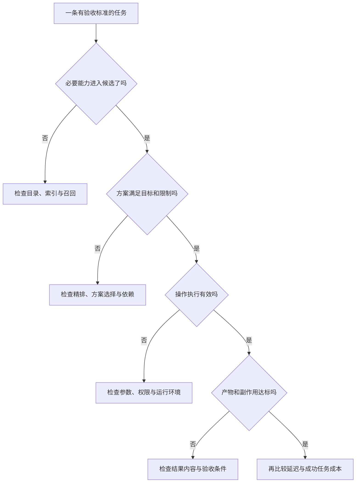
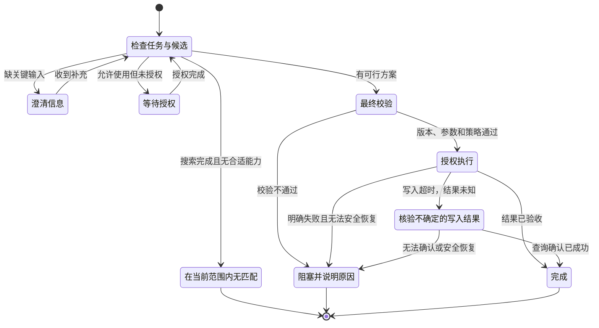

[方案与执行](/writing/capability-routing-execution/)让候选变成可执行方案。这篇讨论“凭什么相信它”：不是为路由器增加更多组件，而是为每一层建立可检验的证据。

假设十次会议整理成功八次。两次失败可能分别是正确 Skill 没被找到，以及飞书写入权限不足。只看 80% 成功率，会把完全不同的问题混在一起。

## 先按失败阶段定位问题



*图 1｜菱形是诊断问题，矩形是排查方向；“是”表示继续定位，不代表上一层已经没有优化空间。多能力任务要检查一条可接受方案的完整覆盖，而非只命中一个工具。*

检索指标回答“可不可以被选到”，选择指标回答“选得是否合理”，执行指标回答“操作是否有效”，结果指标回答“用户目标是否达到”。先区分，再汇总。

## 测试集需要表示多解、无解和限制

不要给每条任务只标一个“唯一正确工具 ID”。同一个任务可能有多个合理方案，也可能缺信息，或者目录里没有答案。

一个简化的标注记录可以是：

```json
{
  "query": "整理会议纪要，不要发群",
  "acceptable_plans": [
    ["meeting.read", "summary.skill", "document.create"],
    ["meeting-assistant.agent"]
  ],
  "forbidden_effects": ["message.send"],
  "expected_status": "SELECT"
}
```

这是教学格式，真实验收仍需核对这些能力是否满足输入、权限和结果要求。

从几十条人工核验任务起步，覆盖同义表达、中文请求配英文目录、相似能力、明确禁止事项、缺参数、缺授权、目录无解和版本变化。让同一能力的大量近重复问法同时进入训练与测试，会得到过于乐观的结果；可以按任务族、时间或能力版本留出测试集。

必须提前约定标注口径。某个 Agent 虽然能完成任务，但会把数据发到不允许的环境，就不属于可接受方案。

## 对照实验应该回答“多一层值不值”

保持测试任务和运行环境一致，对照关键词、混合检索、增加正文精排三种方案。至少同时报告：

| 指标 | 解释 |
| --- | --- |
| 候选覆盖 | 是否包含某条可接受方案所需的全部能力 |
| 方案正确率 | 是否满足目标、依赖和限制 |
| 完成率 | 实际产物是否通过验收 |
| 错误自动执行率 | 不该执行时却执行的比例 |
| 路由 P50 / P95 | 典型和较慢请求的耗时 |
| 每次成功任务成本 | 总投入除以成功任务数，失败成本也计入 |

均值不是 P50；评测集上的分类分数也不是线上概率。数字需要附带样本量、数据范围、版本和测量环境。

精排可能提高选择质量，同时增加延迟。若收益集中在高度相似的候选，可只对这类请求启用；若简单请求原本就很明确，强制多一轮模型确认可能只是增加成本。

## 弃选不是异常，而是一个合法结果



*图 2｜状态图中的箭头表示条件触发的迁移，不是固定调用顺序。“等待授权”不能无限等待；超时、取消和总预算应由运行时约束。图中没有从不确定写入直接跳回重复执行。*

模型自报“置信度 0.9”不意味着十次有九次正确。若用分数决定是否自动选择，需要在独立数据上检验不同分数区间的准确性和覆盖率；高风险动作仍需独立授权。

确认自己选对了“发送邮件”工具，与用户允许发送这封邮件，是两个不同判断。

## 治理必须进入任务链路

至少记录任务 ID、候选列表、索引版本、模型实际看到的内容、选择依据、执行定义版本、授权结果和产物。没有这条证据链，就难以区分没搜到、搜到但没展示、展示了却选错。

缓存也有权限语义：缓存键与失效条件需要考虑租户、权限、目录版本和策略变化。执行端重新授权，避免撤权后继续使用旧候选。日志需脱敏、限权并设保留期限，不无差别保存客户内容和凭证。

公共 Skill 只是公开可获取，不代表可信；容器隔离也不等于已经具备完整授权。[ToolHive](https://github.com/stacklok/toolhive) 等平台可以承担部分托管与访问治理，应用仍需配置身份策略并验收业务结果。

反馈还会产生偏差：常被展示的能力更容易累积“成功”；执行失败可能来自权限而非能力不合适。不要把所有失败都当作检索负样本，也不要直接按全局历史成功率排序。

## 动手验证与上线边界

运行配套实验：

```bash
python3 docs/capability-routing/lab.py evaluate
python3 -m unittest discover -s docs/capability-routing -p 'test_*.py'
python3 docs/capability-routing/lab.py scale --count 10000
```

前两项验证教学样本和路由契约；最后一项在合成目录上测一次本地查询耗时。它不是并发压测，也不是万级真实任务准确率证明。详细测试范围见[实验说明](https://github.com/MarkingYang/aidea-lab/tree/main/docs/capability-routing)。

接入真实系统后，先做离线回放，再做影子路由：新策略只计算选择，不额外触发写操作。对错误分布有把握后，才在明确授权的低风险范围灰度。回滚条件根据业务代价定义，不能直接抄一个通用阈值。

进入灰度前，可以用四项检查收尾：

- [ ] 能区分召回、选择、执行与结果失败，而不只记录一个成功率。
- [ ] 有无匹配、待授权和版本变化的测试，且不会越权回退。
- [ ] 写入结果不确定时会先核对状态，不盲目重复执行。
- [ ] 新策略有对照结果、成本记录和可执行的回滚条件。

## 成熟架构也需要知道何时简化

固定审批流程、明确点名的工具、少量稳定能力，未必需要全套动态检索与规划。确定性路径已经能满足目标时，增加自由度往往也增加故障面。

因此，落地顺序应由失败证据决定：

- 同义表达总漏掉能力，补充语义召回。
- 描述相似但行为不同，补正文精排。
- 经常缺依赖，补方案可行性检查。
- 结果不确定时重复写入，补状态核对与幂等。
- 无法解释误选，补候选和执行追踪。

这不是要求系统永远简单，而是要求复杂度有明确用途。模块可以逻辑分离，不必第一天就拆成多个微服务；已有项目能覆盖的部分，也不需要重造。
