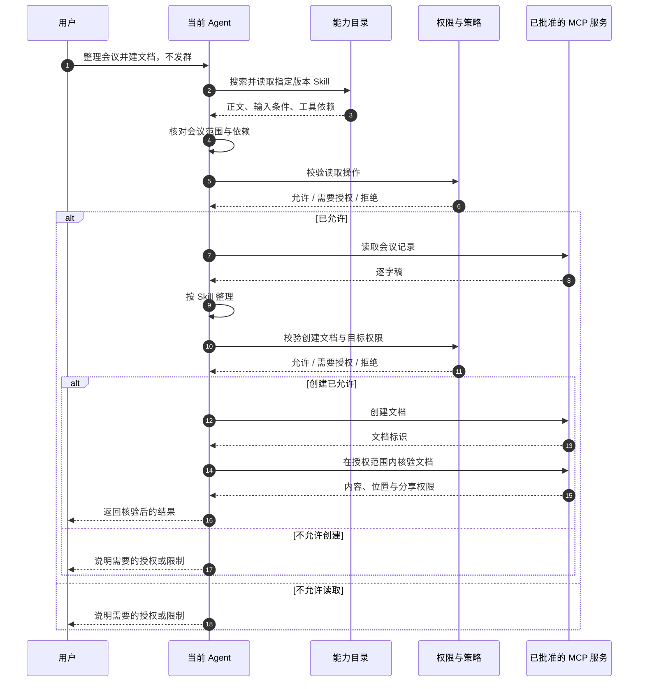

[发现与检索](/writing/capability-routing-discovery/)解决了“怎样找到候选”。但搜索返回的可能是一个总结 Skill、一个创建文档工具，以及一个会议助理 Agent。它们都相关，任务粒度却完全不同。

这一篇展开全景图中的“方案选择与执行”。核心变化是：**从给能力排序，转向比较完成任务的路径。**

## 相关的工具，不一定能完成任务

把会议请求拆成结果要求：取得会议内容，整理决策和待办，创建飞书文档，检查内容和访问权限，不发群。

“创建文档”工具只覆盖其中一步。一个总结 Skill 可以提供整理方法，却未必具备读取会议记录的工具。会议助理 Agent 可能覆盖全程，也可能需要把数据发送到另一环境。

因此，每个候选都需要经过可行性检查：输入是否已有，依赖是否可用，数据是否允许流向目标环境，结果是否可验收，成本是否在预算内。一个方案可以包含多个能力，相关度最高的单个能力不一定属于最合适的方案。

第一版无需实现任意复杂规划。先把已知任务组织为少量可检查的模板：本地 Skill 加工具，或委派给允许使用的 Agent；遇到模板无法覆盖的任务，就明确报告缺口。再根据真实失败决定是否增加动态规划。

## 三种执行语义，不能被一个函数名抹平

下图假设选择了“当前 Agent 加载 Skill，并调用工具”的路径：



*图 1｜实线箭头表示请求，虚线箭头表示返回；纵向顺序表示一次任务推进。图展示成功读取后的主路径与授权分流；真实实现仍要处理接口错误，不能假定每次调用成功。*

**Skill 路径：加载方法。**读取正文后核对输入与依赖，再由当前 Agent 执行。正文要求发邮件，不代表用户授权发邮件。来源可信也不意味着可以覆盖当前任务限制。

**MCP 路径：调用操作。**工具执行适配器负责参数、身份、超时和返回值。服务器发现与具体工具选择要分开；对已批准服务可以缓存目录，执行时仍需检查定义与授权。发现未知服务不等于允许自动安装。

**Agent 路径：委派任务。**向另一个执行主体交付目标、必要输入、禁止事项、预算与验收条件。Agent Card 提供发现信息，但不是质量证明；也不能把其中的能力描述条目直接当成可下载的 `SKILL.md`。状态查询、取消和结果获取能力需要按实际接口验证。[A2A Agent Discovery](https://a2a-protocol.org/latest/topics/agent-discovery/)

三条路径可以共享追踪 ID 和结果封装，但执行内部不能一律替换成“运行文本”。

## 动态加载的，到底是哪一层？

[LangGraph BigTool](https://github.com/langchain-ai/langgraph-bigtool) 展示了先注册工具对象，再通过检索 ID 改变模型可用工具集合的模式。动态变化的是模型当前可见集合，不一定是下载代码。

[FastMCP Tool Search](https://gofastmcp.com/servers/transforms/tool-search) 通过搜索与调用代理减少全量工具暴露；[skills-mcp](https://github.com/Jignesh-Ponamwar/skills-mcp) 则可参考搜索、正文和资源读取的分层接口。

因此，接入时先确认三个位置：能力定义存在哪里，模型何时看到它，真正由哪个执行端调用它。否则很容易把搜索代理误认为安全网关，把加载成功误认为权限就绪。

专业 Agent 的委派还有额外成本：上下文传输、异步等待、结果核对。当前 Agent 已经能做好的简单任务，不必再转交一次；需要独立专长或运行环境时，委派才可能值得。

## 失败恢复，也属于方案设计

| 状态 | 下一步 | 不该做什么 |
| --- | --- | --- |
| 缺逐字稿，只有录音 | 在允许范围内追加检索转写能力 | 假装已经拿到文字 |
| 缺关键客户范围 | 向用户澄清 | 自动猜测 |
| 接口参数不匹配 | 校验定义并修正参数 | 原样重试到超时 |
| 权限拒绝 | 停止或进入授权流程 | 换身份或连接器绕过 |
| 写入超时、结果未知 | 查询状态或使用支持的幂等机制 | 立即换工具重复创建 |

权限拒绝不是普通网络错误。写操作超时也不能简单判断失败：文档可能已经创建，只是响应丢失。恢复前要核对已有状态，并遵守原来的授权和总预算。

已执行的副作用不会因为“重新规划”而消失。任务状态至少记录已经读取什么、已经创建什么、结果是否确定，否则模型每轮都可能重复工作。

## 动手验证：把不同执行路径显式暴露出来

在仓库根目录运行离线实验：

```bash
python3 docs/capability-routing/lab.py execute --path skill
python3 docs/capability-routing/lab.py execute --path mcp
python3 docs/capability-routing/lab.py execute --path agent
python3 docs/capability-routing/lab.py execute --path skill --no-auth
python3 docs/capability-routing/lab.py execute --path skill --stale
```

实验显式选择路径，模拟不同执行语义；不会访问飞书、发送消息或启动远程 Agent。`skill` 路径展示说明加载与工具依赖，`mcp` 路径接收已有摘要，`agent` 路径记录任务交付。不能将这些模拟步骤当作真实 MCP 或 A2A 协议测试。

预期验收：正常路径返回标记为模拟的文档结果；缺授权返回 `NEEDS_AUTH`；版本过期返回 `BLOCKED`，而不是继续使用旧定义。完整结果包含路径与效果记录，便于确认未发生消息发送。

真正接入服务时，用实际 SDK 替换适配器，并在测试空间验证身份、工具定义、写入与结果查询。这一步的验收对象是可查证的产物，不是模型的一句“完成了”。

## 执行过程会反过来改变路由

拿到录音才知道需要转写，读取正文才发现依赖不可用，调用后才知道资源已存在。每一步都会产生新的证据，影响下一次选择。

所以，路由不是任务开始前的静态开关。它是一个有限循环：发现、选择、执行、更新状态；可以重选，也必须能够结束。
