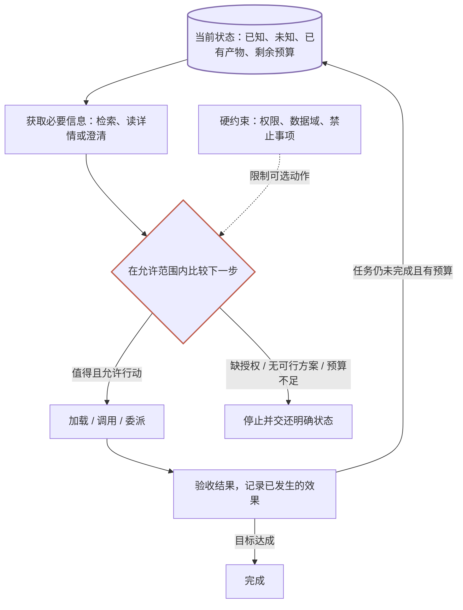

> 万级能力路由系列：[① 系统全景](/writing/capability-routing-at-scale/) · [② 发现与检索](/writing/capability-routing-discovery/) · [③ 方案与执行](/writing/capability-routing-execution/) · [④ 评测与治理](/writing/capability-routing-evaluation/) · [⑤ 整体思考](/writing/capability-routing-synthesis/)

第一篇问：一个能访问上万个能力的 Agent，应该如何决定用什么、怎么用，以及什么时候不该用？

经过发现、执行和评测三篇，我们可以给出比“先检索，再加载”更完整的答案：**能力路由是一种受约束的任务决策。检索是它获取证据的方法，工具调用是它采取行动的方法，而结果验收决定下一步是否还需要行动。**

这一篇不再新增组件，而是重新解释前面每个组件为什么存在，以及哪里不该继续增加复杂度。

## 一、我们真正优化的，不是首位候选

第二篇用检索指标衡量能否找到合适能力。第三篇指出，单个工具命中不代表方案可执行。第四篇进一步区分了调用成功与结果达标。

这些差异共同指向一个问题：优化对象应该是一项任务，而不是一张候选榜单。

一个系统可能总能选中功能最强的 Agent，却付出更多等待、数据传输和验收成本；另一个系统只用熟悉的 Skill 与两个工具，反而更快完成任务。反过来，强行留在本地，也可能因为缺少专长而反复失败。

更合理的比较对象，是**当前条件下可行方案的预期收益与代价**。可以用一个概念表达式帮助思考：

$$
a^* = \arg\max_{a \in \mathcal{A}_{\mathrm{allowed}}(s)}
\left[\mathbb{E}(U \mid s,a) - \lambda C(s,a) - \mu T(s,a)\right]
$$

其中，$s$ 是当前任务状态，$a$ 可以是检索、澄清、执行或停止，$U$ 表示任务收益，$C$ 与 $T$ 分别表示成本与耗时。这个公式是设计视角，不是声称已经存在准确可用的收益预测器。

关键在集合 $\mathcal{A}_{\mathrm{allowed}}$：禁止外传的数据、没有授权的写操作，应先排除，不能靠高收益抵消。权限不是排序偏好。

## 二、按需加载，本质上是在决定何时获取信息

只看摘要很便宜，却可能遗漏自动群发；读正文更充分，却增加检索成本；再调用另一个 Agent 确认，也可能只是重复一次不确定判断。

所以，“加载多少”与“选哪个”不是两个独立问题。加载详情本身，就是为了改善下一次决策而采取的动作。

可以用一条朴素原则判断是否继续读取：

> 新信息有多大机会改变方案？这种改变是否值得额外成本？

明确点名、输入齐全、工具定义稳定的任务，可能无需完整漏斗。几个候选副作用不同、依赖未知时，读正文或澄清才有明显价值。

这解释了为什么正文参与路由与主 Agent 渐进式加载并不冲突：路由器用更丰富的信息做比较，执行 Agent 只接收当前阶段需要的内容。限制上下文，不是限制系统理解能力的全部信息来源。

## 三、统一接口的终点，是保留必要差异

统一发现降低了使用门槛：用户不需要先知道自己找的是 Skill、MCP 还是 Agent。

但统一过头，会丢掉决策最需要的信息。Skill 是方法，工具是操作，Agent 是另一个执行主体；它们的输入粒度、依赖、状态和信任边界不同。

因此，统一层应该保留类型、版本、输入输出、约束、依赖和来源，再由执行适配器处理差异。共同结果格式帮助追踪，却不能抹平任务语义。

“会议总结 Skill”和“会议助理 Agent”的相似度甚至未必可直接比较。先形成两条可行方案，再比较覆盖、成本与数据去向，通常比把它们硬塞进同一个 Top-1 排名更有意义。

## 四、能力越多，为什么不一定越强？

增加能力可以扩大覆盖面，也会增加重复、歧义、版本维护和依赖冲突。一个有一万个条目的目录，可能只有少数能力具备稳定说明、明确依赖和可验收结果。

我们可以区分三个层次：

| 层次 | 含义 | 不能自动推导的结论 |
| --- | --- | --- |
| 名义能力 | 已注册的目录条目 | 不代表当前可用 |
| 可执行能力 | 身份、输入、依赖和环境满足 | 不代表适合这项任务 |
| 有效能力 | 在预算与约束内帮助完成任务 | 不等于目录数量 |

这也解释了元数据维护为什么不是边角工作：描述决定发现，版本决定一致性，依赖决定可执行性，验收决定效果。大量不完整能力可能扩大目录，却没有扩大用户实际能完成的任务范围。

系统还存在反馈偏差。只展示熟悉能力，就很难获得新能力的质量证据；盲目探索，又可能拿用户任务承担风险。合理做法是通过离线样本和低风险验证积累证据，而不是将“越用越准”当成自动成立的规律。

## 五、重新画一遍第一篇的图

*图 6｜矩形是动作，圆柱是任务状态，菱形是决策，虚线是硬约束。循环表示新证据更新下一轮选择，不表示无限重试；“停止”与“完成”是不同的合法出口。*

第一篇的目录、搜索、选择和执行，现在分别对应知识准备、信息获取、行动决策与状态更新。第四篇的日志与评测让我们能够检查这个循环，而不只是观察终点。

以会议任务为例：读取正文后发现需要逐字稿，就更新缺口；创建文档超时后，状态应是“结果未知”，下一步查询已有写入，而不是再创建一次；明确禁止发群，则这条动作始终不进入可选集合。

每一次决策都依赖当前证据，而不是假设第一次搜索已经知道整个任务。

## 六、成熟架构也需要知道何时简化

固定审批流程、明确点名的工具、少量稳定能力，未必需要全套动态检索与规划。确定性路径已经能满足目标时，增加自由度往往也增加故障面。

因此，落地顺序应由失败证据决定：

- 同义表达总漏掉能力，补充语义召回。
- 描述相似但行为不同，补正文精排。
- 经常缺依赖，补方案可行性检查。
- 结果不确定时重复写入，补状态核对与幂等。
- 无法解释误选，补候选和执行追踪。

这不是要求系统永远简单，而是要求复杂度有明确用途。模块可以逻辑分离，不必第一天就拆成多个微服务；已有项目能覆盖的部分，也不需要重造。

## 结语：把“寻找能力”升级为“对任务负责”

这个系列从一万个能力出发，最终落到三个问题：系统凭什么选择，凭什么执行，凭什么宣称完成？

能力表达与检索提供选择依据；类型、依赖和授权约束执行；验收、日志和评测提供完成证据。三者缺一，局部正确就可能掩盖整体失败。

如果读完后只记住“向量检索加精排”，就遗漏了更重要的部分：一个可扩展的 Agent 需要知道当前还缺什么信息、有哪些允许的路径、哪些效果已经发生，以及什么时候应把决定交还用户。

**目录规模衡量系统能发现多少可能性；任务决策的质量，才决定其中多少可能性能够成为可靠结果。**

[← 第四篇：评测与治理](/writing/capability-routing-evaluation/) · [回到第一篇：用新的视角重读全景图](/writing/capability-routing-at-scale/) · [配套离线实验](https://github.com/MarkingYang/aidea-lab/tree/main/docs/capability-routing)
