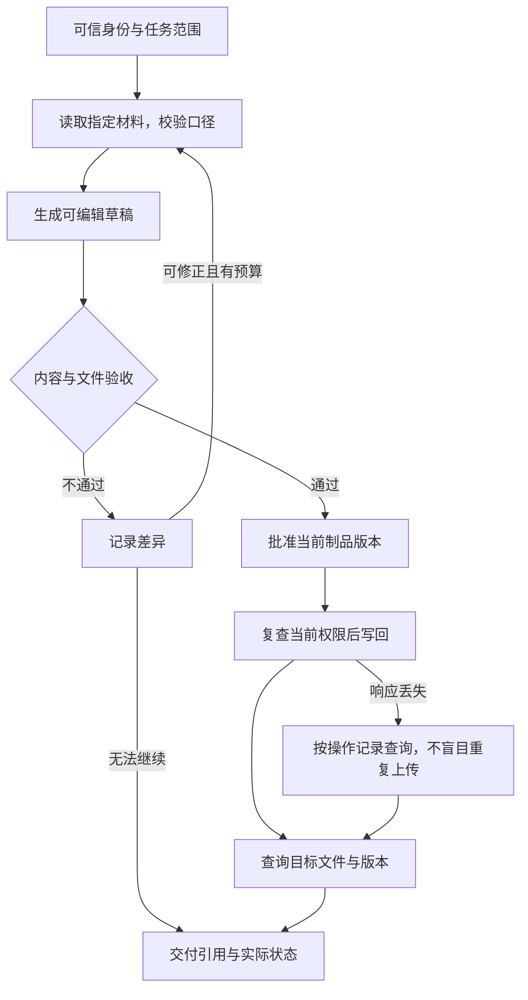

办公 Agent 的采用应以最终交付为准：资料取对、文件可继续编辑、写回对象正确，异常能由明确的人接管。候选产品的定位集中在[办公 Agent 比较](/writing/china-work-agent-showdown/)，本篇只展开落地验证。

## 先定义一项完整工作

以下是教学场景：运营同事用已授权的本月销售表和活动记录制作月报，交付一份可编辑表格与演示文稿，并在批准后写回团队工作区的指定文件夹。允许读取这两类材料、生成草稿和写入该文件夹；不允许向客户发送，也不能读取其他团队文件。

| 阶段 | 输入与动作 | 完成证据 | 常见误判 |
| --- | --- | --- | --- |
| 取得材料 | 固定月份、销售口径、活动范围与来源版本 | 实际读入的文件清单 | 把上月文件或无权材料混入 |
| 整理分析 | 对齐字段，计算总额，解释变化 | 可重算的明细与公式、来源引用 | 报告流畅但混淆含税与未税金额 |
| 生成制品 | 输出可编辑表格和演示文稿 | 文件能打开，公式与图表可修改，页面不溢出 | 只有截图，无法继续编辑 |
| 审核写回 | 批准具体版本后写到指定文件夹 | 文件 ID、版本、位置与当前可见性 | 草稿生成被当作写回成功 |
| 异常接管 | 超时、撤权或数据不足时停止相应动作 | 未完成事项、已发生操作、负责人 | 失败后换位置或账号继续写入 |

例如销售表的总额为 120 万元，活动记录只覆盖其中 80 万元。报告可以说明“有活动关联记录的销售额为 80 万元”，不能把两份材料相加为 200 万元，也不能据此断言活动带来 80 万元增量。这个例子检查统计口径与因果边界，数字为手工设定。

*图 1｜建议的月报交付流程。修正有任务预算；批准不覆盖写回前的撤权，查询失败时保留待对账状态。*

## 文件可用与系统写回分别验收

文件验收应使用下游真实软件检查可编辑性、公式、字体和分页。能下载 PPT 不代表能直接汇报；能够打开 Excel 也不代表公式引用正确。对关键数字保留独立计算，模型解释不能替代复算。

写回验收检查资源身份、目标位置和访问权限。上传超时后先查是否已经产生目标版本；若系统没有幂等键或稳定查询能力，需要明确的人工对账出口。创建了另一份重名文件，不能算恢复成功。

研究类材料另外检查来源支持率、口径和冲突保留；多模态制品另外检查素材授权、可编辑范围与返工时间。通用方法沿用[Agent 评测设计](/writing/agent-system-evaluation-research/)，不再另造一套采购演示分数。

## 企业连接先确认身份和产品版本

连接器存在只证明有接入方式。Agent 代表谁读写、是否能分开控制读取与发送、撤权多久生效、数据和日志存在哪，必须在目标租户测试。

WorkBuddy 企业版公开介绍组织、SSO、审计和不同交付方式，并提供 MCP / CLI 等连接路径。[企业版说明](https://cloud.tencent.com/document/product/1831/134332)、[连接器文档](https://cloud.tencent.com/document/product/1831/134525) 这些是截至 2026-09-05 的官方能力资料，不是本文的租户实测。

其 CodeBuddy 子系统的[安全说明](https://cloud.tencent.com/document/product/1831/137056)不能外推到个人版所有工作模式。企业采用表应记录产品、子系统、套餐、部署形态与实际配置；“腾讯云有认证”不能替代这次 Agent 数据流的验证。

跨端也要分开验收。豆包[手机助手](https://o.doubao.com/)属于另一个产品，手机和桌面都有操作能力不能证明共用同一 Session。Kimi 的多个入口共享计费池，也不能证明任务、权限和历史可以无损迁移。[Kimi 计费说明](https://www.kimi.com/en/help/agent/agent-quota-and-billing)

## 用三个反例测试接管

| 故障 | 应有结果 | 要保留的证据 |
| --- | --- | --- |
| 草稿生成后撤销目标文件夹写权限 | 即使已经批准，也不能新增写回 | 当前身份、权限检查和未执行记录 |
| 上传完成但客户端未收到响应 | 查询既有文件或进入人工对账，不盲目重复上传 | 操作身份、文件 ID、版本与资源数量 |
| 一份材料缺少本月数据 | 说明缺口，交付有限草稿或等待补充 | 缺失字段、范围与未完成部分 |

这些是建议验收项，本文没有替候选产品完成实际租户测试。若产品不提供所需状态或查询接口，应标为能力缺口，而不是让测试人员手工修复后记为自动成功。

## 采用决定应包含维护与退出成本

个人用户先选一项重复任务，比较人工完成与 Agent 辅助的总时间。企业可参考[统一 PoC 方法](/writing/agent-landscape-comparison-methods/)，从有代表性的部门任务开始；试验周期和样本量按任务频率与风险决定，不把“两周”或“30 题”当通用充分条件。

| 项目 | 记录口径 | 决策用途 |
| --- | --- | --- |
| 交付质量 | 按任务类型记录验收通过、失败与未完成 | 是否达到最低业务要求 |
| 人工时间 | 准备、复核、修正与接管的分钟数 | 是否存在净节省 |
| 总成本 | 包含失败和人工的总成本 / 合格交付数 | 是否可持续；零交付单列 |
| 权限与证据 | 逐项通过、失败、未验证 | 硬约束不得用其他高分抵消 |
| 维护与退出 | 连接器升级、资产导出、凭证撤销、数据删除 | 停用或替换时能否保留业务连续性 |

最终记录：“在指定租户和任务范围采用该产品，因为通过了哪些检查；仍由谁负责哪些人工步骤；什么故障或成本变化会触发停用或复评。”这个结论比一份功能排名更便于团队执行。
