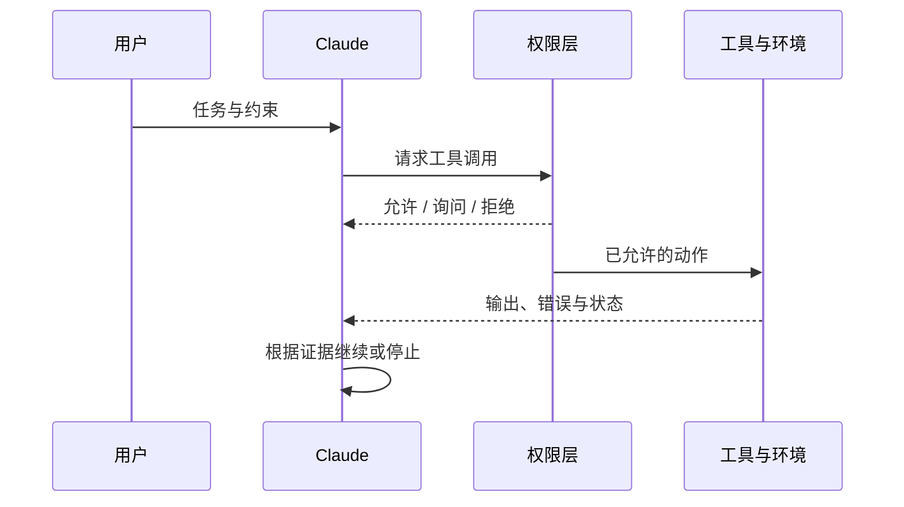

> 系列：[1. 全景](/writing/claude-code-internals-overview/)｜[2. 执行循环](/writing/claude-code-agent-loop/)｜[3. 记忆与扩展](/writing/claude-code-memory-extension/)｜[4. 整体判断](/writing/claude-code-internals-synthesis/)

Claude Code 每轮都在重复一个短循环：收集当前上下文，选择工具，获得真实结果，再决定继续、修正或结束。模型负责开放式判断，工具负责让判断接触文件、Git 和运行环境；权限规则则在副作用发生前限制行动范围。

*图 1｜权限不替模型思考，但决定哪些推理可以转化为真实副作用。*

这里必须区分“完成动作”和“完成任务”。写入文件只证明工具成功，测试、构建、运行结果和 Diff Review 才构成交付证据。Hook 可以在工具前后追加检查，Subagent 可以隔离大范围探索，但最终仍需主循环把结果纳入任务判断。

官方文档也提醒，项目规则进入上下文后属于模型要遵循的指令，并非强制配置。真正不能被绕过的安全要求，应放进权限规则或能够阻断动作的 Hook，而不是只写一句“不要这样做”。

---

上一篇：[全景](/writing/claude-code-internals-overview/)。

下一篇：[记忆与扩展](/writing/claude-code-memory-extension/)。

执行循环解释了一次任务。下一篇进入跨会话状态，区分记住事实、加载方法和强制自动化。
