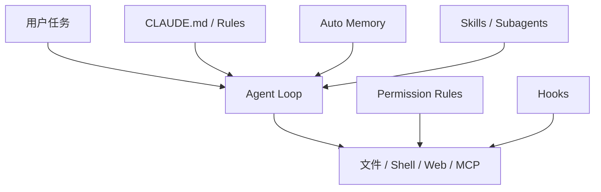

> 系列：[1. 全景](/writing/claude-code-internals-overview/)｜[2. 执行循环](/writing/claude-code-agent-loop/)｜[3. 记忆与扩展](/writing/claude-code-memory-extension/)｜[4. 整体判断](/writing/claude-code-internals-synthesis/)

Claude Code 的核心实现并未完整开源，公开仓库主要承担分发、Issue、插件和部分工具，因此本系列不能假装完成逐行源码分析。可验证材料来自[官方仓库](https://github.com/anthropics/claude-code)与[官方架构文档](https://code.claude.com/docs/en/how-claude-code-works)。

*图 1｜Claude Code 把提示上下文、按需能力与确定性自动化放在不同扩展层。*

第二篇研究模型怎样在观察、工具和验证之间循环；第三篇拆开 CLAUDE.md、Auto Memory、Skill、Subagent 与 Hook，重点判断什么是上下文建议、什么是确定性执行。终篇再回答：Claude Code 的“学习”究竟发生在哪里。

---

下一篇：[执行循环](/writing/claude-code-agent-loop/)。

下一篇先回到一次任务内部，看 Agent 如何获得证据并决定继续或停止。
