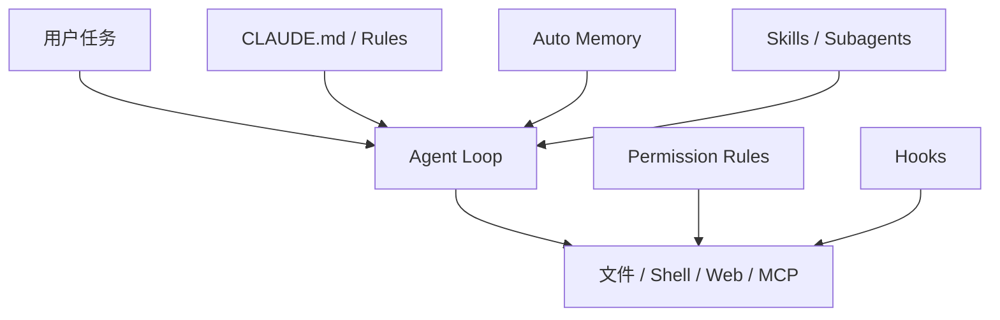
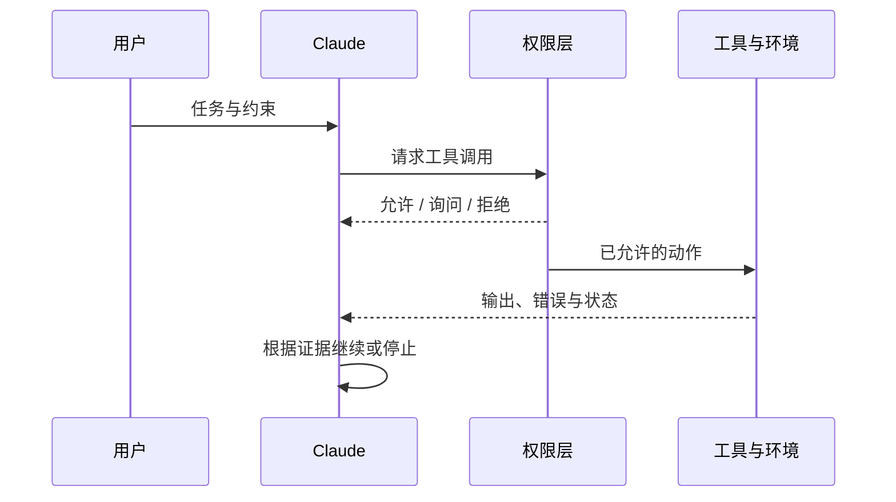

Claude Code 的核心实现并未完整开源，公开仓库主要承担分发、Issue、插件和部分工具，因此本文不声称完成逐行源码分析。可验证材料来自[官方仓库](https://github.com/anthropics/claude-code)与[官方架构文档](https://code.claude.com/docs/en/how-claude-code-works)。

研究口径：依据文中链接的公开文档，核对日期为 2026-09-06；下图是职责归纳，不是完整部署图，也不作为未运行路径的实测证明。

设用户要求修复登录请求超时并运行回归，不推送代码。Claude Code 可以读取实现、提出修改并调用测试；模型提出 Git 推送时，应由当前权限与任务约束阻止。下文以这条任务说明上下文、工具和扩展的分工。

*图 1｜Claude Code 把提示上下文、按需能力与确定性自动化放在不同扩展层。*

## 执行循环：工具证据与停止条件

Claude Code 每轮都在重复一个短循环：收集当前上下文，选择工具，获得真实结果，再决定继续、修正或结束。模型负责开放式判断，工具负责让判断接触文件、Git 和运行环境；权限规则则在副作用发生前限制行动范围。

*图 2｜权限不替模型思考，但决定哪些推理可以转化为真实副作用。*

这里必须区分“完成动作”和“完成任务”。写入文件只证明工具成功，测试、构建、运行结果和 Diff Review 才构成交付证据。Hook 可以在工具前后追加检查，Subagent 可以隔离大范围探索，但最终仍需主循环把结果纳入任务判断。

官方文档也提醒，项目规则进入上下文后属于模型要遵循的指令，并非强制配置。安全要求应落实到权限规则、工具后端和操作系统隔离；能够阻断动作的同步 Hook 可补充路径内检查，但需验证事件覆盖、禁用和失败处理，不能把它视为不可绕过的总边界。

## 记忆与扩展：信息加载和执行边界

Claude Code 的扩展体系按加载时机分层。CLAUDE.md 保存每次会话都需要的项目规则；Auto Memory 由 Claude 根据纠正与经验维护；Skill 的描述常驻而正文按需加载；Subagent 在隔离上下文中工作；Hook 则按配置匹配生命周期事件并触发处理。[官方 Memory 文档](https://code.claude.com/docs/en/memory)明确区分人工规则与自动记忆。

| 机制 | 谁写入 | 何时生效 | 主要风险 |
| --- | --- | --- | --- |
| CLAUDE.md | 人或显式初始化 | 每次会话 | 过长、冲突、规则漂移 |
| Auto Memory | Agent | 跨会话 | 错误经验持续注入 |
| Skill | 作者或团队 | 匹配任务时 | 误触发、内容过时 |
| Subagent | 主 Agent 调度 | 独立任务期间 | 摘要丢失关键证据 |
| Hook | 配置与脚本作者 | 确定事件 | 高权限脚本副作用 |

官方把 Auto Memory 保存为可读 Markdown，并允许用户审计、编辑和删除，这是重要的可治理基础；但“可见”仍不等于“已验证”。经验进入记忆后会影响未来上下文，因此还需要来源、冲突和失效策略。

Skills 与 Hooks 的差异尤其关键：Skill 为模型提供工作流方法，Hook 在配置匹配的事件上触发检查。执行前的同步 Hook 可以参与阻断；事后或异步 Hook 不能承担同样的门禁。需要强制的约束还应落实到权限、工具服务和操作系统隔离，并测试禁用、超时和错误退出时的行为。[Hook 事件、退出码与异步行为](https://code.claude.com/docs/en/hooks)
