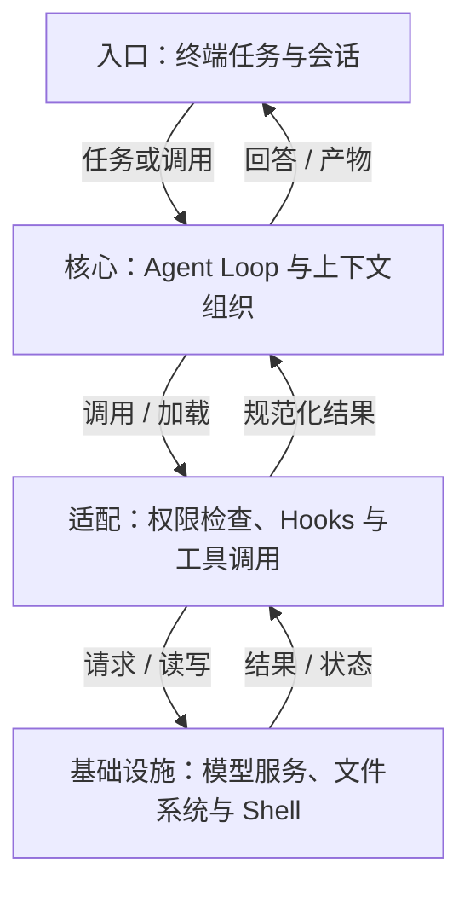
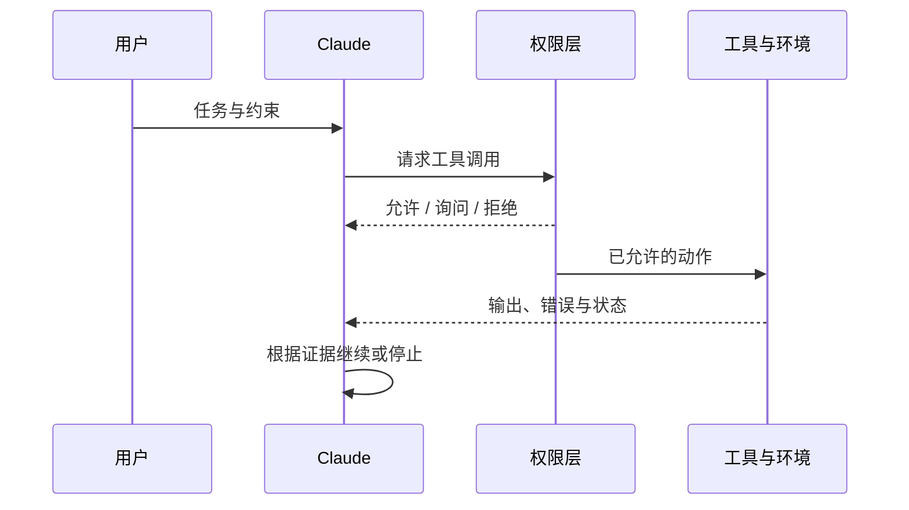

## 定位与价值

Claude Code 是在代码仓库中执行读取、修改与验证任务的编程 Agent；它把手工复制文件、追问模型和运行命令的往返组织成工具循环。

适合交互式开发与受控自动化；不适合要求审计完整核心源码或仅凭提示词实现强隔离的场景。

研究基线：[anthropics/claude-code @ d7dbd9a](https://github.com/anthropics/claude-code/blob/d7dbd9a09f59775726ed14bbea8fc9dfdff62f7b/README.md)；源码与社区核对日期为 2026-09-06。

## 技术架构



*图 1｜职责与数据流；逻辑分层不要求分开部署。*

## 核心机制

### 执行循环怎样取得证据

Claude Code 每轮都在重复一个短循环：收集当前上下文，选择工具，获得真实结果，再决定继续、修正或结束。模型负责开放式判断，工具负责让判断接触文件、Git 和运行环境；权限规则则在副作用发生前限制行动范围。



*图 2｜权限不替模型思考，但决定哪些推理可以转化为真实副作用。*

这里必须区分“完成动作”和“完成任务”。写入文件只证明工具成功，测试、构建、运行结果和 Diff Review 才构成交付证据。Hook 可以在工具前后追加检查，Subagent 可以隔离大范围探索，但最终仍需主循环把结果纳入任务判断。

官方文档也提醒，项目规则进入上下文后属于模型要遵循的指令，并非强制配置。安全要求应落实到权限规则、工具后端和操作系统隔离；能够阻断动作的同步 Hook 可补充路径内检查，但需验证事件覆盖、禁用和失败处理，不能把它视为不可绕过的总边界。


### 记忆与扩展怎样加载

Claude Code 的扩展体系按加载时机分层。CLAUDE.md 保存每次会话都需要的项目规则；Auto Memory 由 Claude 根据纠正与经验维护；Skill 的描述常驻而正文按需加载；Subagent 在隔离上下文中工作；Hook 则按配置匹配生命周期事件并触发处理。[官方 Memory 文档](https://code.claude.com/docs/en/memory)明确区分人工规则与自动记忆。

| 机制 | 谁写入 | 何时生效 | 主要风险 |
| --- | --- | --- | --- |
| CLAUDE.md | 人或显式初始化 | 每次会话 | 过长、冲突、规则漂移 |
| Auto Memory | Agent | 跨会话 | 错误经验持续注入 |
| Skill | 作者或团队 | 匹配任务时 | 误触发、内容过时 |
| Subagent | 主 Agent 调度 | 独立任务期间 | 摘要丢失关键证据 |
| Hook | 配置与脚本作者 | 确定事件 | 高权限脚本副作用 |

官方把 Auto Memory 保存为可读 Markdown，并允许用户审计、编辑和删除，这是重要的可治理基础；但“可见”仍不等于“已验证”。经验进入记忆后会影响未来上下文，因此还需要来源、冲突和失效策略。

Skills 与 Hooks 的差异尤其关键：Skill 为模型提供工作流方法，Hook 在配置匹配的事件上触发检查。执行前的同步 Hook 可以参与阻断；事后或异步 Hook 不能承担同样的门禁。需要强制的约束还应落实到权限、工具服务和操作系统隔离，并测试禁用、超时和错误退出时的行为。[Hook 事件、退出码与异步行为](https://code.claude.com/docs/en/hooks)

## 快速上手

先按官方 README 安装 Claude Code 并完成登录。下面在新建教学目录运行，只验证读取与回答。

```bash
claude --version
mkdir -p claude-demo
cd claude-demo
printf "# Demo\nThis project has no source files yet.\n" > README.md
claude -p "只读取 README.md，用一句话说明项目现状"
```

三个常用配置：

| 配置或安装选项 | 作用 |
| --- | --- |
| `model` | 选用账号可用的模型，影响质量与费用 |
| `permissions.allow` | 预先允许的工具规则；缩小到所需操作 |
| `permissions.deny` | 明确拒绝的工具规则，如禁止推送 |

其余选项见 [配置参考](https://code.claude.com/docs/en/settings)。

常见坑：首次运行先完成登录；README 已将 npm 安装列为弃用方式，优先按官方原生安装说明操作。

验证范围：已核对固定源码的入口、参数与依赖；未以本文示例调用真实模型或部署外部服务。

## 生态与社区

截至 2026-09-06，2026-08-08 至 09-06 UTC 的抽样取得 至少 30 条默认分支提交（上限 30 条）。见 [提交记录](https://github.com/anthropics/claude-code/commits/main/)。

Issue 取 08-08 至 08-30 UTC 创建的最近最多 3 条非 PR 条目，排除机器人和提问者自答；3 条中 0 条观察到维护者文字回复。 样本：[#90859](https://github.com/anthropics/claude-code/issues/90859)、[#90858](https://github.com/anthropics/claude-code/issues/90858)、[#90857](https://github.com/anthropics/claude-code/issues/90857)。小样本不代表 SLA，“未观察到”也不代表其他渠道无人处理。

固定快照许可证：[自定义商业条款；核心产品未完整开源](https://github.com/anthropics/claude-code/blob/d7dbd9a09f59775726ed14bbea8fc9dfdff62f7b/LICENSE.md)。

仓库维护插件示例与 Hook 开发资源；核心产品的 MCP、IDE 等集成以官方文档为准。第三方市场插件并不因此获得官方质量保证。

## 源码阅读路径

阅读顺序：入口 → 核心抽象 → 具体实现 → 测试。

| 顺序 | 目录 → 文件 | 函数、对象或检查重点 |
| --- | --- | --- |
| 1 | [plugins/hookify/.claude-plugin/plugin.json](https://github.com/anthropics/claude-code/blob/d7dbd9a09f59775726ed14bbea8fc9dfdff62f7b/plugins/hookify/.claude-plugin/plugin.json) | 插件元数据：公开扩展入口 |
| 2 | [plugins/hookify/hooks/hooks.json](https://github.com/anthropics/claude-code/blob/d7dbd9a09f59775726ed14bbea8fc9dfdff62f7b/plugins/hookify/hooks/hooks.json) | PreToolUse 等事件绑定 |
| 3 | [plugins/hookify/hooks/pretooluse.py](https://github.com/anthropics/claude-code/blob/d7dbd9a09f59775726ed14bbea8fc9dfdff62f7b/plugins/hookify/hooks/pretooluse.py) | main：读取事件并调用规则引擎 |
| 4 | [plugins/hookify/core/rule_engine.py](https://github.com/anthropics/claude-code/blob/d7dbd9a09f59775726ed14bbea8fc9dfdff62f7b/plugins/hookify/core/rule_engine.py) | RuleEngine.evaluate_rules：检查规则 |
| 5 | [plugins/plugin-dev/skills/hook-development/scripts/test-hook.sh](https://github.com/anthropics/claude-code/blob/d7dbd9a09f59775726ed14bbea8fc9dfdff62f7b/plugins/plugin-dev/skills/hook-development/scripts/test-hook.sh) | 公开 Hook 测试脚本；并非核心运行时测试 |
