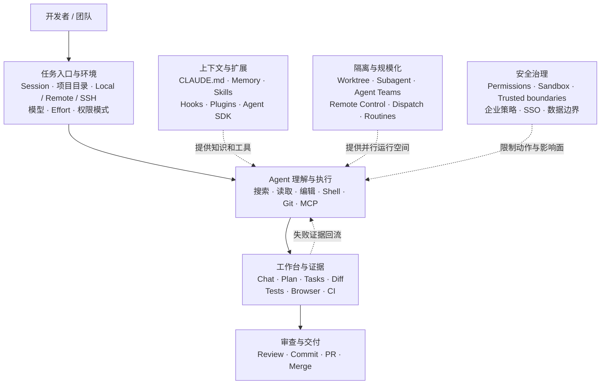
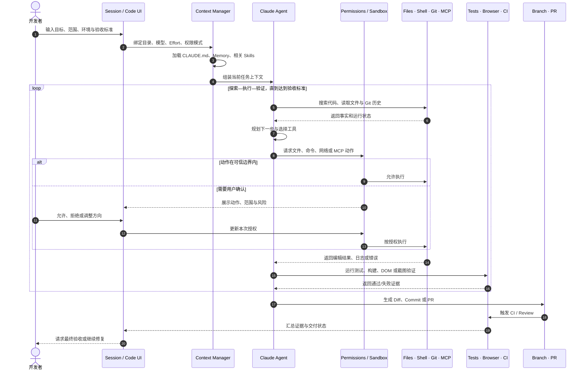
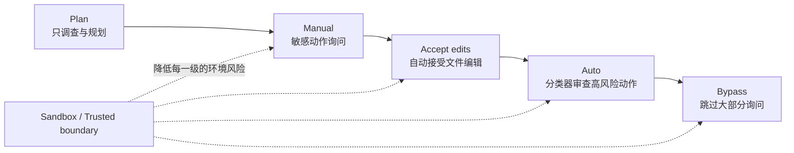
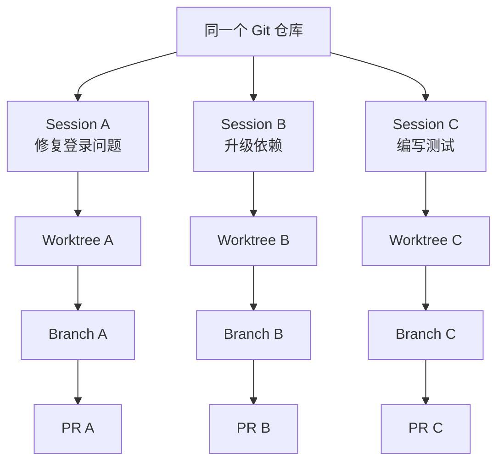

如果只把 Claude Code 理解成“会写代码的聊天机器人”，就会错过它最重要的产品变化。

它真正改变的不是代码生成速度，而是软件工程任务的组织方式：开发者给出目标、工作目录、权限和验收标准；Agent 在真实环境中读取代码、选择工具、修改文件；测试、浏览器、Diff 和 CI 再把结果变成可检查的证据。

> [!IMPORTANT]
> 本文的核心判断是：**Claude Code 不是 AI IDE，而是一套以 Session 为业务对象、以验证闭环为核心、以渐进授权控制风险的软件工程任务系统。**

本文结合 Claude Code 官方文档、Anthropic 公布的使用研究，以及 Claude Desktop 的实际页面结构，从整体到局部回答三个问题：它有哪些业务能力？这些能力如何形成调用链？为什么产品要这样设计？

为了避免账户姓名、头像、项目目录、模型供应商、内部地址和使用量等信息在截图中泄露，文中的页面结构全部重绘为 Mermaid、表格或文本线框，不使用真实客户端截图。产品状态截至 2026 年 9 月；不同套餐、模型、操作系统与企业策略可能导致能力差异。

## 一、先给结论：Claude Code 的设计由三个闭环组成

按照金字塔原理，Claude Code 的大量功能可以归入三个相互嵌套的闭环。


第一层是**目标闭环**。用户不是逐行写指令，而是定义“做什么、不能做什么、怎样才算完成”。

第二层是**执行闭环**。Agent 自主搜索代码、选择工具、编辑文件、运行命令，并根据中间结果继续决策。

第三层是**证据闭环**。测试、构建、截图、DOM、Diff 和 CI 不只是展示结果，而是重新进入 Agent 上下文，驱动下一轮修复。

权限、沙箱和企业策略包围执行过程；CLAUDE.md、Memory 和 Skills 提供不同寿命的知识；Session、Worktree 与 Subagent 则让多个任务可以隔离运行。理解这张图，后面的功能就不再是一堆菜单，而是一套完整产品逻辑。

## 二、用 5W2H 定义产品：它到底解决什么问题

| 维度 | Claude Code 的答案 | 产品含义 |
| --- | --- | --- |
| Why | 降低从需求到可验证代码变更的协调成本 | 竞争点不只是生成质量，而是任务完成率 |
| Who | 个人开发者、复杂代码库维护者、技术负责人、平台与安全团队 | 同一产品需要同时服务执行者与治理者 |
| What | 理解代码、修改文件、运行命令、验证结果并进入 Git 交付 | 覆盖软件工程闭环，而非单点补全 |
| Where | CLI、IDE、Desktop、Web、本机、云端、SSH/WSL 环境 | Session 高于单一客户端，界面只是入口 |
| When | 探索代码、实现功能、修复故障、Review、部署与例行自动化 | 从一次问答扩展到长时间任务 |
| How | Agent 循环 + 工具调用 + 上下文管理 + 权限与沙箱 | 自主性来自系统设计，不只来自模型能力 |
| How much | 由模型、Effort、上下文规模、并行数和验证强度共同决定 | 用户需要在速度、成本、质量和风险间调节 |

Claude Desktop 中的 Chat、Cowork 与 Code 是不同工作表面：Chat 面向普通对话，Cowork 面向通用长任务，Code 面向软件开发。Claude Code 还运行在终端、IDE 和 Web 中。它们共享的是底层 Agent 能力，但任务对象、工具集、权限风险和验收方式不同。[Claude Code 官方概述](https://code.claude.com/docs/zh-CN/overview)

产品边界因此可以概括为：

```text
Chat：回答问题
Cowork：完成通用知识工作
Code：在真实软件工程环境中交付可验证变更
```

## 三、用户不是一种人：四类核心用户画像

下面的画像是根据产品能力推导出的分析性原型，并非 Anthropic 官方用户分群。它们的意义不是给用户贴标签，而是解释同一功能为什么需要多种入口和控制层级。

| 用户画像 | 核心任务 | 最担心什么 | 最需要的设计 |
| --- | --- | --- | --- |
| 独立开发者 | 快速从想法到可运行功能 | 配置复杂、Agent 经常中断 | 默认值、Browser 验证、较高自主性 |
| 代码库维护者 | 在陌生或大型仓库中定位并修改问题 | 改错位置、上下文污染 | Plan、代码搜索、CLAUDE.md、Diff |
| 技术负责人 | 并行推进 Issue、Review 和交付 | 多任务互相干扰、结果不可追踪 | Session、Worktree、Tasks、PR 状态 |
| 平台与安全团队 | 让组织安全地使用 Agent | 数据外泄、供应链命令、越权操作 | Sandbox、权限策略、Hooks、SSO、审计 |

四类用户之间存在天然张力：执行者希望少弹窗、快完成；治理者希望可限制、可追溯。Claude Code 的关键产品设计，大多是在解决“自主性”与“可控性”的冲突。

## 四、业务功能全景：九个能力域如何协同



| 功能领域 | 代表能力 | 用户价值 |
| --- | --- | --- |
| 任务入口 | Session、目录、环境、模型、Effort、权限、附件 | 把目标、成本、环境和风险绑定在一次任务上 |
| 代码理解 | 文件搜索、符号导航、Git 历史、代码智能 | 降低进入陌生代码库的上下文成本 |
| Agent 执行 | 编辑、Shell、测试、构建、调试、Web | 从“给建议”升级为“完成任务” |
| 开发工作台 | Chat、Plan、File、Terminal、Diff、Browser、Tasks、Subagent | 让长过程可以观察、干预和验收 |
| 验证交付 | 自动验证、Review、Commit、PR、CI、Auto-fix | 用外部证据约束模型的不确定性 |
| 并行协作 | Sessions、Worktrees、Subagents、Agent Teams | 并行推进且不污染上下文与代码 |
| 跨端自动化 | Remote、Dispatch、Remote Control、Routines、`/loop` | 任务脱离单一设备与单次在线会话 |
| 扩展平台 | CLAUDE.md、Skills、MCP、Hooks、Plugins、Agent SDK | 适配团队知识、工具和工作流 |
| 安全治理 | Permission Modes、Sandbox、可信目录、企业策略 | 在提高自主性的同时限定影响范围 |

## 五、核心调用链：一次任务如何从输入走到交付

功能全景解决“有什么”，调用链解决“如何发生”。一次典型开发任务可以还原为下面的时序。



这条调用链里有四个产品关键点。

第一，**输入框创建的不是消息，而是一份任务契约**。目录决定资源边界，权限决定动作边界，验收标准决定停止条件。

第二，**上下文不是一次性塞满**。启动时加载稳定规则，相关 Skill 按需进入，Subagent 在独立上下文中工作，工具输出只在需要时回流。

第三，**工具返回值是下一轮决策的输入**。测试失败、页面截图、命令退出码和 CI 日志都会改变 Agent 后续动作。

第四，**人主要控制意图与例外**。用户不需要批准每个推理步骤，但应在越过可信边界、改变任务范围或最终交付时拥有决定权。

## 六、用户旅程：页面为什么从简到繁

| 阶段 | 用户目标 | 主要触点 | 典型焦虑 | Claude Code 的设计回应 |
| --- | --- | --- | --- | --- |
| 启动 | 快速表达任务 | New Session、输入框 | 不知道先配什么 | 只暴露目录、模型、Effort、权限等关键变量 |
| 探索 | 判断 Agent 是否理解代码 | Chat、File、Git 搜索 | 它会不会改错地方 | 默认可读，允许先调查再行动 |
| 规划 | 对齐方案与影响面 | Plan | 方案错误会扩大返工 | 将探索与实施分开，允许先审计划 |
| 执行 | 让任务持续推进 | Terminal、Tasks、Subagent | 每一步批准很累 | 权限梯度、允许列表与 Sandbox 降低打断 |
| 验证 | 确认结果真的可用 | Diff、Tests、Browser | Agent 只是在声称成功 | 外部证据回流，失败后自动迭代 |
| 交付 | 安全进入团队流程 | Commit、PR、CI | 隐性错误进入主分支 | Review、CI 状态、Auto-fix 与受控合并 |
| 离开后继续 | 不守在电脑前等待 | Remote、Remote Control、Dispatch | 任务中断或错过关键请求 | Session 持续存在，关键节点再唤回用户 |

这里有一个明显的渐进披露逻辑：新建页几乎是空白的，只有任务配置；任务开始后，Plan、File、Terminal、Diff、Browser 和 Tasks 才按需出现。产品把复杂度留到用户真正需要的时刻。

## 七、KANO：哪些是基础能力，哪些创造产品差异

下表是基于当前功能结构的产品假设，而不是官方分类。不同用户画像的判断会变化，真正的 KANO 结论仍需问卷、访谈和行为数据验证。

| KANO 类型 | Claude Code 能力 | 产品判断 |
| --- | --- | --- |
| 基础需求 | 稳定读取与编辑、Terminal、Diff、权限控制、任务不丢失 | 缺失就无法建立信任，做好了也只是“应该如此” |
| 期望需求 | 代码理解质量、响应速度、Plan、Browser 验证、PR/CI 集成 | 做得越好，任务完成率和满意度越高 |
| 兴奋需求 | Worktree 并行、Subagents、Agent Teams、Remote Dispatch、Auto-fix | 把“辅助编码”提升为“并行经营任务” |
| 无差异需求 | 与完成任务无关的使用徽章、装饰性统计 | 容易占据页面注意力，却不改善交付结果 |
| 反向需求 | 默认完全自动、无限上下文、无边界访问、过多日志 | 部分用户会因失控、成本和噪声而降低满意度 |

这也解释了 Claude Code 为什么没有把“自动化程度最高”当成唯一北极星指标。对 Agent 产品，完成率、证据质量、安全事件、人工打断率和纠偏成本必须一起观察。

## 八、经典设计一：把首页做成任务契约，而不是仪表盘

Claude Code 首页看起来很空：左侧是 Session 列表，底部是输入区，附近只有环境、项目、模式、模型和 Effort。它没有把文件树、代码编辑器和插件市场全部铺开。

可以把页面结构抽象为：

```text
┌ Sessions ───────┬────────────────────────────────────────┐
│ New             │                                        │
│ Recent tasks    │            当前任务状态                 │
│                 │                                        │
│                 ├────────────────────────────────────────┤
│                 │ 环境 · 项目 · 附件 · Prompt            │
│                 │ 权限模式             模型 · Effort      │
└─────────────────┴────────────────────────────────────────┘
```

为什么这样设计？传统 IDE 以“文件”为主对象，所以先展示文件树；Claude Code 以“任务”为主对象，所以先让用户确认任务环境与授权。首页本质上是一张任务配置单。

它的优势是降低启动认知负担，也让 Local/Remote、目录和权限在执行前显性化。代价是新用户可能低估产品能力，因此空白页需要高质量示例、历史 Session 和渐进式提示来完成能力发现。

## 九、经典设计二：权限不是开关，而是一条信任梯度



为什么不是简单的“自动/手动”？因为风险取决于动作、环境和任务，而不是任务难度。复杂架构分析可以保持只读，简单依赖安装却可能访问网络并执行供应链脚本。

逐动作弹窗也并不等于安全。确认过多会造成审批疲劳，用户最终只是在机械点击允许。Anthropic 表示，引入文件系统与网络沙箱后，其内部 Claude Code 使用中的权限提示减少了 **84%**。设计逻辑是：先定义可信边界，让 Agent 在边界内顺畅行动，越界时再请求高信号确认。[Claude Code Sandboxing](https://www.anthropic.com/engineering/claude-code-sandboxing)

这项设计的核心指标不应只是“弹窗减少”，而应该同时看：越权拦截率、误拦截率、用户放弃率、安全事件和完成任务所需的人工确认数。

## 十、经典设计三：用验证界面对抗生成的不确定性

Diff、Terminal、Browser 和 CI 不是四个附属工具，而是同一套证据系统的不同传感器。

| 证据界面 | 它回答的问题 | 为什么不能只靠聊天文本 |
| --- | --- | --- |
| Diff | 到底改了什么 | 模型摘要可能遗漏副作用 |
| Terminal | 命令是否真实运行、退出码是什么 | “已经测试”不是测试证据 |
| Browser | 页面是否能打开、交互是否工作 | 编译通过不等于用户体验正确 |
| CI | 结果能否进入团队交付流程 | 本地通过不代表集成环境通过 |

官方最佳实践把可运行的检查称为“你可以离开的 Session”与“你必须盯着的 Session”之间的区别。没有测试、构建或截图比较时，Agent 只能在“看起来完成”时停止；有明确检查时，失败结果会自动关闭下一轮反馈回路。[Claude Code 最佳实践](https://code.claude.com/docs/zh-CN/best-practices)

因此，Agent 产品最重要的 Prompt 改进往往不是写得更长，而是补上一条可执行的验收标准。

## 十一、经典设计四：Session 与 Git Worktree 一一映射



多 Agent 并行最大的工程风险不是“它们会不会聊天”，而是文件状态相互污染。Claude Code 对 Git 项目中的并行 Session 使用独立 Worktree，使每个任务拥有自己的目录、分支、上下文和未提交变更。

这完成了一组自然映射：

```text
用户任务 ↔ Session ↔ Context ↔ Worktree ↔ Branch / PR
```

为什么复用 Git，而不是创造 AI 专用版本控制？因为开发者已经理解 Branch、Diff 和 PR；团队的审查、CI、权限与回滚也都围绕 Git 建立。Claude Code 把 Agent 的并行状态翻译成现有工程对象，降低了组织采用成本。

## 十二、经典设计五：把上下文拆成不同寿命

| 机制 | 生命周期 | 适合内容 | 产品角色 |
| --- | --- | --- | --- |
| Prompt / Session | 当前任务 | 目标、范围、临时约束 | 即时任务合同 |
| CLAUDE.md | 每次进入项目 | 命令、架构约定、编码规范 | 稳定项目说明书 |
| Memory | 跨 Session 累积 | 构建方法、调试发现、项目经验 | 渐进式组织记忆 |
| Skill | 相关时加载 | Review、Deploy 等可复用流程 | 按需能力包 |
| MCP | 调用外部系统时 | 数据库、GitHub、Slack、浏览器 | 外部工具协议 |
| Subagent | 独立上下文 | 大量搜索、专项审查、并行调查 | 上下文隔离单元 |
| Hook | 生命周期事件 | 格式化、Lint、拦截危险动作、审计 | 确定性规则 |
| Plugin | 安装与分发周期 | Skills、Hooks、Agents 与 MCP 的组合 | 团队分发单元 |

这里最关键的是 Skill 与 Hook 的区别：Skill 告诉模型“应该怎样做”，仍依赖理解与判断；Hook 则规定“事件发生时必须执行什么”，强调确定性。

这种分层背后的技术约束是 Context Window。若把所有规则、知识和工具说明都永久加载，成本会上升，注意力被稀释，长任务后半程还可能遗忘早期约束。按寿命与相关性加载，本质上是一种 Agent 信息架构设计。[Claude Code 扩展体系](https://code.claude.com/docs/zh-CN/features-overview)

## 十三、经典设计六：保持低层，不强迫用户接受新流程

Claude Code 早期的产品定位有两个关键词：**low-level** 和 **unopinionated**。它不要求开发者把代码迁入新的云工作区，也没有创造一套 AI 专用的构建、版本控制或任务协议；它直接进入现有目录，调用 Shell、Git、测试框架、IDE、浏览器和 CI。

这是一种克制的平台策略：

- 对个人开发者，它可以只是一个终端命令；
- 对 IDE 用户，它可以成为侧边栏中的任务面板；
- 对团队，它通过 CLAUDE.md、Hooks、MCP 和 Plugins 嵌入规范；
- 对企业，它可以运行在本机、远程开发机、云沙箱或自有推理网关后面。

软件工程环境高度异质。一个“包办一切”的 AI IDE 容易统一编辑体验，却可能在构建链、内网、部署、权限和团队规范上失配。Claude Code 把自身设计为已有工具链中的可组合 Agent，让用户决定工作流。[Claude Code 早期设计理念](https://www.anthropic.com/engineering/claude-code-best-practices)

代价是学习曲线：Git、Shell、权限与环境配置仍然存在，Skills、MCP、Hooks 和 Plugins 的边界也不容易一次理解。Desktop 图形界面的作用，正是在不牺牲底层可组合性的前提下提供渐进引导。

## 十四、经典设计七：跨端延续的是 Session，不是聊天记录

Local 适合本地文件和未提交修改；Remote 在云端沙箱执行，电脑关闭后仍可继续；SSH/WSL 进入用户自己的开发环境；Remote Control 允许浏览器或手机控制本地 Session；Dispatch 则可以从其他工作表面发起开发任务。

这些入口共同表达了一个产品判断：**Session 才是持续存在的工作对象，CLI、Desktop、Web 和 IDE 只是观察和干预 Session 的不同表面。**

用户真正需要的不是在手机上写代码，而是在离开电脑后知道任务是否完成、证据是否通过、是否需要一次关键确认。跨端设计因此应优先传递状态和决策，而不是复制全部工具界面。

## 十五、数据如何反向验证这些设计

Anthropic 的公开研究给出了几组有产品意义的数据。

| 数据 | 样本与口径 | 对产品设计的启示 |
| --- | --- | --- |
| 用户做约 70% 的规划决策，Claude 做约 80% 的执行决策 | 约 40 万个交互 Session、约 23.5 万用户 | 界面应让人控制意图、边界与验收，让 Agent 控制执行路径 |
| 写代码 25%、修代码 26%、测试和编排 5% | 同一研究 | 直接写修测约占 56%，产品不能只优化代码生成 |
| 运行软件 17%、规划理解 14%、分析文档 13% | 同一研究 | 约 44% 工作已扩展到代码之外的工程与业务任务 |
| 专业用户平均约 12 个 Agent 动作，新手约 5 个 | 同一研究 | 领域知识没有消失；高质量任务定义能支持更长执行链 |
| Sandbox 使权限提示减少 84% | Anthropic 内部使用 | 安全体验应优化边界，而不是增加确认次数 |
| 79% 自动化式、21% 增强式协作 | 50 万次匿名化编码交互 | Claude Code 更常被委托执行，但这不等于完全无人化 |

约 40 万 Session 的研究还显示，从 2025 年 10 月到 2026 年 4 月，修复故障代码的占比从 **33% 降到 19%**，运行软件从 **14% 升到 21%**，写作与数据分析合计大致从 **10% 升到 20%**；研究估算的典型任务价值提高约 **27%**。用户正在从“让 Agent 修一个错误”走向“让 Agent 经营一段完整工作”。[Claude Code 实际使用研究](https://www.anthropic.com/research/claude-code-expertise)

Anthropic 对内部 132 名工程师与研究人员的调查中，受访者自报 Claude 已参与约 **59%** 的工作，并带来约 **50%** 的生产率提升；合并 PR 数量的观测增幅为 **67%**。这些数字包含自我报告和内部环境影响，应视为方向性信号，而不是适用于所有组织的独立因果结论。[AI 如何改变 Anthropic 内部工作](https://www.anthropic.com/news/how-ai-is-transforming-work-at-anthropic)

## 十六、一个被忽略的产品问题：截图隐私与演示模式

Claude Desktop 把大量上下文直接呈现在页面上：账户名称、头像、项目目录、最近任务、模型或推理服务状态、用量数据、本地连接地址。这些信息对日常操作有帮助，却会在录屏、截图、直播和问题反馈时变成泄露面。

这不是单纯的“用户截图前要小心”，而是一个产品设计问题。Agent 工作台天然聚合了比普通聊天产品更多的敏感上下文，产品应提供明确的 **Presentation / Privacy Mode**：

- 一键隐藏账户名称、头像和组织身份；
- 将项目与目录名称替换成稳定的匿名代号；
- 遮盖本地地址、远程主机、分支名和供应商信息；
- 对用量、历史 Session 与最近项目提供可选择隐藏；
- 截图或分享前运行隐私检查，提示仍可能暴露的区域；
- 允许生成只包含任务过程与结果证据的“安全分享视图”。

这类能力在 KANO 中可能从兴奋需求快速转为基础需求：随着 Agent 被用于企业代码、客户数据和内部系统，安全分享不只是便利功能，也会影响组织是否允许员工使用产品。

## 十七、产品设计上的四个长期挑战

### 1. 功能发现与概念负担

Local、Remote、SSH、权限模式、Skills、Hooks、MCP、Plugins、Subagents、Teams 和 Routines 对高级用户很强，但新用户难以一次理解。产品需要围绕任务推荐下一项能力，而不是要求用户先学习完整术语表。

### 2. 可观察性与信息过载

过程太少，用户无法建立信任；日志太多，关键状态会被淹没。好的默认界面应优先展示“当前目标、正在做什么、为什么停住、验证证据、下一次需要人做的决定”，其余细节按需展开。

### 3. 能力碎片化

套餐、模型、操作系统、推理供应商与企业策略可能让 Auto、Remote、Computer Use 或导入导出不可用。页面应解释能力缺失的原因与恢复路径，避免用户把策略限制误认为产品故障。

### 4. 工程完成不等于业务正确

测试通过和 CI 绿色是强证据，却不能证明需求方向正确。下一阶段的 Agent 产品需要把产品验收标准、用户反馈、线上指标与回滚条件接入同一验证闭环。

## 十八、可以复用的七条产品设计原则

1. **任务优先，而非文件优先。** 先定义目标、环境和边界，再打开工具。
2. **模型负责路径，人负责意图。** 人在高杠杆节点决策，不微操每一步。
3. **自主性必须渐进获得。** 授权随任务风险、环境隔离和信任水平变化。
4. **结果必须由外部证据验证。** 测试、Diff、截图和 CI 高于模型自我评价。
5. **并行必须伴随状态隔离。** 多开聊天不等于真正的多任务。
6. **上下文需要按寿命管理。** 持久规则、按需知识、确定性动作和临时探索应分层。
7. **复用用户已有的心智模型。** Shell、Git、PR 和 IDE 比新造一套 Agent 协议更容易进入真实组织。

## 结语：Claude Code 设计的是责任分配系统

Claude Code 最值得研究的地方，不是它能生成多少代码，而是它重新划分了软件工程中的责任：

```text
人负责：目标、边界、判断与验收
Agent 负责：上下文、路径、执行与迭代
环境负责：测试、运行结果与事实证据
平台负责：隔离、权限、审计与扩展
```

Session 把一次需求变成持续存在的工作对象；Worktree 让并行任务拥有真实隔离；权限梯度让自主性可调；Diff、Terminal、Browser 和 CI 让结果可验证；CLAUDE.md、Skills、MCP、Hooks 与 Plugins 让低层工具成长为平台。

因此，Claude Code 更准确的产品定义是：

> 一套以自然语言目标为入口、以真实开发环境为执行空间、以外部证据为反馈、允许人持续监督和纠偏的软件工程 Agent 系统。

它代表的变化不是开发者不再重要，而是开发者的工作开始从逐行操作，转向设计目标、环境、权限和验收机制，让 Agent 在其中完成可证明的结果。

## 参考资料

- [Claude Code 概述](https://code.claude.com/docs/zh-CN/overview)，Anthropic Claude Code Docs
- [Claude Code Desktop](https://code.claude.com/docs/zh-CN/desktop)，Anthropic Claude Code Docs
- [扩展 Claude Code](https://code.claude.com/docs/zh-CN/features-overview)，Anthropic Claude Code Docs
- [Claude Code 最佳实践](https://code.claude.com/docs/zh-CN/best-practices)，Anthropic Claude Code Docs
- [How Claude Code is used in practice](https://www.anthropic.com/research/claude-code-expertise)，Anthropic，2026-06-16
- [How AI is transforming work at Anthropic](https://www.anthropic.com/news/how-ai-is-transforming-work-at-anthropic)，Anthropic，2025-12-02
- [Beyond permission prompts: making Claude Code more secure and autonomous](https://www.anthropic.com/engineering/claude-code-sandboxing)，Anthropic，2025-10-20
- [Anthropic Economic Index: AI's impact on software development](https://www.anthropic.com/news/impact-software-development)，Anthropic，2025
- [Claude Code: Best practices for agentic coding](https://www.anthropic.com/engineering/claude-code-best-practices)，Anthropic，2025-04-18
