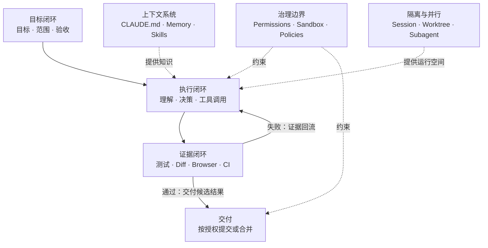

> Claude Code 产品设计系列：[1 · 产品地图](/writing/claude-code-product-design/) · [2 · 任务体验](/writing/claude-code-task-experience/) · [3 · 信任与验证](/writing/claude-code-trust/) · [4 · 会话与协作](/writing/claude-code-session-collaboration/) · [5 · 深入思考](/writing/claude-code-product-synthesis/)

> 范围：基于 2026-09-05 可访问的 Claude Code 官方文档做产品设计分析。CLI、Desktop、Web 的能力不完全相同；下文会区分已有机制、教学抽象与作者建议，不把界面草图当作官方截图。

“修复登录超时，并补上回归测试，先不要提交。”这句话既有目标，也有禁止项。用户不只是请模型生成代码，而是在委托一段有边界的软件工程工作。

理解 Claude Code 的产品设计，应先问：任务在哪里持续存在，行动如何推进，结果由什么证明？这比从菜单、插件和模型参数开始更有用。

本系列用同一修复任务串起体验、信任、协作，最后讨论：**当 Agent 能自主选择执行路径，产品究竟在如何分配责任？**

## 先给结论：Claude Code 的设计由三个闭环组成

按照金字塔原理，Claude Code 的大量功能可以归入三个相互嵌套的闭环。

*图 1｜目标、执行与证据三个闭环。*

第一层是**目标闭环**。用户不是逐行写指令，而是定义“做什么、不能做什么、怎样才算完成”。

第二层是**执行闭环**。Agent 自主搜索代码、选择工具、编辑文件、运行命令，并根据中间结果继续决策。

第三层是**证据闭环**。测试、构建、截图、DOM、Diff 和 CI 不只是展示结果，而是重新进入 Agent 上下文，驱动下一轮修复。

权限、沙箱和企业策略包围执行过程；CLAUDE.md、Memory 和 Skills 提供不同寿命的知识；Session、Worktree 与 Subagent 则让多个任务可以隔离运行。理解这张图，后面的功能就不再是一堆菜单，而是一套完整产品逻辑。

## 用户不是一种人：四类核心用户画像

下面的画像是根据产品能力推导出的分析性原型，并非 Anthropic 官方用户分群。它们的意义不是给用户贴标签，而是解释同一功能为什么需要多种入口和控制层级。

| 用户画像 | 核心任务 | 最担心什么 | 最需要的设计 |
| --- | --- | --- | --- |
| 独立开发者 | 快速从想法到可运行功能 | 配置复杂、Agent 经常中断 | 默认值、Browser 验证、较高自主性 |
| 代码库维护者 | 在陌生或大型仓库中定位并修改问题 | 改错位置、上下文污染 | Plan、代码搜索、CLAUDE.md、Diff |
| 技术负责人 | 并行推进 Issue、Review 和交付 | 多任务互相干扰、结果不可追踪 | Session、Worktree、Tasks、PR 状态 |
| 平台与安全团队 | 让组织安全地使用 Agent | 数据外泄、供应链命令、越权操作 | Sandbox、权限策略、Hooks、SSO、审计 |

四类用户之间存在天然张力：执行者希望少弹窗、快完成；治理者希望可限制、可追溯。Claude Code 的关键产品设计，大多是在解决“自主性”与“可控性”的冲突。

## 业务功能全景：九个能力域如何协同

| 功能领域 | 代表能力 | 用户价值 |
| --- | --- | --- |
| 任务入口 | Session、目录、环境、模型、Effort、权限、附件 | 把目标、成本、环境和风险绑定在一次任务上 |
| 代码理解 | 文件搜索、符号导航、Git 历史、代码智能 | 降低进入陌生代码库的上下文成本 |
| Agent 执行 | 编辑、Shell、测试、构建、调试、Web | 从“给建议”升级为“完成任务” |
| 开发工作台 | Chat、Plan、File、Terminal、Diff、Browser、Tasks、Subagent | 让长过程可以观察、干预和验收 |
| 验证交付 | 自动验证、Review、Commit、PR、CI、Auto-fix | 用外部证据约束模型的不确定性 |
| 并行协作 | Sessions、Worktrees、Subagents、Agent Teams | 并行推进且不污染上下文与代码 |
| 跨端自动化 | Remote、Dispatch、Remote Control、Routines、`/loop` | 任务脱离单一设备与单次在线会话 |
| 扩展平台 | CLAUDE.md、Skills、MCP、Hooks、Plugins、Agent SDK | 适配团队知识、工具和工作流 |
| 安全治理 | Permission Modes、Sandbox、可信目录、企业策略 | 在提高自主性的同时限定影响范围 |

## 首篇只需要记住四种对象

任务契约保存目标与边界；Session 保存一次工作的上下文与进度；工作环境承载实际变更；测试、Diff 和审查提供验证证据。它们有关联，但不是同一个对象。

特别是，Session 存在不等于对应工作区已隔离；Agent 结束不等于验收通过；验收通过也不等于拥有提交、推送和部署的授权。这三条边界会在后文逐步展开。

## 从五个问题开始自己的产品分析

| 要问的问题 | 在修复任务中如何回答 |
|---|---|
| 用户想改变什么？ | 登录超时行为，而非生成更多代码 |
| 哪些事情不能改变？ | 无关逻辑、生产环境、未授权提交 |
| Agent 在哪里行动？ | 明确的仓库与执行环境 |
| 什么证据算完成？ | 原问题复现、修复后通过、相关回归不退化 |
| 谁做最后决定？ | Agent 提交候选结果，用户按任务约定验收 |

这是作者的分析框架，不是 Anthropic 官方用户分类。具体端口的功能可查 [Claude Code 概述](https://code.claude.com/docs/en/overview)与 [Desktop 文档](https://code.claude.com/docs/en/desktop)。

## 全系列的阅读路线

第二篇看用户如何从意图走到行动；第三篇看权限和验证如何建立信任；第四篇看上下文、Worktree 与跨端协作；第五篇回到系统层面，讨论监督成本和责任边界。

这里先不展开每种权限模式，也不追求列全每个按钮。架构的作用是让后续细节有位置，而不是把整份产品手册压进首篇。

---

系统地图说明了需要哪些能力，但用户不应该先学完所有概念才能开始。下一篇沿一个修复任务，理解入口、渐进披露和任务旅程。

下一篇：[从一句需求，到一条可以干预的任务旅程](/writing/claude-code-task-experience/)。
