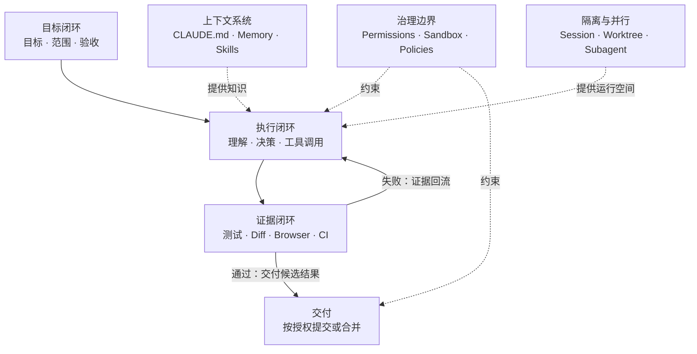
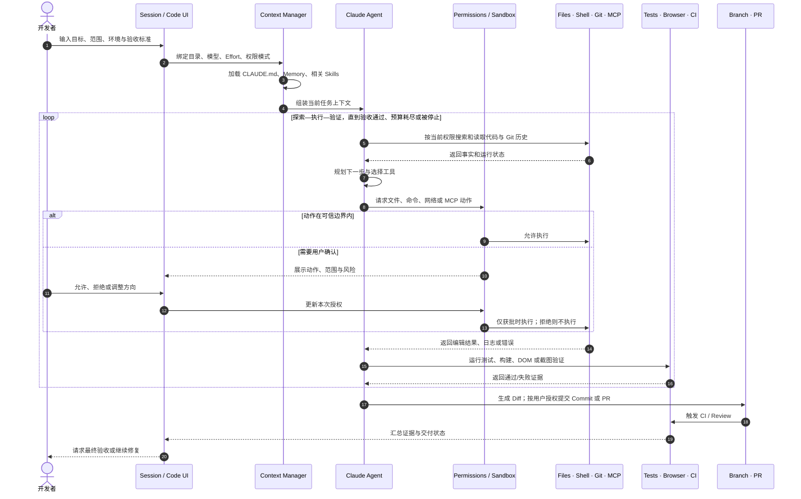

> 范围：基于 2026-09-05 可访问的 Claude Code 官方文档做产品设计分析。CLI、Desktop、Web 的能力不完全相同；下文会区分已有机制、教学抽象与作者建议，不把界面草图当作官方截图。

“修复登录超时，并补上回归测试，先不要提交。”这句话既有目标，也有禁止项。用户不只是请模型生成代码，而是在委托一段有边界的软件工程工作。

理解 Claude Code 的产品设计，应先问：任务在哪里持续存在，行动如何推进，结果由什么证明？这比从菜单、插件和模型参数开始更有用。

以下用同一修复任务分析用户输入、执行反馈和交付证据：**当 Agent 能自主选择执行路径，产品究竟在如何分配责任？**

## 用三个闭环分析任务体验

以下是作者的分析模型，区分目标、执行和证据，不表示产品内部恰好存在三个对应模块。



*图 1｜目标、执行与证据三个闭环。*

第一层是**目标闭环**。用户不是逐行写指令，而是定义“做什么、不能做什么、怎样才算完成”。

第二层是**执行闭环**。Agent 自主搜索代码、选择工具、编辑文件、运行命令，并根据中间结果继续决策。

第三层是**证据闭环**。测试、构建、截图、DOM、Diff 和 CI 不只是展示结果，而是重新进入 Agent 上下文，驱动下一轮修复。

权限、沙箱和企业策略包围执行过程；CLAUDE.md、Memory 和 Skills 提供不同寿命的知识；Session、Worktree 与 Subagent 则让多个任务可以隔离运行。理解这张图，后面的功能就不再是一堆菜单，而是一套完整产品逻辑。

## 用户不是一种人：四类核心用户画像

下面的画像是根据产品能力推导出的分析性原型，并非 Anthropic 官方用户分群。它们的意义不是给用户贴标签，而是解释同一功能为什么需要多种入口和控制层级。

| 用户画像 | 核心任务 | 最担心什么 | 最需要的设计 |
| --- | --- | --- | --- |
| 独立开发者 | 快速从想法到可运行功能 | 配置复杂、Agent 经常中断 | 默认值、Browser 验证、较高自主性 |
| 代码库维护者 | 在陌生或大型仓库中定位并修改问题 | 改错位置、上下文污染 | Plan、代码搜索、CLAUDE.md、Diff |
| 技术负责人 | 并行推进 Issue、Review 和交付 | 多任务互相干扰、结果不可追踪 | Session、Worktree、Tasks、PR 状态 |
| 平台与安全团队 | 让组织安全地使用 Agent | 数据外泄、供应链命令、越权操作 | Sandbox、权限策略、Hooks、SSO、审计 |

四类用户之间存在天然张力：执行者希望少弹窗、快完成；治理者希望可限制、可追溯。Claude Code 的关键产品设计，大多是在解决“自主性”与“可控性”的冲突。

## 业务功能全景：九个能力域如何协同

| 功能领域 | 代表能力 | 用户价值 |
| --- | --- | --- |
| 任务入口 | Session、目录、环境、模型、Effort、权限、附件 | 把目标、成本、环境和风险绑定在一次任务上 |
| 代码理解 | 文件搜索、符号导航、Git 历史、代码智能 | 降低进入陌生代码库的上下文成本 |
| Agent 执行 | 编辑、Shell、测试、构建、调试、Web | 从“给建议”升级为“完成任务” |
| 开发工作台 | Chat、Plan、File、Terminal、Diff、Browser、Tasks、Subagent | 让长过程可以观察、干预和验收 |
| 验证交付 | 自动验证、Review、Commit、PR、CI、Auto-fix | 用外部证据约束模型的不确定性 |
| 并行协作 | Sessions、Worktrees、Subagents、Agent Teams | 并行推进且不污染上下文与代码 |
| 跨端自动化 | Remote、Dispatch、Remote Control、Routines、`/loop` | 任务脱离单一设备与单次在线会话 |
| 扩展平台 | CLAUDE.md、Skills、MCP、Hooks、Plugins、Agent SDK | 适配团队知识、工具和工作流 |
| 安全治理 | Permission Modes、Sandbox、可信目录、企业策略 | 在提高自主性的同时限定影响范围 |

## 任务体验中的四种对象

任务契约保存目标与边界；Session 保存一次工作的上下文与进度；工作环境承载实际变更；测试、Diff 和审查提供验证证据。它们有关联，但不是同一个对象。

特别是，Session 存在不等于对应工作区已隔离；Agent 结束不等于验收通过；验收通过也不等于拥有提交、推送和部署的授权。这三条边界会在后文逐步展开。

## 核心调用链：一次任务如何从输入走到交付

功能全景解决“有什么”，调用链解决“如何发生”。一次典型开发任务可以还原为下面的时序。



*图 2｜任务输入到候选交付的教学时序。*

这条调用链里有四个产品关键点。

第一，**输入框创建的不是消息，而是一份任务契约**。目录决定资源边界，权限决定动作边界，验收标准决定停止条件。

第二，**上下文不是一次性塞满**。启动时加载稳定规则，相关 Skill 按需进入，Subagent 在独立上下文中工作，工具输出只在需要时回流。

第三，**工具返回值是下一轮决策的输入**。测试失败、页面截图、命令退出码和 CI 日志都会改变 Agent 后续动作。

第四，**人主要控制意图与例外**。用户不需要批准每个推理步骤，但应在越过可信边界、改变任务范围或最终交付时拥有决定权。

## 实践：把输入框里的愿望改成契约

```text
目标：修复登录超时，不改认证规则
环境：当前仓库的独立实验工作区
步骤：先复现和定位，再提出修改与运行回归
禁止：不提交、不推送、不部署，不读取无关凭证
完成证据：复现用例由失败转通过；既有回归通过；提供 Diff
停止条件：缺少必要服务、范围需要扩大或预算耗尽时说明
```

这段文本不是保证 Agent 正确的咒语，而是给执行和验收建立共同参照。若实际权限比文本更宽，平台仍需硬边界。

调用链是教学抽象，省略了部分错误分支；它不意味着每个用户都要经过同一条固定流程。

## 用一次可用性测试检查渐进披露

让不了解产品的读者完成三个动作：指出当前工作目录；说清 Agent 为什么停住；找到验证失败的证据。记录寻找时间、误解和错误点击。

如果用户只能在完整日志里找到答案，渐进披露就没有真正减少负担。优秀的长任务界面应该先解释当前状态和下一项决定，详细工具记录则按需打开。

上述可用性指标是建议测量项，本文没有用户实验数据；功能存在不能证明用户满意。

## 从五个问题开始自己的产品分析

| 要问的问题 | 在修复任务中如何回答 |
|---|---|
| 用户想改变什么？ | 登录超时行为，而非生成更多代码 |
| 哪些事情不能改变？ | 无关逻辑、生产环境、未授权提交 |
| Agent 在哪里行动？ | 明确的仓库与执行环境 |
| 什么证据算完成？ | 原问题复现、修复后通过、相关回归不退化 |
| 谁做最后决定？ | Agent 提交候选结果，用户按任务约定验收 |

这是作者的分析框架，不是 Anthropic 官方用户分类。具体端口的功能可查 [Claude Code 概述](https://code.claude.com/docs/en/overview)与 [Desktop 文档](https://code.claude.com/docs/en/desktop)。

## 一个容易被忽略的变量：证据债务

任务做得越快，未被理解的变更也可能堆得越快。测试绿色、Diff 很大、说明很长，仍可能没有人能解释关键行为。

可以把这种状态称为“证据债务”：系统生成了结果，却没有生成足够容易理解、能支撑决策的证据。这是本文提出的分析概念，不是官方指标。

治理它的办法不是让模型写更长的总结，而是缩小变更单元、保留独立验收、让关键风险可以定位，并限制超过团队审查能力的并行任务数。

## 反例：什么时候应该少一点 Agent

目标很模糊、结果很难验收时，让 Agent 高速实现可能更快固化错误方向。任务高度耦合、共享状态很多时，增加子任务数可能只会放大协调成本。授权和数据边界尚不清楚时，扩展工具集可能先扩大风险。

此时最好的产品动作可能是澄清、缩小范围、减少并发，或者保留人工处理，而不是继续增加自动化选项。


权限与证据的界面设计见[信任机制](/writing/claude-code-trust/)，并行任务的接管方式见[会话与协作](/writing/claude-code-session-collaboration/)。
