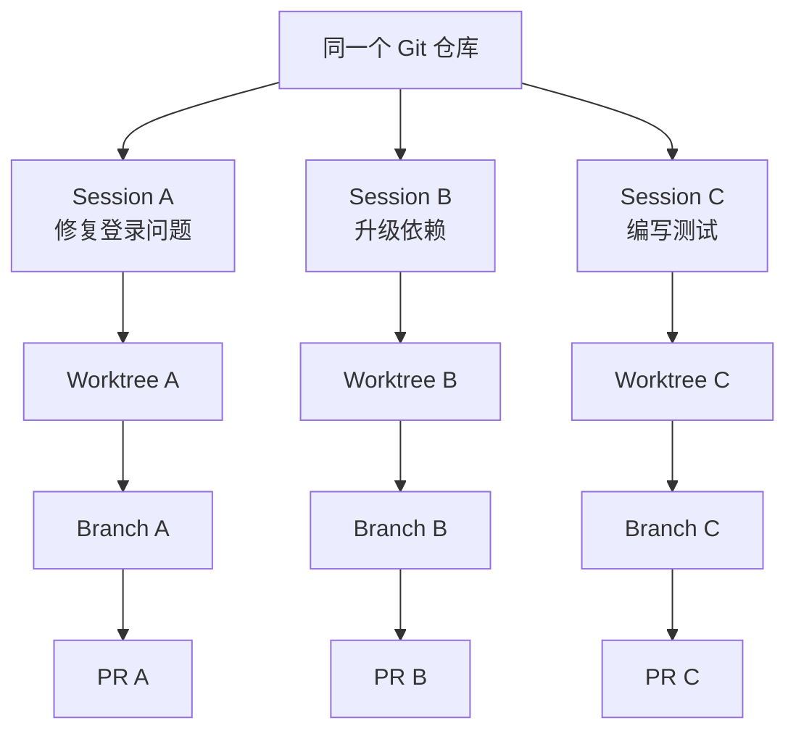

> Claude Code 产品设计系列：[1 · 产品地图](/writing/claude-code-product-design/) · [2 · 任务体验](/writing/claude-code-task-experience/) · [3 · 信任与验证](/writing/claude-code-trust/) · [4 · 会话与协作](/writing/claude-code-session-collaboration/) · [5 · 深入思考](/writing/claude-code-product-synthesis/)

> 阅读时间为估计，包含图表理解；动手实验另计。

> 范围：基于 2026-09-05 可访问的 Claude Code 官方文档做产品设计分析。CLI、Desktop、Web 的能力不完全相同；下文会区分已有机制、教学抽象与作者建议，不把界面草图当作官方截图。


登录问题修复还没结束，团队又启动依赖升级和专项审查。三个聊天窗口不等于三个互不干扰的任务；任务在手机上可见，也不等于它已经迁到了云端。

这一篇从状态归属理解协作，而不是从并行数量开始。

## 经典设计四：用 Worktree 隔离并行任务，而不是假设所有 Session 都隔离



*图 1｜采用独立 Worktree 时的并行任务映射。矩形表示模块或步骤，圆柱表示存储，菱形表示判断；实线表示主路径，虚线表示约束、信息支撑或反馈。图为教学抽象，不代表全部实现细节。*

多 Agent 并行最大的工程风险不是“它们会不会聊天”，而是文件状态相互污染。在 Desktop 的 Git 项目并行会话等受支持场景中，Worktree 可为任务提供独立工作目录与变更空间。普通 CLI 会话、非 Git 目录和显式共享目录不能因此被推断为自动隔离；应检查所用端口与配置。[Desktop 会话说明](https://code.claude.com/docs/en/desktop#work-in-parallel-with-sessions)

在采用独立 Worktree 的任务工作流中，可以建立下面的映射：

```text
用户任务 ↔ Session ↔ Context ↔ Worktree ↔ Branch / PR
```

为什么复用 Git，而不是创造 AI 专用版本控制？因为开发者已经理解 Branch、Diff 和 PR；团队的审查、CI、权限与回滚也都围绕 Git 建立。Claude Code 把 Agent 的并行状态翻译成现有工程对象，降低了组织采用成本。

## 经典设计五：把上下文拆成不同寿命

| 机制 | 生命周期 | 适合内容 | 产品角色 |
| --- | --- | --- | --- |
| Prompt / Session | 当前任务 | 目标、范围、临时约束 | 即时任务合同 |
| CLAUDE.md | 每次进入项目 | 命令、架构约定、编码规范 | 稳定项目说明书 |
| Memory | 跨 Session 累积 | 构建方法、调试发现、项目经验 | 渐进式组织记忆 |
| Skill | 相关时加载 | Review、Deploy 等可复用流程 | 按需能力包 |
| MCP | 调用外部系统时 | 数据库、GitHub、Slack、浏览器 | 外部工具协议 |
| Subagent | 独立上下文 | 大量搜索、专项审查、并行调查 | 上下文隔离单元 |
| Hook | 生命周期事件 | 格式化、Lint、拦截危险动作、审计 | 确定性规则 |
| Plugin | 安装与分发周期 | Skills、Hooks、Agents 与 MCP 的组合 | 团队分发单元 |

这里最关键的是 Skill 与 Hook 的区别：Skill 告诉模型“应该怎样做”，仍依赖理解与判断；Hook 则规定“事件发生时必须执行什么”，强调确定性。

这种分层背后的技术约束是 Context Window。若把所有规则、知识和工具说明都永久加载，成本会上升，注意力被稀释，长任务后半程还可能遗忘早期约束。按寿命与相关性加载，本质上是一种 Agent 信息架构设计。[Claude Code 扩展体系](https://code.claude.com/docs/zh-CN/features-overview)

## 经典设计六：保持低层，不强迫用户接受新流程

Claude Code 早期的产品定位有两个关键词：**low-level** 和 **unopinionated**。它不要求开发者把代码迁入新的云工作区，也没有创造一套 AI 专用的构建、版本控制或任务协议；它直接进入现有目录，调用 Shell、Git、测试框架、IDE、浏览器和 CI。

这是一种克制的平台策略：

- 对个人开发者，它可以只是一个终端命令；
- 对 IDE 用户，它可以成为侧边栏中的任务面板；
- 对团队，它通过 CLAUDE.md、Hooks、MCP 和 Plugins 嵌入规范；
- 对企业，它可以运行在本机、远程开发机、云沙箱或自有推理网关后面。

软件工程环境高度异质。一个“包办一切”的 AI IDE 容易统一编辑体验，却可能在构建链、内网、部署、权限和团队规范上失配。Claude Code 把自身设计为已有工具链中的可组合 Agent，让用户决定工作流。[Claude Code 早期设计理念](https://www.anthropic.com/engineering/claude-code-best-practices)

代价是学习曲线：Git、Shell、权限与环境配置仍然存在，Skills、MCP、Hooks 和 Plugins 的边界也不容易一次理解。Desktop 图形界面的作用，正是在不牺牲底层可组合性的前提下提供渐进引导。

## 经典设计七：跨端延续的是 Session，不是聊天记录

本地会话适合本地文件和未提交修改；Cloud 会话在云端执行，不依赖本地客户端持续打开；SSH/WSL 进入用户自己的开发环境；Remote Control 允许浏览器或手机控制本地 Session；Dispatch 则可以从其他工作表面发起开发任务。

这些入口共同表达了一个产品判断：**Session 才是持续存在的工作对象，CLI、Desktop、Web 和 IDE 只是观察和干预 Session 的不同表面。**

用户真正需要的不是在手机上写代码，而是在离开电脑后知道任务是否完成、证据是否通过、是否需要一次关键确认。跨端设计因此应优先传递状态和决策，而不是复制全部工具界面。


Remote Control 连接的是仍在本机运行的会话，并不把执行迁到云端；本地进程退出会影响可用性。[Remote Control 边界](https://code.claude.com/docs/en/remote-control)

## 工作目录隔离，还没有覆盖全部共享状态

Worktree 隔离的是文件工作副本，不自动隔离数据库、端口、缓存、测试账号和外部系统。两个任务即使修改不同文件，也可能争用同一个测试服务。

上下文隔离也不是安全隔离：子 Agent 可以拥有独立消息历史，却仍使用相同文件和凭据。产品应分别展示“谁知道什么”和“谁能改什么”。

## 实践：为三个任务写一张协作契约

| 项目 | 登录修复 | 依赖升级 | 专项审查 |
|---|---|---|---|
| 工作区 | 独立 A | 独立 B | 只读目标快照 |
| 写入范围 | 认证相关文件 | 依赖与必要适配 | 不修改 |
| 外部资源 | 测试账号 A | 测试账号 B | 不接生产服务 |
| 输出 | Diff 与回归结果 | 升级证据与兼容说明 | 带位置和证据的问题 |
| 汇总责任 | 主任务负责人统一审查冲突与验收 | 同左 | 不替主任务宣布完成 |

这是参考模板，具体隔离需要环境支持。对强依赖任务，先串行明确接口可能比并行更快；还应记录重复工作、冲突处理和最终审查时间。

把跨端也纳入这张表：关闭本地进程后，远程控制界面是否正确显示不可用？云端与本地凭据是否分开？下一位审查者能否恢复任务目标、未决问题和证据？

这些问题回答清楚之后，并行与跨端才从功能卖点变成可靠的协作机制。

---

上一篇：[信任与验证](/writing/claude-code-trust/)。

会话、权限、证据与协作各自成立后，整体体验仍可能更费人。终篇把这些模块重新合起来，讨论监督成本与责任分配。

下一篇：[Agent 产品真正设计的是责任，而不只是操作](/writing/claude-code-product-synthesis/)。
