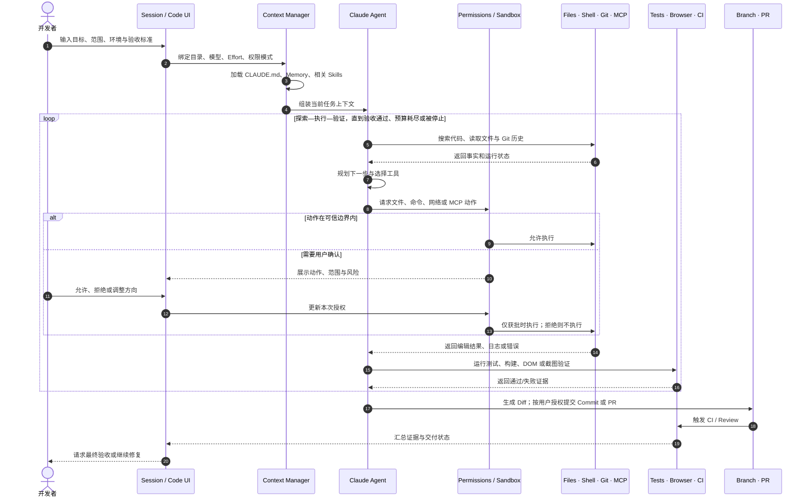

> Claude Code 产品设计系列：[1 · 产品地图](/writing/claude-code-product-design/) · [2 · 任务体验](/writing/claude-code-task-experience/) · [3 · 信任与验证](/writing/claude-code-trust/) · [4 · 会话与协作](/writing/claude-code-session-collaboration/) · [5 · 深入思考](/writing/claude-code-product-synthesis/)

> 阅读时间为估计，包含图表理解；动手实验另计。

> 范围：基于 2026-09-05 可访问的 Claude Code 官方文档做产品设计分析。CLI、Desktop、Web 的能力不完全相同；下文会区分已有机制、教学抽象与作者建议，不把界面草图当作官方截图。


上一篇把任务契约、Session、环境和证据分开。现在让用户真正开始修复登录问题：界面应该先问什么，什么时候显示计划，又应该在哪些节点请求用户决定？

## 核心调用链：一次任务如何从输入走到交付

功能全景解决“有什么”，调用链解决“如何发生”。一次典型开发任务可以还原为下面的时序。



*图 1｜任务输入到候选交付的教学时序。竖线表示参与者，实线箭头表示请求，虚线箭头表示返回；按从上到下的时间顺序阅读。图为教学抽象，不代表全部实现细节。*

这条调用链里有四个产品关键点。

第一，**输入框创建的不是消息，而是一份任务契约**。目录决定资源边界，权限决定动作边界，验收标准决定停止条件。

第二，**上下文不是一次性塞满**。启动时加载稳定规则，相关 Skill 按需进入，Subagent 在独立上下文中工作，工具输出只在需要时回流。

第三，**工具返回值是下一轮决策的输入**。测试失败、页面截图、命令退出码和 CI 日志都会改变 Agent 后续动作。

第四，**人主要控制意图与例外**。用户不需要批准每个推理步骤，但应在越过可信边界、改变任务范围或最终交付时拥有决定权。

## 用户旅程：页面为什么从简到繁

| 阶段 | 用户目标 | 主要触点 | 典型焦虑 | Claude Code 的设计回应 |
| --- | --- | --- | --- | --- |
| 启动 | 快速表达任务 | New Session、输入框 | 不知道先配什么 | 只暴露目录、模型、Effort、权限等关键变量 |
| 探索 | 判断 Agent 是否理解代码 | Chat、File、Git 搜索 | 它会不会改错地方 | 默认可读，允许先调查再行动 |
| 规划 | 对齐方案与影响面 | Plan | 方案错误会扩大返工 | 将探索与实施分开，允许先审计划 |
| 执行 | 让任务持续推进 | Terminal、Tasks、Subagent | 每一步批准很累 | 权限梯度、允许列表与 Sandbox 降低打断 |
| 验证 | 确认结果真的可用 | Diff、Tests、Browser | Agent 只是在声称成功 | 外部证据回流，失败后自动迭代 |
| 交付 | 安全进入团队流程 | Commit、PR、CI | 隐性错误进入主分支 | Review、CI 状态、Auto-fix 与受控合并 |
| 离开后继续 | 不守在电脑前等待 | Remote、Remote Control、Dispatch | 任务中断或错过关键请求 | Session 持续存在，关键节点再唤回用户 |

这里有一个明显的渐进披露逻辑：新建页几乎是空白的，只有任务配置；任务开始后，Plan、File、Terminal、Diff、Browser 和 Tasks 才按需出现。产品把复杂度留到用户真正需要的时刻。

## KANO：哪些是基础能力，哪些创造产品差异

下表是基于当前功能结构的产品假设，而不是官方分类。不同用户画像的判断会变化，真正的 KANO 结论仍需问卷、访谈和行为数据验证。

| KANO 类型 | Claude Code 能力 | 产品判断 |
| --- | --- | --- |
| 基础需求 | 稳定读取与编辑、Terminal、Diff、权限控制、任务不丢失 | 缺失就无法建立信任，做好了也只是“应该如此” |
| 期望需求 | 代码理解质量、响应速度、Plan、Browser 验证、PR/CI 集成 | 做得越好，任务完成率和满意度越高 |
| 兴奋需求 | Worktree 并行、Subagents、Agent Teams、Remote Dispatch、Auto-fix | 把“辅助编码”提升为“并行经营任务” |
| 无差异需求 | 与完成任务无关的使用徽章、装饰性统计 | 容易占据页面注意力，却不改善交付结果 |
| 反向需求 | 默认完全自动、无限上下文、无边界访问、过多日志 | 部分用户会因失控、成本和噪声而降低满意度 |

这也说明，分析 Claude Code 这类产品时，不应把“自动化程度最高”当成唯一北极星指标。完成率、证据质量、安全事件、人工打断率和纠偏成本应一起观察；这不是对厂商内部指标的断言。

## 经典设计一：把首页做成任务契约，而不是仪表盘

Claude Code 首页看起来很空：左侧是 Session 列表，底部是输入区，附近只有环境、项目、模式、模型和 Effort。它没有把文件树、代码编辑器和插件市场全部铺开。

可以把页面结构抽象为：

```text
┌ Sessions ───────┬────────────────────────────────────────┐
│ New             │                                        │
│ Recent tasks    │            当前任务状态                 │
│                 │                                        │
│                 ├────────────────────────────────────────┤
│                 │ 环境 · 项目 · 附件 · Prompt            │
│                 │ 权限模式             模型 · Effort      │
└─────────────────┴────────────────────────────────────────┘
```

为什么这样设计？传统 IDE 以“文件”为主对象，所以先展示文件树；Claude Code 以“任务”为主对象，所以先让用户确认任务环境与授权。首页本质上是一张任务配置单。

它的优势是降低启动认知负担，也让 Local/Remote、目录和权限在执行前显性化。代价是新用户可能低估产品能力，因此空白页需要高质量示例、历史 Session 和渐进式提示来完成能力发现。


## 实践：把输入框里的愿望改成契约

```text
目标：修复登录超时，不改认证规则
环境：当前仓库的独立实验工作区
步骤：先复现和定位，再提出修改与运行回归
禁止：不提交、不推送、不部署，不读取无关凭证
完成证据：复现用例由失败转通过；既有回归通过；提供 Diff
停止条件：缺少必要服务、范围需要扩大或预算耗尽时说明
```

这段文本不是保证 Agent 正确的咒语，而是给执行和验收建立共同参照。若实际权限比文本更宽，平台仍需硬边界。

本文中的页面线框是任务型工作台的教学抽象，按钮与布局会随端口变化。调用链也省略了部分错误分支；它不意味着每个用户都要经过同一条固定流程。

## 用一次可用性测试检查渐进披露

让不了解产品的读者完成三个动作：指出当前工作目录；说清 Agent 为什么停住；找到验证失败的证据。记录寻找时间、误解和错误点击。

如果用户只能在完整日志里找到答案，渐进披露就没有真正减少负担。优秀的长任务界面应该先解释当前状态和下一项决定，详细工具记录则按需打开。

本篇建议的 KANO 分类与可用性指标都是待验证假设；不以功能存在本身证明用户满意。

---

上一篇：[产品地图](/writing/claude-code-product-design/)。

一个清楚的任务入口能降低启动负担，却不能自动建立信任。下一篇讨论用户如何授权、拒绝，以及判断结果确实完成。

下一篇：[少一点确认，不等于少一点边界](/writing/claude-code-trust/)。
