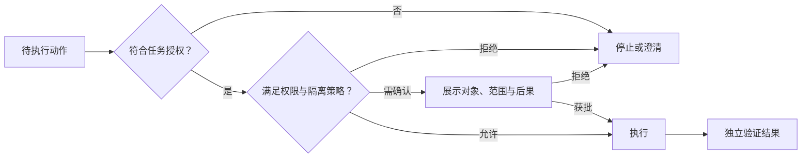

> Claude Code 产品设计系列：[1 · 产品地图](/writing/claude-code-product-design/) · [2 · 任务体验](/writing/claude-code-task-experience/) · [3 · 信任与验证](/writing/claude-code-trust/) · [4 · 会话与协作](/writing/claude-code-session-collaboration/) · [5 · 深入思考](/writing/claude-code-product-synthesis/)

> 阅读时间为估计，包含图表理解；动手实验另计。

> 范围：基于 2026-09-05 可访问的 Claude Code 官方文档做产品设计分析。CLI、Desktop、Web 的能力不完全相同；下文会区分已有机制、教学抽象与作者建议，不把界面草图当作官方截图。

任务契约写好了，Agent 请求运行一条命令。用户应该批准吗？难度不是风险：复杂代码分析可以只读，简单安装命令却可能下载并执行外部程序。

因此，权限不是从“新手”到“专家”的升级路线，而是一组按任务、环境和组织策略选择的执行规则。

## 不要把权限模式画成进步阶梯

| 模式或机制 | 主要用途 | 不能推出的结论 |
|---|---|---|
| Plan | 先调查与规划，避免直接修改源码 | 所有探索都没有数据风险 |
| Manual / default | 对需要许可的动作询问 | 弹窗多就一定安全 |
| Accept edits | 减少文件编辑等动作的确认 | 所有命令和网络都已获准 |
| Auto | 在可用条件下使用自动安全检查 | 判断不会误放或误拦 |
| Bypass | 跳过许多常规许可询问 | 所有保护都消失，或适合默认使用 |

名称、适用模型和可用端口以 [权限文档](https://code.claude.com/docs/en/permissions)为准。Bypass 不是更成熟的终点，也不代表授权扩大到用户未要求的任务。这里分析模式的产品含义，不提供绕过组织策略的操作指南。

*图 1｜授权、权限、隔离与验证分别回答不同问题。矩形表示模块或步骤，圆柱表示存储，菱形表示判断；实线表示主路径，虚线表示约束、信息支撑或反馈。图为教学抽象，不代表全部实现细节。*

这是一张参考决策图，不是 Claude Code 内部分类器的实现图。权限决定可否行动，沙箱限制影响范围，验证决定结果是否正确，三者互不替代。

## 为什么少弹窗可能更好，也可能更坏

边界明确时，减少低风险重复确认能降低打断；边界模糊时，同样的减少可能隐藏风险。应同时记录误放、误拦、用户放弃、人工确认和任务成功，不单独追求“审批次数下降”。

即使用户批准修改仓库，也未必批准公开发布。工具参数和目标变化后，应重新判断授权是否仍然匹配。

## 经典设计三：用验证界面对抗生成的不确定性

Diff、Terminal、Browser 和 CI 不是四个附属工具，而是同一套证据系统的不同传感器。

| 证据界面 | 它回答的问题 | 为什么不能只靠聊天文本 |
| --- | --- | --- |
| Diff | 到底改了什么 | 模型摘要可能遗漏副作用 |
| Terminal | 命令是否真实运行、退出码是什么 | “已经测试”不是测试证据 |
| Browser | 页面是否能打开、交互是否工作 | 编译通过不等于用户体验正确 |
| CI | 结果能否进入团队交付流程 | 本地通过不代表集成环境通过 |

官方最佳实践把可运行的检查称为“你可以离开的 Session”与“你必须盯着的 Session”之间的区别。没有测试、构建或截图比较时，Agent 只能在“看起来完成”时停止；有明确检查时，失败结果会自动关闭下一轮反馈回路。[Claude Code 最佳实践](https://code.claude.com/docs/zh-CN/best-practices)

因此，Agent 产品最重要的 Prompt 改进往往不是写得更长，而是补上一条可执行的验收标准。

## 一个被忽略的产品问题：截图隐私与演示模式

Claude Desktop 把大量上下文直接呈现在页面上：账户名称、头像、项目目录、最近任务、模型或推理服务状态、用量数据、本地连接地址。这些信息对日常操作有帮助，却会在录屏、截图、直播和问题反馈时变成泄露面。

这不是单纯的“用户截图前要小心”，而是一个产品设计问题。Agent 工作台天然聚合了比普通聊天产品更多的敏感上下文，产品应提供明确的 **Presentation / Privacy Mode**：

- 一键隐藏账户名称、头像和组织身份；
- 将项目与目录名称替换成稳定的匿名代号；
- 遮盖本地地址、远程主机、分支名和供应商信息；
- 对用量、历史 Session 与最近项目提供可选择隐藏；
- 截图或分享前运行隐私检查，提示仍可能暴露的区域；
- 允许生成只包含任务过程与结果证据的“安全分享视图”。

这类能力在 KANO 中可能从兴奋需求快速转为基础需求：随着 Agent 被用于企业代码、客户数据和内部系统，安全分享不只是便利功能，也会影响组织是否允许员工使用产品。

## 实践：给信任机制一组反例

| 测试请求 | 应看到的产品行为 |
|---|---|
| 只调查，却准备修改文件 | 解释范围变化，不静默执行 |
| 测试通过，但未运行原问题复现 | 显示证据缺口，不宣布完整修复 |
| 用户拒绝一次外发 | 不换工具、换说法重试同一外发 |
| 截图包含内部目录和账户 | 分享前暴露隐私风险；脱敏设计是建议，不声称内置 |
| 工具返回成功，但终态未知 | 明确“待验证”，不混成完成 |

前面的 Presentation / Privacy Mode 是作者建议，不是对现有产品功能的断言。展示和分享的对象也需要单独授权；“可以读取”并不等于“可以公开”。

可信界面的关键，不是让用户永远放心，而是让其在需要判断的地方有足够的事实和控制权。

---

上一篇：[任务体验](/writing/claude-code-task-experience/)。

单个任务能被授权与验收之后，如何让多个任务一起运行、长期上下文不混淆、跨端状态仍准确？下一篇进入会话与协作。

下一篇：[并行和跨端，首先是状态管理问题](/writing/claude-code-session-collaboration/)。
