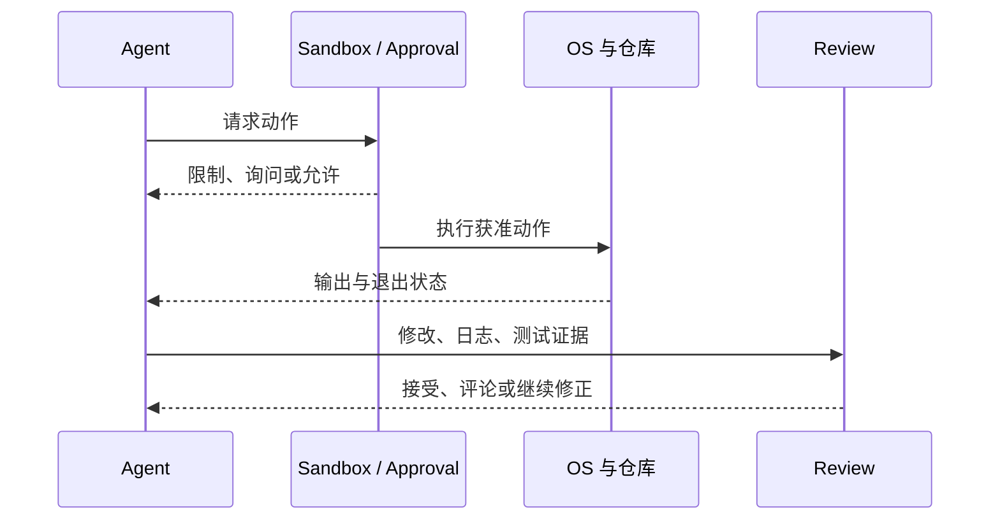

> 系列：[1. 全景](/writing/codex-system-overview/)｜[2. 运行与沙箱](/writing/codex-runtime-sandbox/)｜[3. Skills 与长期工作](/writing/codex-skills-memory-automation/)｜[4. 整体判断](/writing/codex-system-synthesis/)

Codex 的本地运行时把模型决策和操作系统副作用隔开。模型可以提出读取、修改、执行或联网动作，沙箱策略决定进程能触达的文件与系统资源，审批策略决定何时必须由用户扩大权限。二者解决的是“能不能做”，不是“应该不应该做”。

*图 1｜安全边界控制行动范围，Review 与测试判断结果质量。*

Worktree 进一步隔离多个任务的 Git 状态，使不同 Agent 不必同时修改同一工作目录。它降低冲突，却不自动解决语义重复、依赖共享和最终合并判断。真正的闭环仍需要终端日志、测试、Diff 和审查意见。

这套设计值得学习的地方，是把失败留成可检查证据。长任务可以继续运行，但交付不能只是一句“已完成”；人或另一个 Agent 应能从变更和命令结果重新验证结论。[官方 Codex 介绍](https://openai.com/codex/)

---

上一篇：[全景](/writing/codex-system-overview/)。

下一篇：[Skills 与长期工作](/writing/codex-skills-memory-automation/)。

执行边界解决一次任务。下一篇看经验和任务怎样跨时间继续存在。
