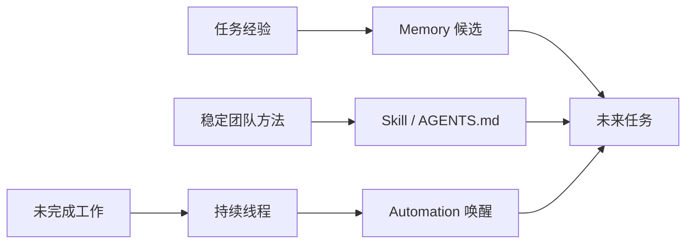

> 系列：[1. 全景](/writing/codex-system-overview/)｜[2. 运行与沙箱](/writing/codex-runtime-sandbox/)｜[3. Skills 与长期工作](/writing/codex-skills-memory-automation/)｜[4. 整体判断](/writing/codex-system-synthesis/)

Codex 把跨任务能力放在几种不同载体中。AGENTS.md 保存仓库长期约束；Skill 打包说明、资源和脚本，按任务匹配；Memory 预览用于记住偏好、纠正和难以重新获得的信息；持续线程保留任务上下文；Automation 则让线程或独立任务按计划再次运行。

*图 1｜经验、方法和未完成任务属于不同生命周期，不应统一塞进会话历史。*

官方已经把“记住偏好、从先前行动学习”作为 Memory 预览能力，同时让 Automation 复用已有线程并跨天继续工作。[官方说明](https://openai.com/index/codex-for-almost-everything/) 这比单次 CLI 会话更接近长期 Agent，但也要求更强治理：自动唤醒不能扩大原任务授权，记忆需要允许纠正和删除，Skill 更新必须能够回滚。

Skills 最重要的价值不是多一个提示词目录，而是让团队把反复使用的工作方式版本化；Automation 的价值也不是定时器，而是把长期任务重新交回可审查队列。

---

上一篇：[运行与沙箱](/writing/codex-runtime-sandbox/)。

下一篇：[整体判断](/writing/codex-system-synthesis/)。

终篇把隔离、证据和长期积累重新放回同一责任结构。
