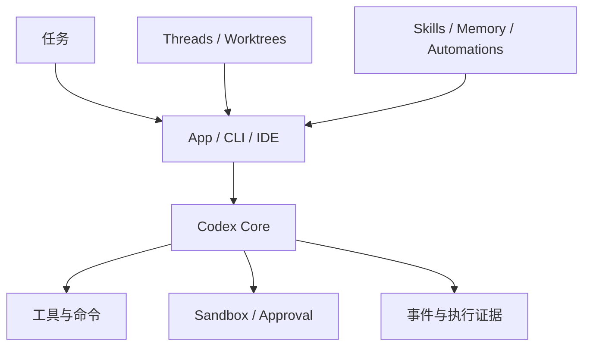
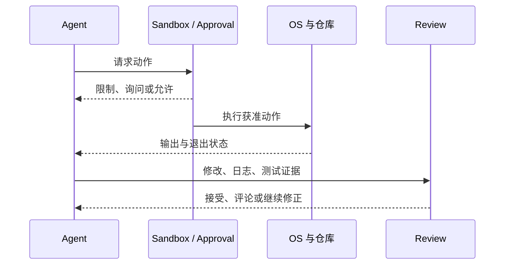
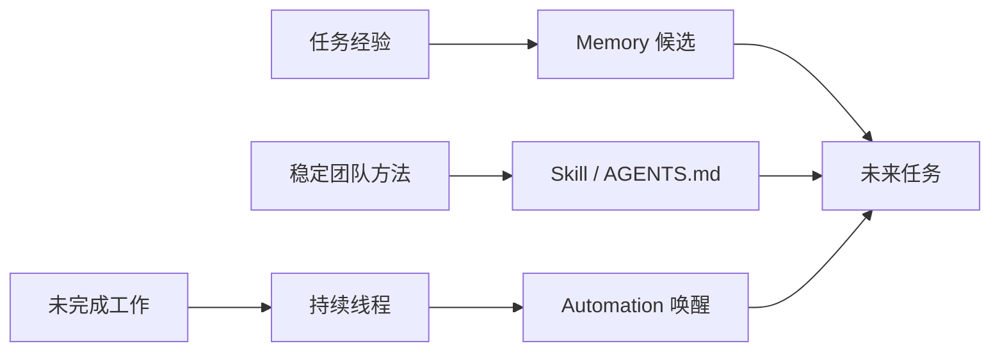

研究 Codex 首先要拆开两个边界：[`openai/codex`](https://github.com/openai/codex)公开本地 CLI 与核心运行代码；Codex App 则在其上组织线程、Worktree、并行 Agent、Skills、Memory 和 Automations。把两者混在一起，会把产品能力误写成某个 Rust 模块已经提供的机制。

研究口径：依据文中链接的公开文档，核对日期为 2026-09-06；下图是职责归纳，不是完整部署图，也不作为未运行路径的实测证明。

以“修复登录超时，不推送”为例：Core 组织模型与工具往返，执行策略约束命令可达范围，测试与 Diff 判断补丁是否合格。App 的任务列表和自动化提供另一个组织层；可用性取决于具体应用版本与设置。

*图 1｜Codex 的本地执行内核与上层长期协作能力需要分别验证。*

## 运行时、沙箱与任务证据

Codex 的本地运行时把模型决策和操作系统副作用隔开。模型可以提出读取、修改、执行或联网动作，沙箱策略决定进程能触达的文件与系统资源，审批策略决定何时必须由用户扩大权限。二者解决的是“能不能做”，不是“应该不应该做”。

*图 2｜安全边界控制行动范围，Review 与测试判断结果质量。*

Worktree 进一步隔离多个任务的 Git 状态，使不同 Agent 不必同时修改同一工作目录。它降低冲突，却不自动解决语义重复、依赖共享和最终合并判断。真正的闭环仍需要终端日志、测试、Diff 和审查意见。

这套设计值得学习的地方，是把失败留成可检查证据。长任务可以继续运行，但交付不能只是一句“已完成”；人或另一个 Agent 应能从变更和命令结果重新验证结论。[官方 Codex 介绍](https://openai.com/codex/)

## Skills、记忆与自动任务

Codex 把跨任务能力放在几种不同载体中。AGENTS.md 保存仓库长期约束；Skill 打包说明、资源和脚本，按任务匹配；Memory 预览用于记住偏好、纠正和难以重新获得的信息；持续线程保留任务上下文；Automation 则让线程或独立任务按计划再次运行。

*图 3｜经验、方法和未完成任务属于不同生命周期，不应统一塞进会话历史。*

官方已经把“记住偏好、从先前行动学习”作为 Memory 预览能力，同时让 Automation 复用已有线程并跨天继续工作。[官方说明](https://openai.com/index/codex-for-almost-everything/) 这比单次 CLI 会话更接近长期 Agent，但也要求更强治理：自动唤醒不能扩大原任务授权，记忆需要允许纠正和删除，Skill 更新必须能够回滚。

配置自动化时需保留任务范围、执行环境和停止条件；重用已有线程也不自动批准新的外部写入。
