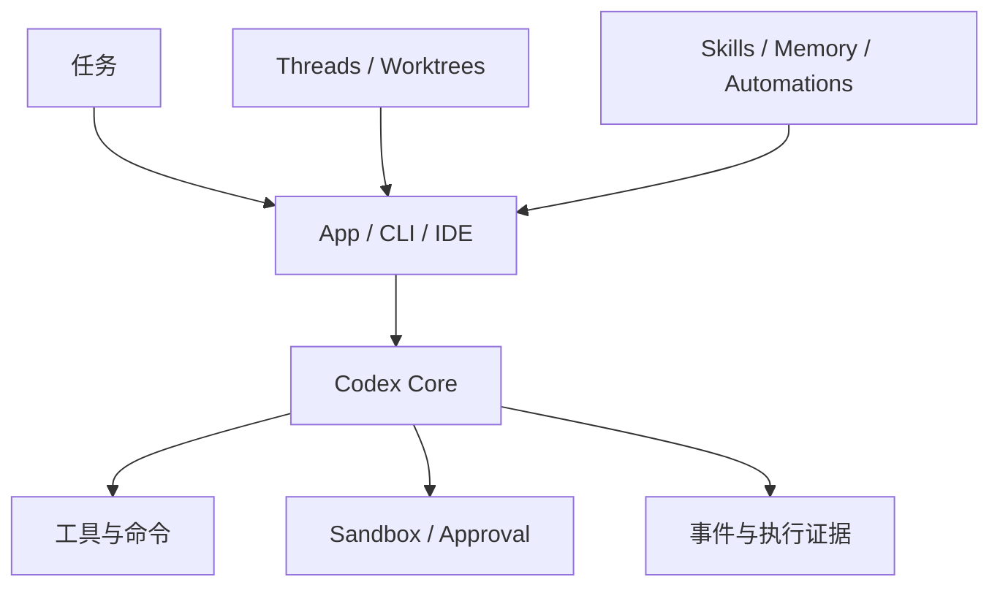

> 系列：[1. 全景](/writing/codex-system-overview/)｜[2. 运行与沙箱](/writing/codex-runtime-sandbox/)｜[3. Skills 与长期工作](/writing/codex-skills-memory-automation/)｜[4. 整体判断](/writing/codex-system-synthesis/)

研究 Codex 首先要拆开两个边界：[`openai/codex`](https://github.com/openai/codex)公开本地 CLI 与核心运行代码；Codex App 则在其上组织线程、Worktree、并行 Agent、Skills、Memory 和 Automations。把两者混在一起，会把产品能力误写成某个 Rust 模块已经提供的机制。

*图 1｜Codex 的本地执行内核与上层长期协作能力需要分别验证。*

第二篇沿一次本地任务研究权限、工具和证据；第三篇进入 Skills、Memory、持续线程与 Automations，判断经验如何跨任务复用。终篇再回答 Codex 的优势到底来自模型、Harness，还是监督与隔离结构。

---

下一篇：[运行与沙箱](/writing/codex-runtime-sandbox/)。

下一篇从本地副作用开始，看 Agent 被允许做什么，以及人怎样检查它确实做过什么。
