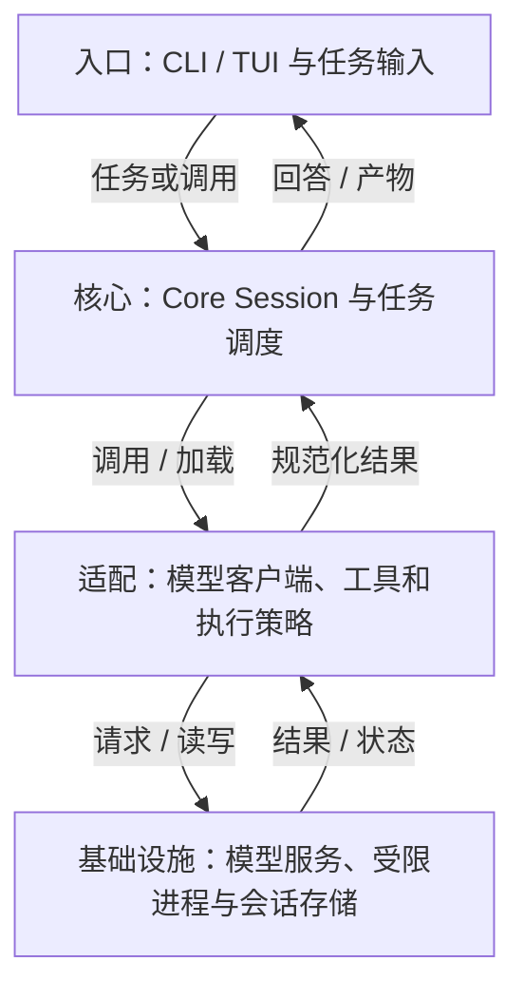
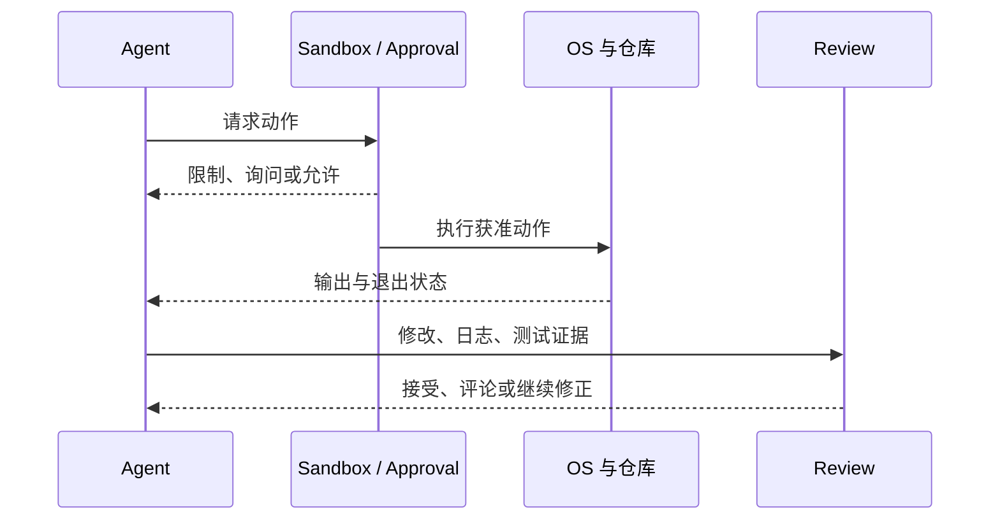
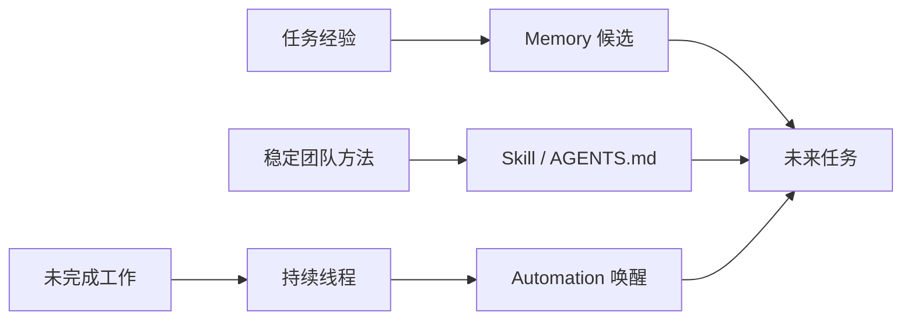

## 定位与价值

Codex CLI 是可在本地仓库执行开发任务的开源 Agent；它统一模型调用、命令执行与会话事件，减少手工拼接模型 SDK、终端和执行策略的工作。

适合需要检查和扩展本地执行链的团队；CLI 源码不等于 Codex App 的全部协作功能，也不替代业务验收。

研究基线：[openai/codex @ 008bbd5](https://github.com/openai/codex/blob/008bbd5884122dc95aaece19ecfe0fc6a59dcf36/README.md)；源码与社区核对日期为 2026-09-06。

## 技术架构



*图 1｜职责与数据流；逻辑分层不要求分开部署。*

## 核心机制

### 执行策略与交付证据

Codex 的本地运行时把模型决策和操作系统副作用隔开。模型可以提出读取、修改、执行或联网动作，沙箱策略决定进程能触达的文件与系统资源，审批策略决定何时必须由用户扩大权限。二者解决的是“能不能做”，不是“应该不应该做”。



*图 2｜安全边界控制行动范围，Review 与测试判断结果质量。*

Worktree 进一步隔离多个任务的 Git 状态，使不同 Agent 不必同时修改同一工作目录。它降低冲突，却不自动解决语义重复、依赖共享和最终合并判断。真正的闭环仍需要终端日志、测试、Diff 和审查意见。

这套设计值得学习的地方，是把失败留成可检查证据。长任务可以继续运行，但交付不能只是一句“已完成”；人或另一个 Agent 应能从变更和命令结果重新验证结论。[官方 Codex 介绍](https://openai.com/codex/)


### 长期协作资产的生命周期

Codex 把跨任务能力放在几种不同载体中。AGENTS.md 保存仓库长期约束；Skill 打包说明、资源和脚本，按任务匹配；Memory 预览用于记住偏好、纠正和难以重新获得的信息；持续线程保留任务上下文；Automation 则让线程或独立任务按计划再次运行。



*图 3｜经验、方法和未完成任务属于不同生命周期，不应统一塞进会话历史。*

官方已经把“记住偏好、从先前行动学习”作为 Memory 预览能力，同时让 Automation 复用已有线程并跨天继续工作。[官方说明](https://openai.com/index/codex-for-almost-everything/) 这比单次 CLI 会话更接近长期 Agent，但也要求更强治理：自动唤醒不能扩大原任务授权，记忆需要允许纠正和删除，Skill 更新必须能够回滚。

配置自动化时需保留任务范围、执行环境和停止条件；重用已有线程也不自动批准新的外部写入。

## 快速上手

按官方 README 安装 Codex CLI 并登录。下面创建独立 Git 教学目录，不访问真实业务服务。

```bash
codex --version
mkdir -p codex-demo
cd codex-demo
printf "# Demo\nNo source files yet.\n" > README.md
git init -q
codex exec --sandbox read-only "读取 README.md，说明目前有什么"
```

三个常用配置：

| 配置或安装选项 | 作用 |
| --- | --- |
| `model` | 所选模型；使用当前账号可用的 ID |
| `sandbox_mode` | 控制进程的文件与网络可达范围 |
| `approval_policy` | 决定哪些动作需要额外审批 |

其余选项见 [配置参考](https://github.com/openai/codex/blob/008bbd5884122dc95aaece19ecfe0fc6a59dcf36/codex-rs/core/config.schema.json)。

常见坑：首次运行需完成登录；read-only 是执行环境约束，不能把自然语言中的“只读”当作同一机制。

验证范围：已核对固定源码的入口、参数与依赖；未以本文示例调用真实模型或部署外部服务。

## 生态与社区

截至 2026-09-06，2026-08-08 至 09-06 UTC 的抽样取得 至少 30 条默认分支提交（上限 30 条）。见 [提交记录](https://github.com/openai/codex/commits/main/)。

Issue 取 08-08 至 08-30 UTC 创建的最近最多 3 条非 PR 条目，排除机器人和提问者自答；3 条中 0 条观察到维护者文字回复。 样本：[#41739](https://github.com/openai/codex/issues/41739)、[#41738](https://github.com/openai/codex/issues/41738)、[#41737](https://github.com/openai/codex/issues/41737)。小样本不代表 SLA，“未观察到”也不代表其他渠道无人处理。

固定快照许可证：[Apache-2.0](https://github.com/openai/codex/blob/008bbd5884122dc95aaece19ecfe0fc6a59dcf36/LICENSE)。商业使用仍须履行声明、变更标记等适用条件，并检查依赖许可。

同仓维护 Rust CLI、app-server 和 SDK 等接入代码；App 的任务组织及订阅功能应单独按产品文档确认。

## 源码阅读路径

阅读顺序：入口 → 核心抽象 → 具体实现 → 测试。

| 顺序 | 目录 → 文件 | 函数、对象或检查重点 |
| --- | --- | --- |
| 1 | [codex-cli/package.json](https://github.com/openai/codex/blob/008bbd5884122dc95aaece19ecfe0fc6a59dcf36/codex-cli/package.json) | bin 指向 npm 启动包装器 |
| 2 | [codex-rs/cli/src/main.rs](https://github.com/openai/codex/blob/008bbd5884122dc95aaece19ecfe0fc6a59dcf36/codex-rs/cli/src/main.rs) | cli_main：分派子命令 |
| 3 | [codex-rs/core/src/session/mod.rs](https://github.com/openai/codex/blob/008bbd5884122dc95aaece19ecfe0fc6a59dcf36/codex-rs/core/src/session/mod.rs) | Session：运行时会话抽象 |
| 4 | [codex-rs/core/src/tasks/user_shell.rs](https://github.com/openai/codex/blob/008bbd5884122dc95aaece19ecfe0fc6a59dcf36/codex-rs/core/src/tasks/user_shell.rs) | Shell 任务实现 |
| 5 | [codex-rs/core/tests/suite/exec.rs](https://github.com/openai/codex/blob/008bbd5884122dc95aaece19ecfe0fc6a59dcf36/codex-rs/core/tests/suite/exec.rs) | 执行集成测试 |
