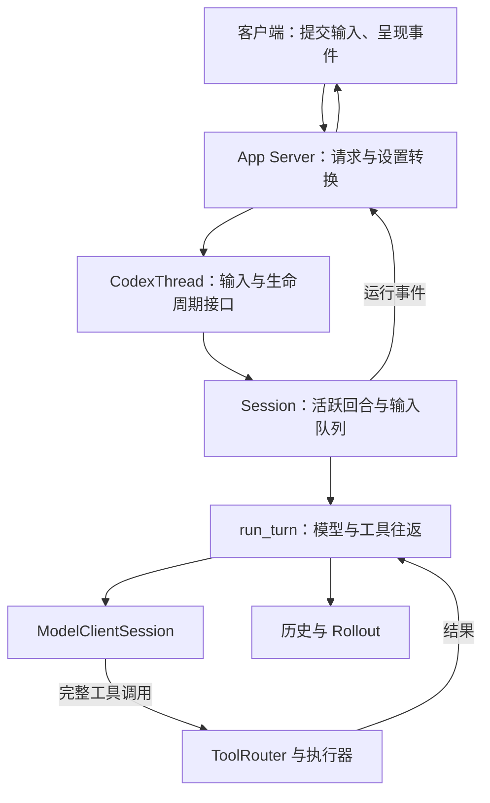
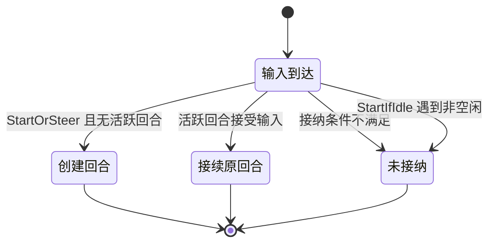
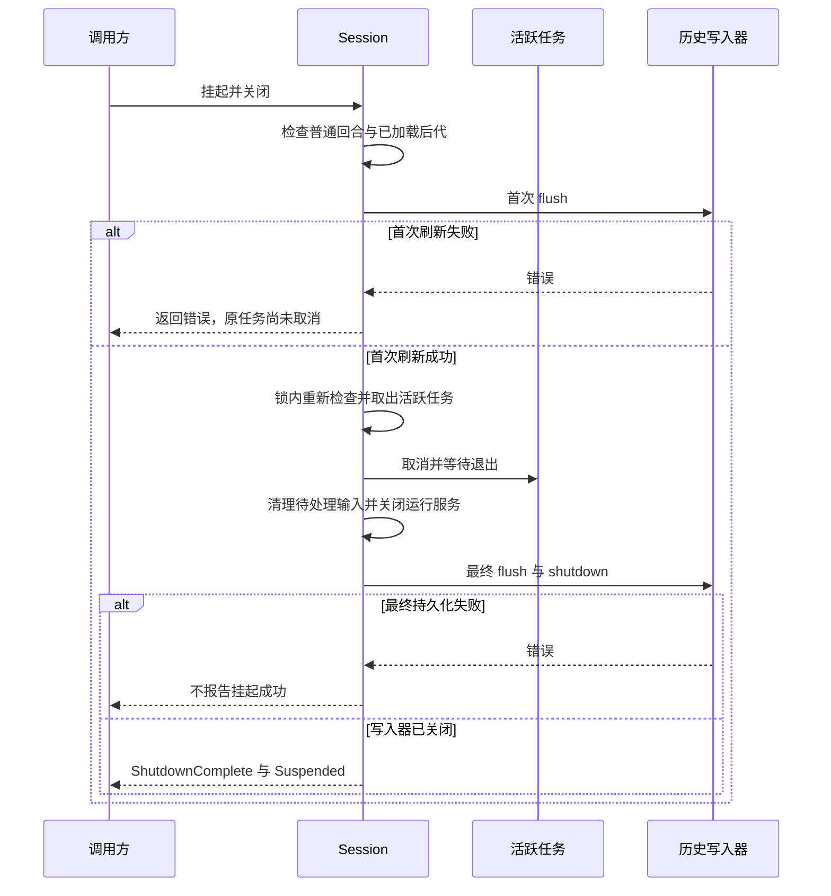

研究 Codex，可以从一项连续委托进入：修复登录超时，运行相关测试，保留修改供审查；执行中用户补充“先不要改公共接口”，之后又需要中断并继续。这个教学任务同时要求模型决策、输入接续、工具执行和状态恢复，不能用一次模型请求解释。

本文以 `openai/codex` 的固定提交 `4b0d9669cc46ba97bf85fa6312431b630d80498d` 为源码基线，核对日期为 2026-09-08。范围是 Rust 本地内核及 App Server 的相关路径；没有编译或启动该提交，没有调用真实模型，也没有验证操作系统沙箱。下面区分源码事实、实现体现的取舍与待验证行为。文件、哈希和声明对应关系见[研究包](/labs/codex-source-study.zip)。

## 客户端、App Server 与内核分别负责什么

App Server 是把 Codex 能力提供给客户端的接口层，不等于桌面 App 的全部实现。公开文档用 Thread 组织会话，用 Turn 表示一轮工作，用 Item 表达消息和工具等条目。[官方文档](https://learn.chatgpt.com/docs/app-server)

固定源码的 `turn_start_inner()` 解析客户端输入与设置，调用 `CodexThread::start_or_steer_turn()`。线程对象把输入送入内核；`Session` 保存活跃回合、输入队列、状态和服务引用；`run_turn()` 组织一轮工作中的多次模型与工具往返。[输入入口](https://github.com/openai/codex/blob/4b0d9669cc46ba97bf85fa6312431b630d80498d/codex-rs/app-server/src/request_processors/turn_processor.rs#L514)、[线程接口](https://github.com/openai/codex/blob/4b0d9669cc46ba97bf85fa6312431b630d80498d/codex-rs/core/src/codex_thread.rs#L177)

这是所研究 App Server 路径的职责图，省略遥测、插件和其他入口。多个方框可以在同一进程；图不表示每个 CLI 请求都经过 App Server，也不描述未公开的桌面界面实现。

这种分工让客户端可以展示进度、提交打断和返回审批，无需自己维护模型循环。代价是客户端必须理解异步事件与运行身份，不能把“请求已接收”当成“任务已完成”。这是根据调用关系作出的工程解释，不是对作者历史决策过程的还原。

持续任务能力也不能全部归到 App 层：本提交的内核已有启动、接续、恢复和挂起接口。桌面任务组织、定时调度或跨设备体验是否使用某条接口，需要各自证据，不能从接口存在推导完整产品能力。

## 输入接纳：为什么由内核判断启动还是接续

`CodexThread` 封装双向消息通道，`submit()` 提交操作；`Session` 的 `submission_loop()` 处理 `TurnInput`、`RecoverTurn`、`Interrupt`、审批响应及关闭等操作。输入接纳返回结构化结果，无需调用方先读一个 busy 标记再决定怎么提交。[操作分派](https://github.com/openai/codex/blob/4b0d9669cc46ba97bf85fa6312431b630d80498d/codex-rs/core/src/session/handlers.rs#L529)

| 接口或模式 | 固定源码中的行为 | 调用方需要理解什么 |
| --- | --- | --- |
| `start_or_steer_turn` | 尝试接续活跃回合；没有活跃回合时启动任务 | 普通用户继续输入，由内核决定去向 |
| `start_turn_if_idle` | 活跃回合存在或其他接纳条件不满足时返回未提交 | 拒绝不等于已排队；自动工作可以让出当前任务 |
| 指定回合的 steer | 将 `expected_turn_id` 交给内核核对 | 旧回合的补充不能悄悄进入另一个回合 |
| `recover_turn_if_idle` | 进入恢复路径，接口约定保留被中断回合的 ID | 恢复与重新输入同一句任务是不同操作 |

例如 `start_if_idle` 在活跃回合锁下检查状态；`start_or_steer` 返回 `Started`、`Steered` 或 `NotSubmitted`。这些是本提交的内部结果类型，不是所有 Agent 协议的通用状态。[输入接纳实现](https://github.com/openai/codex/blob/4b0d9669cc46ba97bf85fa6312431b630d80498d/codex-rs/core/src/session/turn_input.rs#L237)

这是输入分派的概念分支图，省略模式、待处理触发输入和设置校验，不是 Thread 完整状态机。被拒绝的输入不能由客户端显示为已执行。

在登录修复中，“先不要改公共接口”应进入当前工作的后续判断。接到已有回合，可以保留先前代码和工具结果的关联；若客户端自行“先查空闲、再发起”，两步之间状态可能已经改变。集中接纳减少责任分散，但静态调用链不能证明所有并发交错都正确。

## 一轮工作为什么包含多次模型请求

`run_turn()` 先处理压缩、所需 MCP 服务、上下文更新、Skills 与插件注入，再记录输入并进入采样循环。`ModelClientSession` 在回合内复用连接和路由状态；每次请求的输入来自当时的历史视图，连接复用不表示始终发送同一份上下文。[回合实现](https://github.com/openai/codex/blob/4b0d9669cc46ba97bf85fa6312431b630d80498d/codex-rs/core/src/session/turn.rs#L163)

教学任务中，模型第一次可能提出读取调用方，工具返回后第二次决定修改，测试失败又使第三次请求继续修复。用户补充与工具结果都能改变下一步。因此 Turn 不等于一个 HTTP 请求，也不等于一个工具调用。

在所研究的响应流路径中：

1. 文本增量用于反馈；条目完成后，`OutputItemDone` 才进入完成条目的处理分支。
2. `ToolRouter::build_tool_call()` 把完整的 FunctionCall、CustomToolCall 等转换成带名称、参数与 `call_id` 的内部工具调用。
3. 工具调用和后续输入影响 `needs_follow_up`；循环决定继续采样还是进入结束处理。
4. 流在 `response.completed` 之前关闭，会形成明确的流错误，不能把传输中断当正常结束。

对应实现是 [`try_run_sampling_request`](https://github.com/openai/codex/blob/4b0d9669cc46ba97bf85fa6312431b630d80498d/codex-rs/core/src/session/turn.rs#L2280) 和[工具调用构造](https://github.com/openai/codex/blob/4b0d9669cc46ba97bf85fa6312431b630d80498d/codex-rs/core/src/tools/router.rs#L245)。展示增量、确认条目完成、实际执行工具应分别处理；收到半段参数并不能授权派发。

循环结束只说明这轮运行走到了结束路径。登录问题是否修复，还需要测试、变更范围和审查；回合终止信号本身不是面向所有业务的验收器。[Harness 中的独立验收](/writing/prompt-context-harness-engineering/)应由可信任务要求和真实成果定义。

## 历史投影：为什么不能把模型输入当执行账本

`ContextManager` 管理带元信息的历史条目。`for_prompt()` 经 `for_prompt_annotated()` 生成模型输入：补齐调用结果关系、处理孤立结果、去掉当前模型不支持的图片与音频。采样路径取得历史后再做这一投影。[历史视图](https://github.com/openai/codex/blob/4b0d9669cc46ba97bf85fa6312431b630d80498d/codex-rs/core/src/context_manager/history.rs#L392)

Rollout 与历史表示不同职责，不表示所有条目都以完全相同内容写入两处。资源核验是应用需要满足的设计要求，不是 `for_prompt()` 提供的副作用恢复能力。

容易误读的细节是：`ensure_call_outputs_present()` 发现 FunctionCall 没有对应结果，会插入文本为 `aborted` 的合成结果；其他调用类型有各自的补齐规则。它让模型输入中的调用与结果关系完整。[规范化实现](https://github.com/openai/codex/blob/4b0d9669cc46ba97bf85fa6312431b630d80498d/codex-rs/core/src/context_manager/normalize.rs#L21)

**补齐的 `aborted` 不是“外部动作未发生”的证明。** 文件可能已经写入，只是进程来不及记录结果。消息规范化不会查询文件系统判定事实。恢复后的 Agent 仍需读取文件、检查 Diff；远端创建接口还需按资源身份查询。[故障恢复](/writing/harness-engineering-recovery/)讨论的是这层业务事实。

压缩同样改变模型可见历史。`reconstruct_history_from_rollout()` 处理压缩替代历史、回合事件及恢复元信息，不是逐行回显全部 JSON。收益是让长会话形成当前可用视图；代价是恢复语义依赖条目格式、压缩边界和元信息。本文未运行摘要模型，不把压缩流程存在写成摘要必然保留全部关键事实。[恢复重建](https://github.com/openai/codex/blob/4b0d9669cc46ba97bf85fa6312431b630d80498d/codex-rs/core/src/session/rollout_reconstruction.rs#L134)

## 工具并发：共享执行门与资源锁有什么区别

`ToolRouter` 查询注册工具是否支持并行，未知工具默认不支持。`ToolCallRuntime` 内有一把 `RwLock<()>`：支持并行的调用获得读锁，不支持并行的调用获得写锁，再进入派发。锁在共享这一 runtime 的调用之间形成执行门。[并行门](https://github.com/openai/codex/blob/4b0d9669cc46ba97bf85fa6312431b630d80498d/codex-rs/core/src/tools/parallel.rs#L116)

这不是按文件名建立的细粒度资源锁，也不是跨进程全局锁。声明为可并行的两个工具可以同时进入；它们是否访问同一文件，不能由这把锁自动判断。不支持并行的长工具则可能阻塞共享门内的其他调用。

从代码读出的取舍是：用工具能力声明建立统一、相对粗的并发边界，避免为每类工具在外层手写排队；代价是并发精度依赖声明和工具实现。[OpenHands SDK](/writing/openhands-sdk-architecture/)提供资源声明与资源锁的另一种粒度，但两者都需验证声明是否完整，不能据锁的形式排名安全性。

取消还涉及终态竞态：工具已经产生终态，生命周期通知尚未完成时，取消信号可能到达。当前代码检查 `terminal_outcome_reached` 或任务是否结束；已经达到终态时等待结果，否则中止派发任务并生成取消结果。这样可以避免把已有终态覆盖为取消；进程或远端副作用如何收尾，仍取决于执行器。本文没有实测这组竞态。

## 审批、沙箱与重试为什么放在一起

对使用 `ToolRuntime` 的路径，`ToolOrchestrator::run()` 集中处理审批要求、环境权限、沙箱选择、尝试及拒绝后的重试判断，具体执行由 runtime 完成。这不表示所有 MCP 或外部动态工具都自动经过同一套本地进程沙箱。[执行编排器](https://github.com/openai/codex/blob/4b0d9669cc46ba97bf85fa6312431b630d80498d/codex-rs/core/src/tools/orchestrator.rs#L124)

审批回答当前动作是否被允许；沙箱限制执行环境可触及的资源。代码中有 `Forbidden` 直接拒绝，也有按配置跳过交互或请求批准的分支。严格自动审查还可能在普通规则允许跳过时要求审查。

首次执行失败后，并非统一“放开权限再跑一次”。实现检查错误是否为沙箱拒绝、工具是否支持升级重试、审批策略是否允许、环境是否允许无沙箱运行，以及独立网络策略。严格自动审查下，无沙箱重试需要新的审查上下文。[拒绝后的路径](https://github.com/openai/codex/blob/4b0d9669cc46ba97bf85fa6312431b630d80498d/codex-rs/core/src/tools/orchestrator.rs#L325)

集中处理让执行尝试与权限变化保持关联。若每个工具各自重试，模型可能看到相同命令，实际却在更宽权限下运行。代价是策略组合复杂，也需要保留为何批准、为何拒绝和实际执行环境的证据。

沙箱不验证登录修复是否正确，也不提供远端业务幂等。Worktree 可以分离 Git 工作状态，却不能替代操作系统隔离；持有网络凭证的进程仍可能影响共享资源。这些边界应在[执行安全](/writing/harness-engineering-security/)和工具契约中单独判断。

## 挂起与恢复：为什么先刷新历史，再交出执行权

`suspend_turn_and_shutdown()` 试图保留未结束回合，让后续恢复继续使用原回合身份。[挂起实现](https://github.com/openai/codex/blob/4b0d9669cc46ba97bf85fa6312431b630d80498d/codex-rs/core/src/session/turn_suspension.rs)

时序按固定源码归纳，省略没有活跃任务、不支持的任务类型和存在活跃后代的提前返回。末次持久化失败时，任务可能已停止；不能与首次刷新失败时的状态混为一谈。

几项细节直接影响采用判断：

- 首次 flush 在取消前，失败时不先破坏原运行；flush 可能让出执行，因此随后还要在锁下重查活跃任务。
- 取消时不写普通终止回合事件，以免恢复逻辑把原回合当成已结束。
- 接受但尚未处理的输入与交互等待者只在当前进程中，挂起会清理它们；源码指出持久化或重放这部分需要另一个协议。
- 已加载后代的检查只是快照，不是封住后续 spawn 的全局屏障，不能宣传为任意多 Agent 树的原子迁移。
- 最后停止生产者、刷新并关闭写入器，然后才发出关闭完成，避免替代执行者过早写同一历史。

所以“复制聊天记录，让另一进程继续”还缺少未处理输入、运行工具和历史写入权的交接。精细的生命周期顺序解决了具体问题，也增加失败分支的维护成本。

已核对的 Rollout 写入路径调用文件 `flush()`；本文不据此推断断电后的存储耐久性，也未验证主机故障恢复。[写入器](https://github.com/openai/codex/blob/4b0d9669cc46ba97bf85fa6312431b630d80498d/codex-rs/rollout/src/recorder.rs#L1804)提供历史持久化机制，不能代替数据库灾备或远端资源对账。

## Skills、插件和记忆怎样接入这些边界

固定源码的 `run_turn()` 包含 `build_skills_and_plugins()`；`skills.rs` 从配置构造加载输入，分别记录提及与实际注入的技能。能力资产进入模型输入，但“加载了说明”与“工具已执行”仍是两个过程。[技能接入](https://github.com/openai/codex/blob/4b0d9669cc46ba97bf85fa6312431b630d80498d/codex-rs/core/src/skills.rs#L28)

仓库约束、技能说明、长期记忆、当前回合输入和未来的定时触发各有生命周期。这些入口不足以证明桌面 Memory 或 Automation 的完整行为；本文不展开其存储、调度和质量结论。资产格式见 [Agent Skills](/writing/agent-skills-specification/)，跨任务信息的纠错和权限见[记忆治理](/writing/agent-memory-governance/)。

## 哪些设计值得借鉴，哪些不能直接照搬

| 约束或失败 | 本提交提供的机制 | 实现体现的收益 | 接受的代价与边界 |
| --- | --- | --- | --- |
| 执行中继续收到输入 | 内核区分启动、接续和拒绝 | 输入与回合身份对应 | 客户端仍需处理拒绝与异步事件 |
| 一轮工作多次读写与修正 | 采样循环、工具结果回传 | 依据最新观察推进 | 停止信号不等于业务验收 |
| 长历史不适合直接给模型 | 投影、规范化与压缩重建 | 分开输入适配和历史管理 | 合成结果不能确认副作用；摘要质量需实测 |
| 并非所有工具可并行 | 能力声明与共享读写执行门 | 集中维护并发准入 | 不是跨任务资源锁，不自动识别冲突 |
| 拒绝后改变执行环境 | 统一审批、沙箱与重试 | 权限与执行尝试关联 | 组合复杂，依赖执行器和平台行为 |
| 回合需要后续执行者恢复 | 刷新、停止生产者、关闭写入器 | 明确交接顺序与原回合身份 | 未处理输入和后代存在限制；无通用事务恢复 |

表中收益是对实现结构的解释，不是未经测量的性能提升，也不声称每项选择都是作者公开表达的设计动机。短小工单程序可以借鉴输入身份、结果证据和写入边界，无需移植整套 Session、扩展与环境系统。[架构选型](/writing/harness-architecture-selection/)给出了更小的起点。

采用前应分别运行：活跃回合收到补充与过期 steer；取消与工具完成竞争；有未处理输入时挂起；首次及末次 flush 失败；恢复后核对已写文件；沙箱拒绝后的授权变化。这些是待执行的集成验收，不是本文已取得的实验结果。

## 研究证据与限制

本轮完成固定提交下的入口、核心调用链、关键状态和异常分支阅读，保存逐文件 SHA-256 与定位。没有编译、运行上游 Rust 测试，没有启动 App Server、真实模型或沙箱；不提供任务完成率、吞吐、跨机器接管或安全认证结论。

本站另有[架构约束对照实验](/labs/architecture-rationale.zip)，用固定响应工单任务与真实 SQLite 检查改变业务操作键、删除结果核验等后果。它支持通用机制的教学解释，未运行 Codex，不能算作本项目实验。

固定源码支持的结论是：Codex 已把输入接纳、持续回合、工具执行、历史投影和挂起交接组织成明确接口；用于具体业务时，还要为实际工作空间、外部资源和验收结果补齐证据链。
