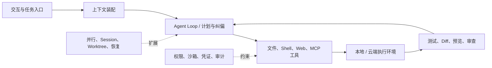

本文比较 Claude Code、Codex 与 Kimi Code 的公开产品结构，资料基线为 2026-09-05。比较同样的六项职责：上下文、执行、验证、协作、扩展和治理。尚无同任务实测，下面的产品取向是采用假设，不能用于总体完成率排名。

## Harness 到底在解决什么

OpenAI 在[拆解 Codex Agent Loop](https://openai.com/index/unrolling-the-codex-agent-loop/)时，把 Harness 描述为连接用户、模型与工具的核心执行逻辑。Anthropic 的工程实践也反复强调，模型能力只有进入“收集上下文—行动—验证”的循环，才会成为可靠的 Agent 能力。

Coding Agent 可以按下列职责拆解：

*图 1｜Coding Agent Harness 的最小工作闭环。*

模型决定“下一步想做什么”；Harness 决定模型看见什么、能做什么、做完如何验证、失败能否恢复。只看模型榜单，就像只看发动机马力来比较整辆车。

## 系统职责对比：内置能力与自建范围

| 层 | Claude Code | Codex | Kimi Code |
| --- | --- | --- | --- |
| 入口 | CLI / IDE / Desktop / Web / GitHub / Slack | CLI / IDE / App / Cloud / GitHub / Slack | CLI / IDE / ACP |
| 上下文 | `CLAUDE.md`、Rules、Memory、Skills | `AGENTS.md`、Skills、Session、Compaction | 项目上下文、Skills、Agents |
| 执行 | 本地与云端 | 本地与云端 | 本地终端 |
| 验证 | 测试、Diff、Preview、Review、Hooks | 测试、Diff、Browser、Review Queue | Shell、文件、Web、子 Agent |
| 并行 | Subagents、Agent View、Teams、Worktrees、Batch | 多线程、Worktrees、Cloud tasks、协作 Agent | 内置子 Agent 与 Agent Swarm |
| 扩展 | Skills、Hooks、MCP、Plugins、Agent SDK | Skills、MCP、Rules、SDK、App 工具 | Skills、MCP、ACP、自定义 Agent |
| 治理 | Permissions + OS Sandbox + Hooks + Managed settings | Approvals + OS Sandbox + Cloud isolation + Admin controls | 产品权限与本地环境边界 |

开源 Harness 的内部实现分别见[Hermes](/writing/hermes-agent-architecture-deep-dive/)、[Pi](/writing/pi-architecture-deep-dive/)与[DeepSeek Harness](/writing/deepseek-harness-composition/)。它们的部署与维护责任不同，不在产品化编码工具表中并列打分。

## 用户体验五要素：同一套功能为何成为不同产品

上面的职责表回答“系统由什么组成”，用户体验五要素则回答“用户如何感受到这套系统”。对 Coding Agent，五层应当从目标一路追踪到可见反馈，任何一层断裂都会让能力停留在 Demo。

### 产品化 Coding Agent 逐层对比

战略与表现层是基于公开设计的分析假设；“监督感”“中文友好”等感受尚无本文用户测试支持。

| 五要素 | Claude Code | Codex | Kimi Code |
| --- | --- | --- | --- |
| **战略层** | 让个人与团队把工程方法交给 Claude 执行 | 让用户监督多个 Agent 完成软件生命周期工作 | 用自研 Agentic 模型覆盖中文与全球开发者 |
| **范围层** | 代码、Shell、Web、MCP、GitHub、Skills、Hooks、团队 Agent | 本地与云端编码、Review、Worktree、Automation、Skills、应用工具 | 代码、Shell、Web、MCP、ACP、Skills、内置与自定义 Agent |
| **结构层** | 单 Agent 循环按需升级为 Subagent、Agent View、Team 或 Batch | 项目—线程—Worktree—Review Queue，支持异步任务，具体取决于运行入口 | 主 Agent 调度内置子 Agent 与 Agent Swarm，新旧 CLI 逐步迁移 |
| **框架层** | 终端、IDE、桌面和 Web 都强调计划、工具轨迹、Diff 与介入点 | App 侧栏承担多任务控制台，Diff、终端、浏览器与 Review 集中呈现 | TUI 与 IDE/ACP 为主，重点呈现任务过程与多 Agent 状态 |
| **表现层** | 信息密度高、过程透明，工程师心智强 | 以任务状态和可审查结果为中心，监督感更强 | 中文友好、模型能力标签突出，产品仍在快速演化 |

## Claude Code：项目约束与工作流扩展

Claude Code 的突出之处是，几乎每种“给 Agent 的信息”都有明确容器：

- 每次都需要的项目约定放在 `CLAUDE.md`；
- 偶尔需要的流程与领域知识放在 Skill；
- 外部系统连接放在 MCP；
- 配置匹配事件的检查放在 Hook，并明确同步阻断与事后反馈的区别；
- 大量探索放在 Subagent；
- 真正需要协作的复杂任务才使用 Agent Team；
- 对 Bash 子进程的硬限制交给 Sandbox。

官方[扩展指南](https://code.claude.com/docs/en/features-overview)把这些机制放在同一张职责地图上，这一点比单纯支持某个协议更重要。它降低了组织把所有规则堆进 System Prompt 的冲动。

### 可以验证的设计收益

第一，Claude Code 为不同上下文提供独立机制。Rules、Skills、Subagents 和 Compaction 让不同信息按不同生命周期进入上下文，而不是永远常驻。

第二，软约束与硬约束分开。Permissions 控制 Agent 是否应该调用工具，Sandbox 用操作系统边界限制命令实际上能访问什么；Anthropic 的[沙箱说明](https://www.anthropic.com/engineering/claude-code-sandboxing)同时覆盖文件系统和网络。

第三，并行机制分层。[Claude Code 并行运行指南](https://code.claude.com/docs/en/agents)区分 Subagents、Agent View、Agent Teams、Worktrees 和 Batch，不假设所有并行都需要同一种编排。

### 它的代价

Claude Code 的能力面正在变大，配置体系也随之复杂。Skills、Plugins、Hooks、MCP、Rules、Subagents 与 Teams 如果缺少治理，很容易形成一套只有少数高手理解的“Agent 配置遗产”。Agent Teams 仍被官方标注为 experimental，并且会显著增加 Token 消耗。

更现实的限制是模型与商业服务绑定 Anthropic。CLI 的可配置性很强，不等于整套能力可以脱离 Claude 模型与 Anthropic 服务独立运行。

## Codex：任务监督、环境与变更审查

Codex 的产品重心已经从“一个终端 Agent”转向“人如何监督很多并行工作”。[Codex App](https://openai.com/index/introducing-the-codex-app/)把项目、线程、Worktree、Review 与 Automation 收进一个控制面；[Codex 云端 Agent](https://openai.com/index/introducing-codex/)则为每个任务准备隔离环境，并把结果交回审查。

### 可以验证的设计收益

第一，本地、IDE、云端与 App 不是割裂产品。用户可以在本地高带宽协作，也可以把独立任务交给云端，最后回到差异审查。

第二，Git 是天然的任务协议。Worktree 隔离并行改动，Diff 是结果边界，PR 是组织交接点。Agent 不需要发明另一套“工作对象”。

第三，Codex CLI 的核心是 Apache-2.0 开源 Rust 实现，并提供 macOS Seatbelt、Linux Sandbox 与 Windows 受限执行等系统级策略，参见[Codex CLI 仓库](https://github.com/openai/codex)。这给本地执行层带来了可审计性，也让 `codex exec` 能进入脚本和 CI。

第四，Review 为变更审查提供入口，但不是每次任务结束都自动进入同一种审查队列。采用时应检查当前任务的交付物、审查状态和负责人。

### 它的代价

Codex 的核心模型和云端控制面仍属于 OpenAI 生态。多 Agent 并行让人类时间得到放大，也会同步放大推理配额、无效分支和审查队列。如果团队没有清晰的任务切分和自动验证，App 可以让混乱并行得更快。

与 Claude Code 相比，Codex 的默认体验更偏“调度与接管”，Claude Code 的公开设计语言更偏“把团队工程方法编进 Harness”。两者不是简单的一强一弱，而是两个控制面中心不同。

## Kimi Code：模型—Harness 垂直整合的国产路线

Kimi Code 的战略意义大于“又一个 CLI”。月之暗面同时控制 Agentic 模型、API、Coding Agent 和 Kimi Work，因此可以让模型训练、工具协议和产品行为互相反馈。

[Kimi Code 文档](https://www.kimi.com/code/docs/en/kimi-code-cli/customization/agents)展示了内置子 Agent、自定义 Agent、Skills 与多层委派；它也支持 MCP 和 ACP，能够进入不同 IDE。旧版 Kimi CLI 的仓库采用 Apache-2.0 许可证，当前产品正在向新版 Kimi Code 迁移，见[官方仓库说明](https://github.com/MoonshotAI/kimi-cli)。

Kimi Code 可以围绕模型与产品协同、中文开发体验和任务成本提出验证假设：

- Kimi Code 当前版本实际支持怎样的并行调度，以及它能否提高工程完成率；Kimi Work 公布的 300 个子 Agent 上限不能直接套用到 Code；
- 新旧 CLI 迁移期间的接口稳定性与生态兼容性；
- 企业权限、沙箱、审计与跨任务恢复是否达到与能力增长相匹配的成熟度；
- 模型开放与产品开放之间的边界是否足够清楚。

因此，Kimi Code 可以进入国内 Coding Agent 的实测名单，但不能仅凭模型参数或并发数量判定已经完成替代。
