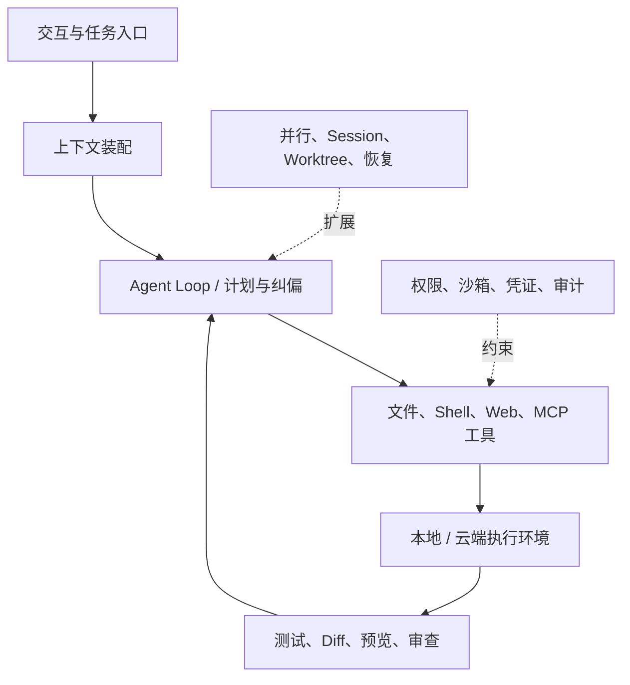

如果只比较模型，Coding Agent 的产品差异会显得很小：无非是读文件、改代码、跑命令。但真实使用几天之后，差距往往不来自模型第一次写对了多少代码，而来自它如何理解项目、如何处理失败、如何证明完成、如何限制副作用，以及工作能否被另一个人接手。

这就是 Harness 的竞争。

> [!IMPORTANT]
> **结论先行：**Claude Code 与 Codex 目前是完成度最高的两种答案。Claude Code 更像一套可编程的工程制度，强在上下文、Skills、Hooks、MCP、Subagents 与权限体系的组合；Codex 更像 Agent 工作操作系统，强在本地与云端连续性、多任务监督、Worktree 隔离、Review 和 Automations。Kimi Code 是最有代表性的国产追赶者；Hermes、Pi、DeepSeek Harness 则分别代表“丰富自治”“极简内核”“万物插件”三条开源路线。

本文是[八强竞品全景](/writing/ai-agent-landscape-2026/)的第二篇，也可以与[Anthropic Harness 建设](/writing/anthropic-harness/)配合阅读。

## 一、Harness 到底在解决什么

OpenAI 在[拆解 Codex Agent Loop](https://openai.com/index/unrolling-the-codex-agent-loop/)时，把 Harness 描述为连接用户、模型与工具的核心执行逻辑。Anthropic 的工程实践也反复强调，模型能力只有进入“收集上下文—行动—验证”的循环，才会成为可靠的 Agent 能力。

一套成熟 Coding Agent 至少包含七层：



模型决定“下一步想做什么”；Harness 决定模型看见什么、能做什么、做完如何验证、失败能否恢复。只看模型榜单，就像只看发动机马力来比较整辆车。

## 二、七层对比：六款产品不是六种皮肤

| 层 | Claude Code | Codex | Kimi Code | Hermes | Pi | DeepSeek Harness |
| --- | --- | --- | --- | --- | --- | --- |
| 入口 | CLI / IDE / Desktop / Web / GitHub / Slack | CLI / IDE / App / Cloud / GitHub / Slack | CLI / IDE / ACP | CLI / Desktop / IM / Gateway | CLI / RPC / SDK | Web UI / CLI / Presets |
| 上下文 | `CLAUDE.md`、Rules、Memory、Skills | `AGENTS.md`、Skills、Session、Compaction | 项目上下文、Skills、Agents | Context files、Memory、Skills、Session search | Context files、Skills、树状 Session | Session event stream、插件化上下文 |
| 执行 | 本地与云端 | 本地与云端 | 本地终端 | 本地、容器、远程后端 | 本地为主，可嵌入 | 插件化 Sandbox 与 Runtime |
| 验证 | 测试、Diff、Preview、Review、Hooks | 测试、Diff、Browser、Review Queue | Shell、文件、Web、子 Agent | Checkpoint、工具结果、Cron 记录 | 由模型、脚本与扩展组合 | Trace、Replay、模式化运行 |
| 并行 | Subagents、Agent View、Teams、Worktrees、Batch | 多线程、Worktrees、Cloud tasks、协作 Agent | 内置子 Agent 与 Agent Swarm | `delegate_task` | 默认不内置，自行扩展或用 tmux | Loop、Scheduling、Subagents 均可插件化 |
| 扩展 | Skills、Hooks、MCP、Plugins、Agent SDK | Skills、MCP、Rules、SDK、App 工具 | Skills、MCP、ACP、自定义 Agent | Skills、MCP、Tools、Hooks、Provider routing | TypeScript Extensions、Skills、Packages、SDK | Cordis Plugins、Presets、Creator mode |
| 治理 | Permissions + OS Sandbox + Hooks + Managed settings | Approvals + OS Sandbox + Cloud isolation + Admin controls | 产品权限与本地环境边界 | 审批、写入限制、容器、安全扫描 | 默认把治理交给用户/扩展 | 安全插件与沙箱可换，生产基线仍早期 |

这张表最重要的信息不是谁的单元格更满，而是“默认产品意见”有多强。Claude Code、Codex 给出一套较完整的标准路径；Pi 故意不替用户决定；DeepSeek Harness 甚至允许替换路径本身。

## 三、Claude Code：最像一套可执行的工程制度

Claude Code 的突出之处是，几乎每种“给 Agent 的信息”都有明确容器：

- 每次都需要的项目约定放在 `CLAUDE.md`；
- 偶尔需要的流程与领域知识放在 Skill；
- 外部系统连接放在 MCP；
- 必须发生的检查放在 Hook；
- 大量探索放在 Subagent；
- 真正需要协作的复杂任务才使用 Agent Team；
- 对 Bash 子进程的硬限制交给 Sandbox。

官方[扩展指南](https://code.claude.com/docs/en/features-overview)把这些机制放在同一张职责地图上，这一点比单纯支持某个协议更重要。它降低了组织把所有规则堆进 System Prompt 的冲动。

### 它为什么强

第一，Claude Code 的上下文工程成熟。Rules、Skills、Subagents 和 Compaction 让不同信息按不同生命周期进入上下文，而不是永远常驻。

第二，软约束与硬约束分开。Permissions 控制 Agent 是否应该调用工具，Sandbox 用操作系统边界限制命令实际上能访问什么；Anthropic 的[沙箱说明](https://www.anthropic.com/engineering/claude-code-sandboxing)同时覆盖文件系统和网络。

第三，并行机制分层。[Claude Code 并行运行指南](https://code.claude.com/docs/en/agents)区分 Subagents、Agent View、Agent Teams、Worktrees 和 Batch，不假设所有并行都需要同一种编排。

### 它的代价

Claude Code 的能力面正在变大，配置体系也随之复杂。Skills、Plugins、Hooks、MCP、Rules、Subagents 与 Teams 如果缺少治理，很容易形成一套只有少数高手理解的“Agent 配置遗产”。Agent Teams 仍被官方标注为 experimental，并且会显著增加 Token 消耗。

更现实的限制是模型与商业服务绑定 Anthropic。CLI 的可配置性很强，不等于整套能力可以脱离 Claude 模型与 Anthropic 服务独立运行。

## 四、Codex：最像多 Agent 时代的工作操作系统

Codex 的产品重心已经从“一个终端 Agent”转向“人如何监督很多并行工作”。[Codex App](https://openai.com/index/introducing-the-codex-app/)把项目、线程、Worktree、Review 与 Automation 收进一个控制面；[Codex 云端 Agent](https://openai.com/index/introducing-codex/)则为每个任务准备隔离环境，并把结果交回审查。

### 它为什么强

第一，本地、IDE、云端与 App 不是割裂产品。用户可以在本地高带宽协作，也可以把独立任务交给云端，最后回到差异审查。

第二，Git 是天然的任务协议。Worktree 隔离并行改动，Diff 是结果边界，PR 是组织交接点。Agent 不需要发明另一套“工作对象”。

第三，Codex CLI 的核心是 Apache-2.0 开源 Rust 实现，并提供 macOS Seatbelt、Linux Sandbox 与 Windows 受限执行等系统级策略，参见[Codex CLI 仓库](https://github.com/openai/codex)。这给本地执行层带来了可审计性，也让 `codex exec` 能进入脚本和 CI。

第四，Codex 把“结束”设计成“进入 Review Queue”，而不是一条聊天回复。这个细节代表产品心智已经从回答问题转向交付工作。

### 它的代价

Codex 的核心模型和云端控制面仍属于 OpenAI 生态。多 Agent 并行让人类时间得到放大，也会同步放大推理配额、无效分支和审查队列。如果团队没有清晰的任务切分和自动验证，App 可以让混乱并行得更快。

与 Claude Code 相比，Codex 的默认体验更偏“调度与接管”，Claude Code 的公开设计语言更偏“把团队工程方法编进 Harness”。两者不是简单的一强一弱，而是两个控制面中心不同。

## 五、Kimi Code：模型—Harness 垂直整合的国产路线

Kimi Code 的战略意义大于“又一个 CLI”。月之暗面同时控制 Agentic 模型、API、Coding Agent 和 Kimi Work，因此可以让模型训练、工具协议和产品行为互相反馈。

[Kimi Code 文档](https://www.kimi.com/code/docs/en/kimi-code-cli/customization/agents)展示了内置子 Agent、自定义 Agent、Skills 与多层委派；它也支持 MCP 和 ACP，能够进入不同 IDE。旧版 Kimi CLI 的仓库采用 Apache-2.0 许可证，当前产品正在向新版 Kimi Code 迁移，见[官方仓库说明](https://github.com/MoonshotAI/kimi-cli)。

Kimi 的强项是模型与产品联合优化、中文开发者体验、较低使用成本和大规模并行叙事。需要验证的则是：

- 300 个 Agent 的上限能否在真实工程里带来更高完成率，而非更多重复探索；
- 新旧 CLI 迁移期间的接口稳定性与生态兼容性；
- 企业权限、沙箱、审计与跨任务恢复是否达到与能力增长相匹配的成熟度；
- 模型开放与产品开放之间的边界是否足够清楚。

因此，Kimi Code 是最值得进入实测名单的国内 Coding Agent，但不能仅凭模型参数或并发数量判定已经完成替代。

## 六、Hermes、Pi、DeepSeek Harness：三种开源哲学

### Hermes：Batteries included 的长期自治 Agent

Hermes 默认提供的不是最小编码循环，而是一套可长期运行的个人 Agent：持久记忆、Skills、浏览器、消息平台、子 Agent、Checkpoint、Cron 和多模型 Provider。

它最有辨识度的机制是把 Memory 与 Skills 分开：Memory 保存短小、常驻的事实，Skill 保存按需加载的程序性知识。Agent 可以从非平凡任务、错误修正和用户反馈中创建 Skill；用户也可以开启写入审批。参见[Hermes 功能总览](https://hermes-agent.nousresearch.com/docs/user-guide/features/overview)与[Skills 文档](https://hermes-agent.nousresearch.com/docs/user-guide/features/skills/)。

这条路线特别适合个人自动化、跨渠道助理和重复工作积累，不应只用 Coding Agent 标尺评价。

它的问题也来自“电池齐全”：能力越多，攻击面越大。官方安全文档提供危险命令审批、文件写入限制、容器隔离、MCP 凭证过滤、上下文扫描和跨 Session 隔离，但默认本地运行仍可能拥有当前用户的文件权限。部署者不能把“开源”误读为“默认安全”。

### Pi：刻意保持空白的最小 Harness

[Pi 官方文档](https://pi.dev/docs/latest)将自己定义为 minimal terminal coding harness。项目现由 Earendil Works 维护，原 `badlogic/pi-mono` 地址会重定向到 `earendil-works/pi`。默认只有少量文件与 Shell 工具；计划、待办、Subagents、MCP 和权限弹窗都不是强制内置，而由 Extensions、Skills、Packages、tmux 或外部隔离方案决定。

这不是功能落后，而是一种架构立场：

```text
核心只保留普遍机制；工作流偏好、团队制度和安全策略由使用者显式添加。
```

Pi 适合 Harness 开发者、模型评测者和讨厌重型默认设置的高级用户。它也提供 RPC 与 SDK，便于嵌入自定义 UI 或流水线，参见[Pi SDK](https://pi.dev/docs/latest/sdk)。

但“没有权限弹窗”不是安全特性。Pi 官方建议在容器中运行或自行构建确认流。对缺少平台工程能力的团队，极简会把产品复杂度转化为自建复杂度。

### DeepSeek Harness：把运行时本身做成插件图

DeepSeek Harness 的 Cordis 架构把模型、工具、文件访问、Agent Loop、Session、Sandbox、Storage、Scheduling 与 UI 都视为插件。Standard Mode 提供完整 Agent，Code Mode 让模型用代码编排多轮工具，Minimal Mode 用极少工具做基准，Creator Mode 用于检查和重组运行时。

与 Pi 相比，Pi 是“稳定的小核心 + 外围扩展”，DeepSeek Harness 更接近“核心能力也可以被重新组合”。它对研究不同 Loop、工具暴露方式和运行时拓扑很有吸引力。

但官方[README](https://github.com/deepseek-ai/deepseek-harness)明确写着 developer preview 和 compatibility-breaking changes。对生产采购而言，架构领先与运维成熟是两张不同的答卷。

## 七、六款产品的相对优势，不用总分表达

| 如果你最在意 | 首选 | 第二选择 | 需要接受的代价 |
| --- | --- | --- | --- |
| 成熟的可定制工程 Harness | Claude Code | Codex | 厂商模型与订阅绑定 |
| 多任务监督与云地协同 | Codex | Claude Code | 配额、审查队列与任务切分成本 |
| 国产模型—产品一体化 | Kimi Code | 自建 Pi + 国产模型 | 产品快速迭代与企业治理仍需实测 |
| 长期个人 Agent 与跨渠道自动化 | Hermes | 自建 DeepSeek Harness | 权限面与持续运维责任 |
| 极简、透明、可塑的 Coding 内核 | Pi | Codex CLI | 高级能力与安全治理需自行装配 |
| 自研 Agent 平台或 Harness 实验 | DeepSeek Harness | Pi SDK | 版本兼容与生产化成本 |
| 企业默认安全基线 | Claude Code / Codex | WorkBuddy Code | 仍需组织配置与人工审查 |

“首选”也不意味着单一采购。很常见的一种组合是：用 Claude Code 或 Codex 作为工程师默认产品，用 Pi 或 DeepSeek Harness 做模型与运行时实验，用 Hermes 承担个人或团队的非代码自动化。

## 八、真正公平的 PoC：不要让六个 Agent 做同一道玩具题

一个有效的两周 PoC，至少应包含四类任务：

1. **定位型任务**：理解陌生代码、追踪跨模块调用、解释故障；
2. **修改型任务**：实现中型功能，必须通过已有测试和静态检查；
3. **长程任务**：需要多轮探索、重启、压缩或交接的迁移；
4. **高风险任务**：包含外部网络、密钥边界、数据库或发布步骤，但设置明确禁止线。

每个任务记录六个数字：一次完成率、测试通过率、人工接管次数、权限例外数、总模型成本、从失败到恢复的时间。并保留完整 Trace，抽样判断“通过”是否来自正确过程，而不是偶然绕过测试。

对于并行能力，再单独测量：任务是否真正独立、冲突率、重复工作率、汇总遗漏率和人类最终审查时间。Agent 数量不是产出指标；**单位人类审查分钟换来的合格变更量**才是。

## 九、最后的判断：最好的 Harness 会逐渐隐形

Claude Code 与 Codex 当前的领先，本质上是它们让更多工程约束进入了系统，而不需要用户每次提醒：项目知识有位置，危险动作有边界，并行修改有隔离，结果有 Diff 和测试，完成后有人类审查入口。

开源三强提出的反问同样重要：

- Hermes 问，Agent 能否积累长期关系和程序性记忆；
- Pi 问，多少“高级功能”其实只是可以删除的产品意见；
- DeepSeek Harness 问，为什么连 Agent Loop 本身都不能被热插拔。

下一阶段不会由某一种哲学通吃。成熟产品会吸收开源 Harness 的可塑性，开源项目也会补齐产品的安全与治理。但无论路线如何，评价标准都应回到同一点：**不是 Agent 做了多少动作，而是它以多低的监督成本交付了多少可验证结果。**

---

资料截至 2026-09-04。本文优先使用各厂商官方文档和开源仓库；涉及 experimental、research preview 或 developer preview 的能力均按官方状态标注，不把路线图当成已成熟能力。
