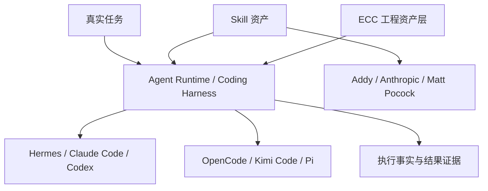

> 系列：[1. 研究地图](/writing/composable-agent-harness-architecture/)｜[2. 研究方法](/writing/composable-agent-harness-research-method/)｜[3. 阶段结论](/writing/composable-agent-harness-synthesis/)

把十个热门仓库放进一张功能表，会很快得到大量勾选，却很难真正理解它们。Hermes Agent 管长期在线的个人 Agent；Claude Code、Codex、OpenCode、Kimi Code 与 Pi 管编码任务的执行环境；三个 Skills 仓库维护可复用方法；ECC 则试图把方法安装到多个 Harness。它们不在同一层，不能直接用功能数量排名。

这次重构先取消原来“Hermes、Pi、ECC 三者对照”的长系列。每个仓库成为独立研究单元，按“全景—机制—边界—总结”推进；母系列只保留研究坐标，不提前输出赢家。

*图 1｜十个仓库分属运行系统、技能资产与跨 Harness 工程层；箭头表示使用关系，不代表优劣。*

## 十个独立问题

| 系列 | 首要研究问题 |
| --- | --- |
| [Hermes Agent](/series/hermes-agent-system/) | 长期 Agent 如何把经验变成记忆与 Skill？ |
| [Claude Code](/series/claude-code-system/) | 自动记忆、Skill 与 Hook 怎样进入编码循环？ |
| [Codex](/series/codex-system/) | 本地沙箱、任务证据与长期自动化怎样连接？ |
| [OpenCode](/series/opencode-system/) | 开放的 Client/Server Harness 如何保持稳定契约？ |
| [Kimi Code](/series/kimi-code-system/) | Session、Skill 与 Agent Swarm 如何协作？ |
| [Pi](/series/pi-system/) | 最小内核如何把产品意见留给扩展？ |
| [Addy Agent Skills](/series/addy-agent-skills/) | 如何把完整研发周期编码成可验证流程？ |
| [Anthropic Skills](/series/anthropic-agent-skills/) | Agent Skills 标准怎样支持渐进加载和复杂产物？ |
| [ECC](/series/ecc-system/) | 工程意图如何跨 Harness 安装、运行与回滚？ |
| [Matt Pocock Skills](/series/mattpocock-skills/) | 小型 Skill 如何修复对齐、术语和反馈失效？ |

如果按建议顺序开始，可以先进入 [Hermes Agent 的长期系统全景](/writing/hermes-agent-series-overview/)；它把“任务之间如何发生连接”暴露得最完整，但不会替其他项目预设比较尺度。

## 暂时不做什么

本阶段不做统一打分，不用 Star 数代替架构质量，也不把“支持 Skills”视为相同能力。更重要的是，不把产品文档中的愿景自动当成开源仓库已经实现的事实。每个系列必须先回答四件事：系统边界在哪里；关键状态怎样流动；失败由谁发现和恢复；经验如何进入未来任务。

只有这些单元结论稳定之后，才有资格讨论共同协议、能力路由和可塑 Harness 的组合方式。

---

下一篇：[研究方法](/writing/composable-agent-harness-research-method/)。

地图划清了对象。下一篇建立统一的源码阅读卡，保证十个系列虽然独立，证据口径仍然一致。
