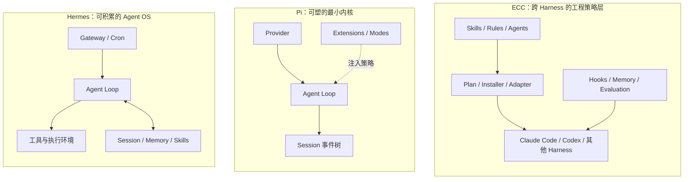

> 系列：[1. 全局地图](/writing/composable-agent-harness-architecture/)｜[2. Hermes 内核](/writing/hermes-agent-architecture-deep-dive/)｜[3. Hermes 工具](/writing/hermes-agent-runtime-services/)｜[4. Hermes 积累](/writing/hermes-agent-memory-governance/)｜[5. Pi 内核](/writing/pi-architecture-deep-dive/)｜[6. Pi Session](/writing/pi-session-extension-architecture/)｜[7. Pi 扩展](/writing/pi-durable-harness-governance/)｜[8. ECC 编译](/writing/ecc-architecture-deep-dive/)｜[9. ECC 运行](/writing/ecc-hook-runtime-memory/)｜[10. ECC 治理](/writing/ecc-memory-supply-chain/)｜[11. 整体思考](/writing/composable-agent-harness-synthesis/)

在 [Agent 工作系统全景的开源路线篇](/writing/open-source-agent-harness-routes/)里，我们已经看到 Hermes、Pi 与 DeepSeek Harness 代表不同的产品哲学。但当问题从“选哪一条路线”进入“怎样设计自己的 Harness”，只看功能多少就不够了。

Hermes 有记忆、Skill、Gateway、Cron 和大量工具；Pi 默认只保留很短的循环与少量工具；ECC 甚至不拥有模型循环，而是把工程方法安装到 Claude Code、Codex 等现有 Harness。它们都强调开放与可改造，却把“允许用户改变什么”放在完全不同的位置。

这个系列不再做一次功能横评，而是沿三套源码回答同一个架构问题：**哪些机制必须稳定，哪些策略应该开放，开放之后的复杂度又由谁承担？**

## 先把三种系统放到同一张图上

*图 1｜三条并列路线服务于同一类用户与组织目标，但“开放”位于不同层：Hermes 开放长期 Agent，Pi 开放运行内核，ECC 开放跨 Harness 的工程资产。*

三者并不是同一类产品的轻量版、中量版和重量版：

- **Hermes 管完整生命期。** 它希望一个 Agent 能长期在线，在不同渠道接收任务，把事实写入 Memory，把方法写入 Skill，再通过 Gateway、Cron 与执行后端持续工作。
- **Pi 管最小运行机制。** 它把模型协议、事件顺序、工具循环、Session 和上下文投影做成稳定内核，把计划、审批、子 Agent 等产品意见留给扩展。
- **ECC 管工作方式的迁移。** 它不替代底层 Agent Loop，而是把 Skill、Rule、Hook 与安装状态组织为中间表示，再投射到能力并不完全相同的 Harness。

因此，问“谁的功能更多”意义有限。更准确的问题是：你准备改造的是一个长期 Agent、一套执行机制，还是组织的工程方法？

## 可塑性至少包含五个层次

很多项目用“插件化”概括所有开放能力，但一个可以增加工具的系统，不一定允许修改循环；一个允许改 Prompt 的系统，也不一定允许改变证据、权限和恢复方式。阅读这三套架构时，可以沿五层检查：

| 层次 | 核心问题 | 典型资产 |
| --- | --- | --- |
| 模型与协议 | 能否替换 Provider，又不抹平关键差异？ | Model registry、消息与流式事件 |
| 执行机制 | 循环、工具、并发和中断如何保持正确？ | Agent Loop、Tool schema、event contract |
| 产品策略 | 计划、审批、压缩与多 Agent 由谁决定？ | Extensions、Modes、Hooks、Gateway |
| 经验资产 | 事实、方法与工程规则如何积累和迁移？ | Session、Memory、Skills、Rules |
| 治理边界 | 谁能写入、发布、回滚和承担副作用？ | Sandbox、manifest、install state、evaluation |

真正成熟的开放系统，不是每层都能任意替换，而是明确告诉使用者：这里是稳定协议，那里是可变策略；这项变化只影响一次任务，那项变化会进入未来所有任务。

## 三种架构其实在吸收不同的复杂度

Hermes 的默认能力最丰富。它替使用者吸收了长期运行、渠道接入、记忆和任务调度的装配成本，但系统自身必须面对更大的权限面、状态面与运维面。

Pi 把默认产品意见压到最低。内核更容易观察和改造，但计划、审批、团队治理和远端执行不会凭空出现。自由度越高，使用者需要补齐的系统责任越多。

ECC 则试图吸收跨 Harness 的重复配置成本。它让同一套工程意图可以迁移，但无法抹平底层平台在 Hook、权限、隔离和生命周期上的差异。所谓“一次编写，到处运行”，最后仍需要 Adapter 和能力降级语义。

| 路线 | 优先保护什么 | 复杂度主要落在哪里 |
| --- | --- | --- |
| Hermes | 长期协作与经验积累 | 记忆治理、权限、服务运行与单体演进 |
| Pi | 机制纯度与工作流可塑性 | 扩展装配、安全基线与两代架构迁移 |
| ECC | 工程方法的复用与跨平台投射 | 资产治理、安装生命周期与能力不对等 |

这张表比功能数量更接近真实选型：项目没有消灭复杂度，只是决定由维护者、部署者还是最终团队接住它。

## 为什么要把运行事实与模型上下文分开

三套系统虽然路径不同，却共享一个重要方向：**真实历史不应等同于下一轮直接喂给模型的上下文。**

Hermes 保存 Session，再按生命周期选择 Memory 与 Skill；Pi 把 Session 写成追加事件树，Compaction 只是新的语义检查点；ECC 把 Markdown 记忆视为事实源，把索引当成可以重建的投影。共同原则是先保留可追溯事实，再根据当前任务生成有限上下文。

这一区分决定系统能否恢复、审计和纠错。如果只保存压缩后的“最终记忆”，错误摘要会替代原始证据；如果把所有历史都塞回 Prompt，成本、噪声和提示注入又会一起增长。

## 阅读这十一篇时，要寻找什么

接下来九篇分别进入 Hermes、Pi 与 ECC，但不会按文件目录逐行讲解：

1. Hermes 三篇先看运行内核与工具服务，再看经验怎样进入长期资产；
2. Pi 三篇先看最小内核的正确性，再看 Session、扩展与持久任务；
3. ECC 三篇先看资产如何被编译和执行，再看记忆、供应链与控制平面；
4. 终篇把三种设计重新合并，给出稳定内核、可变策略和经验晋升的共同判断。

如果只是选现成产品，读完总览和终篇已经足够；如果正在搭建内部 Agent 平台，应重点跟踪每篇里的事件、状态、信任等级和恢复语义。架构图的价值不在于知道模块叫什么，而在于知道一次失败由谁发现、凭什么恢复、会不会污染下一次任务。

---

下一篇：[Hermes 运行](/writing/hermes-agent-architecture-deep-dive/)。

三条路线已经放回同一张地图。下一篇先进入 Hermes 的执行主链，看一个面向长期协作的 Agent 如何连接 Loop、上下文、工具和常驻服务。
