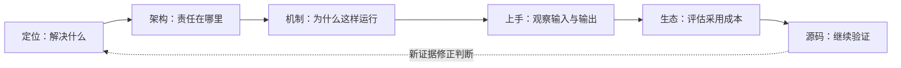

不同项目的名字可以放在一张表里，承担的职责却未必可比。研究 Harness 时，先确定对象层次，再沿一条实际任务追踪状态与控制流，最后比较相同责任的实现。

## 先按职责区分研究对象

| 对象 | 研究问题 | 可进入的案例 |
| --- | --- | --- |
| 完整 Agent 或 Coding Harness | 谁拥有循环、状态、工具和执行边界？ | [Claude Code](/writing/claude-code-internals-overview/)、[Codex](/writing/codex-system-overview/)、[Kimi Code](/writing/kimi-code-system-overview/)、[OpenCode](/writing/opencode-system-overview/) |
| 可塑运行内核与长期助理 | 哪些机制进入内核，哪些策略留给扩展？ | [Pi](/writing/pi-architecture-deep-dive/)、[DeepSeek Harness](/writing/deepseek-harness-composition/)、[Hermes](/writing/hermes-agent-architecture-deep-dive/) |
| 技能与工程资产 | 方法在何时加载，怎样验证和发布？ | [Anthropic Skills](/writing/anthropic-skills-overview/)、[Addy Skills](/writing/addy-agent-skills-overview/)、[Matt Pocock Skills](/writing/mattpocock-skills-overview/)、[ECC](/writing/ecc-architecture-deep-dive/) |
| 记忆基础设施 | 谁提炼事实，怎样检索、更新与删除？ | [Mem0](/writing/mem0-series-overview/)、[OpenViking](/writing/openviking-series-overview/)、[TencentDB Agent Memory](/writing/tencentdb-agent-memory-overview/) |

Skill 资产库不负责模型循环，因此缺少 Session 调度不构成缺陷；极简内核主动外置策略，也不能由功能数量直接判定落后。比较应落在同一职责，例如不同系统如何恢复会话、控制写入或发布技能。

## 固定版本，再追踪一条任务

先记录官方仓库、提交或版本、文档日期以及部署形态。闭源产品只根据公开文档讨论可观察行为，不把产品说明写成逐行源码结论。

选一个具体任务，例如修改文件并运行检查，记录输入如何成为消息、模型响应如何成为工具调用、权限在哪里检查、结果写到什么状态、下一轮怎样继续。每个环节留下文件或配置入口，以及对应的输入输出样本。

## 单项目文章按六个维度展开

一篇总览应让读者完成“判断用途 → 看懂结构 → 跑一个例子 → 找到源码入口”。同项目的机制分篇共享安装和社区入口，深入各自的一两个流程，不重复整份功能介绍。

| 维度 | 必须回答 | 留下的证据 |
| --- | --- | --- |
| 定位与价值 | 用于什么场景，省掉哪类手工工作，不适合什么 | 与直接调用 SDK 或现有方案的具体对比；无实测不报行数或性能倍数 |
| 技术架构 | 入口、核心、适配和基础设施各做什么，请求怎样返回 | 架构图、职责边界及采用代价；四项职责不必是四个部署服务 |
| 核心机制 | 哪一两个流程最能解释这个设计，为什么这样分工 | 时序图或状态图；正常路径加一个相关失败情景 |
| 快速上手 | 安装与认证前提、最短成功路径、最常见的坑 | 主体代码不超过 20 行，三个常用配置；长实验另附文件 |
| 生态与社区 | 谁维护、怎样反馈问题、有什么许可和集成约束 | 带日期的提交与 Issue 样本、固定版本 LICENSE、集成维护归属 |
| 源码阅读路径 | 从哪里进入，怎样到实现和测试 | 目录 → 文件 → 函数或对象；链接固定提交 |

*图 1｜六个维度是阅读顺序，证据应能反过来修正定位和采用判断。*

例子要包含情景、问题、动作和观察结果。例如，“登录请求超过两秒时应返回可重试错误”，比“优化系统稳定性”更容易验证。后文讲超时恢复，就沿用这条输入和验收条件；不要中途换成没有解释的新业务。

Skill 仓库从清单进入 SKILL.md、脚本和校验资源；没有函数时不虚构调用栈。闭源核心只能引用公开说明，可读的插件代码不能充当完整核心实现。上手验证分成实际运行、静态接口核对、尚需凭证三类，未运行的路径不写“已跑通”。

## 社区和许可证怎样记录

本轮项目审阅统一使用 2026-09-06 的快照：提交窗口为 08-08 至 09-06 UTC，每仓最多 30 条默认分支提交。达到上限只能写“至少 30 条”，不能当作整月总数，也不能直接推断交付质量。

Issue 取 08-08 至 08-30 UTC 创建的最近最多 3 条非 PR 条目，观察首条公开维护者文字回复。维护者按 GitHub 的 OWNER、MEMBER、COLLABORATOR 标记识别，排除机器人及提问者自答。“未观察到回复”不记为零小时，也不等于其他渠道无人处理；这种小样本不能推算 SLA。

MIT 和 Apache-2.0 允许商业使用，但仍需履行许可条件。GPL／AGPL 也不是禁止商业使用，应按分发、修改及网络交互等具体行为检查义务。混合许可仓库逐目录核对，托管服务条款和第三方依赖另算；不能用“开源可商用”或“有传染性”代替采用判断。

## 按听众调整讲解节奏

| 听众 | 重点 | 分享时长建议 |
| --- | --- | --- |
| 技术决策者 | 定位、架构、生态 | 10–15 分钟 |
| 开发工程师 | 架构、机制、上手 | 20–30 分钟 |
| 源码贡献者 | 机制、源码路径 | 40–60 分钟 |
| 技术分享或直播 | 定位、上手、机制 | 15–20 分钟 |

时长用于准备讲解，不是文章阅读时长。删去与听众决策无关的细节，保留能支撑结论的图、实例和来源。

## 用失败验证设计取舍

对状态机制测试响应丢失或重启；对扩展机制测试卸载、升级和冲突；对记忆机制测试事实变更与删除传播；对安全机制测试权限失效和不同执行入口。失败样本能说明边界，正常路径往往只能说明接口连通。

不要为了比较而改掉项目的核心约束。例如给 Pi 添加大量自建治理后，比较结果应包含这些额外维护成本；使用开发者预览版 DeepSeek Harness 时，版本兼容成本也属于采用结果。

## 何时可以做跨项目结论

同名概念需要先按生命周期重新定义。比较“Memory”时核对写入对象、读取时机与纠错方式；比较“Hook”时核对事件覆盖、是否阻断及失败处理；比较“Session”时核对保存内容与外部副作用。

这些口径一致后，再拿同一任务和验收标准比较完成率、人工修正时间、恢复行为与维护成本。结论应能说明“在什么任务和配置下更合适”，并允许新版本或新证据推翻它。
