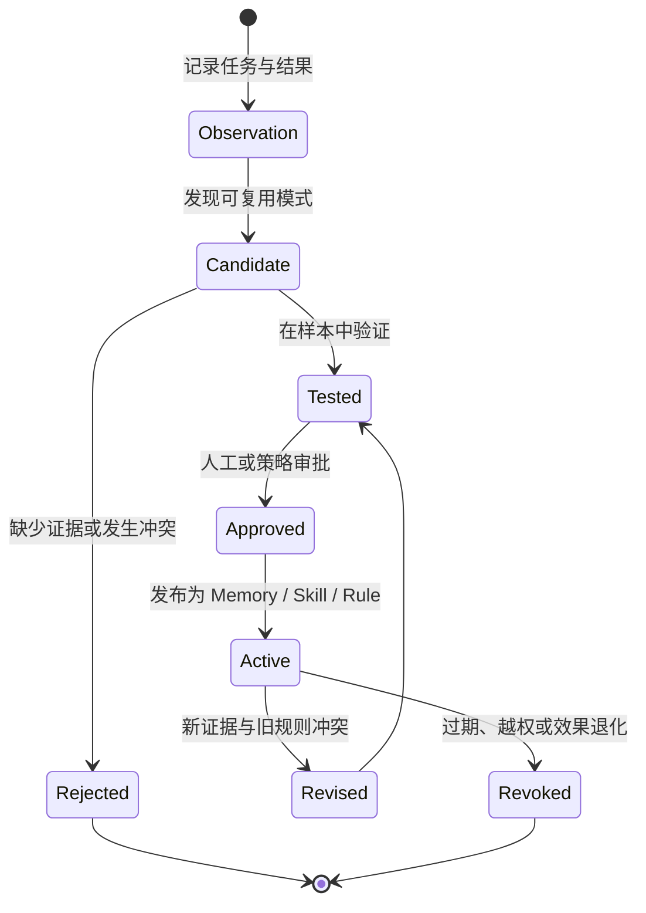

> 系列：[1. 全局地图](/writing/composable-agent-harness-architecture/)｜[2. Hermes 内核](/writing/hermes-agent-architecture-deep-dive/)｜[3. Hermes 工具](/writing/hermes-agent-runtime-services/)｜[4. Hermes 积累](/writing/hermes-agent-memory-governance/)｜[5. Pi 内核](/writing/pi-architecture-deep-dive/)｜[6. Pi Session](/writing/pi-session-extension-architecture/)｜[7. Pi 扩展](/writing/pi-durable-harness-governance/)｜[8. ECC 编译](/writing/ecc-architecture-deep-dive/)｜[9. ECC 运行](/writing/ecc-hook-runtime-memory/)｜[10. ECC 治理](/writing/ecc-memory-supply-chain/)｜[11. 整体思考](/writing/composable-agent-harness-synthesis/)

前十篇从三套系统进入同一个问题。Hermes 把可塑性放在长期 Agent 与经验积累，Pi 把它放在最小内核与扩展边界，ECC 把它放在工程资产与跨 Harness 投射。现在可以暂时放下项目名字，重新回答：一个可塑的 Agent Harness，究竟应该允许我们改变什么？

## 可塑性不是组件数量，而是重新分配决定权

能够安装一百个插件，不等于系统真正可塑。如果插件只能增加工具，却不能影响上下文装配、执行前检查、结果验证和失败恢复，那么它改变的是能力表面，不是工作方式。

更准确地说，可塑性是系统把多少决定权从核心维护者交给部署者和使用者：可以换模型，也可以决定模型看到什么；可以加工具，也可以规定工具在什么边界内运行；可以保存经验，也可以决定经验何时获得更高信任。

决定权转移一定伴随责任转移。接口开放得越深，兼容、安全、评测和恢复就越不能只由项目作者兜底。这也是为什么“开放”本身不是成熟度：它只是说明谁有权改变系统，还没有说明谁能证明改变之后仍然可靠。

## 稳定内核与可变策略，必须被明确画出来

Hermes、Pi 与 ECC 的共同启发，不是所有机制都应该插件化，而是变化速度不同的东西不应焊在一起。

模型协议持续变化，产品策略需要快速实验，团队经验不断演进；但事件顺序、写入所有权、身份边界和恢复语义必须相对稳定。如果稳定机制跟着每个工作流变化，系统无法形成兼容契约；如果可变策略被写死在核心，使用者只能通过 Fork 改造。

可以用一个简单标准判断边界：**删除某项策略之后，系统还能否正确记录发生过什么，并安全回到可继续执行的状态？** 如果不能，它可能属于机制；如果能，它更适合成为扩展、Profile、Skill 或 Hook。

## 事件是可塑系统的真正脊柱

三套架构表面差异很大，底层却都依赖明确的事件边界。Pi 用流式事件连接模型、工具、Session、扩展与 UI；ECC 在 PreToolUse、PostToolUse 等确定性位置运行 Hook；Hermes 需要让 Gateway、Agent Loop、工具后端和 Session 对中断与续跑达成一致。

事件的意义不只是解耦模块。它回答了三个可靠性问题：动作何时真正发生，结果何时已经持久化，扩展失败是否会改变主任务。没有这些契约，插件越多，系统越难知道一次任务到底停在了哪里。

所以，建设 Harness 时应先定义少量稳定事件，再开放插件 API。先有“发生了什么”的事实语言，才有“遇到这件事应该怎么做”的策略生态。

## 历史是事实账本，上下文只是当前投影

长期 Agent 最危险的捷径，是把“记住”理解为把旧文本继续塞进 Prompt。Hermes、Pi 和 ECC 都从不同角度否定了这条路径：Session 保存事实，Memory 保存可推翻结论，Skill 保存方法，索引和 Compaction 只是面向当前任务的投影。

这意味着系统至少需要两条数据链：

- 一条不可被摘要替代的证据链，保存事件、来源、版本与执行结果；
- 一条可以重建的上下文链，按照身份、任务、预算和有效时间选择内容。

当结果出现争议时，人类应能从投影回到事实；当检索策略变化时，事实不需要跟着重写。没有这层分离，“长期记忆”很容易变成无法审计的长期偏见。

## 经验必须经过信任晋升，而不是自动沉淀

Hermes 的 Artifact Learning 和 ECC 的 Instinct、Skill 晋升都触碰到同一个核心：系统可以从任务中产生经验候选，但不应该让一次成功自动改写未来行为。

*图 1｜经验从观察到正式资产需要证据、测试、审批、版本与撤销，而不是一次任务后的自动写入。*

这个状态机揭示了“自我进化”的真实工程形态：变化对象最好是可读、可比较、可回滚的 Artifact，而不是模型权重之外又增加一层不可见状态。经验拥有来源和版本，组织才可能知道 Agent 为什么改变了行为。

## 开放系统的总成本，常常晚于第一次运行出现

开源 Harness 很容易在首次演示中显得便宜：代码可见，模型可换，功能可装。但真正的成本在几个月后出现——Provider 协议变化、扩展之间冲突、旧 Session 无法迁移、记忆污染、工具权限扩大、项目维护停滞。

因此，评估可塑性不能只数扩展点，还要检查五项长期责任：

| 责任 | 必须回答的问题 |
| --- | --- |
| 兼容 | 核心事件和资产格式怎样演进？ |
| 隔离 | 第三方扩展、工具和凭证运行在哪里？ |
| 所有权 | 系统写入了哪些文件，谁可以修改和删除？ |
| 证据 | 一次策略升级如何证明比旧版本更好？ |
| 退出 | 项目、模型或 Harness 更换后，哪些资产可以迁移？ |

Hermes 的挑战是丰富能力带来的运行与权限面；Pi 的挑战是把自由补成团队可用的默认基线；ECC 的挑战是跨 Harness 能力不对等与资产规模治理。它们的风险不同，但都说明同一件事：可塑性收益不能脱离持续维护能力计算。

## 一套更稳妥的建设顺序

如果正在建设内部 Agent 平台，可以从三套架构中提炼出一条比“先做插件市场”更可靠的路径：

1. **先定义事实协议。** 明确消息、工具动作、结果、错误、中断和恢复怎样记录。
2. **再划出硬边界。** 身份、目录、网络、凭证、预算与不可逆动作不能只依赖 Prompt。
3. **把当前上下文做成投影。** Session、Memory、Skill 与项目规则按生命周期分层，不共享一个无边界知识池。
4. **在真实决策点开放策略。** 输入前、模型前、工具前后、压缩和发布，比笼统插件回调更有价值。
5. **给资产建立生命周期。** 安装、更新、冲突、验证、回滚和卸载必须拥有状态记录。
6. **最后才扩大自治。** 只有稳定任务在回归样本中持续通过，才扩大工具、时间与权限范围。

这条顺序看起来比堆功能慢，却能避免平台在最早阶段积累不可见的协议债和信任债。

## 最后的判断：好的可塑性会让变化有边界

Hermes 提醒我们，Agent 的长期价值来自任务之间的连接；Pi 提醒我们，不应把某一种产品意见伪装成所有工作流都需要的机制；ECC 提醒我们，组织经验只有变成可安装、可执行、可验证和可回滚的资产，才能真正跨模型迁移。

把三者合在一起，可塑 Agent Harness 的目标就不再是“任何东西都可以替换”，而是：稳定事实与恢复机制，把变化留在清晰边界；开放决定权，也暴露随之而来的责任；允许系统积累经验，但不允许经验绕过证据获得权力。

所以，可塑性的终点不是配置更多，而是让变化变得可理解、可验证、可撤销。一个系统真正成熟的标志，也不是它能被改造成多少种形态，而是每次改造之后，我们仍然知道发生了什么、为什么可信，以及失败时怎样回来。

---

上一篇：[ECC 治理](/writing/ecc-memory-supply-chain/)。

本系列到此完成。带着“哪些机制必须稳定，哪些策略应该开放”回到[第一篇的全局地图](/writing/composable-agent-harness-architecture/)，三种架构的差异会从项目特性转化为可以复用的设计判断。
