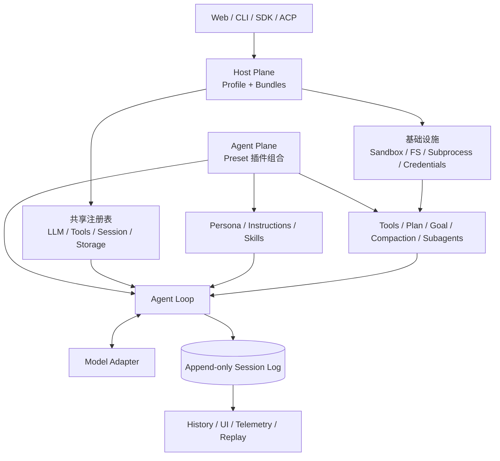
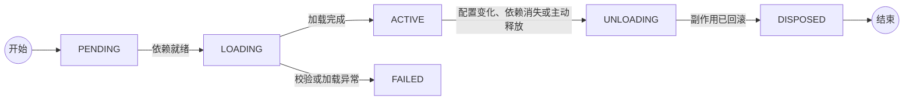
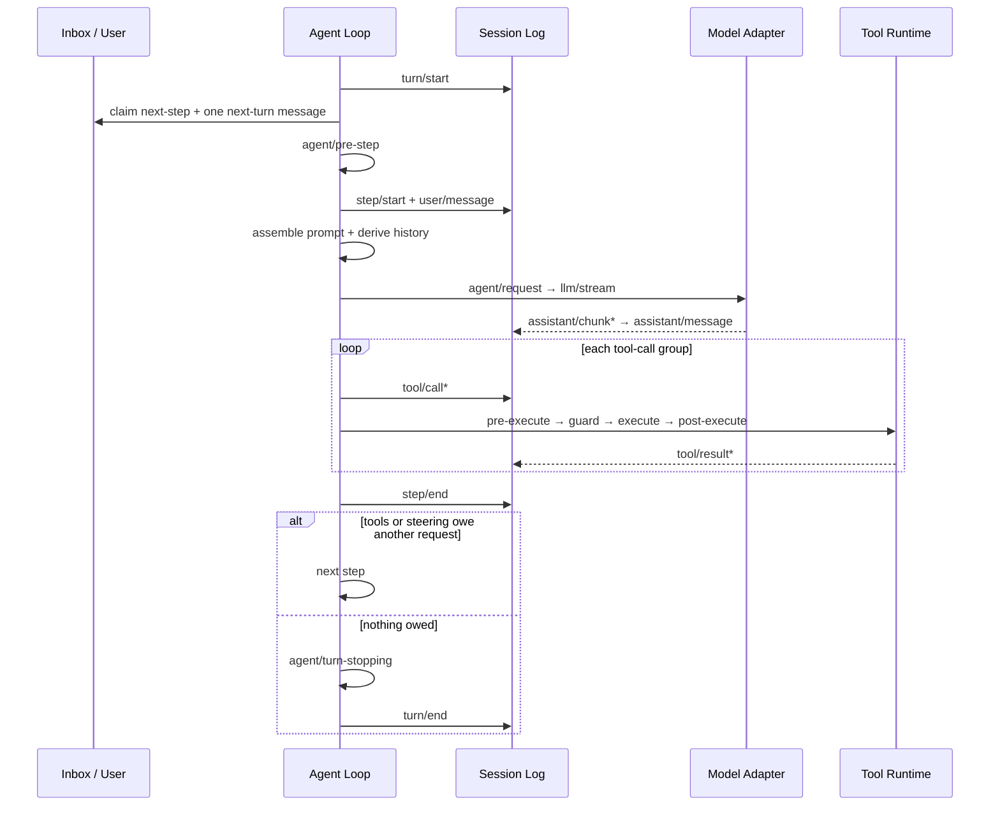
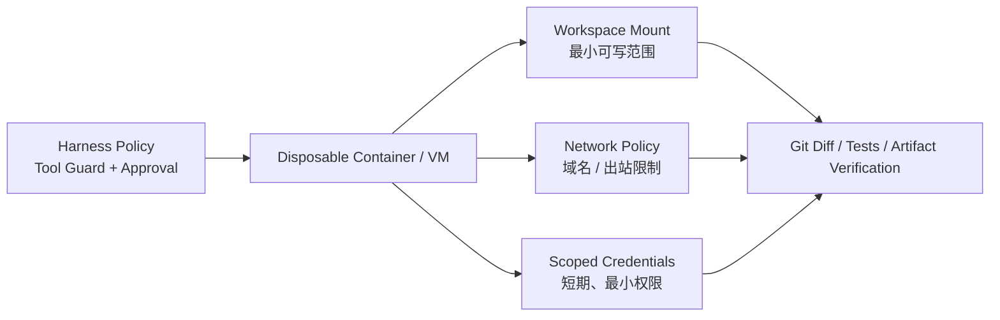

很多 Coding Agent 的扩展方式，是在一个固定主程序外围增加工具、Hook 或 MCP Server。DeepSeek Harness 选择了更激进的答案：**模型适配器、工具注册表、Session、Agent Loop、Sandbox、Compaction、Subagent、调度乃至 UI，全部进入同一套插件组合系统。**

这意味着它想解决的并不是“怎样再做一个会写代码的 Chatbot”，而是一个更底层的问题：当 Agent 的模型、工具、权限、记忆和工作流都在快速变化时，运行时怎样允许它们被独立替换、局部隔离、在线重组，而且在卸载后不留下脏状态？

DeepSeek 给出的公式是：

```text
Agent = Model + Harness
```

其中模型负责推理和决策，Harness 负责把真实世界变成模型可以观察、行动和验证的环境。DeepSeek Harness 的真正产品，不是某一个默认 Agent，而是**生成不同 Agent 的运行时**。

> [!IMPORTANT]
> 结论先行：DeepSeek Harness 最有价值的设计不是“Everything is a Plugin”这句口号，而是它把插件进一步约束成了可回滚的 Effect、可响应依赖变化的 Service、可重放的 Session Event，以及只能收紧权限的 Guard。它因此更接近 Agent Runtime 或 Agent OS 的内核，而不是 Claude Code、Codex 的简单开源复刻。

本文以 2026-09-04 的官方仓库为基线，源码快照为 [`76fda72`](https://github.com/deepseek-ai/deepseek-harness/tree/76fda729799fe9b3848dbe2c211d4b231032b81e)。项目仍处于 **developer preview**，官方明确提示会发生破坏性变更；下文分析架构方向，不把当前接口视为稳定标准。

## 一、先看全景：DeepSeek Harness 有两棵树

理解这套系统，最重要的第一步是不要把“插件”想成浏览器扩展。它更接近依赖注入容器、Actor 生命周期、事件总线和配置系统的结合体。

一个运行中的 `dsh` 同时存在两种结构：

1. **组合树**：当前安装了哪些插件，它们依赖哪些 Service，属于哪个作用域；
2. **事件流**：用户、模型和工具已经发生了什么，怎样从历史恢复当前状态。

前者回答“这个 Agent 现在拥有什么能力”，后者回答“这个 Agent 到目前为止经历了什么”。



这种双重结构解释了 DeepSeek Harness 的很多设计：能力可以热插拔，但历史不能随意改写；同一进程可以运行工具集不同的 Agent，但它们仍共享受控的宿主基础设施；UI 不需要窥探循环内部，而可以从事件流重建界面。

官方[架构文档](https://github.com/deepseek-ai/deepseek-harness/blob/master/docs/architecture.md)把核心脊柱拆成六个包：

| 核心包 | 责任 | 关键接口 |
| --- | --- | --- |
| `session` | 追加写入的 Session Event 日志 | `ctx.sessions` |
| `system-prompt` | System Prompt、运行时上下文与工具 Schema 装配 | `ctx.systemPrompt` |
| `tools` | 作用域化工具注册与受控执行流水线 | `ctx.tools` |
| `agent` | 公共 Agent 接口、注册表和事件词汇 | `ctx.agents` |
| `agent-loop` | 默认 Turn / Step 驱动器 | `ctx.agentLoop` |
| `scope` | Agent 级能力隔离与继承 | 无全局 Service |

这里最克制的一点是：`agent` 只定义公共契约，默认循环放在 `agent-loop`。UI、Hook、编排器依赖 `Agent` 接口，而不依赖具体 Loop；因此更换 Loop 不要求整个系统跟着改。

## 二、Cordis：把依赖注入升级成“时空可组合性”

DeepSeek Harness 底层使用 Cordis。配套论文 [A Programming Paradigm for Spatiotemporal Composability](https://arxiv.org/abs/2608.25512)把动态组合拆成两个正交问题：

- **时间可组合性**：组件移除时，能否完整撤销它造成的副作用；
- **空间可组合性**：组件能否声明自己需要什么，并随依赖的出现和消失自动激活或停用。

这两个词听起来抽象，但对应的是插件系统里最常见的两类事故。

第一类是“卸载了，但没卸干净”：Event Listener、Timer、Watcher、Socket 或工具注册仍然存活，下一版插件加载后出现重复回调和幽灵状态。Cordis 把注册行为视为 **Effect**；插件卸载时，框架反向执行 Disposer。`ctx.on()`、子插件、Service 和 Harness 注册表本身已经是受管 Effect，外部资源则必须放进 `ctx.effect()`。

第二类是“加载顺序决定命运”：消费方比 Provider 先启动就报错，Provider 热更新又让引用失效。Cordis 让插件通过 `inject` 声明依赖；缺少 Service 时 Fiber 进入 `PENDING`，依赖出现后再激活，依赖消失时则卸载相关 Effect。它不是在启动时做一次依赖注入，而是在整个运行期持续维护依赖关系。



Cordis 的 Fiber 状态机和自动清理机制见官方[生命周期教程](https://github.com/deepseek-ai/deepseek-harness/blob/master/docs/cordis-tutorial/02-lifecycle-and-effects.md)。它带来一个很深的架构变化：**扩展不再只是调用 Host API，而是在一个受生命周期管理的 Context 中声明能力。**

### Waterfall：插件怎样共同决定一次行动

普通事件广播只能通知，Agent Runtime 还需要拦截、改写和否决。Cordis 为此提供 `waterfall`：每个 Listener 接收 `next()`，可以把决定交给下游、包装下游结果，也可以不调用 `next()` 而直接短路。

DeepSeek Harness 用 Waterfall 处理 `agent/pre-step`、`agent/request`、`llm/stream`、`tools/pre-execute`、`tools/execute`、`tools/post-execute` 和 `approval/request`。它很像 Koa 中间件，但被纳入类型系统、作用域和插件生命周期。

代价也很明确：一个本想“只记录日志”的 Listener 如果忘记调用 `next()`，就会吞掉整个下游行为。官方[事件教程](https://github.com/deepseek-ai/deepseek-harness/blob/master/docs/cordis-tutorial/04-events.md)把这条纪律写成了常驻规则。可组合性没有消灭复杂度，只是把复杂度从隐式调用顺序变成显式协议。

## 三、Profile、Bundle 与 Preset：应用配置和 Agent 配方是两回事

DeepSeek Harness 没有把所有配置塞进一个巨大 YAML，而是分成三个层级：

- **Profile**：一个可启动的应用形态，例如 `web`、`headless`、`sdk`、`sdk-minimal`、`acp`；
- **Bundle**：可复用的一组 Cordis 配置行，Profile 按顺序叠加多个 Bundle；
- **Preset**：单个 Agent Session 使用的 Persona、工具、Skills 和上下文策略组合。

Profile 的覆盖顺序是：Profile 声明的 Bundles → Profile 自己的 `cordis.patch.yml` → Harness Home 全局 Patch → 命令行 `--patch`。Patch 通过稳定 `id` 替换整行配置，而不是对字段做深合并。这牺牲了一点简洁，换来了更明确的最终状态和更少的“继承后到底是什么”问题。

更值得注意的是 **Host Plane / Agent Plane** 的边界：

- Host Plane 放跨 Session 共享或必须由宿主控制的能力，如注册表、持久化、Sandbox、Approval、模型路由和 Subagent Provider；
- Agent Plane 放某个 Session 才应该拥有的 Persona、Prompt Section、Tools、Skills、Plan、Compaction 和委派入口。

Preset 在独立 Scope 中挂载，作用域内的注册会覆盖同名全局注册。需要私有 Service 的插件组必须声明 `isolate` Realm，否则 Service 会泄露到 Root Context，与其他 Preset 冲突。这个限制并非代码风格偏好，而是多租户 Agent 组合的基本隔离规则。

官方目前附带四种 Preset：

| Preset | 核心定位 | 模型可见能力 |
| --- | --- | --- |
| `standard` | 完整 Coding Agent | 文件、Shell、Web、Skills、Plan、Goal、Subagent、Workflow 等 |
| `ptc` | 用代码组合工具 | 能力接近 Standard，但用 `run_code` + TypeScript SDK 聚合工具调用 |
| `minimal` | 最小基准与简单编码 | 持久 Shell + `str_replace_editor`，无 Compaction 和动态运行时上下文 |
| `cordis` | 创造与修改 Agent | Standard 能力 + 运行时检查、临时插件和 Preset 创作能力 |

Preset 的组合在 Session 产生任何消息或工具调用之后就不能再切换，因为旧日志里可能包含新工具集无法解释的调用。这个细节很重要：**能力配置可以动态化，但一次对话的语义世界必须稳定。** 具体机制见 [`dsh-agent-presets`](https://github.com/deepseek-ai/deepseek-harness/blob/master/packages/preset/agent-presets/README.md)。

## 四、Agent Loop：Turn 是业务承诺，Step 是一次模型调用

很多 Agent 框架把循环写成一个看似简单的 `while (toolCalls.length)`。DeepSeek Harness 的循环更像一个事件溯源状态机。

它明确区分：

- **Step**：一次模型请求，以及该响应触发的一组工具执行；
- **Turn**：从一条用户输入被认领，到所有工具债务和中途追加输入都被处理完，包含零个或多个 Step。

一个 Turn 的主流程如下：



这套定义解决了几个容易被忽略的边界问题：

- 用户在 Agent 工作时追加的 Steering，可以在最近的 Step 边界进入，而不必粗暴终止整个任务；
- 仅注入 Context 不会唤醒空闲 Agent，它等待下一条真正输入；
- 被策略拒绝的第一步仍会写入 `turn/start` / `turn/end`，所以“尝试过但没有调用模型”也是可审计事实；
- 取消会携带 `user`、`parent`、`hook` 或 `disposed` 原因，并最终进入 Turn 的结束记录；
- 并行安全工具进入有界并发池，Exclusive 工具则形成顺序屏障。

默认 `agent-loop` 只负责“调用模型、执行工具、继续循环”。重试、Compaction、目标推进和停止规则都通过事件或 Capability 插件挂上去。官方[`agent-loop` 文档](https://github.com/deepseek-ai/deepseek-harness/blob/master/packages/core/agent-loop/README.md)甚至把自己称为系统中唯一的具体 Loop 实现——“唯一”并不表示不可替换，而是其他包不应偷偷再实现第二套循环语义。

## 五、Session：不是聊天记录，而是运行时的事实账本

DeepSeek Harness 最值得借鉴的设计之一，是把 Session 定义为追加写入的 `SessionEvent` 日志。模型历史不是另一份可变数组，而是从日志投影得到：

```text
Durable Session Events
        │
        ├── deriveMessages() ──> Model History
        ├── projection fold ───> UI / Task / Permission / Token State
        ├── replay ────────────> Resume / Fork
        └── export ────────────> Transcript / Telemetry / Audit
```

它遵循一条很强的约束：**Model-visible means logged。** 任何进入模型请求的信息，都必须能由持久日志重建；运行时 Invariant 会检查请求是否可重构。原始 `assistant/chunk` 也被保留，因此 UI 可以重放流式输出，而不是只得到最终文本。

事件大致分三类：

- `turn/*`、`step/*`、`user/message`、`assistant/*`、`tool/*`：模型交互事实；
- `approval/*`、`compaction/*`、`agent/inbox/*` 等：运行时控制与审计事实；
- `request/header`、`request/context`：模型路由、上下文容量和请求系列的可重构快照。

这比“保存 messages 数组”复杂得多，却带来四个关键收益：

1. **恢复**：进程崩溃后可以识别未闭合 Turn，并在恢复层补写中断语义；
2. **Fork**：子 Session 可以从确定的事件边界继承历史；
3. **多视图一致性**：模型上下文、UI、遥测和审计来自同一事实源；
4. **插件扩展**：新能力通过 Declaration Merging 增加 Event 类型，而不必篡改一份中心状态对象。

它也意味着存储不再只是 I/O 细节。事件顺序、身份、提交边界、Log-only 事件与 Model Surface 的区分，全部成为公共架构。详见官方 [Session 子系统说明](https://github.com/deepseek-ai/deepseek-harness/blob/master/docs/subsystems/session.md)。

## 六、工具系统：先冻结事实，再允许策略介入

工具调用是 Agent 最危险也最容易失真的边界：模型看到的参数、UI 展示的参数、审批时判断的参数和实际执行的参数，必须是同一个事实。

DeepSeek Harness 的做法是先把参数解析成无损 JSON、物化并冻结，再进入策略流水线。参数不能被中途改写，因为一旦改写，历史、审计、UI 和执行就会出现四个版本。

一次调用经过：

```text
model tool call
  → materialize & freeze arguments
  → tools/pre-execute     // allow / deny / ask
  → monotonic guards      // 只能新增 deny，不能重新 allow
  → tools/execute         // 超时、追踪等 around wrapper
  → tool body
  → tools/post-execute    // 接受、替换投影或反馈阻断
  → finalizeContent
  → tools/result          // 冻结后的权威结果
  → durable tool/result
```

这里有三个成熟的设计信号。

### 1. Tool Definition 同时约束输入、规范输出和展示

一个工具不只声明名字、描述和参数，还必须声明 Canonical Output Schema，以及如何把规范值渲染成模型可见的 `ContentBlock`。运行时回调、超时、并发安全分类和 UI Presenter 永远不会泄漏给模型，模型只看到白名单生成的 Schema。

这样一来，“工具返回了对象，但模型只该看到摘要”成为显式投影；原始结构可以在执行链中保持类型化，展示也可以在 Replay 时纯函数重建。

### 2. Guard 只能单调收紧权限

`tools/pre-execute` 是可排序的插件策略，适合 Allow / Deny / Ask。随后执行的 `ToolGuard` 刻意没有 Allow 返回值：它只能不表态或给出拒绝原因。于是无论 Listener 顺序如何，一个安全 Guard 的拒绝都不能被后加载插件翻回允许。

这是“万物插件”架构不可缺少的补丁：扩展性允许多方参与决策，**单调策略**保证安全边界不会因为组合顺序意外变宽。

### 3. 并行是工具自己的可证明属性

只有工具的 `isConcurrencySafe(args)` 明确返回 `true`，调用才能和兄弟调用重叠；省略、异常或任何非 `true` 结果都按 Exclusive 处理。并行因此不是模型一句“请并行”就能获得的权力，而是工具作者对共享状态和副作用作出的声明。

这些细节都记录在官方 [Tools 子系统](https://github.com/deepseek-ai/deepseek-harness/blob/master/docs/subsystems/tools.md)中。它们反映出 DeepSeek Harness 的设计重心：模型协议要短，Host 侧契约要严格。

## 七、PTC：把五次工具往返压缩成一段程序

PTC，即 Programmatic Tool Calling，是 DeepSeek Harness 区别于普通 Native Function Calling 的另一条路线。

在 Native 模式里，模型每调用一组工具，就要等待结果进入上下文，再发起下一次推理。如果任务是“搜索十个文件、读取命中项、过滤内容、汇总结构化结果”，大量中间数据和模型往返并不产生新的推理价值。

PTC 模式只向模型暴露 `run_code` 和自动生成的工具 SDK。模型写一段 TypeScript，把控制流、循环、并发和中间变量留在代码运行时，只有外层结果进入对话上下文：

```ts
const hits = await tools.fs_search({ pattern: "AgentLoop" })
const files = await Promise.all(
  hits.slice(0, 8).map((hit) => tools.fs_read({ path: hit.path }))
)

return files
  .filter((file) => file.content.includes("turn/start"))
  .map((file) => ({ path: file.path, relevant: true }))
```

它的潜在收益是：减少模型往返、避免大量中间结果污染上下文，并让确定性控制流回到代码。PTC Preset 因此关闭了通用 `workflow` 工具，避免同时给模型两个重叠的编排表面。

但不要把 Worker Thread 误读成安全沙箱。官方[`code-runtime-worker-thread` 文档](https://github.com/deepseek-ai/deepseek-harness/blob/master/packages/code-runtime/code-runtime-worker-thread/README.md)明确把它定义为 **containment, not a security boundary**：每次运行使用新 Worker、空环境、堆限制、计算时间和墙钟时间限制，也能硬终止死循环；但模型代码仍可访问 Node API，信任等级接近 Bash，派生的 OS 进程甚至可能在 Worker 终止后继续存在。

因此 PTC 的本质是**性能与上下文工程机制**，不是权限机制。它是否真的提高任务成功率，还需要针对具体模型和任务做评测。官方仓库当前只提供[运行 Benchmark 的说明](https://github.com/deepseek-ai/deepseek-harness/blob/master/BENCHMARK.md)，没有公布足以支持横向性能结论的结果，所以不能仅从架构推导收益数字。

## 八、上下文工程：日志保持完整，Surface 可以被替换

事件溯源系统会遇到一个现实冲突：审计要求历史完整，模型上下文要求历史变短。DeepSeek Harness 用“完整 Log + 可变 Surface Projection”解决。

Compaction 不删除旧事件，而是：

1. 写入 `compaction/start`，形成可检测的事务锁；
2. 选取工具调用/结果配对完整的一段 Surface；
3. 生成摘要并写入 `compaction/summary`；
4. 追加一个带 `replace` 操作的 `user/message`，在模型视图中替换旧区间；
5. 最后写入 `compaction/end`。

如果进程在中间崩溃，存在 Start 而没有 End，恢复逻辑就知道这不是一次成功完成的压缩。旧内容仍然存在于 Canonical Log，只是在当前模型 Surface 中被摘要遮蔽。

在生成摘要前，系统还可以对超长 Tool Result 做确定性的头/尾保留与中段裁剪；随后重新测量 Token 压力，只有必要时才进行模型摘要。完整机制见 [Compaction 子系统](https://github.com/deepseek-ai/deepseek-harness/blob/master/docs/subsystems/compaction.md)。

Prompt 装配也服务于缓存稳定性。固定 Identity、Persona、Prompt Sections 和工具 Schema 按确定顺序形成前缀；运行时状态则作为有来源的 User-role Snapshot 进入历史。Preset 在 Session 生命周期内保持不变，同一 Preset 的 Agent 共享稳定组合，这有利于 KV Cache 复用。官方 System Prompt 文档也明确记录每项贡献对 Token 和 Cache 的影响，见 [`dsh-system-prompt`](https://github.com/deepseek-ai/deepseek-harness/blob/master/packages/core/system-prompt/README.md)。

这套策略的核心不是“尽量压缩”，而是把三种需要分开：

- 审计需要无损事实；
- 模型需要有限、高信号的当前视图；
- Provider Cache 需要稳定前缀。

## 九、Capability Seam：为什么更换 Sandbox 不该修改 Bash

“Everything is a Plugin”很容易退化成一堆互相引用的 NPM 包。DeepSeek Harness 用 Capability Seam 约束插件之间的结构。一个完整 Seam 通常包含三种角色：

1. **Service Definition**：稳定、依赖较少的能力接口；
2. **Service Provider**：本地、远程或第三方实现；
3. **Consumer**：把能力暴露给模型、UI 或其他系统。

以文件系统为例，模型工具是 Consumer，`ctx.fs` 是抽象 Service，本地目录或 E2B 是 Provider。Shell、PTY 和 LSP 又共享同一个 Subprocess 执行世界。将 Provider 换成远程 Sandbox 时，消费者不需要各自增加一套“remote mode”。

同样的模式贯穿：

- LLM：统一流式词汇 + DeepSeek / pi-ai 等 Adapter；
- Persistence：Session 写入契约 + JSONL / SQLite Provider；
- Web：统一搜索与抓取 Service + 不同 Provider + 模型工具；
- Subagent：统一委派契约 + Spawn / Fork / ACP / Codex / Claude Code / dsh SDK Provider；
- Code Runtime：程序执行契约 + Worker Thread / 未来容器 Provider + PTC Consumer。

这是一种运行时层面的依赖倒置。它比“接口 + 实现”多了生命周期、Scope、事件和配置组合，也比为每个工具写 `if (remote)` 更能控制复杂度。官方为此维护了完整的 [Capability Seams 图谱](https://github.com/deepseek-ai/deepseek-harness/blob/master/docs/capability-seams.md)。

## 十、多 Agent：先统一委派语义，再叠加团队协作

DeepSeek Harness 把 Subagent 和 Agent Team 分成两层。

### Subagent 是能力接口

`ctx.subagents` 可以同时挂载多个 Provider：

- `spawn`：创建全新上下文的进程内子 Agent；
- `fork`：从父 Agent 已完成历史复制上下文；
- `acp`：通过 Agent Client Protocol 委派给外部 Agent；
- `codex` / `claude-code`：调用真实的 Codex 或 Claude Code；
- `dsh-sdk`：启动另一个完整 Harness Runtime。

Provider 可以是一轮即结束，也可以是可继续的 Child。父 Agent 通过同一接口发现、发送后续消息、中断和读取状态，而不需要知道子方运行在当前进程、另一个进程还是另一个产品中。详见官方 [Subagent 包总览](https://github.com/deepseek-ai/deepseek-harness/blob/master/packages/subagent/README.md)。

### Agent Team 是有状态协作域

实验性的 Agent Team 在 Subagent 之上增加：

- 持久 Roster；
- 可恢复 Mailbox；
- 共享 Task DAG；
- 基于 Revision 的 Compare-and-set 更新；
- 对写入路径重叠的提示。

消息先完整写进 Lead Session，只有目标 Session 记录后才确认送达；“已排队但未送达”因此可以在 Replay 时恢复。任务的 `writeScopes` 目前只是建议性路径前缀，不是锁，这一点避免了把提示误当隔离。

它和普通“并行调用多个 Agent”最大的不同是：团队状态也进入可重放日志。代价则是协调协议、恢复语义和共享工作区冲突都变成平台责任。官方仍将它标为 Experimental，见 [Agent Teams 文档](https://github.com/deepseek-ai/deepseek-harness/blob/master/docs/subsystems/agent-team.md)。

## 十一、安全架构：插件自由必须由不可逆的边界兜底

DeepSeek Harness 的工具流水线已经体现了 Fail-closed 思想：没有审批通道、审批者异常、返回非法结果或请求被取消，都不能放行动作；只有 `allowed-once` 是授权。

默认权限 Preset 把两个独立旋钮组合起来：

| 权限层 | 可选值 | 控制什么 |
| --- | --- | --- |
| Sandbox Mode | `read-only` / `workspace-write` / `danger-full-access` | 子进程的文件写入范围 |
| Approval Policy | `ask` / `never` | 风险动作是否询问；`never` 表示请求直接拒绝，不是自动允许 |

本地 Sandbox 在 Linux 使用 bwrap / Landlock，在 macOS 使用 Seatbelt，在 Windows 使用 ACL Restricted Token。Provider 必须返回实际受限的命令行，失败时关闭执行；不允许在受限模式下悄悄退回裸命令。

但边界必须准确表达。官方 [Sandbox 文档](https://github.com/deepseek-ai/deepseek-harness/blob/master/docs/subsystems/sandbox.md)明确说明，当前 `SandboxMode` **只治理文件副作用，不覆盖网络和进程可见性**；部分旧 Landlock ABI 和 Windows ACL 场景只能报告 `partial` enforcement。公开 Web Fetch 默认不逐次审批，虽然 Provider 会阻止访问非公开目标，但模型仍可能向公开 URL 发送数据。

更高风险的两个模式是：

- PTC 的 Worker Thread 只是资源隔离，不是安全边界；
- `cordis` 创造模式允许模型检查和修改自己运行的插件组合，信任等级等同 Shell Access。

官方 [Safety Notice](https://github.com/deepseek-ai/deepseek-harness/blob/master/SAFETY.md)明确写着：项目尚未经过安全审计，不应被视为安全或生产就绪；对于不可信工作负载，应使用一次性 VM、容器或专用环境，并遵循最小权限。

所以正确的生产拓扑不是“相信内置 Sandbox”，而是：



Harness 内策略用于表达业务意图，操作系统或云基础设施负责硬隔离，Git / 测试 / 外部状态读取负责验证结果。三者缺一不可。

## 十二、这套架构真正先进在哪里

如果剥掉品牌和功能列表，DeepSeek Harness 有五个值得其他 Agent 平台借鉴的设计判断。

### 1. 把 Harness 当作动态软件系统，而不是提示词容器

Agent 会运行数小时、跨 Session、接入外部工具，也会在线切换能力。它已经具有操作系统式的生命周期问题。Cordis 正面处理组件卸载、依赖消失、隔离 Realm 和配置热更新，而不是假设进程只启动一次。

### 2. 把可观察性放进状态模型，而不是事后加日志

Turn、Step、Chunk、Tool、Approval、Compaction 和 Inbox 都是领域事件。恢复、UI、Telemetry 和审计从同一流派生，减少了“真实执行一套、监控看到另一套”的机会。

### 3. 可扩展策略之后必须有单调 Guard

插件可以提出 Allow / Deny / Ask，但最终 Guard 只能收紧。这是一个很通用的安全原则：在开放组合系统中，越接近执行边界，决策越应该从“可覆盖配置”收敛为“不可逆约束”。

### 4. 把模型上下文看成日志的 Projection

Session 保存事实，Compaction 只改变模型 Surface；PTC 把中间计算留在执行环境；Prompt Registry 维护稳定前缀。记忆、审计、成本和缓存因此不必共享一份脆弱的 `messages` 数组。

### 5. 允许 Agent 修改 Agent，但显式提升信任等级

`cordis` Preset 展示了一个有野心的方向：Agent 不只是使用工具，还能检查和创作新的 Agent 组合。它没有把自修改包装成安全魔法，而是明确标注为 Shell-equivalent Trust。这种诚实比“自进化”口号重要得多。

## 十三、它目前还没有解决什么

架构新颖不等于产品成熟。当前至少有六个需要持续观察的问题。

### 1. 接口稳定性

项目处于 Developer Preview，兼容性破坏是公开承诺。包边界、事件格式、配置行和持久化版本都不应直接当作企业长期 API。

### 2. 复杂度预算

Cordis 的 Service、Effect、Fiber、Scope、Realm、Waterfall、Profile、Bundle、Preset 和 Seam 各自合理，但组合起来学习曲线很高。平台团队得到极强可塑性，普通团队也可能得到一套只有少数人敢改的运行时。

### 3. 动态组合的运维成本

Preset 新代际不会自动回收；复制出来的 Preset 是会漂移的快照；部分 HMR 只跟踪组合文件，而不会感知旁边 Skill 或 Asset 的变化。这些限制已经记录在官方 Preset 文档中，说明运行期可组合仍有资源回收和版本治理问题。

### 4. 安全仍依赖外层基础设施

文件 Sandbox 不等于网络隔离，Worker 不等于容器，Approval 不等于最小权限凭证。对生产多租户或不可信输入，仍需要容器、VM、网络策略和密钥 Broker。

### 5. 缺少公开性能证据

PTC、不同 Preset、Compaction 和 Multi-Agent 都可能显著改变成功率、延迟与 Token 成本，但官方仓库尚未给出系统性对照结果。现阶段应把它当成可实验平台，而不是已经证明优于成熟 Coding Agent 的产品。

### 6. “所有东西都可替换”会削弱默认答案

Claude Code 和 Codex 的价值之一，是为大多数用户提供强而一致的默认工程制度。DeepSeek Harness 把选择权交给部署者，也把评测、安全、兼容和维护责任一并交了出去。自由度是平台优势，也可能是最终用户的负担。

## 十四、如果要用它建设自己的 Agent，应该怎样分阶段

### 阶段一：固定组合，先证明单 Agent 闭环

从 `standard` 或 `sdk-minimal` 开始，不做运行时自修改。只保留少量高质量工具，建立明确的任务完成条件、测试和 Diff 审查。Session Persistence、取消、超时和失败恢复必须先于多 Agent。

成功标准不是 Demo 能调用工具，而是：任务中断后可以恢复，模型可见输入能够重构，所有外部修改都有验证证据。

### 阶段二：建立自己的 Capability Seams

把企业能力拆成 Definition / Provider / Consumer：例如“读工单”是稳定接口，Jira 或 Linear 是 Provider，模型 Tool 与后台 Workflow 是不同 Consumer。不要让模型工具直接绑死底层 SaaS SDK。

同时为每个 Tool 定义：输入 Schema、Canonical Output、模型投影、超时、并发属性、审批理由和最终 Guard。

### 阶段三：按风险划分 Preset

不要做一个拥有所有权限的万能 Agent。至少拆成：

- 只读分析 Preset；
- Workspace Write 编码 Preset；
- 可访问生产 API、必须审批的运维 Preset；
- 仅供平台开发者使用的 Creator Preset。

Preset 决定模型看到的能力，外层 Sandbox、网络和凭证策略决定它实际上能影响什么。

### 阶段四：用评测决定是否启用 PTC 与 Multi-Agent

PTC 适合工具调用链长、中间结果大、控制流容易用代码表达的任务；Native Calling 更适合每一步都需要模型重新判断的任务。Subagent 适合上下文隔离和独立探索，Agent Team 只在共享任务图与持续通信确有价值时启用。

对照实验至少记录：任务完成率、测试通过率、模型请求次数、总 Token、墙钟时间、人工接管次数、越权请求和恢复成功率。架构允许替换只是起点，评测才能决定哪种组合值得保留。

### 阶段五：把插件发布当作供应链发布

插件拥有与宿主同进程的能力，Preset 甚至可能等同 Shell 权限。企业需要锁定版本、审查来源、生成 SBOM、签名发布，并为配置变更保留可回滚记录。不要把“插件市场”当成低风险 Prompt 分享站。

## 十五、最终判断：DeepSeek 开源的是 Agent 的“可变结构”

DeepSeek Harness 最有野心的地方，是它没有把当前 Agent 产品形态当作终点。

今天的 Agent 需要 Shell、文件编辑和搜索；明天可能使用代码化工具调用、远程 Sandbox、另一种 Loop、不同的记忆投影和一组外部 Agent。传统产品通过不断给固定核心增加开关来适应变化，DeepSeek Harness 则试图让“核心由什么组成”本身成为配置。

这条路线的上限很高：研究者可以替换 Loop，平台团队可以构建自己的 Host Plane，企业可以为不同风险域装配不同 Preset，Agent 甚至可以在受控边界内创作新的 Agent。

它的风险也同样清楚：动态系统比固定产品更难理解、更难测试、更难治理。一个可卸载的插件不代表一套可运营的平台，一个有 Sandbox 接口的 Harness 也不代表已经安全。

因此，现阶段最准确的定位不是“DeepSeek 版 Claude Code”，而是：

> **一个用事件溯源保存事实、用 Capability Seam 解耦能力、用 Cordis 管理动态组合的开源 Agent Runtime 实验场。**

如果这套架构最终成立，未来 Agent 的关键配置单元可能不再是 Prompt，也不只是 Skill，而是一棵可以被版本化、评测、隔离和重组的运行时插件树。

---

资料截至 2026-09-04。主要依据为 DeepSeek 官方[项目仓库](https://github.com/deepseek-ai/deepseek-harness)、[架构文档](https://github.com/deepseek-ai/deepseek-harness/blob/master/docs/architecture.md)、[Safety Notice](https://github.com/deepseek-ai/deepseek-harness/blob/master/SAFETY.md)与 Cordis 论文；涉及 Experimental、Developer Preview 或未公开评测的能力均按官方状态标注。
