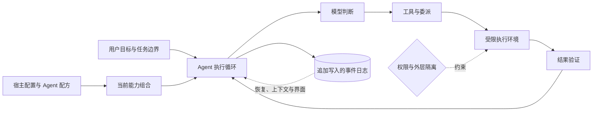

> DeepSeek Harness 架构系列：[1 · 系统全景](/writing/deepseek-harness-architecture/) · [2 · 组合与生命周期](/writing/deepseek-harness-composition/) · [3 · 状态与上下文](/writing/deepseek-harness-state/) · [4 · 执行与安全](/writing/deepseek-harness-execution/) · [5 · 深入思考](/writing/deepseek-harness-synthesis/)

> 阅读时间为估计，包含图表理解；动手实验另计。

> 版本边界：本系列沿用官方源码快照 [`76fda72`](https://github.com/deepseek-ai/deepseek-harness/tree/76fda729799fe9b3848dbe2c211d4b231032b81e)。它是 developer preview；以下解读不是稳定接口或生产安全承诺。

假设一个代码维护 Agent 开始时只读仓库，随后需要编辑、运行测试，并把专项检查委派给另一个 Agent。模型、工具和权限会变化，任务历史却必须能解释。

DeepSeek Harness 的核心问题不是“再加几个工具”，而是：**当运行时的组成可以变化，怎样让能力、事实和边界仍然一致？**

先不要背 Cordis、Preset 和 Surface 的名词。把系统看成三个工作对象就够了：能力组合决定现在能做什么；执行循环推进任务；事件日志记录已经发生什么。

## 总图：一个会行动的系统，需要两条不同主线

*图 1｜能力组合与事实记录共同支撑执行循环。矩形表示模块或步骤，圆柱表示存储，菱形表示判断；实线表示主路径，虚线表示约束、信息支撑或反馈。图为教学抽象，不代表全部实现细节。*

图里有两条不可混淆的主线：**配置形成能力，执行留下事实。** 更换工具实现是在改变未来怎么做；删除过去失败记录是在改变历史。前者可以是扩展机制，后者会破坏审计。

这里不是字面上的“两棵树”：一边是插件组合树，另一边是按时间追加的事件流。

## 每个模块负责什么

| 模块 | 责任 | 不应承担的责任 |
|---|---|---|
| 宿主层 | 存储、执行环境、模型与审批等基础能力 | 让每个任务自行放宽基础边界 |
| Agent 配方 | 当前任务的人设、工具、Skill 和上下文策略 | 替代操作系统隔离 |
| 执行循环 | 调用模型、执行工具、响应反馈、判断继续 | 把所有可选策略写死 |
| 事件日志 | 保存输入、调用、结果与控制事件 | 只保存最终聊天文本 |
| 上下文投影 | 从完整历史组织模型当前需要的信息 | 为压缩而销毁审计事实 |
| 验证与治理 | 核对产物、限制影响面、管理版本 | 用一条“允许”解释全部风险 |

官方把这些责任拆进 session、system-prompt、tools、agent、agent-loop 与 scope 等包。首篇只需要知道：公共 Agent 契约与默认循环实现是分开的，使用方不必依赖某一个固定 Loop。[架构基线](https://github.com/deepseek-ai/deepseek-harness/blob/76fda729799fe9b3848dbe2c211d4b231032b81e/docs/architecture.md)

## 用一次修复任务串起来

用户要求“修复登录超时，只改仓库，不部署”。宿主先提供文件系统、模型和受限执行环境；Agent 配方暴露读取、编辑与测试能力；循环读取报错、提出修改、检查结果；事件日志保存输入和工具结果；上下文较长时，模型看到压缩视图，但原始证据仍可追溯。

如果专项检查交给子 Agent，增加的是一个执行主体，不是自动增加权限。主任务仍需验收子方产物，工作区冲突和重复副作用也不会因为“多 Agent”自动消失。

## 全插件意味着什么，不意味着什么

它意味着模型适配器、工具、存储、循环和其他能力可以通过组合替换。这个设计适合研究不同运行策略和建设自己的平台。

它不意味着任何替换都兼容，不意味着插件卸载能撤回已经发送的消息，也不意味着拥有 Sandbox 接口就已经安全。未来几篇的机制，都是为这些限制服务的。

本系列中的核心包关系、生命周期、上下文与工具契约来自锁定源码；“适合什么团队”和“复杂度代价”是架构分析判断。

## 先做一张自己的责任表

用现有 Agent 系统填写：谁提供工具，谁决定暴露范围，谁记录事实，谁验证结果，谁能停止动作。如果这些问题都落在一个不可解释的循环里，就先理清职责，再考虑运行时热插拔。

我们最后要讨论的，不是“插件越多越先进”，而是：一个系统拥有更多变化方式之后，谁来为这些变化证明正确？

---

全景说明了哪些模块需要配合，却没说明它们怎样安全地出现和消失。下一篇进入插件生命周期：卸载一个插件，究竟意味着什么？

下一篇：[插件怎样出现、协作，并真正退出](/writing/deepseek-harness-composition/)。
