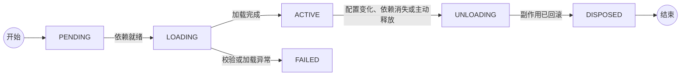

> 版本边界：本文采用官方源码快照 [`76fda72`](https://github.com/deepseek-ai/deepseek-harness/tree/76fda729799fe9b3848dbe2c211d4b231032b81e)。它是 developer preview；以下解读不是稳定接口或生产安全承诺。

DeepSeek Harness 用插件组合能力，用事件记录事实。这里先研究能力组合：假设团队给 Agent 加一个工单查询插件，之后升级其实现。你最希望避免的不是“没有加载成功”，而是旧监听器仍在、另一个任务突然用了错误配置。

下面从这类故障理解 Cordis，而不是从 API 名称开始。

## 每个模块负责什么

| 模块 | 责任 | 不应承担的责任 |
|---|---|---|
| 宿主层 | 存储、执行环境、模型与审批等基础能力 | 让每个任务自行放宽基础边界 |
| Agent 配方 | 当前任务的人设、工具、Skill 和上下文策略 | 替代操作系统隔离 |
| 执行循环 | 调用模型、执行工具、响应反馈、判断继续 | 把所有可选策略写死 |
| 事件日志 | 保存输入、调用、结果与控制事件 | 只保存最终聊天文本 |
| 上下文投影 | 从完整历史组织模型当前需要的信息 | 为压缩而销毁审计事实 |
| 验证与治理 | 核对产物、限制影响面、管理版本 | 用一条“允许”解释全部风险 |

官方把这些责任拆进 session、system-prompt、tools、agent、agent-loop 与 scope 等包。这里的关键区分是：公共 Agent 契约与默认循环实现是分开的，使用方不必依赖某一个固定 Loop。[架构基线](https://github.com/deepseek-ai/deepseek-harness/blob/76fda729799fe9b3848dbe2c211d4b231032b81e/docs/architecture.md)

## 用一次修复任务串起来

用户要求“修复登录超时，只改仓库，不部署”。宿主先提供文件系统、模型和受限执行环境；Agent 配方暴露读取、编辑与测试能力；循环读取报错、提出修改、检查结果；事件日志保存输入和工具结果；上下文较长时，模型看到压缩视图，但原始证据仍可追溯。

如果专项检查交给子 Agent，增加的是一个执行主体，不是自动增加权限。主任务仍需验收子方产物，工作区冲突和重复副作用也不会因为“多 Agent”自动消失。

## Cordis：把依赖注入升级成“时空可组合性”

DeepSeek Harness 底层使用 Cordis。配套论文 [A Programming Paradigm for Spatiotemporal Composability](https://arxiv.org/abs/2608.25512)把动态组合拆成两个正交问题：

- **时间可组合性**：组件移除时，能否清理其生命周期内注册的监听器、服务和受管理资源；这不等于撤销已经提交的文件或远端业务写入；
- **空间可组合性**：组件能否声明自己需要什么，并随依赖的出现和消失自动激活或停用。

这两个词听起来抽象，但对应的是插件系统里最常见的两类事故。

第一类是“卸载了，但没卸干净”：Event Listener、Timer、Watcher、Socket 或工具注册仍然存活，下一版插件加载后出现重复回调和幽灵状态。Cordis 把注册行为视为 **Effect**；插件卸载时，框架反向执行 Disposer。`ctx.on()`、子插件、Service 和 Harness 注册表本身已经是受管 Effect，外部资源则必须放进 `ctx.effect()`。

第二类是“加载顺序决定命运”：消费方比 Provider 先启动就报错，Provider 热更新又让引用失效。Cordis 让插件通过 `inject` 声明依赖；缺少 Service 时 Fiber 进入 `PENDING`，依赖出现后再激活，依赖消失时则卸载相关 Effect。它不是在启动时做一次依赖注入，而是在整个运行期持续维护依赖关系。

*图 1｜一次依赖就绪、激活与退出的简化路径。*

Cordis 的 Fiber 状态机和自动清理机制见官方[生命周期教程](https://github.com/deepseek-ai/deepseek-harness/blob/76fda729799fe9b3848dbe2c211d4b231032b81e/docs/cordis-tutorial/02-lifecycle-and-effects.md)。它带来一个很深的架构变化：**扩展不再只是调用 Host API，而是在一个受生命周期管理的 Context 中声明能力。**

### Waterfall：插件怎样共同决定一次行动

普通事件广播只能通知，Agent Runtime 还需要拦截、改写和否决。Cordis 为此提供 `waterfall`：每个 Listener 接收 `next()`，可以把决定交给下游、包装下游结果，也可以不调用 `next()` 而直接短路。

DeepSeek Harness 用 Waterfall 处理 `agent/pre-step`、`agent/request`、`llm/stream`、`tools/pre-execute`、`tools/execute`、`tools/post-execute` 和 `approval/request`。它很像 Koa 中间件，但被纳入类型系统、作用域和插件生命周期。

代价也很明确：一个本想“只记录日志”的 Listener 如果忘记调用 `next()`，就会吞掉整个下游行为。官方[事件教程](https://github.com/deepseek-ai/deepseek-harness/blob/76fda729799fe9b3848dbe2c211d4b231032b81e/docs/cordis-tutorial/04-events.md)把这条纪律写成了常驻规则。可组合性没有消灭复杂度，只是把复杂度从隐式调用顺序变成显式协议。

## Profile、Bundle 与 Preset：应用配置和 Agent 配方是两回事

DeepSeek Harness 没有把所有配置塞进一个巨大 YAML，而是分成三个层级：

- **Profile**：一个可启动的应用形态，例如 `web`、`headless`、`sdk`、`sdk-minimal`、`acp`；
- **Bundle**：可复用的一组 Cordis 配置行，Profile 按顺序叠加多个 Bundle；
- **Preset**：单个 Agent Session 使用的 Persona、工具、Skills 和上下文策略组合。

Profile 的覆盖顺序是：Profile 声明的 Bundles → Profile 自己的 `cordis.patch.yml` → Harness Home 全局 Patch → 命令行 `--patch`。Patch 通过稳定 `id` 替换整行配置，而不是对字段做深合并。这牺牲了一点简洁，换来了更明确的最终状态和更少的“继承后到底是什么”问题。

更值得注意的是 **Host Plane / Agent Plane** 的边界：

- Host Plane 放跨 Session 共享或必须由宿主控制的能力，如注册表、持久化、Sandbox、Approval、模型路由和 Subagent Provider；
- Agent Plane 放某个 Session 才应该拥有的 Persona、Prompt Section、Tools、Skills、Plan、Compaction 和委派入口。

Preset 在独立 Scope 中挂载，作用域内的注册会覆盖同名全局注册。需要私有 Service 的插件组必须声明 `isolate` Realm，否则 Service 会泄露到 Root Context，与其他 Preset 冲突。这个限制并非代码风格偏好，而是避免服务名称和生命周期互相干扰的组合规则。这里的逻辑作用域隔离不等于多租户安全隔离。

官方目前附带四种 Preset：

| Preset | 核心定位 | 模型可见能力 |
| --- | --- | --- |
| `standard` | 完整 Coding Agent | 文件、Shell、Web、Skills、Plan、Goal、Subagent、Workflow 等 |
| `ptc` | 用代码组合工具 | 能力接近 Standard，但用 `run_code` + TypeScript SDK 聚合工具调用 |
| `minimal` | 最小基准与简单编码 | 持久 Shell + `str_replace_editor`，无 Compaction 和动态运行时上下文 |
| `cordis` | 创造与修改 Agent | Standard 能力 + 运行时检查、临时插件和 Preset 创作能力 |

Preset 的组合在 Session 产生任何消息或工具调用之后就不能再切换，因为旧日志里可能包含新工具集无法解释的调用。这个细节很重要：**能力配置可以动态化，但一次对话的语义世界必须稳定。** 具体机制见 [`dsh-agent-presets`](https://github.com/deepseek-ai/deepseek-harness/blob/76fda729799fe9b3848dbe2c211d4b231032b81e/packages/preset/agent-presets/README.md)。

## Capability Seam：为什么更换 Sandbox 不该修改 Bash

“Everything is a Plugin”很容易退化成一堆互相引用的 NPM 包。DeepSeek Harness 用 Capability Seam 约束插件之间的结构。一个完整 Seam 通常包含三种角色：

1. **Service Definition**：稳定、依赖较少的能力接口；
2. **Service Provider**：本地、远程或第三方实现；
3. **Consumer**：把能力暴露给模型、UI 或其他系统。

以文件系统为例，模型工具是 Consumer，`ctx.fs` 是抽象 Service，本地目录或 E2B 是 Provider。Shell、PTY 和 LSP 又共享同一个 Subprocess 执行世界。将 Provider 换成远程 Sandbox 时，消费者不需要各自增加一套“remote mode”。

同样的模式贯穿：

- LLM：统一流式词汇 + DeepSeek / pi-ai 等 Adapter；
- Persistence：Session 写入契约 + JSONL / SQLite Provider；
- Web：统一搜索与抓取 Service + 不同 Provider + 模型工具；
- Subagent：统一委派契约 + Spawn / Fork / ACP / Codex / Claude Code / dsh SDK Provider；
- Code Runtime：程序执行契约 + Worker Thread / 未来容器 Provider + PTC Consumer。

这是一种运行时层面的依赖倒置。它比“接口 + 实现”多了生命周期、Scope、事件和配置组合，也比为每个工具写 `if (remote)` 更能控制复杂度。官方为此维护了完整的 [Capability Seams 图谱](https://github.com/deepseek-ai/deepseek-harness/blob/76fda729799fe9b3848dbe2c211d4b231032b81e/docs/capability-seams.md)。

## 实践：先写卸载与替换的验收表

| 操作 | 应观察到的结果 | 暴露的问题 |
|---|---|---|
| 工单 Provider 尚未加载 | Consumer 等待，不绕过依赖直接调用 | 隐式加载顺序 |
| Provider 更新 | 旧监听与资源完成清理，新实例接管 | 幽灵回调或重复注册 |
| 两个任务使用不同配方 | 工具与私有 Service 不相互覆盖 | Scope 与 Service 隔离混淆 |
| 日志监听继续下游 | 正常工具调用仍然完成 | Waterfall 被意外短路 |
| 卸载插件后检查远端 | 已发生的工单变更仍需独立处理 | 把资源释放误当业务回滚 |

在隔离测试环境中逐项验证；不要在生产任务中测试热卸载。若要查看锁定版本的启动组合，官方架构文档给出的只读入口是 `dsh --profile web --dump-config`，需要先按该版本说明安装和配置。本文不声称已经在本机部署该运行时。

本篇的关键结论是：可组合性的单位不是“一个函数”，而是包含依赖、生命周期与资源所有权的契约。外部业务副作用则需要幂等、对账或补偿机制另行处理。
