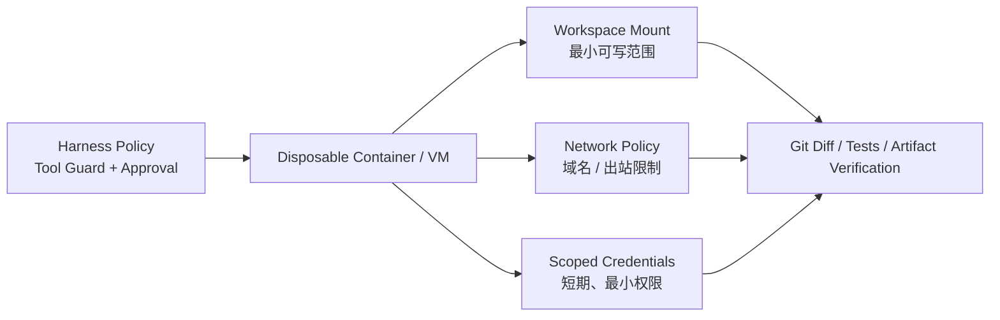
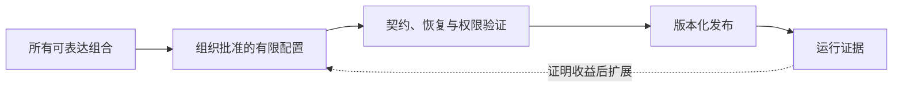

> 版本边界：本文采用官方源码快照 [`76fda72`](https://github.com/deepseek-ai/deepseek-harness/tree/76fda729799fe9b3848dbe2c211d4b231032b81e)。它是 developer preview；以下解读不是稳定接口或生产安全承诺。

运行日志可以证明“发生了什么”，却不能保证事情本来就应该发生。真正的执行边界必须在动作之前检查，动作之后再用证据核验。

## 工具系统：先冻结事实，再允许策略介入

工具调用是 Agent 最危险也最容易失真的边界：模型看到的参数、UI 展示的参数、审批时判断的参数和实际执行的参数，必须是同一个事实。

DeepSeek Harness 的做法是先把参数解析成无损 JSON、物化并冻结，再进入策略流水线。参数不能被中途改写，因为一旦改写，历史、审计、UI 和执行就会出现四个版本。

一次调用经过：

```text
model tool call
  → materialize & freeze arguments
  → tools/pre-execute     // allow / deny / ask
  → monotonic guards      // 只能新增 deny，不能重新 allow
  → tools/execute         // 超时、追踪等 around wrapper
  → tool body
  → tools/post-execute    // 接受、替换投影或反馈阻断
  → finalizeContent
  → tools/result          // 冻结后的权威结果
  → durable tool/result
```

这里有三个成熟的设计信号。

### Tool Definition 同时约束输入、规范输出和展示

一个工具不只声明名字、描述和参数，还必须声明 Canonical Output Schema，以及如何把规范值渲染成模型可见的 `ContentBlock`。运行时回调、超时、并发安全分类和 UI Presenter 永远不会泄漏给模型，模型只看到白名单生成的 Schema。

这样一来，“工具返回了对象，但模型只该看到摘要”成为显式投影；原始结构可以在执行链中保持类型化，展示也可以在 Replay 时纯函数重建。

### Guard 只能单调收紧权限

`tools/pre-execute` 是可排序的插件策略，适合 Allow / Deny / Ask。随后执行的 `ToolGuard` 刻意没有 Allow 返回值：它只能不表态或给出拒绝原因。于是无论 Listener 顺序如何，一个安全 Guard 的拒绝都不能被后加载插件翻回允许。

这是“万物插件”架构不可缺少的补丁：扩展性允许多方参与决策，**单调策略**保证安全边界不会因为组合顺序意外变宽。

### 并行安全先由工具声明，再用冲突测试验证

只有工具的 `isConcurrencySafe(args)` 明确返回 `true`，调用才能和兄弟调用重叠；省略、异常或任何非 `true` 结果都按 Exclusive 处理。并行因此不是模型一句“请并行”就能获得的权力，而是工具作者对共享状态和副作用作出的声明。

这些细节都记录在官方 [Tools 子系统](https://github.com/deepseek-ai/deepseek-harness/blob/76fda729799fe9b3848dbe2c211d4b231032b81e/docs/subsystems/tools.md)中。它们反映出 DeepSeek Harness 的设计重心：模型协议要短，Host 侧契约要严格。

## PTC：把五次工具往返压缩成一段程序

PTC，即 Programmatic Tool Calling，是 DeepSeek Harness 区别于普通 Native Function Calling 的另一条路线。

在 Native 模式里，模型每调用一组工具，就要等待结果进入上下文，再发起下一次推理。如果任务是“搜索十个文件、读取命中项、过滤内容、汇总结构化结果”，大量中间数据和模型往返并不产生新的推理价值。

PTC 模式只向模型暴露 `run_code` 和自动生成的工具 SDK。模型写一段 TypeScript，把控制流、循环、并发和中间变量留在代码运行时，只有外层结果进入对话上下文：

**以下是表达控制流的伪代码，工具名称不构成可直接运行的 SDK 示例。**

```ts
const hits = await tools.fs_search({ pattern: "AgentLoop" })
const files = await Promise.all(
  hits.slice(0, 8).map((hit) => tools.fs_read({ path: hit.path }))
)

return files
  .filter((file) => file.content.includes("turn/start"))
  .map((file) => ({ path: file.path, relevant: true }))
```

它的潜在收益是：减少模型往返、避免大量中间结果污染上下文，并让确定性控制流回到代码。PTC Preset 因此关闭了通用 `workflow` 工具，避免同时给模型两个重叠的编排表面。

但不要把 Worker Thread 误读成安全沙箱。官方[`code-runtime-worker-thread` 文档](https://github.com/deepseek-ai/deepseek-harness/blob/76fda729799fe9b3848dbe2c211d4b231032b81e/packages/code-runtime/code-runtime-worker-thread/README.md)明确把它定义为 **containment, not a security boundary**：每次运行使用新 Worker、空环境、堆限制、计算时间和墙钟时间限制，也能硬终止死循环；但模型代码仍可访问 Node API，信任等级接近 Bash，派生的 OS 进程甚至可能在 Worker 终止后继续存在。

因此 PTC 的本质是**性能与上下文工程机制**，不是权限机制。它是否真的提高任务成功率，还需要针对具体模型和任务做评测。官方仓库当前只提供[运行 Benchmark 的说明](https://github.com/deepseek-ai/deepseek-harness/blob/76fda729799fe9b3848dbe2c211d4b231032b81e/BENCHMARK.md)，没有公布足以支持横向性能结论的结果，所以不能仅从架构推导收益数字。

## 多 Agent：先统一委派语义，再叠加团队协作

DeepSeek Harness 把 Subagent 和 Agent Team 分成两层。

### Subagent 是能力接口

`ctx.subagents` 可以同时挂载多个 Provider：

- `spawn`：创建全新上下文的进程内子 Agent；
- `fork`：从父 Agent 已完成历史复制上下文；
- `acp`：通过 Agent Client Protocol 委派给外部 Agent；
- `codex` / `claude-code`：调用真实的 Codex 或 Claude Code；
- `dsh-sdk`：启动另一个完整 Harness Runtime。

Provider 可以是一轮即结束，也可以是可继续的 Child。父 Agent 通过同一接口发现、发送后续消息、中断和读取状态，而不需要知道子方运行在当前进程、另一个进程还是另一个产品中。详见官方 [Subagent 包总览](https://github.com/deepseek-ai/deepseek-harness/blob/76fda729799fe9b3848dbe2c211d4b231032b81e/packages/subagent/README.md)。

### Agent Team 是有状态协作域

实验性的 Agent Team 在 Subagent 之上增加：

- 持久 Roster；
- 可恢复 Mailbox；
- 共享 Task DAG；
- 基于 Revision 的 Compare-and-set 更新；
- 对写入路径重叠的提示。

消息先完整写进 Lead Session，只有目标 Session 记录后才确认送达；“已排队但未送达”因此可以在 Replay 时恢复。任务的 `writeScopes` 目前只是建议性路径前缀，不是锁，这一点避免了把提示误当隔离。

它和普通“并行调用多个 Agent”最大的不同是：团队状态也进入可重放日志。代价则是协调协议、恢复语义和共享工作区冲突都变成平台责任。官方仍将它标为 Experimental，见 [Agent Teams 文档](https://github.com/deepseek-ai/deepseek-harness/blob/76fda729799fe9b3848dbe2c211d4b231032b81e/docs/subsystems/agent-team.md)。

## 安全架构：插件自由必须由不可逆的边界兜底

DeepSeek Harness 的工具流水线已经体现了 Fail-closed 思想：没有审批通道、审批者异常、返回非法结果或请求被取消，都不能放行动作；只有 `allowed-once` 是授权。

默认权限 Preset 把两个独立旋钮组合起来：

| 权限层 | 可选值 | 控制什么 |
| --- | --- | --- |
| Sandbox Mode | `read-only` / `workspace-write` / `danger-full-access` | 子进程的文件写入范围 |
| Approval Policy | `ask` / `never` | 风险动作是否询问；`never` 表示请求直接拒绝，不是自动允许 |

本地 Sandbox 在 Linux 使用 bwrap / Landlock，在 macOS 使用 Seatbelt，在 Windows 使用 ACL Restricted Token。Provider 必须返回实际受限的命令行，失败时关闭执行；不允许在受限模式下悄悄退回裸命令。

但边界必须准确表达。官方 [Sandbox 文档](https://github.com/deepseek-ai/deepseek-harness/blob/76fda729799fe9b3848dbe2c211d4b231032b81e/docs/subsystems/sandbox.md)明确说明，当前 `SandboxMode` **只治理文件副作用，不覆盖网络和进程可见性**；部分旧 Landlock ABI 和 Windows ACL 场景只能报告 `partial` enforcement。公开 Web Fetch 默认不逐次审批，虽然 Provider 会阻止访问非公开目标，但模型仍可能向公开 URL 发送数据。

更高风险的两个模式是：

- PTC 的 Worker Thread 只是资源隔离，不是安全边界；
- `cordis` 创造模式允许模型检查和修改自己运行的插件组合，信任等级等同 Shell Access。

官方 [Safety Notice](https://github.com/deepseek-ai/deepseek-harness/blob/76fda729799fe9b3848dbe2c211d4b231032b81e/SAFETY.md)明确写着：项目尚未经过安全审计，不应被视为安全或生产就绪；对于不可信工作负载，应使用一次性 VM、容器或专用环境，并遵循最小权限。

所以正确的生产拓扑不是“相信内置 Sandbox”，而是：



*图 1｜业务策略、外层隔离和结果验证的分工。*

Harness 内策略用于表达业务意图，操作系统或云基础设施负责硬隔离，Git / 测试 / 外部状态读取负责验证结果。三者缺一不可。

## 一组必须分别验证的反例

- 审批后参数被替换：执行应基于同一冻结事实，不能“批 A 做 B”。
- 只读工具被误标可并行：用共享状态测试验证声明，分类函数不是自动证明器。
- Worker 超时后派生进程仍在：资源限制与系统级清理需分别检查。
- 两个子 Agent 写同一路径：写范围提示不等于文件锁，必须有隔离或协调。
- 任务禁止外发，但 URL 可访问：文件沙箱不替代网络与凭证策略。

“单调收紧”也有信任前提：Guard 约束的是经过该工具流水线的调用。拥有宿主同进程执行权的恶意插件不能仅靠另一段插件代码来隔离，应通过可信供应链和外层环境限制。

本篇不是部署安全保证；上面的验收表应该进入隔离环境中的测试，并与真实数据流、凭证和出站策略一起审查。

## 如果要用它建设自己的 Agent，应该怎样分阶段

### 阶段一：固定组合，先证明单 Agent 闭环

先选择应用 Profile，例如 `sdk-minimal`；再按任务选择 Preset，例如 `standard`，并确认该组合实际包含所需组件。Profile 与 Preset 属于两个层次，不能作为同级模式二选一。起步阶段不启用运行时自修改。只保留少量高质量工具，建立明确的任务完成条件、测试和 Diff 审查。Session Persistence、取消、超时和失败恢复必须先于多 Agent。

成功标准不是 Demo 能调用工具，而是：任务中断后可以恢复，模型可见输入能够重构，所有外部修改都有验证证据。

### 阶段二：建立自己的 Capability Seams

把企业能力拆成 Definition / Provider / Consumer：例如“读工单”是稳定接口，Jira 或 Linear 是 Provider，模型 Tool 与后台 Workflow 是不同 Consumer。不要让模型工具直接绑死底层 SaaS SDK。

同时为每个 Tool 定义：输入 Schema、Canonical Output、模型投影、超时、并发属性、审批理由和最终 Guard。

### 阶段三：按风险划分 Preset

不要做一个拥有所有权限的万能 Agent。至少拆成：

- 只读分析 Preset；
- Workspace Write 编码 Preset；
- 可访问生产 API、必须审批的运维 Preset；
- 仅供平台开发者使用的 Creator Preset。

Preset 决定模型看到的能力，外层 Sandbox、网络和凭证策略决定它实际上能影响什么。

### 阶段四：用评测决定是否启用 PTC 与 Multi-Agent

PTC 适合工具调用链长、中间结果大、控制流容易用代码表达的任务；Native Calling 更适合每一步都需要模型重新判断的任务。Subagent 适合上下文隔离和独立探索，Agent Team 只在共享任务图与持续通信确有价值时启用。

对照实验至少记录：任务完成率、测试通过率、模型请求次数、总 Token、墙钟时间、人工接管次数、越权请求和恢复成功率。架构允许替换只是起点，评测才能决定哪种组合值得保留。

### 阶段五：把插件发布当作供应链发布

插件拥有与宿主同进程的能力，Preset 甚至可能等同 Shell 权限。企业需要锁定版本、审查来源、生成 SBOM、签名发布，并为配置变更保留可回滚记录。不要把“插件市场”当成低风险 Prompt 分享站。

## 真正的复杂度预算，是允许多少种组合进入生产

假设三个模型、三种工具集、两种存储、两种执行环境都可以独立替换，理论组合已有 36 种。这个数字只是乘法示例，不是该项目的部署统计；重要的是每个组合还带着取消、恢复、升级和权限例外。

不需要测试所有想象中的组合。更实用的办法是区分“框架允许的组合”和“组织支持的组合”：后者是少量锁定版本、拥有负责人、通过契约测试、可回滚的配置。



*图 2｜把可表达组合收敛成组织支持的有限配置。*

如果没有这层收敛，灵活性会变成配置漂移；如果收敛过早，又会把平台重新做成不可替换的固定产品。合理的边界由实际任务变化和维护能力决定。
