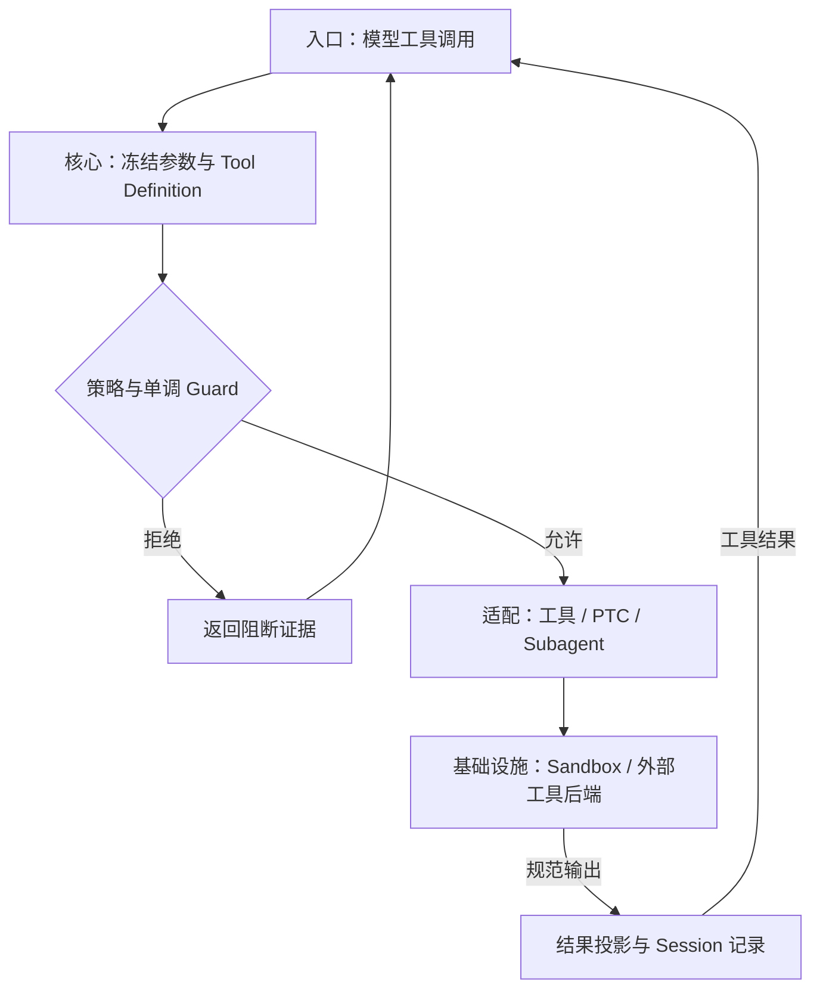
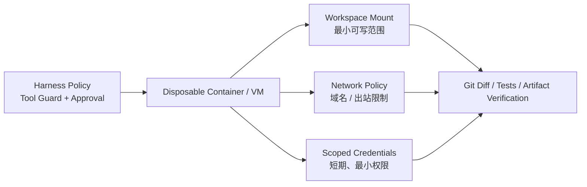

## 定位与价值

本篇追踪模型提出一个工具调用之后，参数、审批和结果如何保持一致，再讨论 PTC 与子 Agent 如何复用这条边界。

完整定位与安装见[项目总览](/writing/deepseek-harness-composition/)。

研究基线：[deepseek-ai/deepseek-harness @ 76fda72](https://github.com/deepseek-ai/deepseek-harness/blob/76fda729799fe9b3848dbe2c211d4b231032b81e/README.md)；源码与社区核对日期为 2026-09-06。

## 技术架构



*图 1｜按职责归纳的调用地图；箭头表示请求与结果，不表示四个独立部署服务。*

## 核心机制

### 工具调用与程序化编排

#### 工具系统：先冻结事实，再允许策略介入

工具调用是 Agent 最危险也最容易失真的边界：模型看到的参数、UI 展示的参数、审批时判断的参数和实际执行的参数，必须是同一个事实。

DeepSeek Harness 的做法是先把参数解析成无损 JSON、物化并冻结，再进入策略流水线。参数不能被中途改写，因为一旦改写，历史、审计、UI 和执行就会出现四个版本。

一次调用经过：

```text
model tool call
  → materialize & freeze arguments
  → tools/pre-execute     // allow / deny / ask
  → monotonic guards      // 只能新增 deny，不能重新 allow
  → tools/execute         // 超时、追踪等 around wrapper
  → tool body
  → tools/post-execute    // 接受、替换投影或反馈阻断
  → finalizeContent
  → tools/result          // 冻结后的权威结果
  → durable tool/result
```

这里有三个成熟的设计信号。

##### Tool Definition 同时约束输入、规范输出和展示

一个工具不只声明名字、描述和参数，还必须声明 Canonical Output Schema，以及如何把规范值渲染成模型可见的 `ContentBlock`。运行时回调、超时、并发安全分类和 UI Presenter 永远不会泄漏给模型，模型只看到白名单生成的 Schema。

这样一来，“工具返回了对象，但模型只该看到摘要”成为显式投影；原始结构可以在执行链中保持类型化，展示也可以在 Replay 时纯函数重建。

##### Guard 只能单调收紧权限

`tools/pre-execute` 是可排序的插件策略，适合 Allow / Deny / Ask。随后执行的 `ToolGuard` 刻意没有 Allow 返回值：它只能不表态或给出拒绝原因。于是无论 Listener 顺序如何，一个安全 Guard 的拒绝都不能被后加载插件翻回允许。

这是“万物插件”架构不可缺少的补丁：扩展性允许多方参与决策，**单调策略**保证安全边界不会因为组合顺序意外变宽。

##### 并行安全先由工具声明，再用冲突测试验证

只有工具的 `isConcurrencySafe(args)` 明确返回 `true`，调用才能和兄弟调用重叠；省略、异常或任何非 `true` 结果都按 Exclusive 处理。并行因此不是模型一句“请并行”就能获得的权力，而是工具作者对共享状态和副作用作出的声明。

这些细节都记录在官方 [Tools 子系统](https://github.com/deepseek-ai/deepseek-harness/blob/76fda729799fe9b3848dbe2c211d4b231032b81e/docs/subsystems/tools.md)中。它们反映出 DeepSeek Harness 的设计重心：模型协议要短，Host 侧契约要严格。

#### PTC：把确定性工具编排移入程序

PTC，即 Programmatic Tool Calling，是 DeepSeek Harness 区别于普通 Native Function Calling 的另一条路线。

在 Native 模式里，模型每调用一组工具，就要等待结果进入上下文，再发起下一次推理。如果任务是“搜索十个文件、读取命中项、过滤内容、汇总结构化结果”，大量中间数据和模型往返并不产生新的推理价值。

PTC 模式只向模型暴露 `run_code` 和自动生成的工具 SDK。模型写一段 TypeScript，把控制流、循环、并发和中间变量留在代码运行时，只有外层结果进入对话上下文：

**以下是表达控制流的伪代码，工具名称不构成可直接运行的 SDK 示例。**

```ts
const hits = await tools.fs_search({ pattern: "AgentLoop" })
const files = await Promise.all(
  hits.slice(0, 8).map((hit) => tools.fs_read({ path: hit.path }))
)

return files
  .filter((file) => file.content.includes("turn/start"))
  .map((file) => ({ path: file.path, relevant: true }))
```

它的潜在收益是：减少模型往返、避免大量中间结果污染上下文，并让确定性控制流回到代码。PTC Preset 因此关闭了通用 `workflow` 工具，避免同时给模型两个重叠的编排表面。

但不要把 Worker Thread 误读成安全沙箱。官方[`code-runtime-worker-thread` 文档](https://github.com/deepseek-ai/deepseek-harness/blob/76fda729799fe9b3848dbe2c211d4b231032b81e/packages/code-runtime/code-runtime-worker-thread/README.md)明确把它定义为 **containment, not a security boundary**：每次运行使用新 Worker、空环境、堆限制、计算时间和墙钟时间限制，也能硬终止死循环；但模型代码仍可访问 Node API，信任等级接近 Bash，派生的 OS 进程甚至可能在 Worker 终止后继续存在。

因此 PTC 的本质是**性能与上下文工程机制**，不是权限机制。它是否真的提高任务成功率，还需要针对具体模型和任务做评测。官方仓库当前只提供[运行 Benchmark 的说明](https://github.com/deepseek-ai/deepseek-harness/blob/76fda729799fe9b3848dbe2c211d4b231032b81e/BENCHMARK.md)，没有公布足以支持横向性能结论的结果，所以不能仅从架构推导收益数字。


### 委派如何保留执行边界

#### 多 Agent：先统一委派语义，再叠加团队协作

DeepSeek Harness 把 Subagent 和 Agent Team 分成两层。

##### Subagent 是能力接口

`ctx.subagents` 可以同时挂载多个 Provider：

- `spawn`：创建全新上下文的进程内子 Agent；
- `fork`：从父 Agent 已完成历史复制上下文；
- `acp`：通过 Agent Client Protocol 委派给外部 Agent；
- `codex` / `claude-code`：调用真实的 Codex 或 Claude Code；
- `dsh-sdk`：启动另一个完整 Harness Runtime。

Provider 可以是一轮即结束，也可以是可继续的 Child。父 Agent 通过同一接口发现、发送后续消息、中断和读取状态，而不需要知道子方运行在当前进程、另一个进程还是另一个产品中。详见官方 [Subagent 包总览](https://github.com/deepseek-ai/deepseek-harness/blob/76fda729799fe9b3848dbe2c211d4b231032b81e/packages/subagent/README.md)。

##### Agent Team 是有状态协作域

实验性的 Agent Team 在 Subagent 之上增加：

- 持久 Roster；
- 可恢复 Mailbox；
- 共享 Task DAG；
- 基于 Revision 的 Compare-and-set 更新；
- 对写入路径重叠的提示。

消息先完整写进 Lead Session，只有目标 Session 记录后才确认送达；“已排队但未送达”因此可以在 Replay 时恢复。任务的 `writeScopes` 目前只是建议性路径前缀，不是锁，这一点避免了把提示误当隔离。

它和普通“并行调用多个 Agent”最大的不同是：团队状态也进入可重放日志。代价则是协调协议、恢复语义和共享工作区冲突都变成平台责任。官方仍将它标为 Experimental，见 [Agent Teams 文档](https://github.com/deepseek-ai/deepseek-harness/blob/76fda729799fe9b3848dbe2c211d4b231032b81e/docs/subsystems/agent-team.md)。

#### 安全架构：插件策略与外层隔离分别验证

DeepSeek Harness 的工具流水线已经体现了 Fail-closed 思想：没有审批通道、审批者异常、返回非法结果或请求被取消，都不能放行动作；只有 `allowed-once` 是授权。

默认权限 Preset 把两个独立旋钮组合起来：

| 权限层 | 可选值 | 控制什么 |
| --- | --- | --- |
| Sandbox Mode | `read-only` / `workspace-write` / `danger-full-access` | 子进程的文件写入范围 |
| Approval Policy | `ask` / `never` | 风险动作是否询问；`never` 表示请求直接拒绝，不是自动允许 |

本地 Sandbox 在 Linux 使用 bwrap / Landlock，在 macOS 使用 Seatbelt，在 Windows 使用 ACL Restricted Token。Provider 必须返回实际受限的命令行，失败时关闭执行；不允许在受限模式下悄悄退回裸命令。

但边界必须准确表达。官方 [Sandbox 文档](https://github.com/deepseek-ai/deepseek-harness/blob/76fda729799fe9b3848dbe2c211d4b231032b81e/docs/subsystems/sandbox.md)明确说明，当前 `SandboxMode` **只治理文件副作用，不覆盖网络和进程可见性**；部分旧 Landlock ABI 和 Windows ACL 场景只能报告 `partial` enforcement。公开 Web Fetch 默认不逐次审批，虽然 Provider 会阻止访问非公开目标，但模型仍可能向公开 URL 发送数据。

更高风险的两个模式是：

- PTC 的 Worker Thread 只是资源隔离，不是安全边界；
- `cordis` 创造模式允许模型检查和修改自己运行的插件组合，信任等级等同 Shell Access。

官方 [Safety Notice](https://github.com/deepseek-ai/deepseek-harness/blob/76fda729799fe9b3848dbe2c211d4b231032b81e/SAFETY.md)明确写着：项目尚未经过安全审计，不应被视为安全或生产就绪；对于不可信工作负载，应使用一次性 VM、容器或专用环境，并遵循最小权限。

对于不可信执行内容，可采用下面的外层隔离方案；具体强度取决于挂载、网络和凭证配置：



*图 2｜业务策略、外层隔离和结果验证的分工。*

Harness 内策略用于表达业务意图，操作系统或云基础设施负责硬隔离，Git / 测试 / 外部状态读取负责验证结果。三者缺一不可。

#### 一组必须分别验证的反例

- 审批后参数被替换：执行应基于同一冻结事实，不能“批 A 做 B”。
- 查询工具共享一个可变游标却标为可并行：用交错请求检查漏读与重复，分类函数不是自动证明器。
- Worker 超时后派生进程仍在：资源限制与系统级清理需分别检查。
- 两个子 Agent 写同一路径：写范围提示不等于文件锁，必须有隔离或协调。
- 任务禁止外发，但 URL 可访问：文件沙箱不替代网络与凭证策略。

“单调收紧”也有信任前提：Guard 约束的是经过该工具流水线的调用。拥有宿主同进程执行权的恶意插件不能仅靠另一段插件代码来隔离，应通过可信供应链和外层环境限制。

本篇不是部署安全保证；上面的验收表应该进入隔离环境中的测试，并与真实数据流、凭证和出站策略一起审查。


将这些机制组成应用时，继续阅读[Mini Harness 装配](/writing/harness-integration-map/)与[架构选型](/writing/harness-architecture-selection/)。

## 快速上手

安装与基础示例见[项目总览](/writing/deepseek-harness-composition/#快速上手)。本篇从同一环境继续，按文中的故障场景检查结果。

模型、执行环境与存储等共用配置，以及安装常见问题，见[总览的三个配置项](/writing/deepseek-harness-composition/#快速上手)。本篇命令仅在明确记录实跑结果时才作为通过证据。

## 生态与社区

许可证、官方集成、提交与 Issue 样本统一见[项目总览的生态与社区](/writing/deepseek-harness-composition/#生态与社区)。本篇的治理建议不表示上游已提供对应 SLA 或托管能力。

## 源码阅读路径

按下面顺序阅读固定提交：先找包或命令入口，再进入核心抽象、具体实现和测试。

| 顺序 | 目录 → 文件 | 函数、对象或检查重点 |
| --- | --- | --- |
| 1 | [package.json](https://github.com/deepseek-ai/deepseek-harness/blob/76fda729799fe9b3848dbe2c211d4b231032b81e/package.json) | CLI 与构建脚本入口 |
| 2 | [vendor/cordis/src/index.ts](https://github.com/deepseek-ai/deepseek-harness/blob/76fda729799fe9b3848dbe2c211d4b231032b81e/vendor/cordis/src/index.ts) | Cordis 公共导出 |
| 3 | [packages/core/agent-loop/src/index.ts](https://github.com/deepseek-ai/deepseek-harness/blob/76fda729799fe9b3848dbe2c211d4b231032b81e/packages/core/agent-loop/src/index.ts) | AgentLoop：默认循环服务 |
| 4 | [packages/core/tools/src/index.ts](https://github.com/deepseek-ai/deepseek-harness/blob/76fda729799fe9b3848dbe2c211d4b231032b81e/packages/core/tools/src/index.ts) | ToolDefinition 与工具运行时 |
| 5 | [docs/testing.md](https://github.com/deepseek-ai/deepseek-harness/blob/76fda729799fe9b3848dbe2c211d4b231032b81e/docs/testing.md) | 测试分类与执行入口 |
