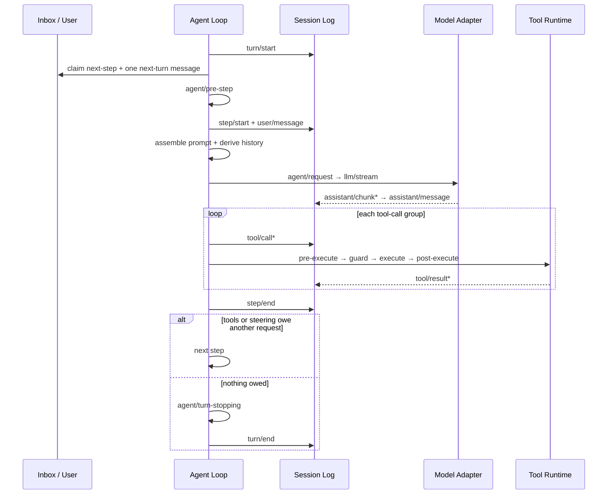

> DeepSeek Harness 架构系列：[1 · 系统全景](/writing/deepseek-harness-architecture/) · [2 · 组合与生命周期](/writing/deepseek-harness-composition/) · [3 · 状态与上下文](/writing/deepseek-harness-state/) · [4 · 执行与安全](/writing/deepseek-harness-execution/) · [5 · 深入思考](/writing/deepseek-harness-synthesis/)

> 版本边界：本系列沿用官方源码快照 [`76fda72`](https://github.com/deepseek-ai/deepseek-harness/tree/76fda729799fe9b3848dbe2c211d4b231032b81e)。它是 developer preview；以下解读不是稳定接口或生产安全承诺。


工单插件已经装好，Agent 修改了文件，测试运行到一半进程退出。重启后，它该继续哪一步？如果只保留一句“正在修复”，就无法区分未执行、已执行但未确认，以及执行失败。

这一篇讨论事实如何进入日志，又怎样变成模型能读的有限上下文。

## Agent Loop：Turn 是业务承诺，Step 是一次模型调用

很多 Agent 框架把循环写成一个看似简单的 `while (toolCalls.length)`。DeepSeek Harness 的循环更像一个事件溯源状态机。

它明确区分：

- **Step**：一次模型请求，以及该响应触发的一组工具执行；
- **Turn**：从一条用户输入被认领，到所有工具债务和中途追加输入都被处理完，包含零个或多个 Step。

一个 Turn 的主流程如下：



*图 1｜一个 Turn 内的模型请求、工具结果与继续条件。*

这套定义解决了几个容易被忽略的边界问题：

- 用户在 Agent 工作时追加的 Steering，可以在最近的 Step 边界进入，而不必粗暴终止整个任务；
- 仅注入 Context 不会唤醒空闲 Agent，它等待下一条真正输入；
- 被策略拒绝的第一步仍会写入 `turn/start` / `turn/end`，所以“尝试过但没有调用模型”也是可审计事实；
- 取消会携带 `user`、`parent`、`hook` 或 `disposed` 原因，并最终进入 Turn 的结束记录；
- 并行安全工具进入有界并发池，Exclusive 工具则形成顺序屏障。

默认 `agent-loop` 只负责“调用模型、执行工具、继续循环”。重试、Compaction、目标推进和停止规则都通过事件或 Capability 插件挂上去。官方[`agent-loop` 文档](https://github.com/deepseek-ai/deepseek-harness/blob/76fda729799fe9b3848dbe2c211d4b231032b81e/packages/core/agent-loop/README.md)甚至把自己称为系统中唯一的具体 Loop 实现——“唯一”并不表示不可替换，而是其他包不应偷偷再实现第二套循环语义。

## Session：不是聊天记录，而是运行时的事实账本

DeepSeek Harness 最值得借鉴的设计之一，是把 Session 定义为追加写入的 `SessionEvent` 日志。模型历史不是另一份可变数组，而是从日志投影得到：

```text
Durable Session Events
        │
        ├── deriveMessages() ──> Model History
        ├── projection fold ───> UI / Task / Permission / Token State
        ├── replay ────────────> Resume / Fork
        └── export ────────────> Transcript / Telemetry / Audit
```

它遵循一条很强的约束：**Model-visible means logged。** 任何进入模型请求的信息，都必须能由持久日志重建；运行时 Invariant 会检查请求是否可重构。原始 `assistant/chunk` 也被保留，因此 UI 可以重放流式输出，而不是只得到最终文本。

事件大致分三类：

- `turn/*`、`step/*`、`user/message`、`assistant/*`、`tool/*`：模型交互事实；
- `approval/*`、`compaction/*`、`agent/inbox/*` 等：运行时控制与审计事实；
- `request/header`、`request/context`：模型路由、上下文容量和请求系列的可重构快照。

这比“保存 messages 数组”复杂得多，却带来四个关键收益：

1. **恢复**：进程崩溃后可以识别未闭合 Turn，并在恢复层补写中断语义；
2. **Fork**：子 Session 可以从确定的事件边界继承历史；
3. **多视图一致性**：模型上下文、UI、遥测和审计来自同一事实源；
4. **插件扩展**：新能力通过 Declaration Merging 增加 Event 类型，而不必篡改一份中心状态对象。

它也意味着存储不再只是 I/O 细节。事件顺序、身份、提交边界、Log-only 事件与 Model Surface 的区分，全部成为公共架构。详见官方 [Session 子系统说明](https://github.com/deepseek-ai/deepseek-harness/blob/76fda729799fe9b3848dbe2c211d4b231032b81e/docs/subsystems/session.md)。

## 上下文工程：日志保持完整，Surface 可以被替换

事件溯源系统会遇到一个现实冲突：审计要求历史完整，模型上下文要求历史变短。DeepSeek Harness 用“完整 Log + 可变 Surface Projection”解决。

Compaction 不删除旧事件，而是：

1. 写入 `compaction/start`，形成可检测的事务锁；
2. 选取工具调用/结果配对完整的一段 Surface；
3. 生成摘要并写入 `compaction/summary`；
4. 追加一个带 `replace` 操作的 `user/message`，在模型视图中替换旧区间；
5. 最后写入 `compaction/end`。

如果进程在中间崩溃，存在 Start 而没有 End，恢复逻辑就知道这不是一次成功完成的压缩。旧内容仍然存在于 Canonical Log，只是在当前模型 Surface 中被摘要遮蔽。

在生成摘要前，系统还可以对超长 Tool Result 做确定性的头/尾保留与中段裁剪；随后重新测量 Token 压力，只有必要时才进行模型摘要。完整机制见 [Compaction 子系统](https://github.com/deepseek-ai/deepseek-harness/blob/76fda729799fe9b3848dbe2c211d4b231032b81e/docs/subsystems/compaction.md)。

Prompt 装配也服务于缓存稳定性。固定 Identity、Persona、Prompt Sections 和工具 Schema 按确定顺序形成前缀；运行时状态则作为有来源的 User-role Snapshot 进入历史。Preset 在 Session 生命周期内保持不变，同一 Preset 的 Agent 共享稳定组合，这有利于 KV Cache 复用。官方 System Prompt 文档也明确记录每项贡献对 Token 和 Cache 的影响，见 [`dsh-system-prompt`](https://github.com/deepseek-ai/deepseek-harness/blob/76fda729799fe9b3848dbe2c211d4b231032b81e/packages/core/system-prompt/README.md)。

这套策略的核心不是“尽量压缩”，而是把三种需要分开：

- 审计需要无损事实；
- 模型需要有限、高信号的当前视图；
- Provider Cache 需要稳定前缀。


## 实践：用中断点检验恢复语义

| 中断点 | 恢复时必须回答 |
|---|---|
| 有 tool/call，没有 tool/result | 是否已产生外部效果？先对账还是可安全重试？ |
| 有 compaction/start，没有 end | 摘要事务是否完成？旧证据是否仍可恢复？ |
| 工具被拒绝，模型未运行 | 是否仍能解释本次 Turn 为什么结束？ |
| 摘要成功，但当前模型换了 | 采用的模型、上下文与配置版本能否追溯？ |

这些是设计验收项，不意味着日志本身提供 exactly-once 执行。对“请求已成功但回包丢失”的外部操作，恢复层仍需幂等键或独立状态查询；不能仅因为日志缺 result 就重新执行。

## 从三份历史回到一个事实源

把这次修复的原始事件、模型上下文与 UI 展示放在一起，检查同一个工具调用的参数和结果是否一致。允许 UI 只显示摘要，但摘要必须能指回同一个事件。

完整日志也不是无限保留的许可：生产系统应按数据类别配置访问、保留与删除策略，并处理备份和派生视图。这里的 append-only 是运行时记录语义，不是对所有业务数据永久不可删除的要求。

读完这部分，应能解释“历史完整”与“上下文变短”为什么不矛盾：它们服务不同消费者，却需要共同的来源与版本约束。

---

上一篇：[组合与生命周期](/writing/deepseek-harness-composition/)。

状态可以回放，不代表动作就被正确限制。下一篇沿着真正产生副作用的工具边界，检查参数、并发、PTC 和多 Agent 的风险。

下一篇：[工具、PTC 和多 Agent，怎样不放大副作用](/writing/deepseek-harness-execution/)。
