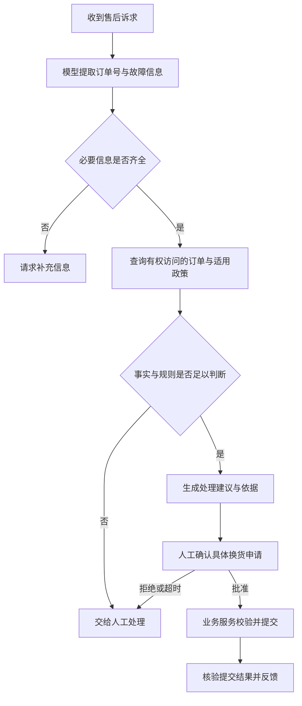
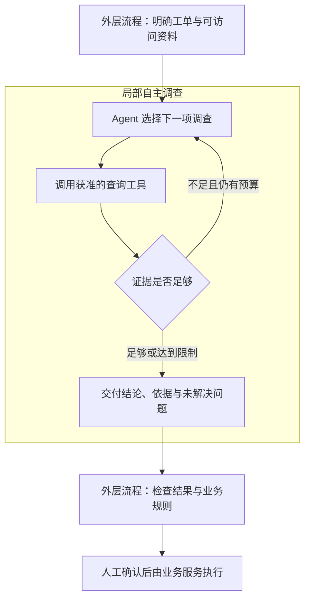

打开 Dify 的画布，最先看到的是一个个方框：输入、模型、知识检索、条件判断、工具调用。把它们连起来，一段原本需要人在几个系统之间反复操作的工作，就有了自动运行的可能。

这种方式很容易理解，也很容易引起怀疑。既然 Agent 已经能够根据目标调用工具、观察结果、继续行动，为什么还需要人提前画流程？今天辛苦搭出的几十个节点，会不会只是模型能力不足时的临时补丁？

我更愿意把这个问题放回真实工作里。模型能不能判断下一步，与一家公司愿不愿意让它决定下一步，是两件事。前者涉及能力，后者还涉及业务约定、执行成本，以及出了问题由谁接手。

**Workflow 在今天的意义，是把模型的能力组织成一项能够反复交付的工作。** 其中有些步骤会随着模型进步而消失，有些步骤则来自业务本身，需要被明确保留下来。从 Dify 出发，恰好可以看清这两部分。

## 一张工单，为什么不能只交给一段提示词

假设一家电商公司的客服收到这样一条消息：

> 上周买的耳机，左边一直有杂音。我换过手机还是一样，能不能直接换一副？订单号是 A123。

这是一段用于说明设计的假设案例，并非 Dify 的客户实测。

让模型读懂这段话并不难。它可以识别商品、故障、已经尝试的排查方法和换货意图，也能写出语气得体的回复。但把这件事真正办完，还要知道：订单是否属于当前用户，商品何时签收，适用哪一版售后规则，是否已有申请，以及什么情况下需要人工判断。

一段很长的提示词当然可以把这些要求全部写进去：“先查订单，再查政策，不满足条件不能换货，情况不明时询问用户。”问题在于，这时每次执行都依赖模型完整记住并正确落实这些要求。提示词表达了愿望，业务系统仍然需要检查愿望有没有兑现。

如果订单接口暂时不可用，系统应该明确告诉客服“暂时无法核验”，而不是让模型根据用户的语气推测订单成立。如果换货请求已经提交，只是返回信息丢失了，也不能把“没收到结果”当作“没有提交过”，再申请一次。

于是，一个原本看起来像对话的问题，变成了几类不同性质的工作：理解自然语言、查证事实、执行规则、作出判断、改变外部状态。它们没有必要全部采用同一种处理方式。

Workflow 的起点，就是把这些差异写清楚：什么由模型理解，什么由程序检查，什么需要外部系统确认，什么必须留给人。

## Dify 的画布，实际在表达什么

Dify 把这类应用组织成可连接的节点。Workflow 面向一次有输入、有处理过程的任务；Chatflow 增加对话层，让每条用户消息触发设计好的流程。因此，定期处理工单可以采用 Workflow，与客户多轮沟通可以采用 Chatflow。是否有聊天窗口，与系统有多大自主权，并不是同一个维度。[Dify：Workflow 与 Chatflow](https://docs.dify.ai/en/cloud/use-dify/build/workflow-chatflow)

理解画布时，可以先抓住三个对象。

**节点表示一次处理。** LLM 节点根据输入调用模型，知识检索节点寻找相关资料，HTTP Request 节点访问外部服务，条件节点选择后续路径。节点的价值在于把输入、操作和输出放在一个可以检查的位置。

**连线表达执行关系。** 哪一步必须等待前一步，哪些处理可以并行，哪些分支在什么条件下进入，都是流程设计的一部分。Dify 支持串行与并行编排；并行分支彼此不能读取对方尚未产生的变量，在汇合后，下游才可以使用各分支的结果。[Dify：编排逻辑](https://docs.dify.ai/en/cloud/use-dify/build/orchestrate-node)

**变量承接中间结果。** 模型抽取出的订单号、接口返回的签收时间、知识库检索到的政策，必须通过明确的变量传给下一步。画布上连了一条线，不意味着下游模型自动知道所有相关信息；需要把哪些内容交给它，仍然要显式配置。[Dify：LLM 节点](https://docs.dify.ai/en/cloud/use-dify/nodes/llm)

这也说明，搭工作流并不只是“把几个提示词串起来”。当一步输出被另一步使用时，它就构成了一个约定。比如“订单号”可以来自模型抽取，但“订单归属已核验”应来自经过身份校验的业务接口。两个变量都能写成文字，可信程度却完全不同。

对前面的售后问题，可以先设计这样一条主线：

这是教学用的业务流程，不是可直接导入的 Dify 配置。请求补充信息在对话中可以进入下一轮；在一次性任务中，可以返回待补充结果或交接人工。图中固定了必要检查与交接点，故障理解和建议生成仍然交给模型。订单鉴权、申请去重与提交结果核验，需要业务服务配合实现。

如果要从这张图开始搭建，第一版甚至可以停在“生成建议”，由客服照常操作后台。先确认系统能稳定帮助人，再接入写操作，比一开始追求全自动更容易辨认收益与问题。

## Workflow 与 Agent 的差别，在于谁决定下一步

“智能体”这个词常常同时指代很多东西：一个带知识库的聊天助手，一条自动处理流程，一个能够自行规划任务的执行系统。它们都可能调用大模型，控制方式却并不相同。

Anthropic 在《Building effective agents》中给出一种实用区分：Workflow 的主要执行路径由预先编写的程序决定；自主 Agent 则让模型在运行时决定过程与工具使用。这是架构上的区分，不是全行业统一的产品命名标准。[Anthropic：Building effective agents](https://www.anthropic.com/engineering/building-effective-agents)

回到售后案例，差别就很具体了。

在一条工作流里，设计者已经规定“先查订单，再核验政策，最后输出建议”。模型可能判断这是换货还是维修，但它主要是在预设分支之间选择。

在一个自主 Agent 里，模型看到“换过手机仍有杂音”，可能决定先查产品故障说明，发现与某个固件版本有关后，再查询固件记录，接着判断是否还需要向用户追问。下一步取决于刚刚得到的观察，而不完全来自预先展开的路线。

二者也可以组合。外层工作流要求“给出有来源的故障判断”，内层 Agent 自主决定查哪些资料；等它交回判断和依据，外层再做政策核验与人工确认。

因此，不能简单地说“有循环就是 Agent”，也不能说“画出来的图一定不自主”。Dify 的 Iteration 用来逐项处理列表，Loop 用来让后一轮利用前一轮结果继续处理。前者可以批量分析多张工单，后者可以根据反馈修改同一份建议；它们是否具有自主性，还要看每轮由谁选择动作、是否能根据环境反馈调整策略。[Dify：Iteration](https://docs.dify.ai/en/cloud/use-dify/nodes/iteration)、[Loop](https://docs.dify.ai/en/cloud/use-dify/nodes/loop)

更准确的提问是：这项工作里，哪些决定已被人写进流程，哪些决定在运行时交给模型，还有哪些决定需要人重新参与？

## 为什么在今天，Workflow 仍然有意义

如果工作流只是帮助较弱的模型分步思考，那么更强的模型确实会减少它的必要性。但一项实际业务需要的安排，远不止“怎样把答案想出来”。

### 让不规则的输入进入已有业务

传统程序擅长处理明确的字段：订单号、商品编码、申请类型。现实中的用户却会说“左边又开始滋滋响了，我已经试过重连”。两者之间存在一段语义转换，过去往往需要人完成。

大模型使这段转换变得可自动化。工作流则把转换后的信息接到原有系统中：模型识别意图，程序校验字段，接口提供事实，规则决定下一步。企业无需为了使用模型，重做整个订单、客户与工单系统。

Dify 的知识检索节点可以把知识库中的相关内容交给下游模型；HTTP Request 节点可以访问外部服务。这些节点提供连接能力，但知识是否适用、账号能访问哪些订单、接口允许怎样的写操作，仍需要应用设计者确定。[Dify：知识检索](https://docs.dify.ai/en/cloud/use-dify/nodes/knowledge-retrieval)、[HTTP Request](https://docs.dify.ai/en/cloud/use-dify/nodes/http-request)

我的理解是，这类平台很重要的一项现实价值，在于接通“人的表达”与“系统接受的操作”。模型可以越来越聪明，但业务系统仍需要知道，它收到的究竟是一条查询、一份建议，还是已经获准执行的申请。

### 把业务规定放在可以执行的位置

“回答得有礼貌”和“提交前必须确认订单归属”，是两类要求。前者适合放在提示词里，后者应该有一个不能被正常执行路径跳过的检查，并在真正提交的服务端再次落实。

假如一项业务明确要求人工确认，模型推理得再好，也不会自动取消这项约定。Workflow 可以把等待、批准、拒绝和超时写成不同路径，使它们成为系统运行的一部分。

Dify 的 Human Input 节点支持暂停流程、收集人工输入，并按选择进入后续分支，也提供超时处理。这让人工参与有了明确的落点。[Dify：Human Input](https://docs.dify.ai/en/cloud/use-dify/nodes/human-input)

但一个“批准”按钮本身，不等于完整的授权机制。比如批准的是某个订单、某件商品的换货，后续执行就不应偷偷变成另一个申请。身份、对象与批准内容的绑定，需要应用和业务服务共同保证。模型能力、流程控制和执行权限，各自解决不同的问题。

### 把一次成功变成能够持续改进的服务

在演示中跑通一张工单，说明系统存在一条成功路径。要每天处理同类任务，还需要知道它会在哪些地方失败。

是模型把故障类型理解错了？知识库找到了过期政策？订单接口返回异常？还是客服最后否决了建议？如果只有最终回复，这些问题很容易混在一起。

Dify 的 Workflow 日志提供运行输入输出、状态、Token 使用量和逐节点执行记录。这些记录使定位问题有了基础，但不能直接证明某项业务已经办对。[Dify：Logs](https://docs.dify.ai/en/cloud/use-dify/monitor/logs)

例如，一张工单显示每个节点都成功，最终却引用了错误地区的售后政策。技术执行成功与业务处理正确，仍然是两种不同结果。工作流的价值在于让人有机会检查中间依据，找到应该修正的位置。

对稳定业务而言，这种可检查性很有意义。团队可以只修改抽取规则或检索配置，再用旧工单检查新版本是否改善；不必每次面对一段包办全部任务的提示词，猜测是哪句话产生了影响。

### 管理每次交付的成本

并非每一步都值得调用最强模型。已经有订单日期，就可以用程序计算是否处于业务设定的期限内；已经确定回复模板，就没有必要让模型重新创作整封消息。更复杂的故障辨认，才值得使用较强模型或多轮调查。

这种分工给成本管理提供了位置，却不保证工作流天然便宜。拆成十次调用，可能比一次调用更慢、更贵；一个不断自我修改的循环，也可能耗尽预算后仍然没有改善结果。

所以应当观察“交付一份合格结果需要多少总成本”，把模型调用、工具服务、人工复核和失败返工放在一起看。节点更少、Token 更少、自动化率更高，都不能单独替代这个判断。

## 更自主的 Agent，正在改变工作流的颗粒度

Dify 自身的演进提供了一个值得注意的信号。截至 2026 年 9 月 16 日查阅的官方 Cloud 文档，Agent 节点页面同时介绍了经典的工具调用策略，以及仍标注 Beta、仅用于 Workflow 应用的新 Agent 节点。新节点可以把已发布的 Agent 作为工作流中的一个步骤，接收任务并向后续节点交付输出。这一说明针对所查阅的 Cloud 文档，不能直接套用到所有自部署版本。[Dify：Agent 节点](https://docs.dify.ai/en/cloud/use-dify/nodes/agent)

这意味着，一张图不必把所有推理动作都展开。

早先，为了完成故障分析，设计者可能分别放置“生成搜索词”“搜索”“总结”“再次搜索”“生成结论”等节点。随着模型与 Agent 执行能力提高，这些内部动作有机会合并为一个“调查故障并交付依据”的任务。外层保留输入要求、可用工具、时间限制、结果检查和交接方式。

这是本文建议的组合方式，不是 Dify 默认提供的完整售后系统。Agent 在限定范围内选择调查步骤，外层流程接收成果并决定如何继续；只有被授予查询工具时，内层调查才不具备直接提交申请的能力。

这种组合也有一个容易被忽略的要求：**把一串小节点合成一个 Agent 节点，不能同时丢掉对结果的约定。** 至少要说清它应该返回哪些事实、依据来自哪里、哪些问题尚未解决，以及达到限制时如何交接。自由度增加以后，验收条件反而需要更明确。

我倾向于把这一变化理解为：流程中的业务阶段可以保持稳定，阶段内部的实现逐渐变得灵活。这是一种有依据的架构判断，并不意味着所有应用都必然走向同一种形态。

对一段固定格式的文本做分类，一个模型节点可能已经足够；对不断变化的故障做调查，局部自主执行更有价值。采用 Agent 的理由，应当来自那些无法合理预先枚举的路径。

## 工作流也会失效，而且有自己的技术债

肯定 Workflow 的意义，并不意味着流程越细越好。

最常见的问题，是把对模型的不放心转化成不断增加节点。分类不稳定就再加一次分类，回答不理想就再加一次润色，偶尔出错就再加一个评审模型。最后画布很大，却没人说得清每一步到底减少了什么错误。

这样的流程会把偶然有效的提示技巧固定成长期负担。模型换代之后，旧的拆解也许已经没有收益，但调用、维护与排查成本还在。每一个模型节点都应该回答：它承担什么独立职责，有什么证据表明这次拆分值得保留？

另一个问题，是把开放任务硬塞进固定路线。排查一处陌生代码库的问题、研究一个尚未定义清楚的议题，下一步往往需要在阅读材料后才能决定。为了容纳所有可能性不停增加条件分支，会让图越来越难维护。此时，应当考虑把探索部分交给 Agent，或者让人先缩小任务范围。

更隐蔽的问题，是误把结构化当作可信。模型输出合法的订单号字段，并不证明它没有抄错；检索命中了文档，并不证明文档仍然有效；多个评审模型都同意，也可能只是共享了同一个错误前提。关键事实需要回到有权访问的记录中核验，不能只靠模型互相确认。

最后，画布不能替代外部系统的可靠性设计。换货接口超时后，可能出现两种情况：请求根本没有到达，或者申请已经创建，只是响应没回来。重试之前，需要查询业务状态，或者让服务使用同一个业务请求标识识别重复提交。通常所说的“幂等”，就是让同一个业务动作重复请求时，不会重复产生业务后果。

这与流程能否暂停恢复不是同一个保证。Dify 提供工作流编排与相关节点，并不意味着任意外部写操作自动获得了只执行一次的语义。更长时间的任务恢复和外部状态问题，可以继续参考 [Agent Runtime](/writing/agent-runtime/) 与 [Temporal 持久执行](/writing/temporal-durable-execution/) 的讨论。

工作流让问题有了明确位置，但问题仍然需要被解决。

## 怎样判断一项工作值不值得采用 Workflow

选择时，我会先看任务是否反复出现、处理阶段是否稳定，以及是否能够定义合格成果。下面是设计起点，不是不同产品的性能排名。

| 任务特点 | 可以从什么开始 | 为什么 |
| --- | --- | --- |
| 只需一次分类、改写或摘要 | 单次模型调用，加必要校验 | 多步编排可能没有额外收益 |
| 高频重复，步骤与例外大致明确 | Workflow | 适合明确检查点、责任与交接 |
| 主流程稳定，局部需要调查 | Workflow 加局部 Agent | 固定业务阶段，放开探索步骤 |
| 路径难预先确定，结果可验证 | Agent 加工具边界与验收 | 让环境反馈决定下一步 |
| 目标和验收都说不清楚 | 先由人澄清任务 | 自动化会放大尚未解决的歧义 |

对 Dify 这类平台，我认为一个合适的切入场景是：团队已经知道要处理哪类工作，也有可接入的资料与接口，希望让业务人员和工程人员围绕同一条流程迭代。可视化降低的是表达与协作成本，真正困难的数据整理、权限接入和异常处理不会自动消失。

如果只是很短的固定逻辑，一段代码也可以完成；如果需要高度定制的运行状态、长时间任务恢复或复杂测试体系，则应进一步检查平台是否适合，而不是因为画布方便就把所有逻辑堆进去。工作流是一种组织方式，Dify 是它的一种产品实现，二者不能画等号。

上线前，还需要用业务结果验证上述选择。沿用售后案例，可以准备一组由业务人员确认预期处理方式的工单，包含普通申请、缺少订单号、政策过期、信息冲突、重复申请以及接口结果未知等情况。

| 检查情形 | 应观察的结果 |
| --- | --- |
| 用户没有提供必要信息 | 是否明确请求补充，而不是编造 |
| 用户描述与订单记录不符 | 是否展示冲突并交接，避免擅自下结论 |
| 检索到了不适用的政策 | 是否能阻止错误建议进入执行 |
| 同一申请被重复提交 | 是否只产生预期的一次业务后果 |
| 外部接口超时 | 是否区分失败与结果未知 |
| 人工拒绝或长时间未回应 | 是否进入约定分支，避免默认批准 |

这是一组待执行的验证建议，本文没有运行 Dify、调用真实模型或提交换货申请。比较单次调用、固定工作流与混合 Agent 方案时，应尽量使用同一组任务、资料、权限和验收标准，记录端到端正确率、人工修正量、完成时间与总成本。

Dify 提供草稿与已发布版本的管理能力，但流程版本并不等于整个系统被冻结。模型、知识库、工具与业务规则仍可能改变。需要复核某次结果时，这些依赖也应一并记录；Cloud 中具体的版本恢复和指定版本运行能力，还存在套餐差异。[Dify：版本管理](https://docs.dify.ai/en/cloud/use-dify/build/version-control)

只有这些比较显示改善，才有理由说工作流为这项工作创造了价值。画布是否复杂、节点是否丰富，无法代替这个结论。

回到最初的问题：当 Agent 越来越自主，Workflow 还有什么价值？

我认为，更强的模型会让许多为理解和推理而搭建的细碎步骤消失，这是好事。设计者可以把精力从反复教模型“先想这个，再想那个”，移到更重要的地方：工作需要什么证据，哪些动作允许执行，成果交给谁，以及遇到例外时怎样继续。

从 Dify 看过去，Workflow 值得保留的部分，正是这些能够被团队共同检查、执行和改进的业务约定。模型有了更多自主完成工作的能力，人也就更需要清楚地定义：这一次，究竟把什么工作交给了它。

## 资料来源

本文依据 2026 年 9 月 16 日查阅的 Dify 官方 Cloud 文档及 Anthropic 工程文章撰写；Dify 的具体能力随版本、部署方式与套餐变化。售后流程、架构组合和验证样例是本文的分析与设计推演，不代表已部署案例或实测性能。

- [Workflow 与 Chatflow](https://docs.dify.ai/en/cloud/use-dify/build/workflow-chatflow)、[编排逻辑](https://docs.dify.ai/en/cloud/use-dify/build/orchestrate-node)：应用形态、执行关系和变量传递。
- [LLM](https://docs.dify.ai/en/cloud/use-dify/nodes/llm)、[Knowledge Retrieval](https://docs.dify.ai/en/cloud/use-dify/nodes/knowledge-retrieval)、[HTTP Request](https://docs.dify.ai/en/cloud/use-dify/nodes/http-request)：模型、知识与外部服务的接入。
- [Agent](https://docs.dify.ai/en/cloud/use-dify/nodes/agent)、[Iteration](https://docs.dify.ai/en/cloud/use-dify/nodes/iteration)、[Loop](https://docs.dify.ai/en/cloud/use-dify/nodes/loop)：自主执行与两类重复处理。
- [Human Input](https://docs.dify.ai/en/cloud/use-dify/nodes/human-input)、[Logs](https://docs.dify.ai/en/cloud/use-dify/monitor/logs)、[Version Control](https://docs.dify.ai/en/cloud/use-dify/build/version-control)：人工参与、运行记录与版本。
- [Building effective agents](https://www.anthropic.com/engineering/building-effective-agents)：Workflow 与自主 Agent 的架构区分。

相关机制：[Loop 与 Graph](/writing/harness-engineering-loop/)、[RAG](/writing/rag/)、[Agent Runtime](/writing/agent-runtime/)。
