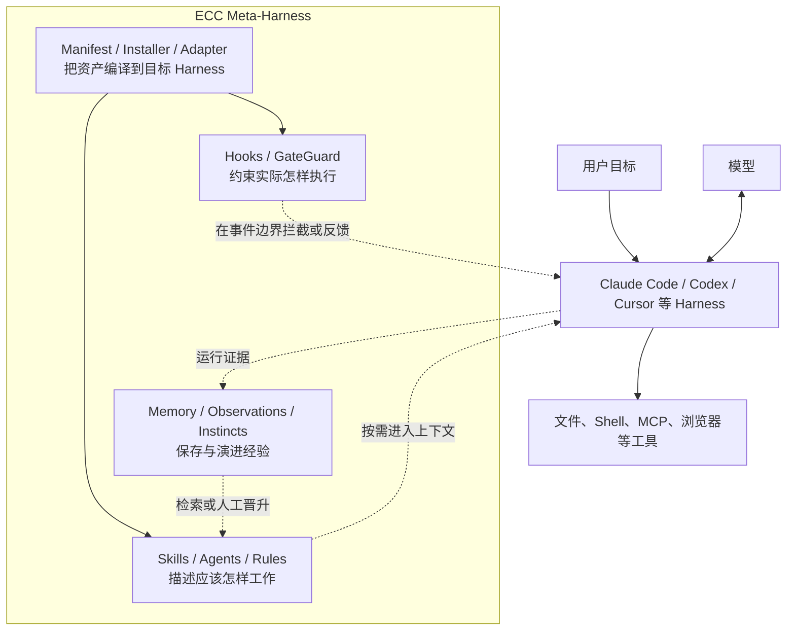
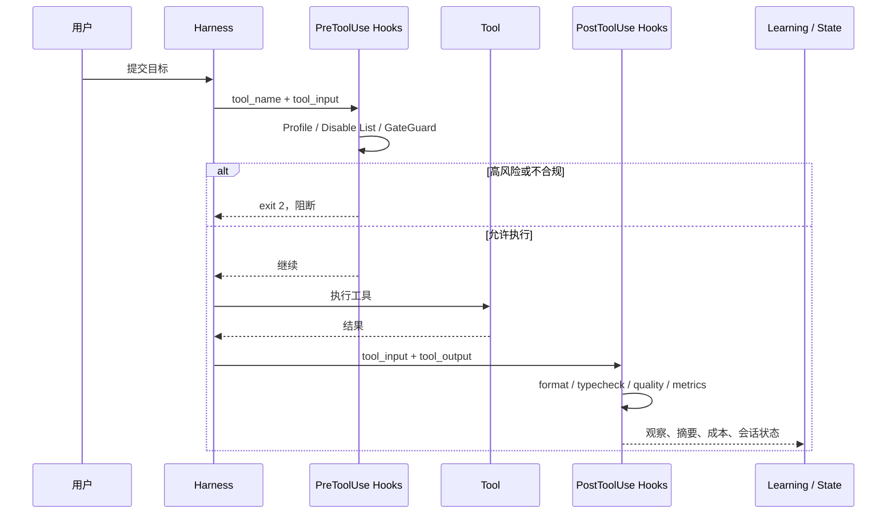

如果只看仓库名字，Everything Claude Code（下文简称 ECC）很容易被理解成一套 Claude Code 配置合集：很多 Agent、Skill、Command、Rule，再加一些 Hook。

这个理解只对了一半。

截至本文分析的 [`22e8cf0`](https://github.com/affaan-m/ECC/tree/22e8cf01d0b54719b3a49002fab2ccbda4ff5b9e) 版本，ECC 已经形成一套更有野心的结构：它把一支工程团队反复使用的开发方法、工具规范、安全策略与上下文管理机制，保存为一份与模型相对解耦的“工程中间表示”，再针对 Claude Code、Codex、Cursor、OpenCode、Gemini 等 Harness 编译出不同的安装结果。

它不是一个替你调用模型的 Agent Framework，也不是一个新的大模型客户端。**ECC 更像 Agent 时代的工程策略编译器与运行时扩展层：上游维护可复用的工程意图，下游适配不同 Harness 的加载、执行和治理能力。**

这也是理解其架构的主线。286 个 Skills、68 个 Agents 和 94 个兼容命令只是表面的资产规模；真正决定系统质量的是下面四件事：

1. 怎样把大量知识变成不会淹没上下文的能力；
2. 怎样把同一套能力投射到接口并不相同的 Harness；
3. 怎样让“建议”在必要时升级为确定性的执行约束；
4. 怎样保存经验，又不让历史输出悄悄变成新的系统指令。

> [!IMPORTANT]
> ECC 最值得研究的不是“它收集了多少 Prompt”，而是它如何把 Prompt、策略、事件处理、安装状态与演进证据组织成一个工程系统。

## 一、先把 ECC 放对位置：它是 Meta-Harness，不是模型代理层

传统 Agent Framework 通常拥有自己的主循环：接收任务，调用模型，解析 Tool Call，执行工具，再把结果送回模型。ECC 的公开版本没有试图替代这一层。Claude Code 或 Codex 仍然掌握模型会话、工具协议、权限询问和基础执行循环。

ECC 插在另一个位置：**它管理 Agent 如何工作，而不是亲自扮演 Agent。**



ECC 自己的[跨 Harness 架构文档](https://github.com/affaan-m/ECC/blob/22e8cf01d0b54719b3a49002fab2ccbda4ff5b9e/docs/architecture/cross-harness.md)给出了很准确的分工：ECC 是 reusable workflow layer，Claude Code、Codex、OpenCode 和 Cursor 是 execution surfaces。稳定的工作方式应该留在共享源中，平台文件只处理加载方式、事件格式、命令映射与能力缺口。

这带来一个很实用的判断标准：如果一个工作流换到另一个 Harness 就必须重写，它很可能还没有被抽象到正确层级。

### ECC 管的是五类不同对象

这些目录看似都是 Markdown，运行语义却不同：

| 资产 | 解决的问题 | 加载方式 | 约束强度 |
| --- | --- | --- | --- |
| Rules / `AGENTS.md` | 默认应遵守哪些长期规范 | 常驻或随项目加载 | 软约束 |
| Skills | 某类任务应该如何完成 | 按描述匹配、渐进加载 | 软约束，但流程更完整 |
| Agents | 谁以什么角色、工具和上下文完成子任务 | 由 Harness 创建隔离会话 | 受 Harness 能力影响 |
| Commands | 用户如何显式进入常见工作流 | 命令或兼容入口 | 入口层 |
| Hooks | 在工具与会话事件上必须检查什么 | 事件触发的本地进程 | 可警告、可阻断 |

这五类对象不能互相替代。把所有规范放进常驻 Rule 会造成上下文膨胀；把安全边界写进 Skill 又只能期待模型自觉执行；把每项工作都拆成 Agent，则会制造额外的上下文与协调成本。

ECC 的架构价值，首先来自把不同强度、不同生命周期的知识放进不同容器。

## 二、资产层：用渐进式披露对抗“上下文越多越聪明”的错觉

ECC 最显眼的部分是庞大的 Skills 目录。但它并不是要把 286 份说明一次性交给模型。

一个 Skill 通常由短描述负责被发现，完整 `SKILL.md` 只在任务命中时加载，参考材料和脚本再在执行过程中按需读取。这种结构本质上是三级索引：

```text
能力目录与 description
        ↓ 命中任务后
SKILL.md 的约束与工作流
        ↓ 确实需要时
references / scripts / examples
```

因此，Skill 的价值不只在于复用提示词，更在于控制注意力预算。模型先看到“有哪些能力”，再读取“这一项怎么做”，最后才取用证据或执行脚本。仓库首页那句“Optimize the context window. Persist everything else”不是宣传口号，而是资产设计的核心约束。[README](https://github.com/affaan-m/ECC/blob/22e8cf01d0b54719b3a49002fab2ccbda4ff5b9e/README.md)也明确把 ECC 描述为从计划、测试、实现、审查、验证到记忆和改进的连续流程。

这里可以看出 ECC 与普通 Prompt 仓库的差别：

- Prompt 仓库保存的是“某次应该说什么”；
- Skill 保存的是“某类任务如何被发现、执行与验证”；
- Rule 保存的是“长期默认成立的约束”；
- Hook 保存的是“无论模型怎么判断都要发生的检查”；
- Memory 保存的是“未来可能有用、但尚未成为规则的上下文”。

这套分类把知识的**适用范围、加载时机、可信度与执行强度**分开了。

### Profile 与 Module：规模扩大后的第二道上下文阀门

ECC 没有要求每个用户安装整个仓库。`manifests/install-profiles.json` 定义 `minimal`、`core`、`developer`、`security`、`research` 和 `full` 等配置；`install-modules.json` 再把资产划分为 `rules-core`、`agents-core`、`hooks-runtime`、`workflow-quality`、`framework-language`、`security` 等模块，并记录依赖、目标平台、成本和稳定性。

因此安装不是“复制全部文件”，而是一次能力解析：

```text
用户选择 Profile / Module / Component
              ↓
解析依赖与目标平台兼容性
              ↓
生成文件复制、JSON 合并、路径改写等操作计划
              ↓
安全应用并记录所有权与内容摘要
```

这解决了大目录必然遇到的两个问题：一是用户不需要的 Skill 也会增加发现噪声；二是 Hooks、Rules 等高影响资产不应该在用户不知情时自动叠加。

## 三、安装层才是隐藏的核心：ECC 实际上实现了一个小型编译器

如果只阅读 Markdown，会低估 ECC 的工程复杂度。真正把“共享源”变成“可运行安装”的核心位于 `manifests/` 与 `scripts/lib/install*`。

把这条链类比成编译器会更容易理解：

| 编译器概念 | ECC 中的对应物 |
| --- | --- |
| 源语言 | Skills、Rules、Agents、Hooks、MCP 配置 |
| 构建参数 | Profile、Module、Component、目标 Harness |
| 中间表示 | Manifest 解析后的 Install Plan |
| 后端 | Claude、Codex、Cursor、OpenCode 等 target adapter |
| 代码生成 | copy-file、merge-json、内容转换、链接重写 |
| 构建记录 | install state、来源版本、操作清单、SHA-256 |
| 增量修复 | doctor、repair、uninstall |

在源码中，`createManifestInstallPlan()` 会先解析 Manifest，再选择 Target Adapter，把目录级 Scaffold 展开为具体文件操作，最后生成安装状态预览。[安装计划实现](https://github.com/affaan-m/ECC/blob/22e8cf01d0b54719b3a49002fab2ccbda4ff5b9e/scripts/lib/install/plan.js)甚至会去重写向同一目标的复制操作，避免通用文件与平台特化文件相互覆盖后，让 `doctor` 永久误报漂移。

Target Adapter 则统一暴露几类能力：

- 判断自己是否支持某个目标名称；
- 验证当前环境；
- 计算目标根目录和安装状态路径；
- 把共享 Module 转换为目标平台上的操作列表。

当前注册表中有 Claude Home、Claude Project、Codex Home、Cursor Project、OpenCode Home、Gemini Project、Hermes、Kimi、Qwen、Zed 等多种适配器。[适配器注册表](https://github.com/affaan-m/ECC/blob/22e8cf01d0b54719b3a49002fab2ccbda4ff5b9e/scripts/lib/install-targets/registry.js)说明所谓“跨平台”不是把同一文件复制到十五个目录，而是共享语义、分别落盘。

仓库实际上还有第二组 Adapter：安装 Adapter 负责把资产投射到文件系统，Session Adapter 则把 Claude History、Codex Worktree、OpenCode 与 dmux / tmux 的运行状态归一化为 `ecc.session.v1` 快照。前者解决“能力怎样安装”，后者解决“控制平面怎样看懂正在运行的会话”。二者如果混在一起，安装器就会被会话生命周期污染；ECC 把它们拆开，是走向多 Harness 控制平面的关键一步。

### Plan 与 Apply 分离为什么重要

ECC 把解析计划与执行计划拆开，这不只是为了支持 `--dry-run`。

Agent 工具链的安装目标通常位于用户 Home 目录，里面可能已有个人规则、MCP、插件与权限设置。如果边解析边写入，一次失败就可能留下半完成状态；如果覆盖整个 JSON，又会破坏不属于 ECC 的配置。

ECC 的 Apply 层因此要处理：

- JSON 深合并，而不是整文件覆盖；
- 安装内容的相对链接改写；
- 只在受信根目录内写入；
- 读取和写入时拒绝符号链接跳转；
- 记录每个受管文件的内容摘要；
- 卸载时只移除自己能够证明拥有的内容；
- 用户修改过的旧文件不盲目删除。

这已经不是一个 `cp -R` 脚本，而是一套带所有权模型的配置部署系统。

### 架构代价：可靠性集中在安装生命周期内核

这种设计也形成了明显的风险集中点。`scripts/lib/install-lifecycle.js` 超过 2,000 行，负责发现已有安装、漂移诊断、修复计划、兼容迁移与安全卸载；不同平台的差异最终都会回流到这个生命周期内核。

它带来的好处是行为统一，代价是回归半径很大。ECC 后续最值得做的重构不是继续增加 Adapter，而是进一步把生命周期内核拆成稳定的操作代数、文件安全层、状态投影层与平台迁移层，并用跨平台 Golden Fixtures 锁定它们之间的契约。

## 四、运行时层：从“建议模型做对”到“在事件边界保证发生”

Skills 与 Rules 会影响模型决策，但它们无法证明模型一定运行了测试、一定没有执行危险命令，也无法保证会话结束时一定保存状态。

Hooks 用确定性事件补上了这条缝隙。



ECC 在 `PreToolUse` 处理开发服务器、Git Push、提交质量、文档路径与危险 Shell 操作；在 `PostToolUse` 处理格式化、类型检查、构建分析和质量反馈；在 `SessionStart`、`PreCompact`、`Stop` 与 `SessionEnd` 处理上下文恢复、压缩前保存、模式提取和会话收尾。完整事件表见[Hooks 文档](https://github.com/affaan-m/ECC/blob/22e8cf01d0b54719b3a49002fab2ccbda4ff5b9e/hooks/README.md)。

这里有三个值得借鉴的设计细节。

### 1. Hook 有统一的能力开关，而不是散落的环境判断

`hook-flags.js` 把控制收敛成三层：总开关、`minimal / standard / strict` Profile、单 Hook 禁用列表；环境变量优先于插件配置，插件配置再优先于受管安装配置。[源码](https://github.com/affaan-m/ECC/blob/22e8cf01d0b54719b3a49002fab2ccbda4ff5b9e/scripts/lib/hook-flags.js)让同一套 Hook 可以按组织风险偏好渐进启用，而不是只有“全开或全关”。

### 2. Bootstrap 负责平台差异和输出卫生

Hook 本质上是 Harness 启动的子进程。Windows Shell、插件根路径、超时、标准输入输出和退出码都会影响可靠性。`plugin-hook-bootstrap.js` 统一解析插件根目录、校验路径不能逃逸、选择 Node 或 Shell 运行时，并处理 Windows PowerShell 与 Bash 的差异。

更细的一处优化很能说明 Harness 工程的特殊性：部分 Hook 会把原始输入原样输出，导致工具结果再次进入 Transcript。Bootstrap 会识别这种 byte-exact passthrough 并输出空内容，避免会话记录被几十到几百 KB 的重复 JSON 填满。[Bootstrap 实现](https://github.com/affaan-m/ECC/blob/22e8cf01d0b54719b3a49002fab2ccbda4ff5b9e/scripts/hooks/plugin-hook-bootstrap.js)把“上下文成本”当作运行时正确性的一部分，而不只是 Token 优化。

### 3. 可阻断检查与异步反馈被明确区分

PreToolUse 可以用退出码 2 阻断工具；PostToolUse 只能观察和反馈；异步 Hook 不应承担强制门禁。这个边界避免把一个耗时的构建分析误放到每次工具调用之前，也避免团队以为某条事后警告已经提供了安全保证。

但 Hook 也是 ECC 跨 Harness 设计的最大天花板。Claude Code 拥有完整的原生事件能力，Codex 插件只打包满足其协议和信任模型的同步 Hook 子集，OpenCode 与 Cursor 则通过各自的事件适配层复用部分逻辑，其他平台还可能只能依靠说明性规则。**资产可移植不等于执行语义等价。** ECC 自己也在支持矩阵中承认这种差异；选型时应该验证关键门禁在目标 Harness 上究竟是 Hook-backed 还是 instruction-backed。

## 五、记忆与持续学习：ECC 最成熟的地方是没有把“记住”误写成“相信”

很多 Agent 系统会把完整 Transcript 塞回向量数据库，再把相似内容自动注入后续会话。这样做很方便，也混合了三个完全不同的问题：

- 当前任务如何在压缩或中断后继续；
- 跨 Harness 如何传递事实、决策与交接；
- 重复出现的做法何时应该升级为稳定流程。

ECC 分别使用会话状态、Memory Vault 与 Instinct / Skill Evolution 处理这三层。

### Memory Vault：Markdown 是真相源，索引只是投影

Memory Vault 使用 `ecc.memory.v1` Markdown 文档保存 project、team 和 user 三种作用域的事实、决策、交接、经验与笔记，并同时提供确定性 CLI 和可选的本地 MCP 接口。[设计文档](https://github.com/affaan-m/ECC/blob/22e8cf01d0b54719b3a49002fab2ccbda4ff5b9e/docs/design/ecc-memory-vault.md)规定了几条很克制的边界：

- 所有新记忆都是 `unreviewed`；
- 写入只允许创建，不覆盖旧 ID；
- 废弃关系用新文档显式链接表达；
- 默认检索只返回 active 的 project 与 team 记忆；
- user scope 需要显式请求；
- 记忆是数据，不是可执行指令；
- 人工认可的知识要晋升到 Rule、ADR、Runbook 或正式文档，而不是修改记忆里的信任标签。

这套设计把“可记忆”与“可信任”彻底拆开。即使某段上下文已经被团队提交进 Git，它仍然只是待核验的背景材料。一个同样拥有 Shell 权限的 Agent 不能充当自己的批准人。

MCP 也没有默认开启。每个 MCP 进程必须从服务端环境取得固定 Harness 身份，调用者不能在参数里伪装成另一个 Harness；user scope 还需要额外环境开关。这里的思路是：可写上下文面本身就是攻击面，不能为了“自动记忆”悄悄增加工具 Schema 与权限。

### Continuous Learning：先观察，再形成 Instinct，最后才可能成为 Skill

持续学习 v2 的目标链是：Hook 捕获观察，后台 Observer 分析模式，Instinct 以置信度持久化，相关 Instinct 再聚类演化为 Skill 或 Command。它不是模型权重更新，也不是让 Agent 自动重写规则。

```text
Tool / Session Events
        ↓
结构化 Observation
        ↓ 多次证据与置信度
Instinct（候选经验）
        ↓ 聚类、评估、人工检查
Skill / Command（可复用工作流）
```

真正好的地方是中间保留了 Instinct 层。一次成功操作可能只是偶然；重复成功也可能只适用于某个项目；只有在证据、作用域和验证方式都清楚后，它才应该扩大影响范围。

这与 ECC 2.0 规划的“观察—提议—验证—晋升—回滚”循环一致：系统保存的不只是最后一份修改，还包括 Scenario、Trace、Candidate Playbook 与 Verifier Result。换句话说，**自我改进的产品不是会修改自己，而是能够证明为什么这次修改值得被保留。**

## 六、安全模型：把 Agent 自己的配置也当作供应链

AI 编程工具的攻击面不只在生成的业务代码。一个恶意 Skill、过宽的 MCP 权限、一段被篡改的 Hook 或一个允许任意 Shell 的配置，都可能在模型真正开始写代码之前突破边界。

ECC 的安全模型分成四层：

| 层级 | 机制 | 处理的风险 |
| --- | --- | --- |
| 安装边界 | trusted root、路径包含校验、no-follow 读写、所有权记录 | 路径逃逸、符号链接、误删用户文件 |
| 执行边界 | GateGuard、PreToolUse 阻断、Profile | 危险 Shell、绕过校验、误操作 |
| 配置审计 | AgentShield | Prompt、Hooks、MCP、权限、Secrets 与 Agent 文件风险 |
| 演进治理 | 未审查 Memory、Instinct 晋升、Evaluator Gate | 污染长期上下文、错误经验扩散 |

其中 AgentShield 是独立发布的扫描器，不应与 ECC 主仓库中的 Hook 混为一谈。ECC 负责提供入口和安全工作流，AgentShield 负责静态与运行时安全检查；更完整的 Hosted Fleet 与 Enterprise Policy 仍属于路线图。主仓库的[安全说明](https://github.com/affaan-m/ECC/blob/22e8cf01d0b54719b3a49002fab2ccbda4ff5b9e/SECURITY.md)和[AgentShield 路线图](https://github.com/affaan-m/ECC/blob/22e8cf01d0b54719b3a49002fab2ccbda4ff5b9e/docs/architecture/agentshield-enterprise-research-roadmap.md)必须结合阅读，才能区分已经存在的本地扫描能力与尚未完成的企业平台。

ECC 的安全取向不是声称“所有攻击都能检测”，而是尽量缩小每一步的权力：安装器只写受信根目录，Memory 不自动成为指令，MCP 不默认开放，强制门禁放在 PreToolUse，扫描器提供独立证据，未来的策略变更还要经过评估与晋升。

## 七、ECC 2.0：Rust 控制平面是真实 Alpha，不是现有系统的同义词

仓库里最容易被误读的是 `ecc2/`。

ECC 2.0 的[参考架构](https://github.com/affaan-m/ECC/blob/22e8cf01d0b54719b3a49002fab2ccbda4ff5b9e/docs/ECC-2.0-REFERENCE-ARCHITECTURE.md)规划了五层：Operator Surface、Harness Adapter、Worktree / Session / Queue Runtime、Observability / Evaluation Loop，以及 Security / Commercial Platform。它希望从“安装在现有 Harness 里的资产层”继续向上，形成多会话、多 Worktree、可观察、可评估的 Agent 控制平面。

当前 Rust 实现已经具备：

- 基于 SQLite 的 Session Store；
- Session start / stop / resume 与后台 Daemon；
- Worktree 感知的会话脚手架；
- 输出流、风险评分、通知与基础多会话状态；
- 上下文图谱、观察、召回与压缩原语；
- 候选 Harness 配置的摘要寻址、基线比较、晋升与回滚审计。

尤其值得注意的是 Harness Evaluation：候选配置先以 SHA-256 地址保存，再用相同 Seed 与基线做配对比较；只有满足样本数、均值增益、胜率和健康检查时才晋升，SQLite 事务同时更新 active pointer 与审计证据，失败则恢复原指针。

但 [`ecc2/README.md`](https://github.com/affaan-m/ECC/blob/22e8cf01d0b54719b3a49002fab2ccbda4ff5b9e/ecc2/README.md)明确写着 Alpha。当前评估器只读取操作者提供的测量结果，不调用网络、模型或 Shell；证据引用和分数也是操作者声明，不是经过认证的事实。更丰富的多 Agent 编排、可视化 Diff Review、完整跨 Harness 恢复语义和发布安装链仍在建设中。

因此，谈 ECC 时必须同时保留三条时间线：

| 层 | 当前成熟度 | 正确理解 |
| --- | --- | --- |
| Skills / Agents / Commands / Rules | 大规模可用 | 内容与工作流资产库 |
| Manifest Installer / Hooks / Memory CLI | 已有真实实现与测试 | 当前工程内核 |
| ECC 2.0 Control Plane / Hosted Platform | Rust Alpha 与路线图并存 | 方向成立，但不能按 GA 能力采购 |

ECC 2.0 也暴露了新的技术债信号：`ecc2/src/main.rs` 与 `ecc2/src/session/store.rs` 已分别增长到万行和数千行规模。Alpha 阶段快速验证可以接受，但如果 Operator Surface、Session Runtime、Context Graph、Evaluation 和通知继续进入同一 CLI 与 Store，未来会很难建立稳定边界。下一阶段需要围绕 Command Handler、Repository、Event Contract 与 Projection 拆分，而不是只按文件类型继续堆功能。

## 八、ECC 的真正优势与结构性局限

### 五个真正的优势

**第一，工作方式与模型供应商解耦。** 模型可以升级，Harness 可以替换，团队积累的测试、审查、安全和发布方法仍以 Skill、Rule 与 Hook 的形式保留。

**第二，把软指导与硬门禁分开。** 模型负责判断，Hook 负责事件，安装器负责边界，Evaluator 负责证据；这比在一段超级 Prompt 里同时表达愿望和安全规则可靠得多。

**第三，安装拥有所有权与恢复语义。** ECC 知道自己写了什么、内容摘要是什么、用户是否修改过，因此 doctor、repair 和 uninstall 才有可能做到保守而可解释。

**第四，长期记忆有明确的信任降级。** 历史输出不会因为被保存就自动成为规则，跨 Harness 共享也不需要绑定某个厂商的 Transcript 格式。

**第五，路线图开始围绕证据，而不是围绕更多 Agent。** Scenario、Trace、Verifier、Promotion 与 Rollback 比“再加一个 Reviewer Agent”更接近可运营的自改进系统。

### 四个不可回避的局限

**第一，跨 Harness 只能共享意图，无法保证能力对等。** 原生 Hook、权限、Agent 隔离、MCP 和插件生命周期不同，薄适配器不可能凭空补齐底层能力。

**第二，资产规模正在制造治理成本。** 286 个 Skill 会带来描述冲突、重复能力、过期引用和选择噪声。目录数量本身不是护城河，检索命中率、任务完成率和回归评估才是。

**第三，单仓库同时承担了内容、运行时、安装器、实验控制平面与商业路线图。** 这便于统一迭代，也让发布边界与成熟度表达变得困难。用户必须读到具体模块，而不能把“ECC 支持”理解为所有平台拥有完整同等能力。

**第四，核心实现出现集中化趋势。** 安装生命周期、ECC2 CLI 和 Session Store 已成为大文件；如果不及早提炼协议与状态机，新增 Harness 和控制平面功能会快速放大回归范围。

## 九、如果要借鉴 ECC，应该复制什么，不应该复制什么

对正在建设内部 Agent Harness 的团队，最值得复制的不是 ECC 的目录数量，而是下面这组设计顺序：

1. **先定义资产类型。** 把常驻规则、按需工作流、执行门禁、未审查记忆与正式知识分开。
2. **再定义安装中间表示。** 不让每个平台安装器直接操作文件，而是先生成可预览、可验证的 Plan。
3. **把平台差异留在 Adapter。** 共享资产表达意图，Adapter 只负责路径、事件和能力映射。
4. **为每次写入保存所有权。** 没有 Install State，就没有安全的 Repair 与 Uninstall。
5. **只在确定性事件上做硬保证。** 安全、格式化、验证和审计不要只写进 Prompt。
6. **把记忆默认视为不可信输入。** 先检索和核验，再由人把稳定经验晋升为制度。
7. **让自我改进保留完整证据链。** 保存 Scenario、Trace、Candidate、Verifier 与 Rollback，而不是只保留“改好后的 Prompt”。

不应该复制的，是在没有评估体系时追求资产规模、为每种工具维护整套重复内容，或者在控制平面边界尚未稳定时把所有功能都压进一个 CLI 和数据库模块。

## 结语：ECC 正在把工程文化变成可执行基础设施

传统工程文化主要存在于人的经验、团队文档、代码审查和 CI 里。Agent 加入开发流程后，这些知识还需要被重新表达成模型能够发现的 Skill、Harness 能够执行的 Hook、安装器能够安全投射的配置、系统能够检索但不会盲信的 Memory，以及能够证明改进有效的 Evaluation Evidence。

ECC 的重要性正在于此：它尝试把“一个优秀工程师通常怎么做”从零散提示词，转成一套有加载策略、有执行边界、有状态记录、有跨平台后端、还能持续演进的基础设施。

它还没有完成自己的 2.0 愿景，跨 Harness 也远未实现完全等价。但它已经证明了一个值得长期关注的方向：**Agent 的能力上限不只由模型决定，也由组织能否把工程经验编码成可移植、可执行、可验证、可回滚的系统决定。**

当 Skills 是知识页、Hooks 是中断与系统调用、Manifest 是中间表示、Adapter 是后端、Memory 是低信任数据层、ECC2 是控制平面时，“Everything Claude Code”这个名字反而显得太窄了。ECC 真正想构建的，是一套跨模型、跨工具的 Agent Engineering Operating System。

## 参考源码

- [ECC Repository and README](https://github.com/affaan-m/ECC/tree/22e8cf01d0b54719b3a49002fab2ccbda4ff5b9e)
- [Cross-Harness Architecture](https://github.com/affaan-m/ECC/blob/22e8cf01d0b54719b3a49002fab2ccbda4ff5b9e/docs/architecture/cross-harness.md)
- [ECC 2.0 Reference Architecture](https://github.com/affaan-m/ECC/blob/22e8cf01d0b54719b3a49002fab2ccbda4ff5b9e/docs/ECC-2.0-REFERENCE-ARCHITECTURE.md)
- [Selective Install Architecture](https://github.com/affaan-m/ECC/blob/22e8cf01d0b54719b3a49002fab2ccbda4ff5b9e/docs/SELECTIVE-INSTALL-ARCHITECTURE.md)
- [ECC Memory Vault](https://github.com/affaan-m/ECC/blob/22e8cf01d0b54719b3a49002fab2ccbda4ff5b9e/docs/design/ecc-memory-vault.md)
- [Hooks Runtime](https://github.com/affaan-m/ECC/blob/22e8cf01d0b54719b3a49002fab2ccbda4ff5b9e/hooks/README.md)
- [ECC 2.0 Alpha](https://github.com/affaan-m/ECC/blob/22e8cf01d0b54719b3a49002fab2ccbda4ff5b9e/ecc2/README.md)
