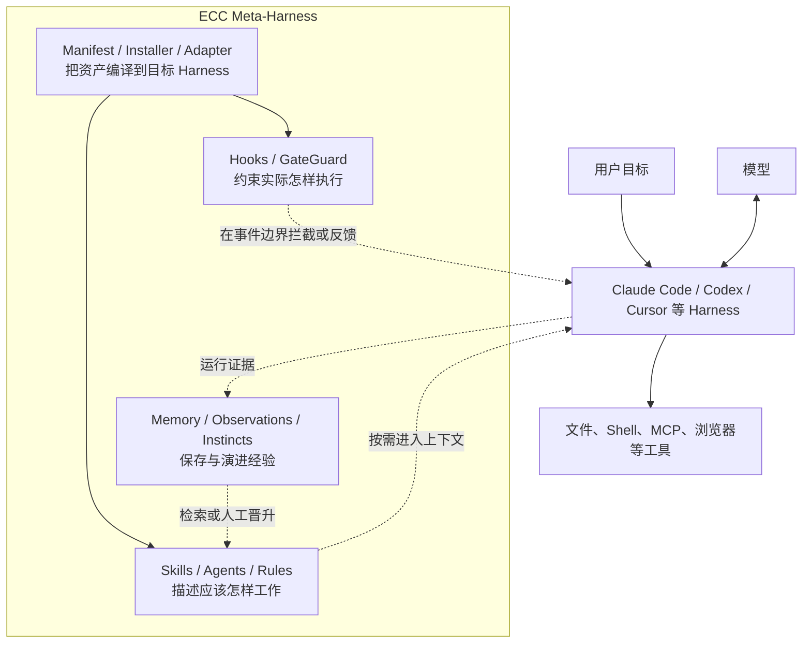

> 系列：[1. 全景](/writing/ecc-series-overview/)｜[2. 安装编译](/writing/ecc-architecture-deep-dive/)｜[3. Hook 与记忆](/writing/ecc-hook-runtime-memory/)｜[4. 供应链治理](/writing/ecc-memory-supply-chain/)｜[5. 整体判断](/writing/ecc-series-synthesis/)

如果只看仓库名字，Everything Claude Code（下文简称 ECC）很容易被理解成一套 Claude Code 配置合集：很多 Agent、Skill、Command、Rule，再加一些 Hook。

这个理解只对了一半。

截至本文分析的 [`22e8cf0`](https://github.com/affaan-m/ECC/tree/22e8cf01d0b54719b3a49002fab2ccbda4ff5b9e) 版本，ECC 已经形成一套更有野心的结构：它把一支工程团队反复使用的开发方法、工具规范、安全策略与上下文管理机制，保存为一份与模型相对解耦的“工程中间表示”，再针对 Claude Code、Codex、Cursor、OpenCode、Gemini 等 Harness 编译出不同的安装结果。

它不是一个替你调用模型的 Agent Framework，也不是一个新的大模型客户端。**ECC 更像 Agent 时代的工程策略编译器与运行时扩展层：上游维护可复用的工程意图，下游适配不同 Harness 的加载、执行和治理能力。**

这也是理解其架构的主线。286 个 Skills、68 个 Agents 和 94 个兼容命令只是表面的资产规模；真正决定系统质量的是下面四件事：

1. 怎样把大量知识变成不会淹没上下文的能力；
2. 怎样把同一套能力投射到接口并不相同的 Harness；
3. 怎样让“建议”在必要时升级为确定性的执行约束；
4. 怎样保存经验，又不让历史输出悄悄变成新的系统指令。

> [!IMPORTANT]
> ECC 最值得研究的不是“它收集了多少 Prompt”，而是它如何把 Prompt、策略、事件处理、安装状态与演进证据组织成一个工程系统。

## 先把 ECC 放对位置：它是 Meta-Harness，不是模型代理层

传统 Agent Framework 通常拥有自己的主循环：接收任务，调用模型，解析 Tool Call，执行工具，再把结果送回模型。ECC 的公开版本没有试图替代这一层。Claude Code 或 Codex 仍然掌握模型会话、工具协议、权限询问和基础执行循环。

ECC 插在另一个位置：**它管理 Agent 如何工作，而不是亲自扮演 Agent。**



*图 1｜ECC 位于模型 Harness 之外，以资产、安装器和 Adapter 把工程意图投射到不同平台。*

ECC 自己的[跨 Harness 架构文档](https://github.com/affaan-m/ECC/blob/22e8cf01d0b54719b3a49002fab2ccbda4ff5b9e/docs/architecture/cross-harness.md)给出了很准确的分工：ECC 是 reusable workflow layer，Claude Code、Codex、OpenCode 和 Cursor 是 execution surfaces。稳定的工作方式应该留在共享源中，平台文件只处理加载方式、事件格式、命令映射与能力缺口。

这带来一个很实用的判断标准：如果一个工作流换到另一个 Harness 就必须重写，它很可能还没有被抽象到正确层级。

### ECC 管的是五类不同对象

这些目录看似都是 Markdown，运行语义却不同：

| 资产 | 解决的问题 | 加载方式 | 约束强度 |
| --- | --- | --- | --- |
| Rules / `AGENTS.md` | 默认应遵守哪些长期规范 | 常驻或随项目加载 | 软约束 |
| Skills | 某类任务应该如何完成 | 按描述匹配、渐进加载 | 软约束，但流程更完整 |
| Agents | 谁以什么角色、工具和上下文完成子任务 | 由 Harness 创建隔离会话 | 受 Harness 能力影响 |
| Commands | 用户如何显式进入常见工作流 | 命令或兼容入口 | 入口层 |
| Hooks | 在工具与会话事件上必须检查什么 | 事件触发的本地进程 | 可警告、可阻断 |

这五类对象不能互相替代。把所有规范放进常驻 Rule 会造成上下文膨胀；把安全边界写进 Skill 又只能期待模型自觉执行；把每项工作都拆成 Agent，则会制造额外的上下文与协调成本。

ECC 的架构价值，首先来自把不同强度、不同生命周期的知识放进不同容器。

## 资产层：用渐进式披露对抗“上下文越多越聪明”的错觉

ECC 最显眼的部分是庞大的 Skills 目录。但它并不是要把 286 份说明一次性交给模型。

一个 Skill 通常由短描述负责被发现，完整 `SKILL.md` 只在任务命中时加载，参考材料和脚本再在执行过程中按需读取。这种结构本质上是三级索引：

```text
能力目录与 description
        ↓ 命中任务后
SKILL.md 的约束与工作流
        ↓ 确实需要时
references / scripts / examples
```

因此，Skill 的价值不只在于复用提示词，更在于控制注意力预算。模型先看到“有哪些能力”，再读取“这一项怎么做”，最后才取用证据或执行脚本。仓库首页那句“Optimize the context window. Persist everything else”不是宣传口号，而是资产设计的核心约束。[README](https://github.com/affaan-m/ECC/blob/22e8cf01d0b54719b3a49002fab2ccbda4ff5b9e/README.md)也明确把 ECC 描述为从计划、测试、实现、审查、验证到记忆和改进的连续流程。

这里可以看出 ECC 与普通 Prompt 仓库的差别：

- Prompt 仓库保存的是“某次应该说什么”；
- Skill 保存的是“某类任务如何被发现、执行与验证”；
- Rule 保存的是“长期默认成立的约束”；
- Hook 定义配置匹配时触发的检查，实际执行与阻断能力取决于事件类型和运行配置；
- Memory 保存的是“未来可能有用、但尚未成为规则的上下文”。

这套分类把知识的**适用范围、加载时机、可信度与执行强度**分开了。

### Profile 与 Module：规模扩大后的第二道上下文阀门

ECC 没有要求每个用户安装整个仓库。`manifests/install-profiles.json` 定义 `minimal`、`core`、`developer`、`security`、`research` 和 `full` 等配置；`install-modules.json` 再把资产划分为 `rules-core`、`agents-core`、`hooks-runtime`、`workflow-quality`、`framework-language`、`security` 等模块，并记录依赖、目标平台、成本和稳定性。

因此安装不是“复制全部文件”，而是一次能力解析：

```text
用户选择 Profile / Module / Component
              ↓
解析依赖与目标平台兼容性
              ↓
生成文件复制、JSON 合并、路径改写等操作计划
              ↓
安全应用并记录所有权与内容摘要
```

这解决了大目录必然遇到的两个问题：一是用户不需要的 Skill 也会增加发现噪声；二是 Hooks、Rules 等高影响资产不应该在用户不知情时自动叠加。

## 安装层才是隐藏的核心：ECC 实际上实现了一个小型编译器

如果只阅读 Markdown，会低估 ECC 的工程复杂度。真正把“共享源”变成“可运行安装”的核心位于 `manifests/` 与 `scripts/lib/install*`。

把这条链类比成编译器会更容易理解：

| 编译器概念 | ECC 中的对应物 |
| --- | --- |
| 源语言 | Skills、Rules、Agents、Hooks、MCP 配置 |
| 构建参数 | Profile、Module、Component、目标 Harness |
| 中间表示 | Manifest 解析后的 Install Plan |
| 后端 | Claude、Codex、Cursor、OpenCode 等 target adapter |
| 代码生成 | copy-file、merge-json、内容转换、链接重写 |
| 构建记录 | install state、来源版本、操作清单、SHA-256 |
| 增量修复 | doctor、repair、uninstall |

在源码中，`createManifestInstallPlan()` 会先解析 Manifest，再选择 Target Adapter，把目录级 Scaffold 展开为具体文件操作，最后生成安装状态预览。[安装计划实现](https://github.com/affaan-m/ECC/blob/22e8cf01d0b54719b3a49002fab2ccbda4ff5b9e/scripts/lib/install/plan.js)甚至会去重写向同一目标的复制操作，避免通用文件与平台特化文件相互覆盖后，让 `doctor` 永久误报漂移。

Target Adapter 则统一暴露几类能力：

- 判断自己是否支持某个目标名称；
- 验证当前环境；
- 计算目标根目录和安装状态路径；
- 把共享 Module 转换为目标平台上的操作列表。

当前注册表中有 Claude Home、Claude Project、Codex Home、Cursor Project、OpenCode Home、Gemini Project、Hermes、Kimi、Qwen、Zed 等多种适配器。[适配器注册表](https://github.com/affaan-m/ECC/blob/22e8cf01d0b54719b3a49002fab2ccbda4ff5b9e/scripts/lib/install-targets/registry.js)说明所谓“跨平台”不是把同一文件复制到十五个目录，而是共享语义、分别落盘。

仓库实际上还有第二组 Adapter：安装 Adapter 负责把资产投射到文件系统，Session Adapter 则把 Claude History、Codex Worktree、OpenCode 与 dmux / tmux 的运行状态归一化为 `ecc.session.v1` 快照。前者解决“能力怎样安装”，后者解决“控制平面怎样看懂正在运行的会话”。二者如果混在一起，安装器就会被会话生命周期污染；ECC 把它们拆开，是走向多 Harness 控制平面的关键一步。

### Plan 与 Apply 分离为什么重要

ECC 把解析计划与执行计划拆开，这不只是为了支持 `--dry-run`。

Agent 工具链的安装目标通常位于用户 Home 目录，里面可能已有个人规则、MCP、插件与权限设置。如果边解析边写入，一次失败就可能留下半完成状态；如果覆盖整个 JSON，又会破坏不属于 ECC 的配置。

ECC 的 Apply 层因此要处理：

- JSON 深合并，而不是整文件覆盖；
- 安装内容的相对链接改写；
- 只在受信根目录内写入；
- 读取和写入时拒绝符号链接跳转；
- 记录每个受管文件的内容摘要；
- 卸载时只移除自己能够证明拥有的内容；
- 用户修改过的旧文件不盲目删除。

这已经不是一个 `cp -R` 脚本，而是一套带所有权模型的配置部署系统。

### 架构代价：可靠性集中在安装生命周期内核

这种设计也形成了明显的风险集中点。`scripts/lib/install-lifecycle.js` 超过 2,000 行，负责发现已有安装、漂移诊断、修复计划、兼容迁移与安全卸载；不同平台的差异最终都会回流到这个生命周期内核。

它带来的好处是行为统一，代价是回归半径很大。ECC 后续最值得做的重构不是继续增加 Adapter，而是进一步把生命周期内核拆成稳定的操作代数、文件安全层、状态投影层与平台迁移层，并用跨平台 Golden Fixtures 锁定它们之间的契约。

---

上一篇：[ECC 全景](/writing/ecc-series-overview/)。

资产与安装器解决了“同一份工程意图怎样到达不同平台”。下一篇继续看 Hook 如何在确定性事件上执行约束，以及记忆为什么只能作为低信任输入。

下一篇：[ECC 运行](/writing/ecc-hook-runtime-memory/)。
