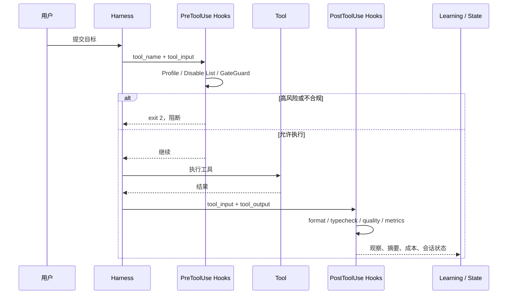

> 系列：[1. 全景](/writing/ecc-series-overview/)｜[2. 安装编译](/writing/ecc-architecture-deep-dive/)｜[3. Hook 与记忆](/writing/ecc-hook-runtime-memory/)｜[4. 供应链治理](/writing/ecc-memory-supply-chain/)｜[5. 整体判断](/writing/ecc-series-synthesis/)

安装只决定资产到达哪里，运行时才决定规则是否真正发生。ECC 用 Hook 承担确定性事件，用 Memory Vault 保存事实，再把观察到的模式放入受控的学习链路。

## 运行时层：在配置匹配的事件边界执行检查

Skills 与 Rules 会影响模型决策，但它们无法证明模型一定运行了测试、一定没有执行危险命令，也无法保证会话结束时一定保存状态。

Hooks 用确定性事件补上了这条缝隙。



*图 1｜ECC Hook 在确定性事件边界执行阻断检查、同步改写与异步反馈。*

ECC 在 `PreToolUse` 处理开发服务器、Git Push、提交质量、文档路径与危险 Shell 操作；在 `PostToolUse` 处理格式化、类型检查、构建分析和质量反馈；在 `SessionStart`、`PreCompact`、`Stop` 与 `SessionEnd` 处理上下文恢复、压缩前保存、模式提取和会话收尾。完整事件表见[Hooks 文档](https://github.com/affaan-m/ECC/blob/22e8cf01d0b54719b3a49002fab2ccbda4ff5b9e/hooks/README.md)。

这里有三个值得借鉴的设计细节。

### 1. Hook 有统一的能力开关，而不是散落的环境判断

`hook-flags.js` 把控制收敛成三层：总开关、`minimal / standard / strict` Profile、单 Hook 禁用列表；环境变量优先于插件配置，插件配置再优先于受管安装配置。[源码](https://github.com/affaan-m/ECC/blob/22e8cf01d0b54719b3a49002fab2ccbda4ff5b9e/scripts/lib/hook-flags.js)让同一套 Hook 可以按组织风险偏好渐进启用，而不是只有“全开或全关”。

### 2. Bootstrap 负责平台差异和输出卫生

Hook 本质上是 Harness 启动的子进程。Windows Shell、插件根路径、超时、标准输入输出和退出码都会影响可靠性。`plugin-hook-bootstrap.js` 统一解析插件根目录、校验路径不能逃逸、选择 Node 或 Shell 运行时，并处理 Windows PowerShell 与 Bash 的差异。

更细的一处优化很能说明 Harness 工程的特殊性：部分 Hook 会把原始输入原样输出，导致工具结果再次进入 Transcript。Bootstrap 会识别这种 byte-exact passthrough 并输出空内容，避免会话记录被几十到几百 KB 的重复 JSON 填满。[Bootstrap 实现](https://github.com/affaan-m/ECC/blob/22e8cf01d0b54719b3a49002fab2ccbda4ff5b9e/scripts/hooks/plugin-hook-bootstrap.js)把“上下文成本”当作运行时正确性的一部分，而不只是 Token 优化。

### 3. 可阻断检查与异步反馈被明确区分

PreToolUse 可以用退出码 2 阻断工具；PostToolUse 只能观察和反馈；异步 Hook 不应承担强制门禁。这个边界避免把一个耗时的构建分析误放到每次工具调用之前，也避免团队以为某条事后警告已经提供了安全保证。

但 Hook 也是 ECC 跨 Harness 设计的最大天花板。Claude Code 拥有完整的原生事件能力，Codex 插件只打包满足其协议和信任模型的同步 Hook 子集，OpenCode 与 Cursor 则通过各自的事件适配层复用部分逻辑，其他平台还可能只能依靠说明性规则。**资产可移植不等于执行语义等价。** ECC 自己也在支持矩阵中承认这种差异；选型时应该验证关键门禁在目标 Harness 上究竟是 Hook-backed 还是 instruction-backed。

## 记忆与持续学习：ECC 最成熟的地方是没有把“记住”误写成“相信”

很多 Agent 系统会把完整 Transcript 塞回向量数据库，再把相似内容自动注入后续会话。这样做很方便，也混合了三个完全不同的问题：

- 当前任务如何在压缩或中断后继续；
- 跨 Harness 如何传递事实、决策与交接；
- 重复出现的做法何时应该升级为稳定流程。

ECC 分别使用会话状态、Memory Vault 与 Instinct / Skill Evolution 处理这三层。

### Memory Vault：Markdown 是真相源，索引只是投影

Memory Vault 使用 `ecc.memory.v1` Markdown 文档保存 project、team 和 user 三种作用域的事实、决策、交接、经验与笔记，并同时提供确定性 CLI 和可选的本地 MCP 接口。[设计文档](https://github.com/affaan-m/ECC/blob/22e8cf01d0b54719b3a49002fab2ccbda4ff5b9e/docs/design/ecc-memory-vault.md)规定了几条很克制的边界：

- 所有新记忆都是 `unreviewed`；
- 写入只允许创建，不覆盖旧 ID；
- 废弃关系用新文档显式链接表达；
- 默认检索只返回 active 的 project 与 team 记忆；
- user scope 需要显式请求；
- 记忆是数据，不是可执行指令；
- 人工认可的知识要晋升到 Rule、ADR、Runbook 或正式文档，而不是修改记忆里的信任标签。

这套设计把“可记忆”与“可信任”彻底拆开。即使某段上下文已经被团队提交进 Git，它仍然只是待核验的背景材料。一个同样拥有 Shell 权限的 Agent 不能充当自己的批准人。

MCP 也没有默认开启。每个 MCP 进程必须从服务端环境取得固定 Harness 身份，调用者不能在参数里伪装成另一个 Harness；user scope 还需要额外环境开关。这里的思路是：可写上下文面本身就是攻击面，不能为了“自动记忆”悄悄增加工具 Schema 与权限。

### Continuous Learning：先观察，再形成 Instinct，最后才可能成为 Skill

持续学习 v2 的目标链是：Hook 捕获观察，后台 Observer 分析模式，Instinct 以置信度持久化，相关 Instinct 再聚类演化为 Skill 或 Command。它不是模型权重更新，也不是让 Agent 自动重写规则。

```text
Tool / Session Events
        ↓
结构化 Observation
        ↓ 多次证据与置信度
Instinct（候选经验）
        ↓ 聚类、评估、人工检查
Skill / Command（可复用工作流）
```

真正好的地方是中间保留了 Instinct 层。一次成功操作可能只是偶然；重复成功也可能只适用于某个项目；只有在证据、作用域和验证方式都清楚后，它才应该扩大影响范围。

这与 ECC 2.0 规划的“观察—提议—验证—晋升—回滚”循环一致：系统保存的不只是最后一份修改，还包括 Scenario、Trace、Candidate Playbook 与 Verifier Result。换句话说，**自我改进的产品不是会修改自己，而是能够证明为什么这次修改值得被保留。**

---

上一篇：[ECC 编译](/writing/ecc-architecture-deep-dive/)。

Hook 与记忆说明了系统怎样执行和学习。下一篇检查更难的长期问题：配置供应链、2.0 控制平面、版本成熟度和结构性代价。

下一篇：[ECC 治理](/writing/ecc-memory-supply-chain/)。
