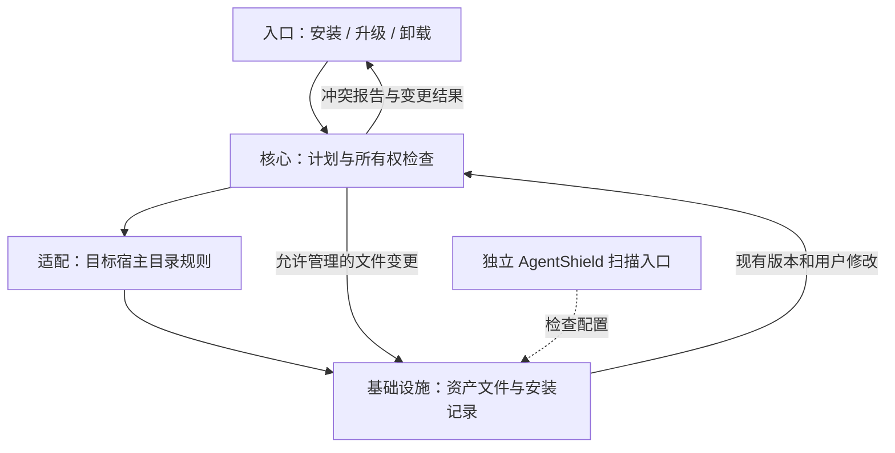
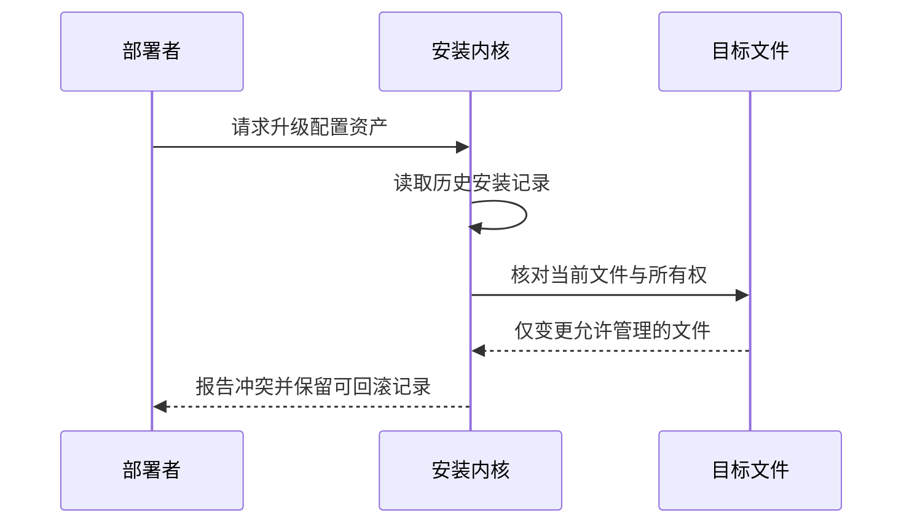

## 定位与价值

本篇关注配置资产的升级和退出：安装器能否保留用户文件，经验更新能否回滚，Alpha 控制面提供了哪些可验证机制。

完整定位与安装见[项目总览](/writing/ecc-architecture-deep-dive/)。

研究基线：[affaan-m/ECC @ 22e8cf0](https://github.com/affaan-m/ECC/blob/22e8cf01d0b54719b3a49002fab2ccbda4ff5b9e/README.md)；源码与社区核对日期为 2026-09-06。

## 技术架构



*图 1｜职责与数据流；逻辑分层不要求分开部署。*

## 核心机制



*图 2｜本篇关键流程的职责示意；部署者提出的验收要求与框架内建行为需按正文区分。*

### 安装与运行的供应链边界

AI 编程工具的攻击面不只在生成的业务代码。一个恶意 Skill、过宽的 MCP 权限、一段被篡改的 Hook 或一个允许任意 Shell 的配置，都可能在模型真正开始写代码之前突破边界。

ECC 的安全模型分成四层：

| 层级 | 机制 | 处理的风险 |
| --- | --- | --- |
| 安装边界 | trusted root、路径包含校验、no-follow 读写、所有权记录 | 路径逃逸、符号链接、误删用户文件 |
| 执行边界 | GateGuard、PreToolUse 阻断、Profile | 危险 Shell、绕过校验、误操作 |
| 配置审计 | AgentShield | Prompt、Hooks、MCP、权限、Secrets 与 Agent 文件风险 |
| 演进治理 | 未审查 Memory、Instinct 晋升、Evaluator Gate | 污染长期上下文、错误经验扩散 |

其中 AgentShield 是独立发布的扫描器，不应与 ECC 主仓库中的 Hook 混为一谈。ECC 负责提供入口和安全工作流，AgentShield 负责静态与运行时安全检查；更完整的 Hosted Fleet 与 Enterprise Policy 仍属于路线图。主仓库的[安全说明](https://github.com/affaan-m/ECC/blob/22e8cf01d0b54719b3a49002fab2ccbda4ff5b9e/SECURITY.md)和[AgentShield 路线图](https://github.com/affaan-m/ECC/blob/22e8cf01d0b54719b3a49002fab2ccbda4ff5b9e/docs/architecture/agentshield-enterprise-research-roadmap.md)必须结合阅读，才能区分已经存在的本地扫描能力与尚未完成的企业平台。

ECC 的安全取向不是声称“所有攻击都能检测”，而是尽量缩小每一步的权力：安装器只写受信根目录，Memory 不自动成为指令，MCP 不默认开放，强制门禁放在 PreToolUse，扫描器提供独立证据，未来的策略变更还要经过评估与晋升。


### Alpha 控制面与采用验证

#### ECC 2.0：Rust 控制平面是真实 Alpha，不是现有系统的同义词

仓库里最容易被误读的是 `ecc2/`。

ECC 2.0 的[参考架构](https://github.com/affaan-m/ECC/blob/22e8cf01d0b54719b3a49002fab2ccbda4ff5b9e/docs/ECC-2.0-REFERENCE-ARCHITECTURE.md)规划了五层：Operator Surface、Harness Adapter、Worktree / Session / Queue Runtime、Observability / Evaluation Loop，以及 Security / Commercial Platform。它希望从“安装在现有 Harness 里的资产层”继续向上，形成多会话、多 Worktree、可观察、可评估的 Agent 控制平面。

当前 Rust 实现已经具备：

- 基于 SQLite 的 Session Store；
- Session start / stop / resume 与后台 Daemon；
- Worktree 感知的会话脚手架；
- 输出流、风险评分、通知与基础多会话状态；
- 上下文图谱、观察、召回与压缩原语；
- 候选 Harness 配置的摘要寻址、基线比较、晋升与回滚审计。

尤其值得注意的是 Harness Evaluation：候选配置先以 SHA-256 地址保存，再用相同 Seed 与基线做配对比较；只有满足样本数、均值增益、胜率和健康检查时才晋升，SQLite 事务同时更新 active pointer 与审计证据，失败则恢复原指针。

但 [`ecc2/README.md`](https://github.com/affaan-m/ECC/blob/22e8cf01d0b54719b3a49002fab2ccbda4ff5b9e/ecc2/README.md)明确写着 Alpha。当前评估器只读取操作者提供的测量结果，不调用网络、模型或 Shell；证据引用和分数也是操作者声明，不是经过认证的事实。更丰富的多 Agent 编排、可视化 Diff Review、完整跨 Harness 恢复语义和发布安装链仍在建设中。

因此，谈 ECC 时必须同时保留三条时间线：

| 层 | 当前成熟度 | 正确理解 |
| --- | --- | --- |
| Skills / Agents / Commands / Rules | 大规模可用 | 内容与工作流资产库 |
| Manifest Installer / Hooks / Memory CLI | 已有真实实现与测试 | 当前工程内核 |
| ECC 2.0 Control Plane / Hosted Platform | Rust Alpha 与路线图并存 | 需要继续验证，不能按 GA 能力采购 |

#### 采用时验证五个故障场景

以下是基于固定提交 `22e8cf0` 的采用建议，不是本文完成过的测试结果。先选择一个目标 Harness 和最小安装 Profile，再检查：

| 场景 | 应观察的结果 | 不能据此推断什么 |
| --- | --- | --- |
| 安装后用户手动修改受管文件 | doctor 标出漂移，卸载保留用户变更 | 内容摘要不能证明文件业务正确 |
| 目标平台没有所需阻断事件 | 能力矩阵标记缺口，用独立 CI 或受控执行器补足 | 安装成功不代表门禁生效 |
| Hook 被禁用或超时 | 高风险路径按明确策略停止，并留下记录 | 事后告警不能撤销已执行操作 |
| 一条错误 Memory 被多次召回 | 保留来源与未审查状态，不自动晋升 Rule | 高频出现不代表经验可信 |
| Evaluator 收到人为夸大的分数 | 能追溯输入证据，晋升前有独立复核 | Alpha 的事务审计不能认证测量真实性 |

ECC 的可复用部分是资产类型、可预览安装计划、文件所有权和平台适配边界。代价是维护多平台语义差异、资产过期与额外的安装生命周期。需要自有模型循环时，应另选运行框架；需要生产级多会话控制面时，应单独验证 ECC 2.0，而不能从成熟的 Skills 目录推断 Alpha 的可靠性。

## 快速上手

先按[项目总览](/writing/ecc-architecture-deep-dive/#快速上手)准备运行环境；本篇的最小实验直接执行固定快照中的测试。另需按仓库贡献指南安装开发与测试依赖。

```bash
node tests/scripts/install-apply.test.js
```

检查安装变更的文件边界；在独立克隆中运行。

模型、执行环境与存储等共用配置，以及安装常见问题，见[总览的三个配置项](/writing/ecc-architecture-deep-dive/#快速上手)。本轮在固定源码的独立副本中实际运行该命令：40 项通过、0 项失败。测试使用临时夹具，不代表真实模型或生产环境已通过验收。

## 生态与社区

许可证、官方集成、提交与 Issue 样本统一见[项目总览的生态与社区](/writing/ecc-architecture-deep-dive/#生态与社区)。

## 源码阅读路径

公共安装入口见项目总览。本篇沿相关模块追踪到具体实现与测试：

| 顺序 | 目录 → 文件 | 函数、对象或验证重点 |
| --- | --- | --- |
| 1 | [scripts/install-apply.js](https://github.com/affaan-m/ECC/blob/22e8cf01d0b54719b3a49002fab2ccbda4ff5b9e/scripts/install-apply.js) | main：计划落盘入口 |
| 2 | [scripts/lib/install/config.js](https://github.com/affaan-m/ECC/blob/22e8cf01d0b54719b3a49002fab2ccbda4ff5b9e/scripts/lib/install/config.js) | 配置与安装计划校验 |
| 3 | [tests/scripts/install-apply.test.js](https://github.com/affaan-m/ECC/blob/22e8cf01d0b54719b3a49002fab2ccbda4ff5b9e/tests/scripts/install-apply.test.js) | 所有权、路径与安装失败用例 |
