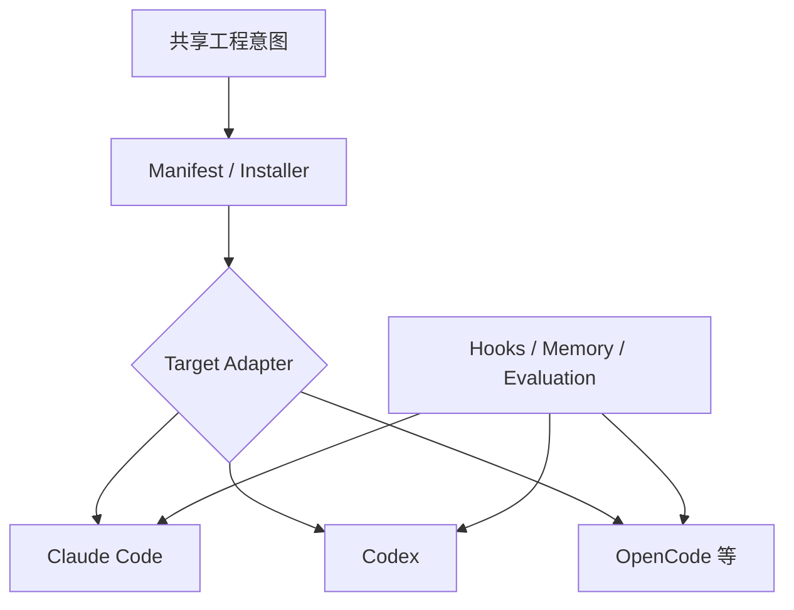

> 系列：[1. 全景](/writing/ecc-series-overview/)｜[2. 安装编译](/writing/ecc-architecture-deep-dive/)｜[3. Hook 与记忆](/writing/ecc-hook-runtime-memory/)｜[4. 供应链治理](/writing/ecc-memory-supply-chain/)｜[5. 整体判断](/writing/ecc-series-synthesis/)

ECC 的系统边界与 Hermes、Pi 不同。它不拥有模型循环，而是维护 Skills、Rules、Agents、Hooks 与 Memory 等工程资产，再通过安装计划和平台 Adapter 投射到 Claude Code、Codex、OpenCode 等执行表面。[官方仓库](https://github.com/affaan-m/ECC)

*图 1｜ECC 更像工程策略编译与扩展层，而不是新的 Agent Runtime。*

本系列依次研究资产怎样形成安装计划、Hook 如何在事件边界执行、Memory 与经验候选如何保存，以及配置供应链怎样更新和退出。贯穿问题是：共享语义可以复用，但底层 Harness 的能力差异不能被复制脚本抹平。

---

下一篇：[安装编译](/writing/ecc-architecture-deep-dive/)。

下一篇从 Manifest、Plan、Adapter 与 Install State 开始，检查“跨平台”到底做了哪些真实工作。
