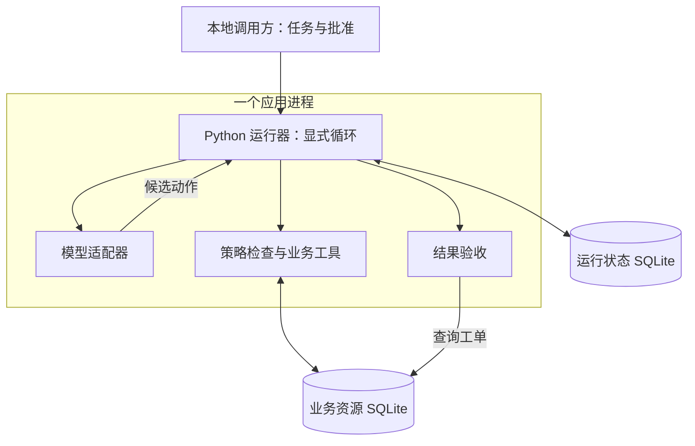
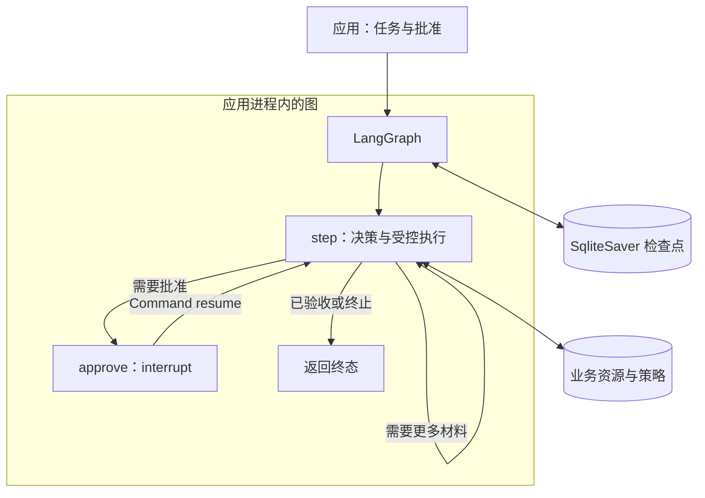
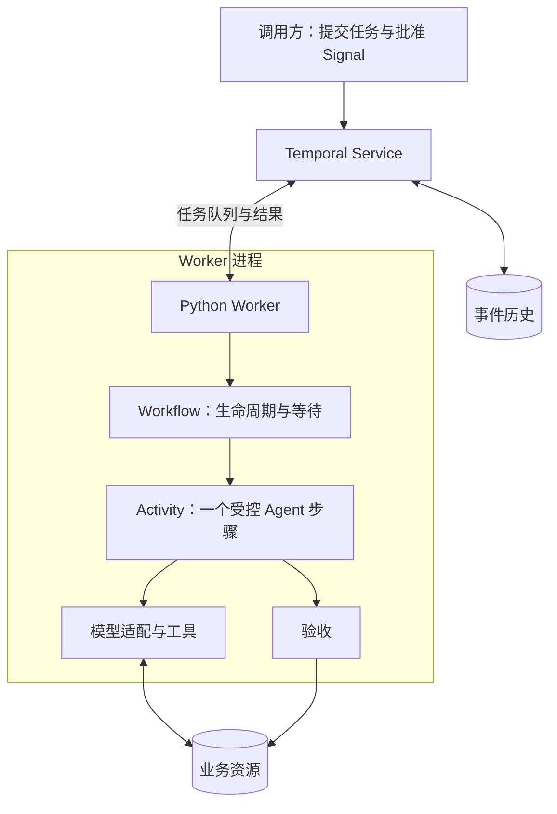
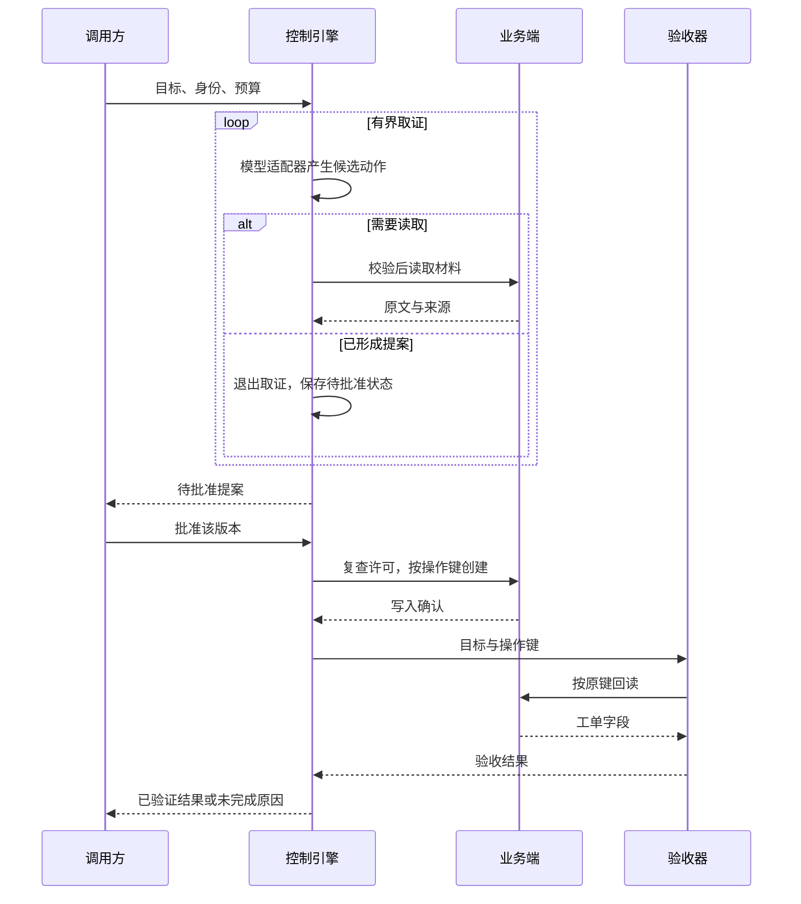
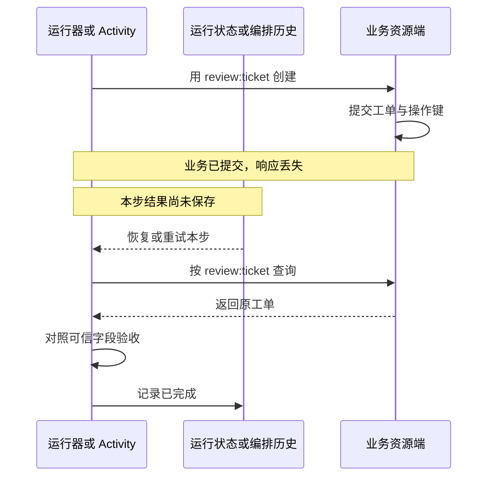

**单 Worker、流程短且容易验收，先用显式循环；分支与人工暂停成为主要复杂度时，用图式编排；任务需要跨服务等待、调度和恢复时，再评估持久工作流。** 这三个选择改变的是控制与状态管理方式，工具授权、业务幂等和结果验收都不能省略。

本文给出三套参考组合、逐模块选型与迁移条件，并附上真实运行器的[对照实验包](/labs/harness-architectures.zip)。共同逻辑架构见[模块职责与接口](/writing/harness-engineering-map/)；本文重点回答如何组装以及为什么选它。

## 用一个任务固定比较条件

资料管理员要求：检查公告与目录的生效日期，发现不一致时提出工单，批准后创建并返回可查询结果。以下数据是教学设定：

| 材料 | 内容 | 在任务中的作用 |
| --- | --- | --- |
| 公告 `notice` | 9 月 1 日发布，9 月 15 日生效 | 原始来源，两个日期含义不同 |
| 目录 `catalog` | 生效日期记为 9 月 1 日 | 需要核对的记录 |
| 工单提案 | 字段为 `effective`，两侧值分别为 9 月 15 日与 9 月 1 日 | 说明冲突；不自动改写目录 |

运行器必须读到两份材料再形成提案；写入需经批准；恢复后同一逻辑创建只能对应一条工单。验收器按预先固定的标准查询实际字段。工单中的 `source` 指向公告，`observed` 是公告值，`recorded` 是目录值，不能交换。

对照实验用固定响应模拟模型按观察结果选择下一步；数据、控制引擎与 SQLite 写入真实运行。它验证编排和恢复契约，不测模型能否理解任意公告。将固定响应替换为真实模型后，还需重新评测证据提取与工具选择。

## 先确定约束，再选择控制引擎

| 需求 | 对设计的影响 |
| --- | --- |
| 已给定字段，只需创建 | 可以直接执行固定流程，不必调用模型 |
| 读完材料才知道下一步 | 需要有界决策循环和工具结果回传 |
| 等待用户批准 | 保存提案和运行状态，批准到达后重新检查当前许可 |
| 写入成功但响应丢失 | 按稳定操作键查询；不能换新键盲目创建 |
| 多 Worker 或跨服务 | 明确执行权、重复派发、凭证及共享存储边界 |
| 更换框架或升级代码 | 版本化状态与接口；测试旧任务如何恢复或退出 |

三个参考组合不是性能等级。图可以包含循环，持久工作流也可以调用运行图的 Worker；控制流与部署方式是独立维度。组合时应明确谁拥有重试、取消与恢复，防止两层各自重新发起同一个业务动作。

## A：显式循环与本地事务存储

*图 1｜A 的对照实现使用同进程工具与两份数据库。运行状态与业务资源分开提交，保留需要对账的故障窗口。*

**具体组合：** Python 函数、严格字段校验、显式状态循环、运行 SQLite、业务 SQLite、确定性验收。线上模型可通过一个小适配器接入；不必为了复用同进程函数先增加 MCP 服务。

`run_explicit()` 每步保存运行状态；等待时返回，由调用方再次启动。`Business.create()` 将操作键与工单放在同一事务中。恢复先查询业务库，再决定是否执行写入。

**优点：** 控制路径短，状态与预算容易检查，依赖和部署步骤少。替换模型或工具不要求迁移整个框架。

**代价：** 等待入口、状态版本、任务接管和调度都由应用维护。循环短不代表恢复天然正确；写入与保存检查点之间仍然可能退出。

**适用范围：** 个人工具、单 Worker、流程短且失败出口有限的任务。分支增加并不立即要求换框架；当自行维护暂停、节点恢复和状态流的成本持续上升时，再比较 B。

已有 [Mini Harness 实战](/series/harness-integration/)是 A 的另一种接线：同进程工具换成真实 MCP 子进程，仍保持运行状态、资源与验收的分工。

## B：图式编排与持久检查点

*图 2｜B 将继续、暂停和恢复交给图运行器。检查点保存图状态，业务工单仍由工具服务的事务契约保护。*

**具体组合：** LangGraph `StateGraph`、`SqliteSaver`、`interrupt()` / `Command(resume=...)`，复用 A 的工具与验收。实验把步骤压缩为 `step` 和 `approve` 两个节点，以隔离控制引擎差异；实际分支增多后可拆成检索、核验与提交节点。

LangGraph 的 checkpointer 保存 thread 范围内的状态，store 用于跨 thread 数据。二者均不能替代业务工单库。[持久化文档](https://docs.langchain.com/oss/python/langgraph/persistence)

**优点：** 状态流、分支与人工暂停有明确表达；恢复不必由应用自行维护全部游标。图也便于定位一次任务停在哪个节点。

**代价：** 需要理解节点重执行、字段合并与检查点语义。`interrupt()` 恢复时会重新执行所在节点；因此实验的批准节点只返回批准决定，没有在中断前写业务资源。[中断规则](https://docs.langchain.com/oss/python/langgraph/interrupts)

**适用范围：** 多个业务阶段、人工接管、分支汇合成为主要复杂度的应用。引入图并不会自动得到分布式任务服务；并发 Worker、任务分配和数据库连接管理仍要明确。

对比自写循环时，重点看新增业务分支是否更容易维护、故障是否更容易定位，不用“节点更多”证明架构更完整。图与循环的关系见[Loop 与 Graph](/writing/loop-graph-engineering/)。

## C：持久工作流与 Agent Worker

*图 3｜C 把任务历史与执行者分开。验证使用本地 Temporal 服务；生产部署还需持久后端、访问控制及按执行内容选择的 Worker 隔离。*

**具体组合：** Temporal Service、Python Worker、Workflow、Activity、业务存储和验收器。Workflow 等待批准 Signal；Activity 处理模型或工具 I/O；事件历史保存已完成步骤的结果。对照实现使用本地服务的内存后端，因此验证了 Worker 更换后的恢复，没有验证服务端宕机后恢复。

Workflow 通过历史重放恢复执行，需要遵守确定性约束；模型调用、数据库与外部服务 I/O 放进 Activity。已记录结果的重放与失败 Activity 的重试是不同过程。[Workflow 文档](https://docs.temporal.io/workflows)

**优点：** 等待、重试与执行者生命周期有明确所有者；Worker 退出时，任务记录可以继续由服务维护。适合将长任务状态与某个应用进程解耦。

**代价：** 增加服务、Worker、队列和历史版本的运行维护。Activity 可能重试，业务操作仍需幂等或对账；代码升级还要检验历史兼容性。把普通短请求全部包装成持久工作流，会增加不必要的调度边界。[Activity 执行与重试](https://docs.temporal.io/activity-execution)

**适用范围：** 任务需要长时间等待、跨服务推进或由不同 Worker 接管。选择前先确认团队能维护这套基础设施；只是分支多，并不足以成为引入 C 的理由。

## 正常路径：三套组合共享同一业务契约

*图 4｜共同正常时序，省略故障出口。循环内只有候选为读取时才调用读取工具；形成提案后退出取证并等待批准。A 由应用持久化并再次调用，B 用检查点与 resume，C 用历史与 Signal 承接等待。*

### 从本地验证到服务部署，要补哪些配置

| 组合 | 本地已运行组合 | 服务化时的明确设计选择 | 新增责任 |
| --- | --- | --- | --- |
| A | 单进程、两份 SQLite 文件 | 先保留一个 Worker 和持久卷；需要共享访问时用 PostgreSQL 保存任务与业务记录 | 任务认领、租约、备份和调度仍由应用实现；不能同时启动两个无所有权约束的循环 |
| B | StateGraph + SqliteSaver | 多 Worker 候选为 PostgreSQL checkpointer，业务资源另存 | 验证目标版本的连接池、thread 隔离、状态合并和旧节点兼容；checkpointer 不负责认证 |
| C | 本地内存服务 + Python Worker | 自托管 Temporal 配持久后端，或采用托管服务；Worker 按信任域分队列与凭证 | 验证服务备份恢复、命名空间访问、历史保留、代码版本和 Activity 重投；队列名称本身不是权限隔离 |

这是部署方案，后两列未在本地实验中验证。候选持久组件依据 [LangGraph 持久化说明](https://docs.langchain.com/oss/python/langgraph/persistence)与 [Temporal 部署指南](https://github.com/temporalio/documentation/blob/main/docs/production-deployment/self-hosted-guide/deployment.mdx)，核对日期为 2026-09-06。数据库迁移不能只复制记录：旧任务的执行权、批准版本和操作键要一起交接。涉及不可信代码时，再按[执行安全](/writing/harness-engineering-security/)配置沙箱；本例固定业务工具没有执行任意代码的需求。

## 同一故障，三套架构都要回答

*图 5｜换控制引擎不消除提交窗口。实验通过资源查询恢复，三套实现都只创建一条工单。*

这里的操作键由运行器生成，模型不能修改。生产中还需加入租户与逻辑动作范围，并定义去重记录留存期。若远端查询最终一致，“没有查到”不能立即证明没有写入，应等待、对账或交由人工处理。完整边界见[事务、幂等与恢复](/writing/harness-engineering-recovery/)。

取消也不能撤销已提交资源。批准前取消可以阻止写入；提交后取消必须报告已有影响，删除或补偿应作为单独动作处理。

## 逐模块选择：默认组合与替换条件

下表是针对上述案例的设计建议。实验验证控制契约，不构成所有候选组件的性能排名。

| 模块 | 起点 | 替代方案与收益 | 代价／替换条件 |
| --- | --- | --- | --- |
| 任务与动作契约 | 明确字段、预算、操作身份；严格校验 | Pydantic / JSON Schema 便于扩大结构与跨语言协作 | 仍需检查业务语义；Schema 合法不等于完成目标 |
| 模型接入 | 单 Provider 小适配器 | 网关便于集中路由、用量与故障策略 | 多 Provider 的工具协议和能力要逐项核对；确有替换需求再加 |
| 上下文 | 当前任务、已授权原文、最近工具结果 | 检索或摘要用于材料定位与预算控制 | 带来源、版本和排除理由；收益须由遗漏率与验收结果验证 |
| 循环与编排 | A 的显式状态 | B 表达分支与暂停；C 管持久生命周期 | 根据实际控制复杂度选，不能靠框架名字决定 |
| 工具 | 同进程函数 | 业务 HTTP API 用于已有服务；MCP 用于跨宿主工具共享 | 网络、身份、会话与协议维护成本增加；MCP 不负责整个 Agent 的运行 |
| 状态 | 单 Worker 的 SQLite | 共享数据库或持久编排后端支持更多执行者 | 迁移要同时处理所有权与并发，不能只替换连接串 |
| 权限与隔离 | 固定业务工具、服务端策略检查 | 开放 Shell 时使用受控执行环境与隔离 | 隔离强度取决于不可信代码和凭证暴露范围；三种架构都需处理 |
| 验收与观测 | 独立查询、确定性字段检查、运行记录 | 语义任务增加校准过的评委或人工复核，跨服务增加 Trace | 自评不能替代证据；埋点不能替代业务状态 |
| Skills 与长期记忆 | 当前任务无需接入 | 重复方法沉淀为 Skill；跨任务有效事实进入记忆 | 增加版本、权限、纠错和删除责任；不要默认全量保存 |
| 多 Agent | 单 Agent／确定步骤 | 独立资料可委派，集中汇总和最终提交 | 只有并行收益超过协调与审查成本才采用 |

MCP、记忆系统和框架不是同一层的替代选项。MCP 的 host/client/server 架构解决工具等能力的连接边界，应用仍负责运行控制。[MCP 架构](https://modelcontextprotocol.io/docs/2026-07-28/learn/architecture) 记忆实现的详细比较见[记忆生命周期](/writing/agent-memory-design-competitive-analysis/)，协作边界见[多 Agent 责任](/writing/harness-operations-multi-agent/)。

## 已验证什么，尚不能据此判断什么

验证环境为 Python 3.11.9、LangGraph 1.2.11、SQLite checkpointer 3.1.1、Temporal Python SDK 1.32.0；本地 Temporal CLI 1.8.3 / Server 1.31.2。完整输入、结果与运行说明保存在[实验包](/labs/harness-architectures.zip)中。

| 场景 | A / B / C 的预期结果 |
| --- | --- |
| 给定字段的固定流程 | 不调用模型替身，批准后创建并验收 |
| 读取两份材料后生成提案 | 三次固定决策完成读取与提案，批准后创建 |
| 写入提交后响应丢失 | 恢复查询既有资源，工单数保持 1 |
| 提案夹带 `approved` 字段 | 拒绝，工单数为 0 |
| 决策预算为 1 | 资料未读齐即耗尽，工单数为 0 |
| 等待期间撤权或取消 | 批准信号不覆盖当前策略，不创建工单 |
| 无法识别的状态版本 | 返回 `migration_required`，不继续写入 |

八个场景每个引擎重复三次，共 **72 次契约检查通过**。另外验证 A、B 在新进程中从批准前状态恢复，C 更换 Worker 后从历史恢复，以及提交后取消、同键参数冲突等资源契约。

这些结果支持“本样例的暂停、恢复与业务边界按预期执行”。它们不支持三种方案的生产完成率排名。原始耗时包含本机调度、检查点和测试轮询差异，未做隔离基准；真实模型费用、多租户安全、服务端灾难恢复与规模吞吐未测。状态版本测试验证的是拒绝未知版本，不是自动迁移已经实现。

## 最终选择与迁移步骤

对本例的单用户起点，选择 **A**：两次读取、一份提案、一次批准和一次创建都能直接表达。以后若增加多种批准分支、返工与汇合，先比较 **B**；若任务需要脱离应用进程持续等待、跨服务接管，再评估 **C**。

迁移应保留业务操作身份和验收标准：

1. 固定任务 Schema、工具契约、操作键与业务查询接口，将它们与控制引擎解耦。
2. 让新运行器以相同输入运行只读或隔离实验，比较正常与故障路径。
3. 明确旧任务的处理方式：由旧版本排空、显式迁移，或结束后新建；不能让两个引擎同时拥有同一任务的写入权。
4. 先迁移小范围任务，保留旧版本和回退条件。回退运行器不能撤销已产生的业务资源。

如果 B 嵌入 C，建议由 C 管任务生命周期和外层重试，B 管一次活动中的局部决策。需要长期人工等待时，可由 C 保存待批准产物并接收信号，再启动后续活动；不要让两个引擎分别挂起一份含义不明的同一批准。

选型记录应写成可推翻的判断：“当前采用 A，因为单 Worker 和有限分支足够；承担自行维护恢复的成本。出现复杂暂停或跨服务接管时，用同一故障集重新比较 B、C。”这样才能知道何时坚持现有架构，何时值得增加组件。
