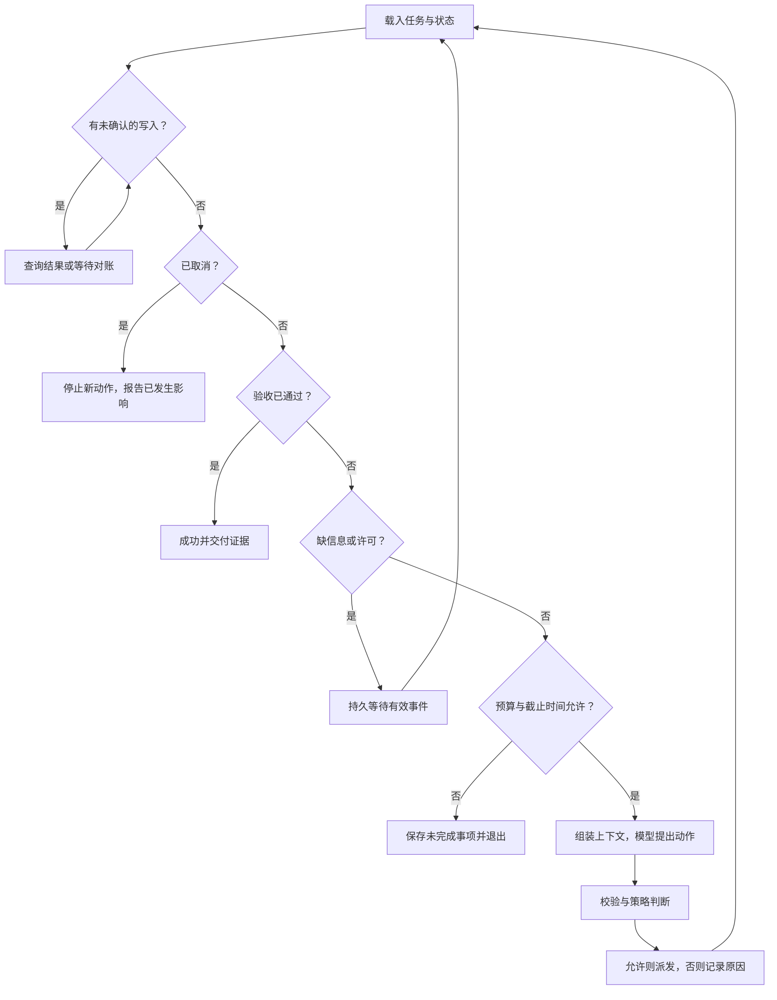

用户要求在工单系统创建一张待核验工单，并返回可查询的编号。模型只生成了标题和来源，却回答“完成了”。此时任务尚未完成：运行器还需检查许可、实际创建，再查询工单核对字段。

循环设计首先要表达这些未完成责任，再决定下一次模型调用。否则，模型停止生成、工具不再被调用和任务成功很容易混成一个状态。

当任务进一步出现多条分支与汇合，可以接续 [Loop Engineering 与 Graph Engineering](/writing/loop-graph-engineering/)，理解局部反馈循环怎样与全局执行结构组合。

## 先统一四个时间尺度

本文把 **Step** 作为一次模型决策及其关联工具处理，把 **Turn** 作为响应一次用户输入的工作段，把 **Run** 作为一次任务执行实例，把 **Session** 作为跨工作段保留的记录容器。这是教学口径，不是跨框架统一协议。

一个 Run 可能跨多个 Turn：先检索资料，等待用户补充，再创建工单。一次进程启动也可能只处理 Run 的一部分。理解这些关系后，才能讨论“重启是否恢复同一任务”，而不是只看同一个聊天窗口还在不在。

已有的 [DeepSeek 状态篇](/writing/deepseek-harness-state/)和 [Pi 内核篇](/writing/pi-architecture-deep-dive/)提供了具体实现。跨框架迁移时，优先映射事件和生命周期，不要仅映射相似的类名。

## 状态应该描述事实，而不是情绪

“思考中”“正在努力”适合作为反馈文字，却不能驱动恢复。工程状态必须让下一步动作可判定。

| 状态 | 已知事实 | 允许的下一步 |
| --- | --- | --- |
| Ready | 有任务，尚未跨越执行边界 | 准备候选动作 |
| Waiting | 缺少必需信息、审批或外部结果 | 保存现场，等待有效事件 |
| Dispatching | 已准备派发，结果尚未确认 | 接收结果或对账 |
| Verifying | 已获得执行线索 | 查询终态，核对任务契约 |
| Succeeded | 所有必需验收通过 | 交付证据 |
| Failed / Cancelled / Exhausted | 失败、取消或预算结束 | 交付原因和剩余事项 |

真实系统通常需要更细的失败类型；上表只建立主干。尤其是 `Dispatching` 不能简单转换成“失败后再试”，因为请求可能已经产生副作用。



*图 1｜先解决未确认副作用，再决定下一步。等待与对账由事件或有界调度触发，箭头回环不表示忙轮询。*

## 继续条件应包含可检查的进展

模型提出新动作只是继续的一个信号。运行时还要检查：动作是否在权限内，输入是否齐全，是否仍有预算，是否有未处理的工具结果，以及这次继续能否推进目标。

下面是策略伪代码，不是特定 SDK 的可直接运行接口：

```text
先处理已派发动作的结果或不确定状态
若收到取消：停止新派发，记录仍在途的副作用
若缺少必需信息：进入等待并给出具体问题
若验收通过：结束并附带证据
若达到预算或截止时间：保存现场并交还任务
否则：生成候选动作，经过策略检查后执行
```

“进展”可以是新证据、状态变化或一个更具体的失败原因。若连续得到同一错误、同一查询结果和同一动作，应触发重复检测或更小的重试上限。这个上限需要按任务校准；不存在适用于所有 Agent 的统一轮数。

## 等待、预算与取消需要各自的语义

**等待不应该持续消耗模型调用。** 缺少资料编号就明确问编号，等待审批就保留动作快照。恢复由有效事件触发，并重新检查当前策略，而不是每隔几秒询问模型“现在能做了吗”。

**预算必须跨重启保留。** 如果每次恢复都重新获得三次尝试，一段有界代码也会成为无限任务。生产预算可以包含费用、调用次数和截止时间；配套实验只实现持久化的派发尝试上限。失败和派发前中断也可能消耗一次尝试，目的是让最坏行为可界定。

**取消只阻止尚未发生的动作。** 已创建的工单不会因为用户点击取消而消失。如果请求在途，界面应显示“已停止后续动作，正在确认已派发请求”，而不是宣称所有修改已回滚。对已发生副作用的删除或补偿，是另一项需要明确授权的操作。

## 任务变更不能悄悄复用旧动作

用户把“核验 source-001”改成“核验 source-002”，这不是给旧工单换一个摘要即可。系统需要重新形成任务版本和动作，检查原操作是否已执行，并使旧审批失效。

配套实验选择更简单的规则：同一 Run 的目标、候选动作和预算固定，恢复时不允许偷偷改变。真实产品可以支持版本化修改，但必须记录新旧目标关系、旧操作的处理结果和新的授权依据。

## 用五个事件验证循环

准备一张状态转移表，至少演练：缺少参数、审批恢复、预算耗尽、派发前取消、派发后取消。每个场景都写清“下一次是否允许模型调用”和“下一次是否允许外部写入”。两者不一定相同。

例如，派发后取消仍可允许可信对账器读取实际工单，但不应让模型继续创建替代工单。这样的划分将产品体验与执行安全接在同一个事实模型上，也能接续已有的[任务旅程设计](/writing/claude-code-product-design/)与[结果契约](/writing/product-work-methodology/)。

## 先选择最小可用的控制方式

| 方式 | 适用条件 | 需要付出的代价 |
| --- | --- | --- |
| 固定工作流 | 步骤已知，变化主要在输入 | 维护分支与异常路径 |
| 固定主干加局部探索 | 大部分步骤稳定，少数资料需要查找 | 约束探索出口与预算 |
| 动态规划 | 子任务数量和依赖要运行时发现 | 检验拆分、循环和计划更新 |

例如“读取资料、准备工单、创建、验收”可以固定；“发现资料引用缺失后寻找原始来源”适合局部探索。不必为了使用 Agent，把原本确定的每一步都交给模型重新决定。

Anthropic 的工作流分类区分了预先定义的并行任务与运行时由协调者拆分的任务。动态拆分适合子任务无法预先列全的场景，但这不意味着所有工作都会因此受益。[Building effective agents](https://www.anthropic.com/engineering/building-effective-agents)

## 把计划节点写成执行契约

一个可执行计划节点至少要表达输入、依赖、完成证据和失败出口。下面是教学结构，不是任何 SDK 的原生 Schema：

```json
{
  "step_id": "verify-release-date",
  "plan_version": 3,
  "depends_on": ["resolve-project-identity"],
  "input_refs": ["source-001@v2"],
  "expected_evidence": ["primary-source-url", "publication-date"],
  "on_missing": "request-more-evidence",
  "write_allowed": false
}
```

任务状态可以区分待执行、进行中、等待、已验证、已失效与已取消。模型说“核验完成”只能提交候选结果；是否进入“已验证”，由节点的验收契约决定。

计划生成后也要检查基本结构：依赖是否存在、是否有环、每一步能否取得所需输入、工具是否在允许范围内，以及拆分是否仍然服务原目标。一个无法执行的计划应在派发前被发现。

## 重规划应由事实触发

值得重规划的事件包括：发现项目身份错误、必需数据不存在、工具持续不可用、用户改变目标，或剩余预算无法支撑原路径。

一个查询暂时超时，通常先进入工具层的有界恢复。若每次超时都让模型重写全部计划，既浪费成本，也可能丢掉已经确认的证据。相反，身份变更会影响后续全部资料选择，应使相关节点失效，而不仅仅是补写一句提示。

更新计划时保留旧版本、触发证据和受影响节点。已发生的写入继续按[副作用恢复契约](/writing/harness-engineering-recovery/)处理，不能因为计划不再包含该步骤就当它没有发生。

## 用同一组任务比较三种策略

从资料核验中抽取简单完整、资料缺失、名称变化和证据冲突四类任务。固定模型、工具、数据快照和总预算，比较固定流程、局部探索与动态规划。

记录独立验收结果、完成时延、重规划次数、失效工作量和人工修正成本。多试次检查稳定性，不把一次幸运探索当成策略优势。若动态规划只在资料缺失切片有收益，就只在该切片启用。

本篇交付物是[工作簿中的计划卡](/labs/harness-operations-workbook.md)：一个依赖图、三个重规划触发条件，以及每种触发对既有证据和写入的处理规则。
