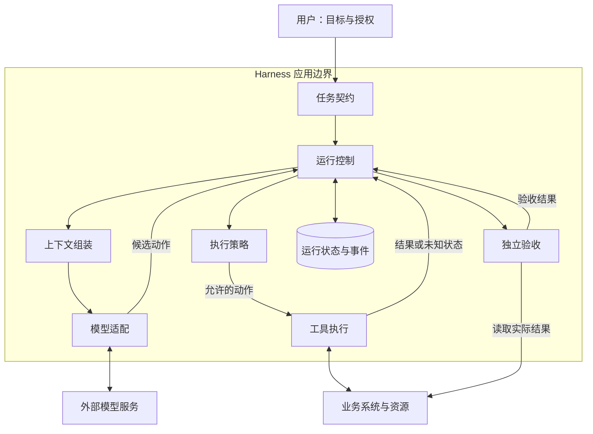

Harness 是围绕模型组织任务的运行系统。模型提出下一步，Harness 负责装配上下文、限制执行范围、保存运行状态，并用实际结果决定继续还是结束。要理解它，先把职责和接口画清，再选择实现组件。

它与提示词工程、上下文工程的关联，可先阅读 [从 Prompt 到 Context，再到 Harness](/writing/prompt-context-harness-engineering/)，沿同一个资料核验任务理解三者的分工与演变。



*图 1｜箭头表示请求或结果传递。模型提供候选动作，策略与验收分别约束执行前后。业务资源由外部系统保存。*

## 八项职责各自控制什么

| 职责 | 负责什么 | 不能用什么代替 |
| --- | --- | --- |
| 任务契约 | 目标、允许动作与完成条件 | 模型自行生成的成功标准 |
| 上下文 | 当前任务材料、状态与工具结果 | 无限追加的会话日志 |
| 模型适配 | 完整响应、候选动作与用量 | 普通文字“已经完成” |
| 运行控制 | 继续、等待、取消、预算与终止 | 没有边界的自动重试 |
| 工具执行 | 输入校验、副作用与结果结构 | 只有参数列表的 API 镜像 |
| 执行策略 | 身份、授权、审批与隔离 | 提示词中的行为期望 |
| 状态存储 | 契约、检查点、意图与有序事件 | 客户端记忆中的成功标记 |
| 独立验收 | 对照可信目标检查实际资源 | 模型自评或工具返回成功 |

模块可以合并在一个进程或文件中，职责需要分清。例如单用户 Mini Harness 可以用一个显式运行器、模型适配器、工具服务和两份 SQLite 存储实现这些接口。[Mini Harness 的模块与选型](/writing/harness-integration-map/)给出具体默认组合。

## 模块之间交换什么

以下是应用契约的设计口径，字段名不要求所有框架一致。

| 接口 | 输入 → 输出 | 调用方与状态归属 | 失败出口 |
| --- | --- | --- | --- |
| 任务入口 | 目标、允许动作 → TaskContract | 应用建立并版本化；模型只能读取 | 缺少目标或验收条件时退回澄清 |
| 上下文组装 | 契约、来源、当前状态 → ContextBundle | 运行器调用；保留来源与取舍清单 | 资料不足或预算不足时等待或缩小范围 |
| 模型适配 | ContextBundle → Proposal 与用量 | 运行器调用；提案和用量进入运行记录 | 截断、格式错误、不可用分别记录 |
| 运行控制 | 提案、事件、预算 → 下一状态 | 运行器拥有状态转移与执行权 | 等待、取消、失败或预算耗尽 |
| 执行策略 | 可信身份、动作、资源范围 → Decision | 派发前和资源端检查；模型无权批准 | 拒绝或等待与具体提案绑定的批准 |
| 工具执行 | 动作、稳定操作键 → ToolOutcome | 工具服务拥有业务资源 | 区分未执行、业务拒绝与结果未知 |
| 状态存储 | 契约、意图、事件 → 恢复依据 | 运行器写入；需版本与并发规则 | 不兼容状态阻止继续，等待迁移决定 |
| 结果验收 | 原始目标、实际资源 → Verdict | 运行器调用独立规则；保留证据 | 不满足目标时报告差异，不宣布成功 |

以“核验公告生效日期”为例：模型读到公告为 9 月 15 日、目录为 9 月 1 日后提出工单；策略检查创建许可；工具保存工单；验收器重新查询两侧日期和来源。模型不能把“提案已生成”升级成“工单已创建”。完整组合与运行证据见[架构选型](/writing/harness-architecture-selection/)。

## 三个平面帮助定位失败

控制平面决定谁可以运行、还剩多少预算、何时停下；执行平面连接模型与工具，产生读写操作；证据平面保留状态、轨迹和验收结果。

同一故障可能穿过三个平面：模型提案正确，执行服务已经写入，但响应丢失，控制器无法确定任务结果。这时重新发起请求不一定正确，应该根据业务操作键查询实际资源。[状态与恢复](/writing/harness-engineering-recovery/)展开事务、幂等和对账。

## 四份记录不要混用

- 消息历史用于构造下一轮模型输入。
- 运行事件记录提案、派发、结果与决策的先后关系。
- 检查点记录恢复所需的状态，不能自动撤销外部副作用。
- 业务资源记录系统实际完成了什么，验收最终要回到这里。

独立验收指标准与证据独立于模型的完成声明，不代表所有工具结果天然不可伪造。Agent 能同时修改代码、测试和日志时，应再使用受保护的 CI 或人工复核。

## 从小循环开始，再根据失败增加机制

先选择一个结果可核对的任务，建立“获取上下文 → 提出动作 → 受控执行 → 验收”的循环，并设置预算与停止条件。接着检查三类瓶颈：材料不足就改上下文；接口误用就改工具；结果反复不合格就补验收样本。只有这些机制仍无法处理任务时，再增加显式规划、多 Agent 或长期记忆。

Anthropic 的 [Building effective agents](https://www.anthropic.com/engineering/building-effective-agents)区分预定义工作流与模型决定路径的 Agent。这个区分有助于避免把确定任务包装成复杂自治系统。[长期应用开发案例](https://www.anthropic.com/engineering/harness-design-long-running-apps)则把需求规划、实现与真实页面验收分成不同职责：新增角色的价值要用结果验证，不能由角色数量证明。

[并行编译器实验](https://www.anthropic.com/engineering/building-c-compiler)说明多 Agent 还依赖任务隔离与可重复测试；[Managed Agents 的解耦案例](https://www.anthropic.com/engineering/managed-agents)提示不要把持久 Session 的寿命绑定到一次执行容器。两者都是架构参考，不是当前教学系统已经具备的能力。

## 第一份设计产物：任务责任卡

```text
目标：创建一张字段正确的待核验工单
模型可提出：来源与标题
应用控制：运行 ID、操作键、执行许可与预算
工具负责：按操作键查询、幂等创建
状态负责：保存提案、派发意图和有序事件
验收负责：读取实际资源，对照原始字段
失败处理：结果未知先对账；不满足目标时不宣布成功
```

这张卡确定后，按问题进入专题：循环与规划解释下一步怎么决定；工具和协议解释怎么执行；状态和恢复解释中断后怎么继续；运行治理解释如何持续维护。要动手装配，直接从 [Mini Harness 实战](/series/harness-integration/)开始。
