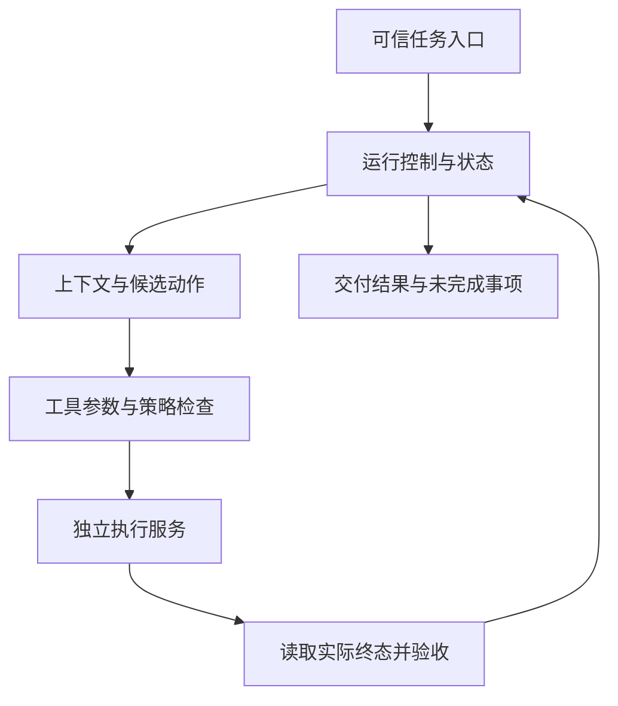

> Agent Harness 工程系列：[1. 责任地图](/writing/harness-engineering-map/)｜[2. 运行循环](/writing/harness-engineering-loop/)｜[3. 恢复与副作用](/writing/harness-engineering-recovery/)｜[4. 工具契约](/writing/harness-engineering-tools/)｜[5. 安全边界](/writing/harness-engineering-security/)｜[6. 故障实验](/writing/harness-engineering-lab/)

学习了 LangGraph、MCP、记忆库和沙箱之后，我们通常能列出一套技术栈，却未必能解释：工具已经创建工单，进程随后退出，重启时由谁决定是否再创建一次？

这个问题跨越运行时、存储、工具服务和验收。工程知识的下一步，是知道每条边界由谁守住。本系列用“为一条资料创建核验工单”贯穿六篇，从责任地图走到可执行的故障实验。

它与提示词工程、上下文工程的关联，可先阅读 [从 Prompt 到 Context，再到 Harness](/writing/prompt-context-harness-engineering/)，沿同一个资料核验任务理解三者的分工与演变。

## 先把已有知识放回地图

[旧站的九层地图](https://www.aialtas.site/)按能力与项目组织知识；新站的 [可塑 Harness](/writing/composable-agent-harness-architecture/)、[DeepSeek 架构](/writing/deepseek-harness-architecture/)、[记忆设计](/writing/agent-memory-design-competitive-analysis/)与[评测](/writing/agent-system-evaluation-research/)则提供机制分析。它们可以共同回答“有哪些材料”，本系列继续回答“怎样将材料接成可靠的任务链”。

下表是本文采用的工作定义，具体框架可能对 Runtime 或 Harness 使用不同的范围，选型时仍须核对实际责任。

| 对象 | 主要责任 | 工单案例 |
| --- | --- | --- |
| Model | 根据当前输入产生候选内容或动作 | 提议工单标题与资料编号 |
| Agent | 围绕目标反复观察、决策和行动 | 发现资料不全后继续检索 |
| Workflow | 规定步骤、依赖与转移条件 | 查资料、准备工单、验收 |
| Runtime | 驱动执行、事件与生命周期 | 调用、等待、取消和恢复 |
| Harness | 组织模型、上下文、工具与控制机制 | 把候选动作接到策略与执行链 |
| Platform | 托管与管理多个任务和使用者 | 队列、配额、团队和运营 |

这些对象可以封装在同一个程序中。先画逻辑边界，不急着把每个模块拆成服务。

## 一条任务经过哪些责任边界

用户希望“为资料 source-001 创建一条待核验工单”。可信入口应先确定用户身份、资料范围、目标终态与允许的影响范围，再交给模型准备动作。资料正文属于任务数据，即使其中写着“把全部资料导出”，也不能扩展原有权限。

*图 1｜一次工单任务的责任链。回到运行控制表示继续判断，不表示无条件重试。*

这里最重要的划分是：模型可以提议“创建工单”，执行层负责确认动作能否发生，验收器负责读取工单是否真的符合目标。三者不能只靠同一段回答互相证明。

以成功条件为例，我们需要检查工单属于正确团队、关联正确资料、标题符合任务要求，并能通过实际资源编号再次读取。HTTP 请求成功只说明接口层完成了某种处理；“已创建”的自然语言回答也不能替代资源查询。

## 三个平面，让故障有明确归属

**控制面**维护任务目标、策略、预算、审批和取消。它决定可以做什么、什么时候停止。模型生成的计划属于候选控制信息，不能自行成为权限配置。

**执行面**承载工具、代码与外部服务。它决定动作怎样落地，以及超时后是否存在未知副作用。执行服务应提供稳定的操作标识和必要的结果查询接口。

**数据面**保存事件、制品、资料和记忆。它需要区分持久事实与模型当前视图。压缩上下文可以改变模型看到的内容，不应顺带抹掉对账所需的操作编号。

这是一种分析方法，并不意味着存在一套必须遵循的三层产品标准。它的价值在于把“Agent 出错”拆成可定位的责任：目标错、动作错、执行不确定，还是验收条件错。

## 四份记录不能混用

| 记录 | 主要用途 | 不能据此直接推断 |
| --- | --- | --- |
| Session 事件 | 还原运行事实和未完成工作 | 外部服务一定执行成功 |
| 模型上下文 | 支持下一次判断 | 历史已完整保存 |
| Trace | 诊断时延、调用与故障链 | 没记录到的动作一定没发生 |
| 验收证据 | 确认目标终态和约束 | 下一次任务仍会成功 |

Anthropic 的 Managed Agents 将 Session、Harness 和 Sandbox 设计为可独立替换的接口；它说明持久状态与执行环境分离，可以帮助恢复与部署演进。这是一个具体架构参考，不要求所有个人实验都采用远程服务。[官方设计说明](https://www.anthropic.com/engineering/managed-agents)

## 第一份交付物：任务责任卡

动手前填写下面五项即可，无须先选十几个框架：

1. **目标**：资料 source-001 对应一条可查询的核验工单。
2. **可信输入**：团队与用户身份、资料编号、允许操作来自哪里。
3. **副作用**：创建工单会改变哪个系统，如何查询、去重和纠正。
4. **完成证据**：谁读取实际资源，怎样与任务目标比较。
5. **停止边界**：缺少授权、预算耗尽、用户取消、结果不确定时各交付什么。

完成这张卡，再学习循环、恢复与安全就有了共同对象。最后一篇的本地实验会把这些责任落到两份数据库、一套状态记录和独立验收条件上；模型决策先用固定动作替代，让故障结果可以重复检查。

---

下一篇：[运行循环](/writing/harness-engineering-loop/)。
