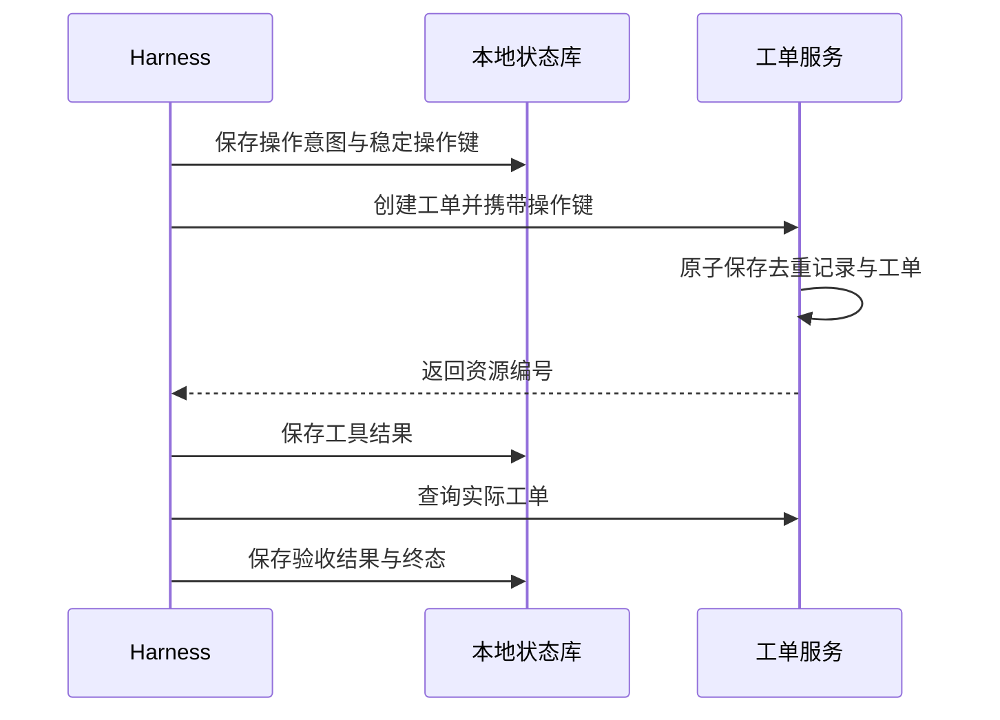

工单服务已经写入成功，响应还没到 Harness，进程就退出了。重启后，本地日志只有“准备创建”，没有工单编号。

如果直接重试，可能得到两条工单；如果直接报告失败，又遗漏了已经发生的修改。Checkpoint 保存的是本地执行状态，无法凭空回答另一个系统已经做了什么。

## 恢复位置，不等于恢复外部世界

LangGraph 的动态中断提供了一个值得认真理解的例子：恢复时，中断所在节点从头执行，中断之前的代码也会再次运行。因此，节点内的外部写入需要独立考虑重放行为，不能把界面里的“继续”理解为从原机器指令接着执行。[官方 Interrupts 文档](https://docs.langchain.com/oss/python/langgraph/interrupts)

[Pi 的持久化架构](/writing/pi-durable-harness-governance/)与 [DeepSeek 的事件日志](/writing/deepseek-harness-state/)已经解释了如何识别未完成工作。本篇继续讨论：识别之后，哪些动作可以安全重做？

## 把一次写入拆成四个提交边界



*图 1｜本地记录与外部写入之间存在多个故障窗口，它们不属于同一个数据库事务。*

| 中断点 | 本地知道什么 | 恢复动作 |
| --- | --- | --- |
| 保存意图后，写入前 | 准备过请求 | 查询操作结果；满足条件再用原键重试 |
| 外部提交后，响应记录前 | 是否执行不确定 | 按操作键对账，禁止换新键盲目创建 |
| 工具结果后，验收前 | 有资源编号 | 读取实际资源并验收 |
| 验收后，任务结束前 | 可能已有通过记录 | 恢复或重跑只读验收，再关闭任务 |

真实远端查询可能延迟、超时或最终一致。“暂时没有查到”只有在服务契约明确保证时，才能作为不存在的证据。否则应保留不确定状态，交给后续对账或人工处理。

## 幂等键必须表达同一次业务意图

本例采用 `tenant + run_id + operation_slot` 标识一次逻辑创建。第一次派发和恢复重试复用同一个键；真正的新任务使用新 Run。不能在每次网络请求前随机生成新键，那样服务端看到的始终是不同操作。

也不要只对标题和资料内容取哈希当作操作身份。用户可能确实想创建两条内容相同的工单；“参数相同”和“同一次意图”不是一回事。

服务端还必须保存原始参数。同一个键再次到达时，参数相同才返回原结果；参数改变应拒绝，避免把旧资源当成新动作的结果。AWS Builders' Library 将请求标识、参数变化和去重记录留存作为幂等 API 设计的重要部分。[原文](https://aws.amazon.com/builders-library/making-retries-safe-with-idempotent-APIs/)

## 去重记录和副作用必须一起提交

只在客户端维护一个“调用过”的布尔值不够。如果先写布尔值再创建，崩溃可能导致工单永远不创建；如果先创建再写布尔值，崩溃可能导致重复创建。

实验中的工单服务用一个 SQLite 事务提交资源和唯一操作键。这样，在本地教学模型里，同一个键不会落成两条资源。运行状态保存在另一份数据库，刻意保留真实系统中两边不能原子提交的事实。

这不是普遍实现了端到端 exactly-once。它依赖服务端原子去重、正确的键作用域以及足够长的记录留存。换成不支持操作键的第三方接口，不能只加一张本地表就获得相同保证。

## 对账、重试与补偿分别解决什么

**对账**负责确认实际发生了什么。**重试**负责再次尝试同一次意图。**补偿**负责处理已经发生但不再符合目标的影响。

例如错误工单已经创建：删除它是新的写入，可能受审批、保留策略和下游引用约束。自动删除不能被藏在“恢复失败”分支里。生产系统可以用补偿工作流组织修复，但应记录原操作、补偿操作和最终残留影响。

同理，Outbox 可以把本地业务变更和待发送消息一起提交，却不自动保证远端消费者只执行一次。消息重复投递时，远端仍需去重或幂等消费。这些机制解决不同提交边界，不能互相替代。

## 本篇交付物：故障矩阵

在自己的任务链上标出每个外部写入，逐项填写：操作键在哪里生成、谁做去重、查询是否权威、记录保留多久、无法确认时交给谁。

[故障实验](/writing/harness-foundations-lab/)会在上述四个边界注入中断，并额外用子进程退出验证“外部提交后、本地结果前”的恢复。验收看实际工单数量与内容，不只看运行状态是否显示成功。后续接入真实服务时，这份矩阵可以直接成为[回归系统](/writing/agent-evaluation-engineering/)的故障样本来源。

## 把依据放进提交条件

配套实验采用一条原子条件更新，下面与实验采用相同的判断方式：

```sql
UPDATE documents
SET body = ?, version = version + 1
WHERE id = 'source-001' AND version = ?;
```

最后一个参数是生成结果时读到的版本。检查受影响行数：1 表示这次提交被接受；0 表示条件不再满足，需要重新读取并判断。

对于本实验中始终存在的文档，0 就代表版本冲突。实际系统还可能发生删除或权限范围变化，应进一步分类，不能一概向用户报告“有人刚刚编辑过”。

这种比较版本再更新的方式，只在所有相关写入者遵守版本规则时才成立。如果后台脚本直接覆盖正文而不改变版本，版本号就失去了证明价值。

## 冲突之后重新判断，而不是只换版本号

B 收到冲突后，如果只是读取最新版本号，把原摘要原样再提交，形式上通过了检查，语义上仍可能覆盖 A 的新证据。

正确的后续取决于任务：重新生成、合并差异、保留两个候选，或者交给用户决定。实验的第二项测试验证“旧版本拒绝、明确使用新版本后可以更新”；它没有实现自然语言合并，也没有证明某个合并结果正确。

应把三个对象留在提交记录里：输入版本、候选结果、冲突处理决定。这样才能区分正常竞争与错误重试。

## 事务并不等于整段业务天然隔离

事务定义一组数据库操作的提交边界，隔离级别还决定并发事务能观察到什么。例如 PostgreSQL 的 Read Committed 下，同一事务内两次查询可能看到不同的已提交数据。[PostgreSQL 隔离级别文档](https://www.postgresql.org/docs/current/transaction-iso.html)

因此，“已经放进事务”还不足以说明先读取、长时间计算、再写回是安全的。需要继续说明是否锁行、是否检查版本，以及是否涉及多行约束。

本地实验用 SQLite 验证单文档条件更新，不据此推导 PostgreSQL 多行不变量或跨服务事务已经成立。真正迁移时，要在目标数据库、隔离级别和写入路径上保留同样的竞争反例。
