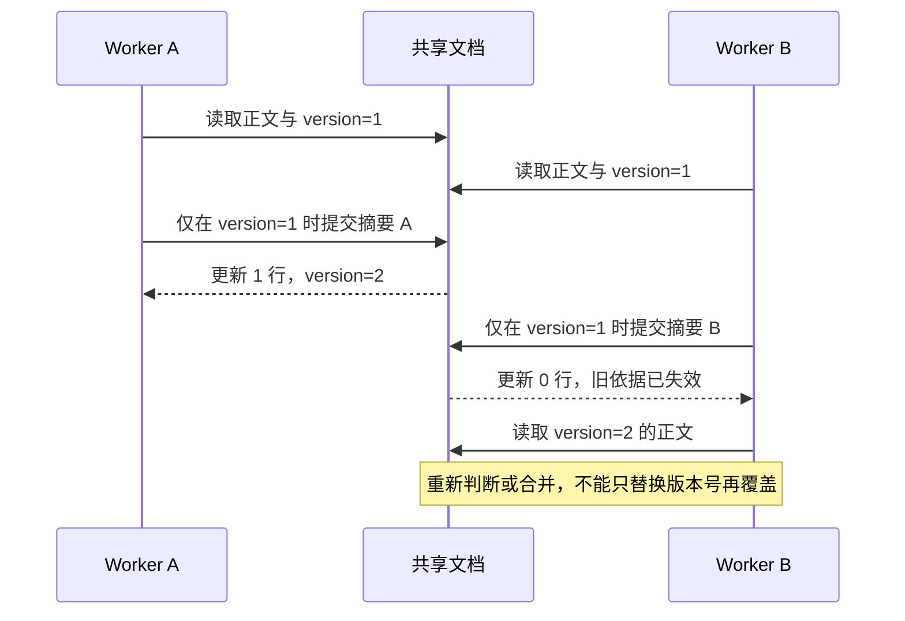

两个核验任务同时读取资料 `source-001`，分别生成摘要，再把结果写回同一条记录。每个任务单独执行都正确，放在一起却可能让其中一次修改消失。问题发生在动作之间，单看模型答案发现不了。

多个任务或 Worker 共享资源时，正确的单次执行仍可能产生竞争。这里区分异步、并发和并行，再用资源版本与所有权检查冲突。

## 异步、并发和并行分别解决什么

异步允许程序在等待外部结果时继续安排其他工作；并发强调多个任务在一段时间内交错推进；并行强调实际同时执行。三者相关，但不能用“开了异步”推导出更高的 CPU 吞吐或更安全的共享状态。

例如，两次独立搜索可以在等待网络时重叠。生成摘要依赖搜索结果，应等待对应输入；提交最终工单还依赖验收与授权，不应因为线程池有空位就提前执行。

| 动作 | 可以重叠的前提 | 需要保护的边界 |
| --- | --- | --- |
| 搜索两个独立来源 | 输入和预算可独立分配 | Provider 并发限额 |
| 对同一版本分别提取证据 | 读取的是明确的快照 | 来源版本与引用 |
| 更新同一份摘要 | 有冲突检测或明确合并规则 | 文档版本 |
| 重试创建同一工单 | 服务端支持业务去重 | 操作键与意图一致性 |

先画依赖，再挑并发机制。把所有步骤交给 `gather` 或线程池，无法代替依赖分析。



*图 1｜两个 Worker 的计算依据相同，提交时只能有一个匹配旧版本。冲突后要处理新内容，而非机械重试。*

## 把依据放进提交条件

配套实验采用一条原子条件更新，下面与实验采用相同的判断方式：

```sql
UPDATE documents
SET body = ?, version = version + 1
WHERE id = 'source-001' AND version = ?;
```

最后一个参数是生成结果时读到的版本。检查受影响行数：1 表示这次提交被接受；0 表示条件不再满足，需要重新读取并判断。

对于本实验中始终存在的文档，0 就代表版本冲突。实际系统还可能发生删除或权限范围变化，应进一步分类，不能一概向用户报告“有人刚刚编辑过”。

这种比较版本再更新的方式，只在所有相关写入者遵守版本规则时才成立。如果后台脚本直接覆盖正文而不改变版本，版本号就失去了证明价值。

## 冲突之后重新判断，而不是只换版本号

假设 Worker A、B 都基于文档版本 1 生成摘要，A 先提交并得到版本 2。B 提交时收到冲突；如果只改用版本号 2，却仍写入原摘要，就会覆盖 A 新增的证据。版本检查通过不代表内容合并正确。

正确的后续取决于任务：重新生成、合并差异、保留两个候选，或者交给用户决定。实验的第二项测试验证“旧版本拒绝、明确使用新版本后可以更新”；它没有实现自然语言合并，也没有证明某个合并结果正确。

应把三个对象留在提交记录里：输入版本、候选结果、冲突处理决定。这样才能区分正常竞争与错误重试。

## 事务并不等于整段业务天然隔离

事务定义一组数据库操作的提交边界，隔离级别还决定并发事务能观察到什么。例如 PostgreSQL 的 Read Committed 下，同一事务内两次查询可能看到不同的已提交数据。[PostgreSQL 隔离级别文档](https://www.postgresql.org/docs/current/transaction-iso.html)

因此，“已经放进事务”还不足以说明先读取、长时间计算、再写回是安全的。需要继续说明是否锁行、是否检查版本，以及是否涉及多行约束。

本地实验用 SQLite 验证单文档条件更新，不据此推导 PostgreSQL 多行不变量或跨服务事务已经成立。真正迁移时，要在目标数据库、隔离级别和写入路径上保留同样的竞争反例。

## 锁的保护范围必须说清

在一个事件循环内，协程锁可以保护一段共享状态更新。Python 的 `asyncio` 同步原语并不线程安全，不能拿来保护操作系统线程间的访问。[Python 同步原语文档](https://docs.python.org/3/library/asyncio-sync.html)

进一步增加进程或机器后，进程内的锁也不会自动覆盖其他 Worker。此时应把冲突判定放在共同承认的存储或资源端，例如原子条件更新。锁住一段 Python 代码与约束所有数据库写入者，是两个不同范围的保证。

## 限制活跃数量还不够

假设每秒到达的任务长期多于系统能完成的任务，只限制同时执行 8 个，其余全部排队，等待列表仍会不断增长。“8”只是示例配置，不能作为容量结论。

因此至少要一起设计活跃上限、等待队列上限、排队截止时间和拒绝或降级策略。任务预算也应包含等待时间；用户已经取消的任务不应在排队结束后重新启动。

[生产调度篇](/writing/harness-operations-production/)讨论了队列和租约。本篇补充它们的基础关系：并发限制保护运行资源，背压把压力反馈到任务入口，版本检查保护提交正确性，三者不能互相替代。

## 先写一个会发生冲突的实验

配套实验使用两个真实线程和两个独立数据库连接。屏障让它们都先读到版本 1，然后再竞争提交。测试检查只有一个提交成功、最终版本为 2，不要求某个线程一定获胜。

这比依靠短暂休眠碰运气更有解释力：被固定的是共同的旧依据，被允许变化的是执行顺序。实验没有测量吞吐，也没有模拟分布式调度。

练习时，为自己的任务列出三个共享对象，逐一写明“谁会修改、以什么版本为依据、冲突后谁决定合并”。如果只能写出“加一个锁”，还需要继续说明这个锁究竟覆盖哪些执行者。
