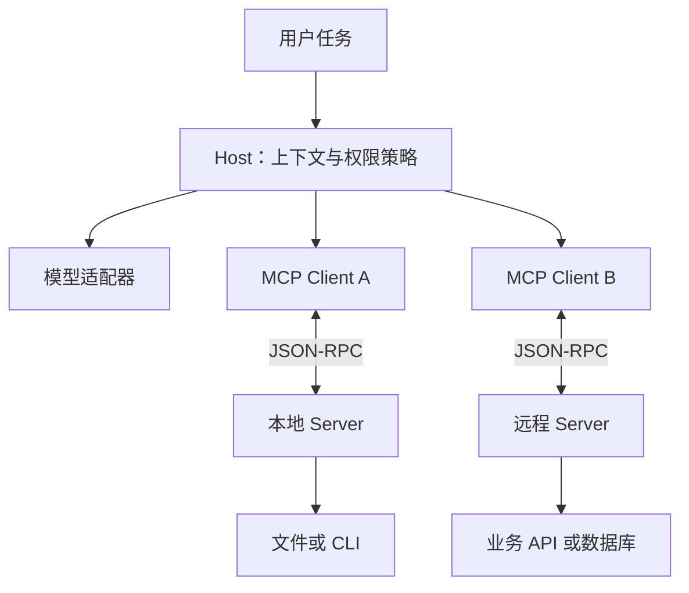
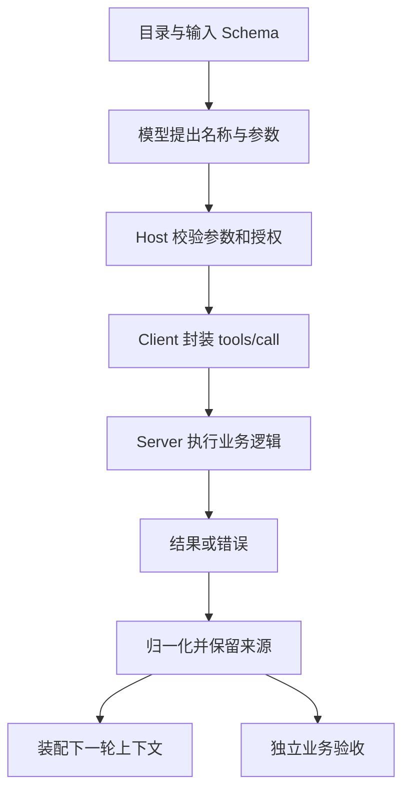
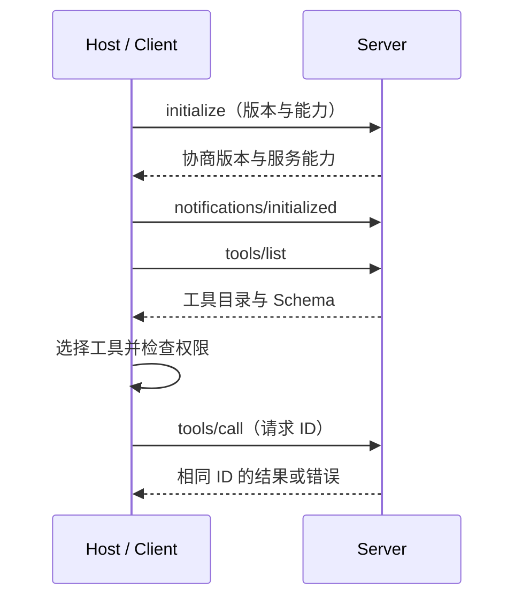
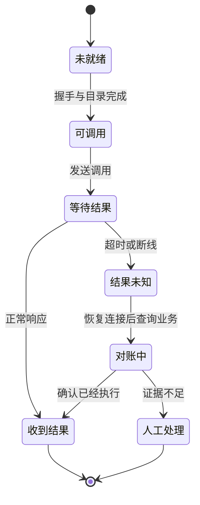

<a id="harness-foundations-mcp-lifecycle"></a>

MCP（Model Context Protocol）统一 Agent 应用与外部能力服务之间的消息契约。它让同一个工具服务可以被不同宿主发现和调用，也让宿主以相近的方式接入不同服务。它不负责替模型规划任务，也不替业务系统保证写入只发生一次。

本文以 **2025-11-25** 规范为固定学习基线，2026-09-07 复核；不是所有后续版本的功能总表。原有配套代码仍是本地状态模型，没有启动真实 MCP 服务。新增报文与图用于解释规范和设计，不扩大实验结论。

## 架构：Host 管理信任，Client 管理连接，Server 提供能力



Host 是拥有用户会话的应用；Client 是宿主内负责某条服务连接的协议角色；Server 暴露能力。图中的两个 Client 表达连接隔离，不要求两个独立进程。模型厂商 API 属于另一条调用链，不因使用 MCP 而消失。

一个合理的 Host 要维护“服务身份＋工具名”的命名空间。例如两个服务都提供 `search`，模型可见名称需要无歧义，调用后仍要映射回原服务。工具描述、资源内容和服务端 instructions 都是外来输入，不能覆盖宿主自身的授权规则。

## 三种服务端原语解决不同问题

| 原语 | 典型交互 | 交给宿主什么 | 不应误解为 |
| --- | --- | --- | --- |
| Tools | `tools/list`、`tools/call` | 可执行操作及输入输出契约 | 已授予执行权限 |
| Resources | `resources/list`、`resources/read` | URI 标识的上下文数据 | 自动进入模型全部上下文 |
| Prompts | `prompts/list`、`prompts/get` | 可参数化的消息模板 | 高于宿主规则的系统指令 |

三者的区别在控制意图：工具支持模型选择操作，资源供应用组织上下文，提示模板供用户或应用显式选用。实际界面如何呈现由 Host 决定。[服务端原语](https://modelcontextprotocol.io/specification/2025-11-25/server/index)

反向能力也值得关注：Server 可在客户端支持时请求 sampling 或 elicitation，分别请求模型采样或向用户收集信息；roots 提供宿主愿意暴露的根目录信息。它们均受能力协商约束。**roots 是边界描述，不能代替操作系统文件权限或沙箱。** 一个服务器请求模型采样，也不意味着获得了无限 Token 预算。[Sampling](https://modelcontextprotocol.io/specification/2025-11-25/client/sampling)、[Roots](https://modelcontextprotocol.io/specification/2025-11-25/client/roots)、[Elicitation](https://modelcontextprotocol.io/specification/2025-11-25/client/elicitation)

## 报文分为信封、工具契约和业务语义

以下是作者构造的合法形状示例，假定 `search_docs` 已被发现并获准使用：

```json
{"jsonrpc":"2.0","id":"req-7","method":"tools/call","params":{"name":"search_docs","arguments":{"query":"恢复策略"}}}
```

工具定义中的 `inputSchema` 描述参数形状；结果可以包含文本、资源链接或结构化内容。声明 `outputSchema` 时，结构化结果还需满足输出契约。工具 annotations 中的只读、破坏性等提示不能取代服务端权限判断。[工具定义与结果](https://modelcontextprotocol.io/specification/2025-11-25/server/tools)



参数校验、授权、结果归一化是本文建议的 Host 接入流程。Schema 只能检查形状；`query` 合法不代表有权查询任意租户。结果进入上下文与任务验收是两个不同出口。

## 初始化建立共同的运行前提

握手完成后再进入工具发现；传输、身份验证和错误处理还需要各自的生命周期管理。
客户端提出版本，服务端返回所采用的版本与能力；客户端若不支持返回版本，规范建议断开连接。收到初始化结果后，客户端必须发送 `notifications/initialized`。后续行为要遵守已协商的能力。[MCP 生命周期规范](https://modelcontextprotocol.io/specification/2025-11-25/basic/lifecycle)

实验采用更容易验证的工具闸门：完成上述步骤且服务端声明 `tools` 后才允许工具请求。它只实现工具子集，不能用来验证规范中 ping、日志等初始化阶段例外。



时序表达工具子集的正常路径；Server 只声明 resources 时，Host 不能假定 tools 也可用。分页目录需取全或建立明确的增量发现策略。

## 请求 ID 只负责关联这一次往返

JSON-RPC 请求带有 ID，响应用相同 ID 关联；通知没有 ID，也不要求对应响应。响应应包含 `result` 或 `error`，两者不能同时出现。[JSON-RPC 2.0 规范](https://www.jsonrpc.org/specification)

两个工具请求先后发出，结果可能倒序到达。Harness 应按 ID 查找等待者，不能把第一个收到的结果交给第一个发出的调用。

实验用“连接代次:序号”产生 ID，例如 `1:3`、`2:3`。这是教学实现的本地策略，不是 MCP 要求的格式。重新连接后旧响应无法命中新请求，有助于测试迟到消息的处理。

但请求 ID 不能代替业务操作键。一次工单创建经过断线重试，可能涉及多个请求 ID，业务上仍是同一次创建意图。

## 工具目录也有有效期

服务端在支持相应能力时，可以通知工具列表发生变化。工具发现、输入 Schema 和执行错误格式由[工具规范](https://modelcontextprotocol.io/specification/2025-11-25/server/tools)定义。

Harness 还需要自己的缓存策略。假设目录请求已经发出，此时收到目录变化通知，随后旧请求的响应才到达；直接把这份响应标为最新目录，会覆盖刚刚获得的失效信息。

实验为目录维护本地修订号。发请求时记住修订号，变化通知到达时递增；返回结果若对应旧修订，就不允许它重新使缓存有效。接着重新获取目录，再开放工具调用。

这是这里选择的保守策略，规范没有要求所有客户端采用这一缓存算法。真实目录还可能需要分页、权限过滤与 Schema 校验，本实验未实现这些部分。

## 三层成功必须分别判断

| 观察 | 可以说明 | 下一步仍需确认 |
| --- | --- | --- |
| 收到合法 JSON-RPC 响应 | 本次响应能够关联与解析 | 是否为协议错误 |
| 收到工具结果且没有执行错误标记 | 工具返回了正常结果 | 业务对象是否符合目标 |
| 权威读取和验收通过 | 当前证据支持目标已完成 | 是否还有任务级未完成条件 |

协议层错误，例如无法识别的方法，进入 `error`；工具执行中的业务错误可以在 `result` 内使用 `isError: true`。本地模型分别返回 `protocol_error` 与 `tool_error`，正常结果也只记作 `tool_result_received`。

这延续了[工具契约篇](/writing/harness-engineering-tools/)的原则：接口完成与任务完成由不同证据支持。错误分类也不自动决定能否重试，写操作是否已经产生副作用仍需单独确认。

练习时，画出客户端当前允许发送的方法，并在每条边上注明前提。若图里只有“连接成功→调用工具”，就把初始化、能力缺失、目录变化和错误返回四条分支补上。

## 两种传输需要不同的运行管理

MCP 2025-11-25 定义 stdio 与 Streamable HTTP。stdio 常用于客户端启动本地子进程，协议消息走标准输入输出，标准输出不能混入普通日志。Streamable HTTP 使用 HTTP 端点，并可通过 SSE 传递消息。[MCP 传输规范](https://modelcontextprotocol.io/specification/2025-11-25/basic/transports)

| 运行问题 | stdio 接入时重点检查 | HTTP 接入时重点检查 |
| --- | --- | --- |
| 服务生命周期 | 子进程启动、退出和资源回收 | 服务可达性、请求和会话生命周期 |
| 日志与消息 | 标准输出被日志污染 | 代理缓冲、连接中断与流解析 |
| 身份边界 | 子进程继承的环境和本地权限 | 身份验证、会话归属与来源校验 |
| 故障验证 | 子进程异常退出、残缺消息 | 响应丢失、流断开、会话失效 |

这些是后续真实接入应执行的检查，本文没有启动子进程协议服务器，也没有发送 HTTP 请求。

## 三种 ID 对应三种范围

| 标识 | 作用范围 | 不能据此推断 |
| --- | --- | --- |
| JSON-RPC 请求 ID | 请求与响应关联 | 业务动作只执行一次 |
| MCP 会话 ID | 服务端选择启用的 HTTP 会话 | 调用者具有业务权限 |
| SSE 事件 ID | 支持恢复时定位事件位置 | 外部写入尚未发生 |

业务操作键是另一层应用契约，用来关联同一个写入意图。配套模型把它保存在客户端等待记录里，没有把它伪装成 MCP 标准字段。真实接入时，需要工具或背后业务服务明确支持它。

HTTP 服务端可以选择分配会话 ID；携带已失效会话 ID 收到 404 时，客户端必须重新初始化。SSE 恢复也取决于服务端支持，不能假设每次断线都可以完整重放。[会话与恢复规则](https://modelcontextprotocol.io/specification/2025-11-25/basic/transports)

即便消息重放成功，仍应按请求 ID 处理重复或迟到响应，并按业务操作判断副作用。

## 取消是一场可能发生竞态的协作

普通请求可以使用 `notifications/cancelled` 通知取消。初始化请求不能这样取消；任务增强请求采用单独的 `tasks/cancel` 机制，不能混用。[MCP 取消规范](https://modelcontextprotocol.io/specification/2025-11-25/basic/utilities/cancellation)

取消可能与完成同时发生。接收方可能已经提交了工单，无法通过停止计算撤销它。发送方停止等待，也不等于收到了一份“没有执行”的证明。

实验在取消后移除等待项，把写操作加入未知结果集合，忽略后续迟到响应。这只是在模型中确定了客户端如何处理消息。是否撤销工单，需要一个独立且获得授权的业务动作，不能偷偷塞进取消逻辑。

## 重连后恢复的是观察能力

建议将恢复拆成可独立验收的步骤：

1. 建立新连接并完成协商，重新确认工具目录。
2. 找到断线时尚未确定结果的业务操作。
3. 使用权威查询检查实际资源及其参数。
4. 根据查询一致性、去重契约和任务目标，决定完成、等待、重试或交接。

“查不到”只有在查询语义足以排除已提交结果时，才能支持后续判断。远端查询如果存在延迟，就仍要保留未知状态。

配套演示直接查询本地 SQLite 中的工单，能看到已提交的资源；但协议模型仍保留 `needs_reconciliation`，因为演示没有实现任务级验收和完成状态回写。查询证据与任务终态之间，仍有一道应用决策。

## 给连接恢复设置终点

重复重连也会消耗时间和资源。每次连接尝试要受单次超时约束，整个任务还需要总截止时间，不能让进度通知或重试不断延长用户等待。

同时保留[观测篇](/writing/harness-operations-observability/)中的任务关联：任务 ID、业务操作键、请求 ID 和连接代次分别记录。否则新连接里的成功日志会掩盖上一条连接留下的未知写入。

练习时，选择一个真实写工具，在“提交前断开”和“提交后响应丢失”两处分别注入故障。两种场景的界面可能一样，恢复决策应由实际证据区分。

## 长任务与授权需要单独协商

2025-11-25 引入的 Tasks 在该版本中标记为实验性。它给可增强的请求增加任务句柄和生命周期，可以查询状态、取得结果或取消。它不是 A2A Task 的同义词：MCP Task 服务于一次能力请求的延迟完成；A2A 还描述独立 Agent 的能力与交互。[Tasks 规范](https://modelcontextprotocol.io/specification/2025-11-25/basic/utilities/tasks)



这是 Host 的设计状态机，图中的“结果未知／对账中”不是 MCP 标准枚举。它专门保留网络协议无法解释的业务副作用。

HTTP 授权规范将 MCP Server 放在资源服务器的位置：客户端发现受保护资源及授权服务器信息，取得适用于目标资源的访问令牌。请求的资源边界、实际受众、有效期和权限范围都需核验；会话 ID 不是访问令牌。stdio 则通常从受控运行环境获得凭据，不能照搬 HTTP OAuth 流程。[MCP 授权](https://modelcontextprotocol.io/specification/2025-11-25/basic/authorization)

Host 不应把发给自己的 Token 原样交给另一个服务。需要访问下游系统时，使用明确的下游凭据或受支持的委派机制。用户批准了“读取文档”，也不意味着批准“把原文发送给外部模型”。授权的对象应包括动作、数据和目标。

## 接入取舍与验证范围

MCP 适合多个 Host 复用同一能力服务，尤其在工具目录、资源和客户端反向能力都需要标准化时。仅在单进程调用两个自有函数，直接函数接口通常更容易调试。已经有 HTTP API 时，可在 API 外加适配层，而不是把业务逻辑搬进协议处理器。

接入验证至少覆盖：不支持的版本被拒绝、分页目录没有遗漏、同名工具不会串服务、无权参数被服务端拒绝、执行错误不会记作成功、重连后的旧响应不会污染新调用，以及写入后响应丢失时不盲目重试。这里给出验证设计，真实跨 Host 互通和生产授权链尚未实测。

工具执行语义见[Tool Calling](/writing/harness-engineering-tools/)，跨 Agent 委派见[A2A](/writing/a2a-protocol/)，授权流程见[OAuth](/writing/oauth/)。MCP 的价值是统一接口边界；可靠运行仍取决于 Host 和业务服务对这些边界的落实。
