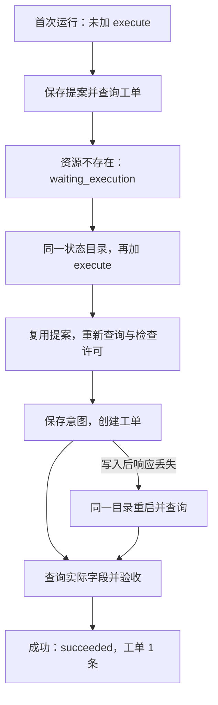

本实验创建一张本地待核验工单：来源为 `source-001`，标题为“核验 Agent Harness 资料”。运行后应只存在一条字段匹配的工单；写入后进程退出，再次运行也不能重复创建。下面按模块安装、执行并检查这个结果。

[下载 Mini Harness 实验包](/labs/harness-integration.zip)。包内默认使用固定模型响应，MCP 子进程、传输和 SQLite 写入真实执行。

## 先对照装配清单

```text
lab.py: execute()               组装入口与运行状态机
  ├─ model.py: propose()       上下文、模型调用与严格提案解析
  ├─ store.py: Runs            契约、提案、意图、预算与事件
  ├─ session_for() → call()    MCP 连接与结构化结果
  │    └─ server.py            查询、创建两个工具
  │         └─ store.py: Tickets   幂等业务资源
  └─ 查询结果对照 expected       完成验收与记录终态
```

没有单独的策略服务：目标一致性检查与 `execute_write` 在运行器内。没有独立上下文框架：单动作任务的输入在 `propose()` 内组装。先保留这种紧凑实现，职责增长后再拆文件。



*图 1｜正常路径用两条命令完成。响应丢失后的路径复用运行记录和操作键，验收回到真实工单。*

## 安装并验证各模块契约

解压进入 `harness-integration` 目录；已记录的实验环境为 Python 3.11.9。以下使用 macOS/Linux 路径：

```sh
python3 -m venv .venv
.venv/bin/python -m pip install -r requirements.txt
.venv/bin/python -m unittest discover -p 'test_*.py' -v
```

Windows 使用虚拟环境中的 `Scripts/python.exe`。固定依赖包含 `mcp==1.29.1`；客户端检查协议基线 `2025-11-25`。安装需要网络，默认测试不调用外部模型。

16 项测试分为：8 项模型输入输出边界、2 项默认与正常运行、3 项真实退出恢复、2 项目标一致性、1 项本机 HTTP 正常路径。测试文件与 `VERIFICATION.md` 提供对应证据。

## 按两步完成一次任务

```sh
.venv/bin/python lab.py --state-dir ./state-demo
.venv/bin/python lab.py --state-dir ./state-demo --execute
```

第一条把模型提案交给状态库，查询为空后返回 `waiting_execution`。第二条复用已保存提案，允许创建，独立查询通过后返回 `succeeded`。事件中应依次出现提案保存、会话初始化、执行意图和验收通过；跨两次运行会有多次会话初始化。

这时检查 `attempts` 为 1，并读实际资源：

```sh
.venv/bin/python - <<'PYCODE'
import sqlite3
with sqlite3.connect('state-demo/tickets.sqlite') as db:
    print(db.execute('SELECT id, op, payload FROM tickets').fetchall())
PYCODE
```

应只有一行，操作键为 `review-001:ticket`，字段匹配默认目标。查询数据库用于学习和测试；在真实远端系统中应使用受授权的资源查询接口。

## 从代码调用组装入口

在实验目录另存 `run_example.py`，即可用不同任务调用同一组模块：

```python
import asyncio
from pathlib import Path
from lab import execute

result = asyncio.run(execute(
    Path('state-example'),
    run='review-002',
    expected={'source': 'source-002', 'title': '检查报告的来源'},
    provider='fixture',
    execute_write=True,
))
print(result['state'], result['attempts'])
```

用 `.venv/bin/python run_example.py` 运行。这个接口示例对应现有实现；复用同一 run ID 时保持任务配置一致。

## 让模块在退出后重新接上

每个故障选择一个从未使用过的状态目录：

```sh
.venv/bin/python lab.py --state-dir ./state-crash --execute --fault server-after-commit
.venv/bin/python lab.py --state-dir ./state-crash
```

第一条预期非零退出；第二条查询已提交的工单并验收，`attempts` 仍为 1。再分别尝试 `client-after-result` 与 `client-after-intent`：前者恢复只需查询；后者资源尚不存在，恢复命令需要追加 `--execute`，最终 `attempts` 为 2。

检查[状态与验收](/writing/harness-integration-recovery/)的资源数表，而不只看退出码。已经成功的运行直接返回终态，所以旧的成功目录不能用于重新触发故障。

## 第一次替换：接在线模型

在终端设置 `ANTHROPIC_API_KEY` 和账号实际可用的 `ANTHROPIC_MODEL`，再运行：

```sh
.venv/bin/python lab.py --state-dir ./state-live --provider anthropic --model "$ANTHROPIC_MODEL"
```

这会把合成任务发往 Anthropic Messages API，并可能产生模型费用。默认只保存提案和查询；确认动作后，保留相同参数追加 `--execute`。其他模块无需改动。

本次没有调用在线模型，不能据此给出真实模型的成功率、费用或延迟。接入后应另外保留响应类型、提案通过率和用量证据，密钥与完整敏感输入不要进入事件日志。

## 下一步按需求扩展哪一块

| 你要增加的任务能力 | 先改的模块 | 增加的验收证据 |
| --- | --- | --- |
| 读材料后再决定下一步 | 模型接口、消息历史、有界循环 | 工具结果进入下一轮，轮数和总截止时间有效 |
| 更换真实工单系统 | 工具服务与幂等映射 | 响应丢失后能查询；同键同参数不重复 |
| 长任务暂停后继续 | 状态存储、消息与预算检查点 | 重启不丢决定性上下文，不重置额度 |
| 开放文件与 Shell | 执行策略、沙箱 | 越界路径和网络动作被执行层拒绝 |
| 多 Worker 调度 | 所有权、并发状态更新 | 旧 Worker 不能继续提交过期动作 |
| 引入 Skills 或记忆 | 上下文组装与来源管理 | 对相同任务集确实提高验收率或减少成本 |

第一版的完成标准是：你能替换模型或工具，同时保持任务契约、执行策略、恢复和验收不被绕开。它仍是单用户、单动作的本地基线；上表提供了从这块切片扩展到多轮系统的具体路线。
