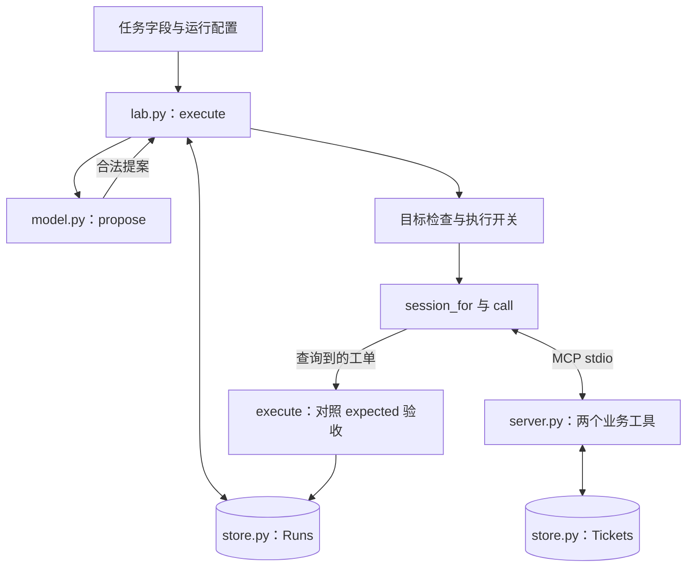

要搭一个能完成任务的 Harness，第一步是画清模块，以及它们交换什么。实战采用一个具体起点：**单用户、单 Worker、Python、本地执行、允许重启恢复**。在这个范围内，优先选择少量显式函数、严格数据校验和 SQLite；出现明确瓶颈后再换组件。

这里把 Mini Harness 定义为：围绕模型建立的最小任务运行系统，能够接收任务、约束动作、执行工具、保存进度，并根据实际结果判断是否完成。Mini 指实现规模小，职责仍要完整。下表是架构地图，不要求每一行单独做成服务。

## 八个模块怎样拆

| 模块 | 输入 → 输出 | 必须负责的判断 | 实验中的落点 |
| --- | --- | --- | --- |
| 任务契约 | 用户目标 → 可验收目标、允许动作 | 什么才算完成 | `lab.py: execute()` 的 `expected` 和运行配置 |
| 上下文组装 | 契约、任务材料、已知状态 → 模型输入 | 哪些信息本轮需要，来源是否可信 | `model.py: propose()`，目前只输入固定任务 |
| 模型适配 | 模型输入 → 候选动作、调用元信息 | 响应是否完整，工具名与字段是否有效 | `propose()`、`parse_response()`、`validate_action()` |
| 运行控制 | 候选动作、状态 → 下一步或终态 | 继续、等待、失败、恢复、预算耗尽 | `lab.py: execute()` |
| 工具执行 | 工具名、参数 → 结构化结果 | 调用什么，如何报告失败 | `session_for()`、`call()` 和 `server.py` |
| 执行策略 | 动作、操作者配置 → 允许或拒绝 | 动作是否在授权范围内 | 目标一致性检查、`execute_write`；尚无系统沙箱 |
| 状态存储 | 契约、意图、事件 → 可恢复记录 | 重启后哪些事实仍成立 | `store.py: Runs`，以及服务端 `Tickets` |
| 结果验收 | 可信目标、实际资源 → 通过或失败 | 实际交付是否符合要求 | 工具查询后对照 `expected` |

这些模块的依赖方向应清楚：模型返回提案；运行器决定是否派发；工具改变资源；验收器读取资源。运行器把关键状态和事件写入存储。模型输出不能自行变成执行许可或验收标准。

*图 1｜实验落地为运行器和工具服务两个进程。策略与验收都在 execute 内，不需要为每项职责建立独立服务。*

## 当前适合这个起点的默认组合

“最佳”必须有适用条件。下面是面向当前教学场景的工程建议，不是经过统一基准测试的工具排行榜。

| 模块 | 新项目的默认选择 | 为什么先这样选 | 何时替换或扩展 |
| --- | --- | --- | --- |
| 任务与数据契约 | Python 数据结构 + Pydantic 或严格校验函数 | 字段、长度、枚举和额外字段策略容易核对 | 跨语言共享时统一维护 JSON Schema |
| 上下文 | 显式消息列表 + 当前任务材料 + 最近工具结果 | 可以检查每条信息为什么进入模型 | 材料超出预算且检索确实提升验收率时增加检索 |
| 模型 | 一家供应方的官方 SDK，封装成小适配器 | 先稳定输出协议、错误分类和用量记录 | 在同一任务集上证明第二模型有收益后加路由 |
| 循环 | 显式状态机或有步数限制的循环 | 中断点和终止条件容易定位 | 分支、人工暂停和恢复节点增多时考虑 LangGraph |
| 工具 | 同进程先直接调用函数；跨客户端共享时用 MCP SDK | 本地函数调试简单，MCP 解决跨进程契约 | 多用户共享服务再引入 HTTP、身份与服务治理 |
| 策略与隔离 | 固定工具白名单、参数约束、执行前检查 | 可以限制当前业务动作 | 一旦开放 Shell 或不可信代码，就加入操作系统隔离 |
| 存储 | SQLite，运行状态与事件同事务写入 | 单 Worker 容易部署、检查和重放 | 多 Worker 时增加所有权与并发控制，按需迁移数据库 |
| 验收与观测 | 确定性断言 + 独立资源查询 + 有序事件 | 能指出哪项要求失败 | 语义任务增加人工标注样本；跨服务再加 Trace |

官方 SDK 是新项目建议；配套实验为展示原始请求，在线模型适配器使用 Python 标准库 HTTP。实验的严格校验也由普通函数实现，不要求先引入抽象框架。

LangGraph 的 checkpointer 保存线程运行状态，store 保存跨线程信息；它可以承担更多状态编排，但不会自动替业务写入提供幂等保证。是否采用它，取决于运行流程复杂度。[LangGraph 持久化文档](https://docs.langchain.com/oss/python/langgraph/persistence)

## 用什么任务把它们组装起来

实战的第一块可运行切片是：给定 `source` 与 `title`，创建一张本地待核验工单，重启后同一业务操作仍只对应一张工单。

这个任务的执行路径已经确定，因此它是**单动作工作流**：模型负责产生结构化提案，运行器执行固定的查询、创建和验收步骤。实际业务中，如果字段已经完全确定，可以直接调用创建函数。这里保留模型适配，是为了单独练习生成结果如何进入受控执行链路。

在此基础上，真正需要 Agent 决策的扩展任务可以是“读取三份材料，比较冲突，生成待核验问题，再创建工单”。这时模型要根据工具结果选择下一步，才需要多轮循环；[模型与循环](/writing/harness-integration-model/)给出循环接口与消息往返，本 Mini 实验包尚未实现该扩展。[架构对照实验](/writing/harness-architecture-selection/)另外实现了读取两份资料、根据观察推进、批准后创建的控制链路，模型仍用固定响应，便于隔离编排差异。

## 五篇的组装顺序

| 顺序 | 动手内容 | 这一层完成的标准 |
| --- | --- | --- |
| 1. 模块与选型 | 确定八项职责、默认组件和任务边界 | 每项职责能对应到代码或明确的待实现项 |
| 2. 模型与循环 | 定义上下文、动作 Schema 和循环退出条件 | 普通文本、截断、多动作不能误入执行 |
| 3. 工具与策略 | 接入查询、创建及 MCP 传输 | 工具响应可校验，写入许可由应用决定 |
| 4. 状态与验收 | 保存意图，加入幂等创建与恢复查询 | 三个退出点都能得到可解释的资源结果 |
| 5. 组装与运行 | 跑命令、读数据库、替换一个模块 | 正常路径和故障路径都有实际证据 |

Skills、长期记忆和多 Agent 都是可选扩展。只有重复流程值得沉淀、跨任务信息确实有用、任务拆分收益超过协调成本时，再分别接入。关于循环和任务边界，可对照[Harness 工程主线](/writing/harness-engineering-map/)继续阅读。

需要比较自写循环、图式编排与持久工作流时，继续阅读[架构选型与对照实验](/writing/harness-architecture-selection/)。
