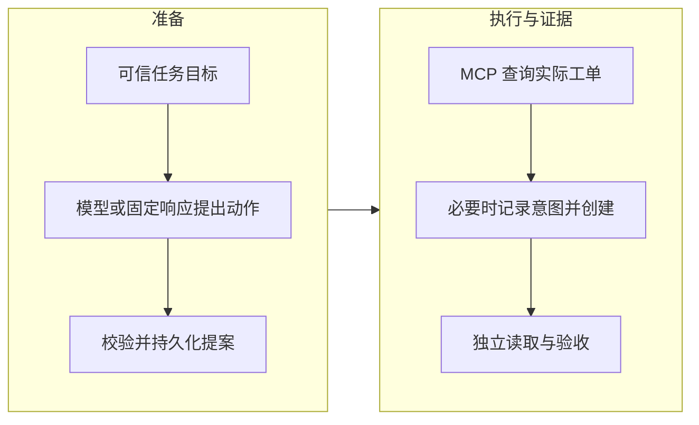

> Harness 接入与实战系列：[1. 链路全景](/writing/harness-integration-map/)｜[2. 模型适配](/writing/harness-integration-model/)｜[3. MCP 实接](/writing/harness-integration-mcp/)｜[4. 持久化恢复](/writing/harness-integration-recovery/)｜[5. 端到端实验](/writing/harness-integration-lab/)

前面的实验已经解释了“为什么要记录意图”“为什么断线后要对账”。但函数调用中的异常与真实进程退出之间，还隔着协议编码、子进程管理、结果结构和清理时序。

本系列把这些边界接成一条可运行链路。目标刻意收窄为：根据给定的来源和标题创建一份本地核验工单，并证明恢复后没有重复创建。它不负责搜索资料、判断来源真实性或完成核验工作本身。

## 五篇文章的全景地图

| 顺序 | 核心问题 | 配套证据 |
| --- | --- | --- |
| 链路全景 | 谁提出动作，谁执行，谁验收 | 模块与验证范围表 |
| 模型适配 | 怎样把供应方输出变成可检查的提案 | 完整性、工具名与字段反例 |
| MCP 实接 | SDK 怎样跨进程和 HTTP 调用服务 | stdio 与本机 HTTP 集成测试 |
| 持久化恢复 | 进程退出后根据什么继续 | 三个真实退出点与资源计数 |
| 端到端实验 | 怎样运行、复盘和扩展 | 下载包、测试与后续验证清单 |

这条路径承接[工程基础与协议](/writing/harness-foundations-concurrency/)，也会用到[运行与演进](/writing/harness-operations-context/)中的观测和发布思想。

## 先确定模块之间交换的东西

*图 1｜模型提出候选动作，Harness 管理执行与恢复，验收读取实际资源。*

模型接口只接收合成测试任务，只能提出 `source` 和 `title`。运行标识、业务操作键、执行许可、数据库位置和故障开关都由应用控制，不能从模型响应中获得。

本地服务暴露查询与创建两个工具。客户端用查询确认既有资源，必要时才写入。工单库与运行库分别由服务端和客户端维护，避免用“客户端记得成功”代替实际资源证据。

## 哪些已经实测

| 层次 | 本批状态 |
| --- | --- |
| 模型响应校验 | 固定响应与错误反例测试通过 |
| 真实模型 API | 提供可选适配器，未进行远端调用 |
| MCP stdio | 官方 SDK 启动真实子进程并完成工具往返 |
| Streamable HTTP | 本机回环地址上的正常执行路径通过 |
| 进程级恢复 | 三个退出点、持久化重载与单资源验收通过 |
| 生产运行 | 多 Worker、OAuth、沙箱、撤权与容量未验证 |

“真实链路”指传输、进程和存储确实发生，不代表所有组件都接入了外部生产服务。默认模型是固定响应，工单也是自建本地测试服务。

## 固定学习基线，避免示例随安装结果漂移

实验固定 `mcp==1.29.1`，并记录完整依赖版本。安装时已经存在 SDK 2.x；这里使用 1.x 维护线，是为了延续前一系列的 MCP 2025-11-25 基线。运行时会检查实际协商版本。[固定版本 SDK 说明](https://github.com/modelcontextprotocol/python-sdk/blob/v1.29.1/README.md)

这不是版本选型结论。迁移到另一版本时，应重新运行协议、结果结构和退出恢复测试，不直接把已通过的结果搬过去。

## 让输出足以支持复盘

实验输出状态、已保存动作、派发次数和有序事件。事件里记录模型来源、协商版本、操作键与验收资源 ID。恢复后应能回答：是否重新规划、是否再次派发、最后根据哪份资源宣布完成。

这是一份最小诊断账本，没有跨服务 Trace、事件时间和时延统计，也没有防篡改审计。读者可以依据[观测篇](/writing/harness-operations-observability/)继续增加字段，但应先保留这些已经能解释恢复行为的证据。

下一篇：[模型适配](/writing/harness-integration-model/)。
