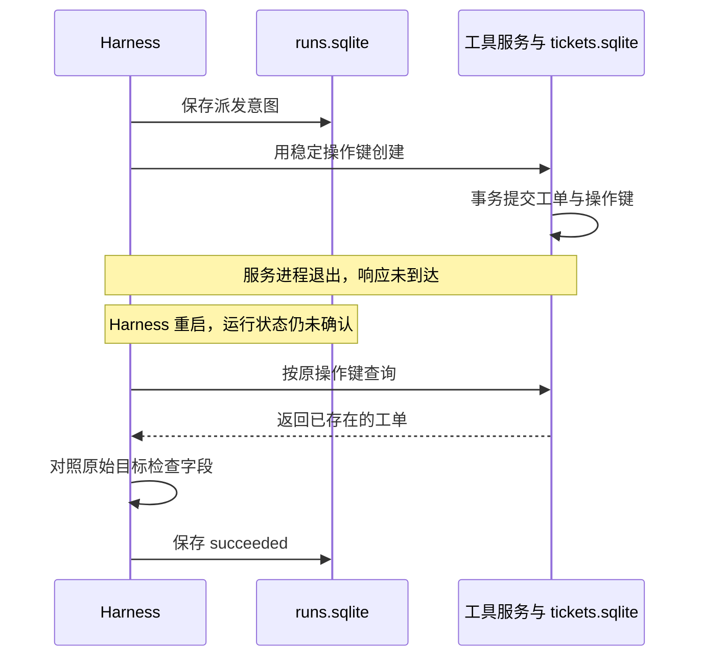

运行器记得“发过请求”，不等于业务系统已经完成；客户端没收到响应，也不等于业务系统没有写入。Mini Harness 的恢复模块要同时读取运行记录与业务事实。

*图 1｜复现 server-after-commit：工单已经存在，恢复执行只读查询与验收，不能换键再创建。*

## 两份存储各管什么

| 存储 | 内容 | 它能回答的问题 |
| --- | --- | --- |
| `runs.sqlite` | 任务契约、状态、已保存提案、派发次数、有序事件 | Harness 原本打算做什么，走到了哪里 |
| `tickets.sqlite` | 操作键、资源 ID、工单字段 | 业务资源到底是否存在，内容是什么 |

实验中客户端维护 `Runs`，工具服务维护 `Tickets`。分开存储是为了真实呈现“两次提交不能靠同一个本地事务包住”的问题。运行状态和事件在运行库内同事务提交；它们与工单创建不构成跨库原子事务。

## 状态机只保留有行动意义的状态

| 状态 | 下一次应该做什么 |
| --- | --- |
| `new` | 生成并校验提案 |
| `planned` | 使用已保存提案，进入资源查询 |
| `reconciling` | 根据业务键查工单，判断是否还需创建 |
| `waiting_execution` | 等待允许新增写入；资源已存在时可以只验收 |
| `dispatching` | 派发意图已落盘；重启后先查询，不能假定未写入 |
| `reconcile_required` | 派发预算用尽；继续查询或转人工处理 |
| `succeeded` / `failed` | 返回已保存的终态 |

`interrupted` 是命令行捕获异常后的输出摘要，不是数据库里的新状态。异常发生时，数据库可能仍停在 `dispatching`。恢复应以持久化记录为依据。

本实验成功终态重读会直接返回，不持续监测工单以后是否被删除。若业务要求“始终存在”，应另设巡检任务，不能把一次验收扩大成永久保证。

## 一次写入怎样组装

实际执行顺序如下：

1. `Runs.open()` 保存任务契约；同一个 run ID 更换目标、供应方或模型时拒绝恢复。
2. 提案校验成功后保存；恢复时复用提案。
3. 根据 `run + ':ticket'` 得到稳定操作键，查询工单。
4. 如果工单不存在，检查执行许可和剩余派发预算。
5. 用 `Runs.record()` 在同一事务内保存意图、事件并消耗一次预算。
6. 调用创建工具，再用查询工具读取实际工单。
7. 验收 ID 类型及字段与原始目标一致后，保存成功终态。

第 5 步记录的是派发尝试预算，因此即使进程在网络调用前退出，也已经消耗一次。这个保守选择可以避免重启无限重置额度；它不是服务端实际执行次数的精确统计。

服务端创建则在 SQLite 事务中检查操作键，并以唯一约束防止重复资源。同键出现不同参数会报冲突。事务与连接管理的具体行为应以 Python SQLite 接口为准。[Python sqlite3 文档](https://docs.python.org/3/library/sqlite3.html)

## 验收器为什么必须独立

本实验验收的是“待核验工单创建正确”，判定式是：查询到工单、ID 为整数、`action` 与可信 `expected` 相等。它没有核验来源内容的真实性。

验收独立指：标准来自用户目标，证据来自资源读取，不接受模型一句“已完成”作为成功条件。这里查询与创建仍由同一测试服务提供，所以它可以发现丢响应和错误内容，不能抵抗恶意服务伪造结果。

换成代码任务时，验收可以是指定测试、构建产物与 Diff；换成研究任务时，需要把来源是否支持结论拆成可复核的检查。验收复杂度跟任务走，不能用“工具调用成功”统一代替。

## 用三个退出点检查恢复

| 故障位置 | 退出时资源数 | 恢复动作 | 最终资源数 / 派发预算消耗 |
| --- | ---: | --- | --- |
| 客户端保存意图后、调用前 | 0 | 查询为空，获准后再次派发 | 1 / 2 |
| 服务端提交后、响应前 | 1 | 查询到资源并验收 | 1 / 1 |
| 客户端收到结果后、验收前 | 1 | 查询到资源并验收 | 1 / 1 |

这三种情况在实验中通过真实进程退出重现，不只是函数抛异常。恢复命令要复用状态目录和 run ID；把状态目录换掉，就不是恢复原运行。

## 什么时候要换持久化方案

单 Worker 可以使用这里的小状态机。多 Worker 会引入新的问题：谁拥有运行、谁能消耗预算、旧 Worker 恢复后是否还能写。此时需要租约、版本或 fencing 等所有权设计，单靠工单唯一键只能阻止同键重复资源，管不了调度竞争。

分支、暂停和消息历史增多时，可以把运行状态交给工作流框架；工具的幂等和业务验收仍需保留。先以[并发与一致性](/writing/harness-foundations-concurrency/)中的反例确定需要的保证，再换数据库或编排器。
